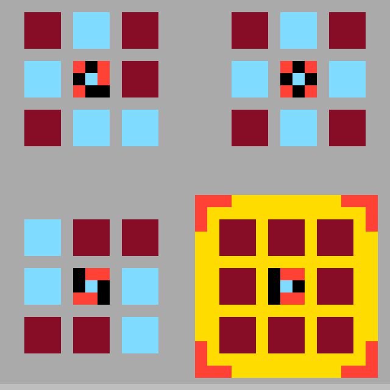

# `ft09` level `1` — Initial state

## Navigation

**Level start**

### Actions

*No child actions recorded yet.*

---

- **Full game ID:** `ft09-0d8bbf25`
- **State:** `NOT_FINISHED`
- **Image hash:** `a7fc970783dacc89`
- **Incoming action:** `initial`

## Image



## Files

- [image.png](image.png)
- [state.json](state.json)
- [object_registry.pl](object_registry.pl) — shared level registry (0 canonical identities)

## Embedded files

<details>
<summary><code>state.json</code></summary>

````json
{
  "state": "NOT_FINISHED",
  "observation": {
    "game_id": "ft09-0d8bbf25",
    "state": "NOT_FINISHED",
    "levels_completed": 0,
    "win_levels": 6,
    "action_input": {
      "id": "RESET",
      "data": {},
      "reasoning": null
    },
    "guid": "21926087-6dbe-44d2-847c-a804f890d5f5",
    "full_reset": true,
    "available_actions": [
      6
    ]
  },
  "step_count": 0,
  "game_id": "ft09-0d8bbf25",
  "game_directory": "ft09",
  "level": "1",
  "image_hash": "a7fc970783dacc89",
  "incoming_action": null,
  "action_directory": null,
  "action_data": {},
  "parent_node": null,
  "action_path": []
}
````

[Open `state.json`](state.json)

</details>
