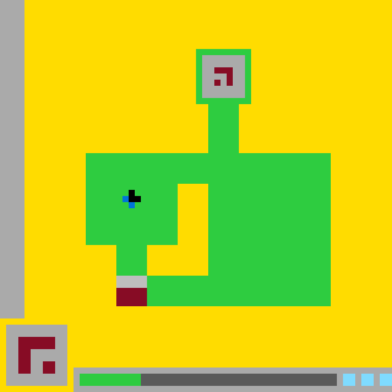

# `ls20` level `1` — LEFT / LEFT / LEFT / LEFT / RIGHT / RIGHT / RIGHT / LEFT / LEFT / LEFT

## Navigation

[Level start](../../../../../../../../../../README.md) · [Parent](../README.md)

### Actions

*No child actions recorded yet.*

---

- **Full game ID:** `ls20-9607627b`
- **State:** `NOT_FINISHED`
- **Image hash:** `c157eafda230b340`
- **Incoming action:** `ACTION3`

## Image



## Files

- [image.png](image.png)
- [state.json](state.json)
- [object_registry.pl](../../../../../../../../../../object_registry.pl) — shared level registry (10 canonical identities)
- [differences.pl](differences.pl)
- [objects.pl](objects.pl)
- [rules.pl](rules.pl)
- [similarities.pl](similarities.pl)
- [turtle_from_diff.pl](turtle_from_diff.pl)
- [turtle_from_image.pl](turtle_from_image.pl)

## Embedded files

*Canonical identities are shared through [`object_registry.pl`](../../../../../../../../../../object_registry.pl) and are not repeated in every node.*

<details>
<summary><code>state.json</code></summary>

````json
{
  "state": "NOT_FINISHED",
  "observation": {
    "game_id": "ls20-9607627b",
    "state": "NOT_FINISHED",
    "levels_completed": 0,
    "win_levels": 7,
    "action_input": {
      "id": "ACTION3",
      "data": {},
      "reasoning": null
    },
    "guid": "3758e2ba-d1de-4e0a-b087-a75755f5f5c6",
    "full_reset": false,
    "available_actions": [
      1,
      2,
      3,
      4
    ]
  },
  "step_count": 9,
  "game_id": "ls20-9607627b",
  "game_directory": "ls20",
  "level": "1",
  "image_hash": "c157eafda230b340",
  "incoming_action": "ACTION3",
  "action_directory": "LEFT",
  "action_data": {},
  "parent_node": "..",
  "action_path": [
    "LEFT",
    "LEFT",
    "LEFT",
    "LEFT",
    "RIGHT",
    "RIGHT",
    "RIGHT",
    "LEFT",
    "LEFT",
    "LEFT"
  ]
}
````

[Open `state.json`](state.json)

</details>

<details>
<summary><code>differences.pl</code></summary>

````prolog
changed(base_glyph).
removed_region(base_glyph,rect(24,45,28,46),gray).
removed_region(base_glyph,rect(24,47,28,49),dark_red).
added_region(base_glyph,rect(19,45,23,46),gray).
retained_region(base_glyph,rect(20,47,23,49),dark_red).
added_region(base_glyph,rect(19,47,19,49),dark_red).
changed(status_marker).
added_region(status_marker,rect(22,61,22,62),green).
unchanged(green_structure).
unchanged(central_hole).
unchanged(top_glyph).
unchanged(player_cursor).
unchanged(hud_panel).
unchanged(status_pips).
unchanged(status_track).
````

[Open `differences.pl`](differences.pl)

</details>

<details>
<summary><code>objects.pl</code></summary>

````prolog
% Canonical identities are loaded from the level registry.
:- ensure_loaded('../../../../../../../../../../object_registry.pl').

% State-specific facts for this action-tree node.
state(current).
canvas_size(64,64).
background_color(yellow).
object(green_structure,compound_object).
object_region(green_structure,rect(14,25,53,39),green).
object_region(green_structure,rect(19,40,53,49),green).
object_region(green_structure,rect(34,16,38,24),green).
object_region(green_structure,rect(33,9,40,16),green).
contains(green_structure,central_hole).
object(central_hole,hole).
object_region(central_hole,rect(29,30,33,44),yellow).
enclosed_by(central_hole,green_structure).
object(top_glyph,glyph).
object_region(top_glyph,rect(33,9,40,16),gray).
object_region(top_glyph,rect(35,11,37,12),dark_red).
object_region(top_glyph,rect(37,12,37,13),dark_red).
attached_to(top_glyph,green_structure).
object(base_glyph,compound_object).
object_region(base_glyph,rect(19,45,23,46),gray).
object_region(base_glyph,rect(19,47,23,49),dark_red).
attached_to(base_glyph,green_structure).
object(player_cursor,compound_object).
object_region(player_cursor,rect(21,31,21,32),black).
object_region(player_cursor,rect(20,33,21,33),blue).
inside(player_cursor,green_structure).
object(hud_panel,interface_object).
object_region(hud_panel,rect(1,53,10,62),gray).
object_region(hud_panel,rect(3,55,8,56),dark_red).
object_region(hud_panel,rect(3,57,4,60),dark_red).
object_region(hud_panel,rect(7,59,8,60),dark_red).
object(status_track,interface_object).
object_region(status_track,rect(13,61,54,62),gray).
object(status_marker,interface_object).
object_region(status_marker,rect(13,61,22,62),green).
part_of(status_marker,status_track).
object(status_pips,interface_object).
object_region(status_pips,rect(56,61,57,62),cyan).
object_region(status_pips,rect(59,61,60,62),cyan).
object_region(status_pips,rect(62,61,63,62),cyan).
turtle_program(green_structure,[set_color(green),fill_rect(14,25,53,39),fill_rect(19,40,53,49),fill_rect(34,16,38,24),fill_rect(33,9,40,16),set_color(yellow),fill_rect(29,30,33,44)]).
turtle_program(top_glyph,[set_color(gray),fill_rect(33,9,40,16),set_color(dark_red),fill_rect(35,11,37,12),fill_rect(37,12,37,13)]).
turtle_program(base_glyph,[set_color(gray),fill_rect(19,45,23,46),set_color(dark_red),fill_rect(19,47,23,49)]).
turtle_program(player_cursor,[set_color(black),fill_rect(21,31,21,32),set_color(blue),fill_rect(20,33,21,33)]).
turtle_program(hud_panel,[set_color(gray),fill_rect(1,53,10,62),set_color(dark_red),fill_rect(3,55,8,56),fill_rect(3,57,4,60),fill_rect(7,59,8,60)]).
turtle_program(status_track,[set_color(gray),fill_rect(13,61,54,62)]).
turtle_program(status_marker,[set_color(green),fill_rect(13,61,22,62)]).
turtle_program(status_pips,[set_color(cyan),fill_rect(56,61,57,62),fill_rect(59,61,60,62),fill_rect(62,61,63,62)]).
````

[Open `objects.pl`](objects.pl)

</details>

<details>
<summary><code>rules.pl</code></summary>

````prolog
observed_rule(action3_reconfigures_base_glyph,'ACTION3 replaces the prior stepped gray/dark-red base pattern with a five-column gray-over-dark-red block at the left base of the green structure.').
observed_rule(action3_advances_status_marker,'ACTION3 extends the green status marker one logical column to the right.').
evidence(action3_reconfigures_base_glyph,parent_region,region(base_glyph,gray,24,45,28,46)).
evidence(action3_reconfigures_base_glyph,current_region,region(base_glyph,gray,19,45,23,46)).
evidence(action3_reconfigures_base_glyph,current_region,region(base_glyph,dark_red,19,47,23,49)).
evidence(action3_advances_status_marker,parent_right_edge,21).
evidence(action3_advances_status_marker,current_right_edge,22).
supported_by(action3_reconfigures_base_glyph,direct_parent_current_difference).
supported_by(action3_advances_status_marker,direct_parent_current_difference).
hypothetical_rule(progress_tracks_actions,'Each successful action advances the status marker by one logical column.',medium_confidence).
hypothetical_rule(base_glyph_encodes_action_state,'The base glyph geometry encodes the current action or progress state.',medium_confidence).
supported_by(progress_tracks_actions,action3_advances_status_marker).
supported_by(base_glyph_encodes_action_state,action3_reconfigures_base_glyph).
contradicted_by(progress_tracks_actions,no_known_evidence).
contradicted_by(base_glyph_encodes_action_state,no_known_evidence).
````

[Open `rules.pl`](rules.pl)

</details>

<details>
<summary><code>similarities.pl</code></summary>

````prolog
corresponds(parent(green_structure),current(green_structure),identical).
corresponds(parent(central_hole),current(central_hole),identical).
corresponds(parent(top_glyph),current(top_glyph),identical).
corresponds(parent(player_cursor),current(player_cursor),identical).
corresponds(parent(hud_panel),current(hud_panel),identical).
corresponds(parent(status_pips),current(status_pips),identical).
corresponds(parent(status_track),current(status_track),identical_extent).
corresponds(parent(base_glyph),current(base_glyph),transformed).
corresponds(parent(status_marker),current(status_marker),extended_right).
shares_anchor(parent(base_glyph),current(base_glyph),point(19,49)).
shares_left_endpoint(parent(status_marker),current(status_marker),point(13,61)).
````

[Open `similarities.pl`](similarities.pl)

</details>

<details>
<summary><code>turtle_from_diff.pl</code></summary>

````prolog
turtle_from_diff([set_color(green),fill_rect(24,45,28,49),set_color(gray),fill_rect(19,45,23,46),set_color(dark_red),fill_rect(19,47,23,49),set_color(green),fill_rect(22,61,22,62)]).
````

[Open `turtle_from_diff.pl`](turtle_from_diff.pl)

</details>

<details>
<summary><code>turtle_from_image.pl</code></summary>

````prolog
turtle_from_image([set_color(yellow),fill_rect(0,0,63,63),set_color(green),fill_rect(14,25,53,39),fill_rect(19,40,53,49),fill_rect(34,16,38,24),fill_rect(33,9,40,16),set_color(yellow),fill_rect(29,30,33,44),set_color(gray),fill_rect(33,9,40,16),set_color(dark_red),fill_rect(35,11,37,12),fill_rect(37,12,37,13),set_color(gray),fill_rect(19,45,23,46),set_color(dark_red),fill_rect(19,47,23,49),set_color(black),fill_rect(21,31,21,32),set_color(blue),fill_rect(20,33,21,33),set_color(gray),fill_rect(1,53,10,62),set_color(dark_red),fill_rect(3,55,8,56),fill_rect(3,57,4,60),fill_rect(7,59,8,60),set_color(gray),fill_rect(13,61,54,62),set_color(green),fill_rect(13,61,22,62),set_color(cyan),fill_rect(56,61,57,62),fill_rect(59,61,60,62),fill_rect(62,61,63,62)]).
````

[Open `turtle_from_image.pl`](turtle_from_image.pl)

</details>
