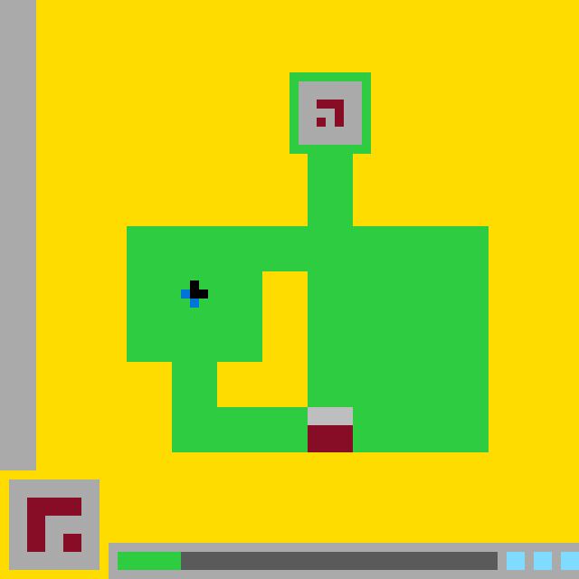

# `ls20` level `1` — LEFT / LEFT / LEFT / LEFT / RIGHT / RIGHT / RIGHT

## Navigation

[Level start](../../../../../../../README.md) · [Parent](../README.md)

### Actions

[`LEFT`](LEFT/README.md)

---

- **Full game ID:** `ls20-9607627b`
- **State:** `NOT_FINISHED`
- **Image hash:** `d674c3b92975a672`
- **Incoming action:** `ACTION4`

## Image



## Files

- [image.png](image.png)
- [state.json](state.json)
- [object_registry.pl](../../../../../../../object_registry.pl) — shared level registry (10 canonical identities)
- [differences.pl](differences.pl)
- [objects.pl](objects.pl)
- [rules.pl](rules.pl)
- [similarities.pl](similarities.pl)
- [turtle_from_diff.pl](turtle_from_diff.pl)
- [turtle_from_image.pl](turtle_from_image.pl)

## Embedded files

*Canonical identities are shared through [`object_registry.pl`](../../../../../../../object_registry.pl) and are not repeated in every node.*

<details>
<summary><code>state.json</code></summary>

````json
{
  "state": "NOT_FINISHED",
  "observation": {
    "game_id": "ls20-9607627b",
    "state": "NOT_FINISHED",
    "levels_completed": 0,
    "win_levels": 7,
    "action_input": {
      "id": "ACTION4",
      "data": {},
      "reasoning": null
    },
    "guid": "3758e2ba-d1de-4e0a-b087-a75755f5f5c6",
    "full_reset": false,
    "available_actions": [
      1,
      2,
      3,
      4
    ]
  },
  "step_count": 6,
  "game_id": "ls20-9607627b",
  "game_directory": "ls20",
  "level": "1",
  "image_hash": "d674c3b92975a672",
  "incoming_action": "ACTION4",
  "action_directory": "RIGHT",
  "action_data": {},
  "parent_node": "..",
  "action_path": [
    "LEFT",
    "LEFT",
    "LEFT",
    "LEFT",
    "RIGHT",
    "RIGHT",
    "RIGHT"
  ]
}
````

[Open `state.json`](state.json)

</details>

<details>
<summary><code>differences.pl</code></summary>

````prolog
comparison(parent,current).
action_between(parent,current,action4).

object_difference(parent,current,base_glyph,
    translated(vector(5,0),rect(29,45,5,5),rect(34,45,5,5))).
object_difference(parent,current,status_marker,
    extended(right,1,rect(13,61,6,2),rect(13,61,7,2))).

changed_cell_block(parent,current,rect(29,45,5,2),gray,green).
changed_cell_block(parent,current,rect(29,47,5,3),dark_red,green).
changed_cell_block(parent,current,rect(34,45,5,2),green,gray).
changed_cell_block(parent,current,rect(34,47,5,3),green,dark_red).
changed_cell_block(parent,current,rect(19,61,1,2),dark_gray,green).

unchanged_object(parent,current,central_hole).
unchanged_object(parent,current,green_structure).
unchanged_object(parent,current,hud_panel).
unchanged_object(parent,current,left_boundary_bar).
unchanged_object(parent,current,player_cursor).
unchanged_object(parent,current,status_pips).
unchanged_object(parent,current,status_track).
unchanged_object(parent,current,top_glyph).

changed_region_union(parent,current,
    union([rect(29,45,10,5),rect(19,61,1,2)])).
````

[Open `differences.pl`](differences.pl)

</details>

<details>
<summary><code>objects.pl</code></summary>

````prolog
% Canonical identities are loaded from the level registry.
:- ensure_loaded('../../../../../../../object_registry.pl').

% State-specific facts for this action-tree node.
state(current).
incoming_action(current, action4).
grid_size(current, 64, 64).
coordinate_system(current, logical_grid, origin(top_left), cell_size(1)).
rectangle_convention(rectangle_xy_width_height).
background_color(current, yellow).

object_present(current, base_glyph).
object_present(current, central_hole).
object_present(current, green_structure).
object_present(current, hud_panel).
object_present(current, left_boundary_bar).
object_present(current, player_cursor).
object_present(current, status_marker).
object_present(current, status_pips).
object_present(current, status_track).
object_present(current, top_glyph).

object_bbox(current, left_boundary_bar, rect(0,0,4,52)).
object_geometry(current, left_boundary_bar, rect(0,0,4,52)).
object_color_region(current, left_boundary_bar, gray, rect(0,0,4,52)).

object_bbox(current, green_structure, rect(14,8,40,42)).
object_geometry(current, green_structure,
    union([
        difference(rect(32,8,9,9),rect(33,9,7,7)),
        rect(34,17,5,8),
        difference(
            union([rect(14,25,40,15),rect(19,40,35,10)]),
            union([rect(29,30,5,10),rect(24,40,10,5)]))
    ])).
object_color(current, green_structure, green).
object_subregion(current, green_structure, top_chamber_fill, gray, rect(33,9,7,7)).

object_bbox(current, central_hole, rect(24,30,10,15)).
object_geometry(current, central_hole,
    union([rect(29,30,5,10),rect(24,40,10,5)])).
object_color(current, central_hole, yellow).
enclosed_by(current, central_hole, green_structure).

object_bbox(current, top_glyph, rect(35,11,3,3)).
object_geometry(current, top_glyph,
    union([rect(35,11,3,1),rect(37,12,1,2),rect(35,13,1,1)])).
object_color(current, top_glyph, dark_red).
contained_in(current, top_glyph, green_structure).

object_bbox(current, player_cursor, rect(20,31,3,3)).
object_color_region(current, player_cursor, black,
    union([cell(21,31),cell(21,32),cell(22,32)])).
object_color_region(current, player_cursor, blue,
    union([cell(20,32),cell(21,33)])).
contained_in(current, player_cursor, green_structure).
object_occludes(current, player_cursor, green_structure).

object_bbox(current, base_glyph, rect(34,45,5,5)).
object_geometry(current, base_glyph, rect(34,45,5,5)).
object_color_region(current, base_glyph, gray, rect(34,45,5,2)).
object_color_region(current, base_glyph, dark_red, rect(34,47,5,3)).
contained_in(current, base_glyph, green_structure).
object_occludes(current, base_glyph, green_structure).

object_bbox(current, hud_panel, rect(1,53,10,10)).
object_geometry(current, hud_panel, rect(1,53,10,10)).
object_color_region(current, hud_panel, gray, rect(1,53,10,10)).
object_subregion(current, hud_panel, panel_glyph, dark_red,
    union([rect(3,55,6,2),rect(3,57,2,4),rect(7,59,2,2)])).

object_bbox(current, status_track, rect(12,60,52,4)).
object_geometry(current, status_track, rect(12,60,52,4)).
object_color_region(current, status_track, gray, rect(12,60,52,4)).
object_color_region(current, status_track, dark_gray, rect(20,61,35,2)).

object_bbox(current, status_marker, rect(13,61,7,2)).
object_geometry(current, status_marker, rect(13,61,7,2)).
object_color(current, status_marker, green).
contained_in(current, status_marker, status_track).
object_occludes(current, status_marker, status_track).

object_bbox(current, status_pips, rect(56,61,8,2)).
object_geometry(current, status_pips,
    union([rect(56,61,2,2),rect(59,61,2,2),rect(62,61,2,2)])).
object_color(current, status_pips, cyan).
contained_in(current, status_pips, status_track).
object_occludes(current, status_pips, status_track).

turtle_program(left_boundary_bar,
    [set_color(gray),fill_rect(0,0,4,52)]).
turtle_program(green_structure,
    [set_color(green),fill_rect(32,8,9,9),
     set_color(gray),fill_rect(33,9,7,7),
     set_color(green),fill_rect(34,17,5,8),fill_rect(14,25,40,15),fill_rect(19,40,35,10),
     set_color(yellow),fill_rect(29,30,5,10),fill_rect(24,40,10,5)]).
turtle_program(central_hole,
    [set_color(yellow),fill_rect(29,30,5,10),fill_rect(24,40,10,5)]).
turtle_program(top_glyph,
    [set_color(dark_red),fill_rect(35,11,3,1),fill_rect(37,12,1,2),fill_cell(35,13)]).
turtle_program(player_cursor,
    [set_color(black),fill_cell(21,31),fill_rect(21,32,2,1),
     set_color(blue),fill_cell(20,32),fill_cell(21,33)]).
turtle_program(base_glyph,
    [set_color(gray),fill_rect(34,45,5,2),set_color(dark_red),fill_rect(34,47,5,3)]).
turtle_program(hud_panel,
    [set_color(gray),fill_rect(1,53,10,10),
     set_color(dark_red),fill_rect(3,55,6,2),fill_rect(3,57,2,4),fill_rect(7,59,2,2)]).
turtle_program(status_track,
    [set_color(gray),fill_rect(12,60,52,4),set_color(dark_gray),fill_rect(13,61,42,2)]).
turtle_program(status_marker,
    [set_color(green),fill_rect(13,61,7,2)]).
turtle_program(status_pips,
    [set_color(cyan),fill_rect(56,61,2,2),fill_rect(59,61,2,2),fill_rect(62,61,2,2)]).
````

[Open `objects.pl`](objects.pl)

</details>

<details>
<summary><code>rules.pl</code></summary>

````prolog
observed_rule(action4_base_translation,
    action_effect(action4,translate(base_glyph,vector(5,0)))).
observed_rule(action4_status_advance,
    action_effect(action4,extend(status_marker,right,1))).
observed_rule(action4_locality,
    changes_confined_to(union([rect(29,45,10,5),rect(19,61,1,2)]))).
observed_rule(action4_preservation,
    preserves([central_hole,green_structure,hud_panel,left_boundary_bar,player_cursor,status_pips,status_track,top_glyph])).

hypothetical_rule(action4_slot_progression,action4,
    advances(base_glyph,right,one_glyph_width)).
hypothetical_rule(action4_progress_meter,action4,
    increments(status_marker,one_cell)).
hypothetical_rule(action4_coupled_progress,action4,
    couples(translate(base_glyph,vector(5,0)),extend(status_marker,right,1))).

evidence(base_bbox_evidence,parent_current,
    bbox_change(base_glyph,rect(29,45,5,5),rect(34,45,5,5))).
evidence(base_recolor_evidence,parent_current,
    recolors([rect(29,45,5,2)-gray-green,rect(29,47,5,3)-dark_red-green,rect(34,45,5,2)-green-gray,rect(34,47,5,3)-green-dark_red])).
evidence(status_extension_evidence,parent_current,
    recolor(rect(19,61,1,2),dark_gray,green)).
evidence(locality_evidence,parent_current,
    exhaustive_changed_region(union([rect(29,45,10,5),rect(19,61,1,2)]))).
evidence(preservation_evidence,parent_current,
    unchanged([central_hole,green_structure,hud_panel,left_boundary_bar,player_cursor,status_pips,status_track,top_glyph])).

supported_by(action4_base_translation,base_bbox_evidence).
supported_by(action4_base_translation,base_recolor_evidence).
supported_by(action4_status_advance,status_extension_evidence).
supported_by(action4_locality,locality_evidence).
supported_by(action4_preservation,preservation_evidence).
supported_by(action4_slot_progression,base_bbox_evidence).
supported_by(action4_progress_meter,status_extension_evidence).
supported_by(action4_coupled_progress,base_bbox_evidence).
supported_by(action4_coupled_progress,status_extension_evidence).

contradicted_by(_Rule,_Evidence) :- fail.
````

[Open `rules.pl`](rules.pl)

</details>

<details>
<summary><code>similarities.pl</code></summary>

````prolog
object_correspondence(parent,current,base_glyph,translation(5,0)).
object_correspondence(parent,current,central_hole,identity).
object_correspondence(parent,current,green_structure,identity).
object_correspondence(parent,current,hud_panel,identity).
object_correspondence(parent,current,left_boundary_bar,identity).
object_correspondence(parent,current,player_cursor,identity).
object_correspondence(parent,current,status_marker,right_extension(1)).
object_correspondence(parent,current,status_pips,identity).
object_correspondence(parent,current,status_track,identity).
object_correspondence(parent,current,top_glyph,identity).

similarity(parent,current,base_glyph,1.0).
similarity(parent,current,central_hole,1.0).
similarity(parent,current,green_structure,1.0).
similarity(parent,current,hud_panel,1.0).
similarity(parent,current,left_boundary_bar,1.0).
similarity(parent,current,player_cursor,1.0).
similarity(parent,current,status_marker,1.0).
similarity(parent,current,status_pips,1.0).
similarity(parent,current,status_track,1.0).
similarity(parent,current,top_glyph,1.0).
````

[Open `similarities.pl`](similarities.pl)

</details>

<details>
<summary><code>turtle_from_diff.pl</code></summary>

````prolog
turtle_program(patch_parent_to_current,
    [set_color(green),fill_rect(29,45,5,5),
     set_color(gray),fill_rect(34,45,5,2),
     set_color(dark_red),fill_rect(34,47,5,3),
     set_color(green),fill_rect(19,61,1,2)]).
````

[Open `turtle_from_diff.pl`](turtle_from_diff.pl)

</details>

<details>
<summary><code>turtle_from_image.pl</code></summary>

````prolog
turtle_program(redraw_current_frame,
    [set_color(yellow),fill_rect(0,0,64,64),
     set_color(gray),fill_rect(0,0,4,52),

     set_color(green),fill_rect(32,8,9,9),
     set_color(gray),fill_rect(33,9,7,7),
     set_color(dark_red),fill_rect(35,11,3,1),fill_rect(37,12,1,2),fill_cell(35,13),
     set_color(green),fill_rect(34,17,5,8),fill_rect(14,25,40,15),fill_rect(19,40,35,10),
     set_color(yellow),fill_rect(29,30,5,10),fill_rect(24,40,10,5),

     set_color(black),fill_cell(21,31),fill_rect(21,32,2,1),
     set_color(blue),fill_cell(20,32),fill_cell(21,33),

     set_color(gray),fill_rect(34,45,5,2),
     set_color(dark_red),fill_rect(34,47,5,3),

     set_color(gray),fill_rect(1,53,10,10),
     set_color(dark_red),fill_rect(3,55,6,2),fill_rect(3,57,2,4),fill_rect(7,59,2,2),

     set_color(gray),fill_rect(12,60,52,4),
     set_color(dark_gray),fill_rect(13,61,42,2),
     set_color(green),fill_rect(13,61,7,2),
     set_color(cyan),fill_rect(56,61,2,2),fill_rect(59,61,2,2),fill_rect(62,61,2,2)]).
````

[Open `turtle_from_image.pl`](turtle_from_image.pl)

</details>
