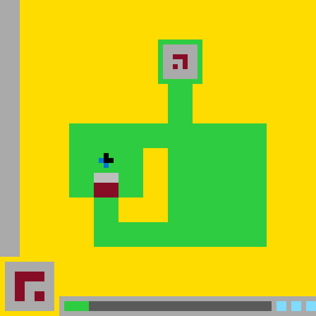

# `ls20` level `1` — LEFT / LEFT / LEFT / UP / UP

## Navigation

[Level start](../../../../../README.md) · [Parent](../README.md)

### Actions

[`UP`](UP/README.md)

---

- **Full game ID:** `ls20`
- **State:** `NOT_FINISHED`
- **Image hash:** `122995df0b8cad0e`
- **Incoming action:** `ACTION1`

## Image



## Files

- [image.png](image.png)
- [state.json](state.json)
- [object_registry.pl](../../../../../object_registry.pl) — shared level registry (10 canonical identities)
- [differences.pl](differences.pl)
- [objects.pl](objects.pl)
- [rules.pl](rules.pl)
- [similarities.pl](similarities.pl)
- [turtle_from_diff.pl](turtle_from_diff.pl)
- [turtle_from_image.pl](turtle_from_image.pl)

## Embedded files

*Canonical identities are shared through [`object_registry.pl`](../../../../../object_registry.pl) and are not repeated in every node.*

<details>
<summary><code>state.json</code></summary>

````json
{
  "state": "NOT_FINISHED",
  "observation": {
    "game_id": "ls20-9607627b",
    "state": "NOT_FINISHED",
    "levels_completed": 0,
    "win_levels": 7,
    "action_input": {
      "id": "ACTION1",
      "data": {},
      "reasoning": null
    },
    "guid": "cce92f71-96a0-45c5-b7d7-d8b66521ca4d",
    "full_reset": false,
    "available_actions": [
      1,
      2,
      3,
      4
    ]
  },
  "step_count": 4,
  "game_id": "ls20",
  "game_directory": "ls20",
  "level": "1",
  "image_hash": "122995df0b8cad0e",
  "incoming_action": "ACTION1",
  "action_directory": "UP",
  "action_data": {},
  "parent_node": "..",
  "action_path": [
    "LEFT",
    "LEFT",
    "LEFT",
    "UP",
    "UP"
  ]
}
````

[Open `state.json`](state.json)

</details>

<details>
<summary><code>differences.pl</code></summary>

````prolog
parent_state(parent).
current_state(current).
applied_action(parent, current, 'ACTION1').

object_translation(parent, current, base_glyph, vector(0,-5)).
object_bbox_change(parent, current, base_glyph, bbox(19,40,23,44), bbox(19,35,23,39)).
object_shape_preserved_under_translation(parent, current, base_glyph, vector(0,-5)).

object_geometry_extension(parent, current, green_structure, rectangle(19,40,23,44,green)).
structural_part_added(parent, current, green_structure, left_lower_connector, rectangle(19,40,23,44,green)).
relation_change(parent, current, central_hole, enclosed_by([green_structure,base_glyph]), enclosed_by([green_structure])).

object_bbox_change(parent, current, status_marker, bbox(13,61,16,62), bbox(13,61,17,62)).
object_geometry_extension(parent, current, status_marker, rectangle(17,61,17,62,green)).

color_change_region(parent, current, rectangle(19,35,23,36), green, gray).
color_change_region(parent, current, rectangle(19,37,23,39), green, dark_red).
color_change_region(parent, current, rectangle(19,40,23,41), gray, green).
color_change_region(parent, current, rectangle(19,42,23,44), dark_red, green).
color_change_region(parent, current, rectangle(17,61,17,62), dark_gray, green).

unchanged_object(parent, current, left_boundary_bar).
unchanged_object(parent, current, top_glyph).
unchanged_object(parent, current, central_hole).
unchanged_object(parent, current, player_cursor).
unchanged_object(parent, current, hud_panel).
unchanged_object(parent, current, status_track).
unchanged_object(parent, current, status_pips).
````

[Open `differences.pl`](differences.pl)

</details>

<details>
<summary><code>objects.pl</code></summary>

````prolog
% Canonical identities are loaded from the level registry.
:- ensure_loaded('../../../../../object_registry.pl').

% State-specific facts for this action-tree node.
state(current).
logical_grid(current, 64, 64).
coordinate_system(current, zero_based, x_right_y_down).
background_color(current, yellow).

present_object(current, base_glyph, compound_object).
present_object(current, central_hole, hole).
present_object(current, green_structure, compound_object).
present_object(current, hud_panel, interface_object).
present_object(current, left_boundary_bar, bar).
present_object(current, player_cursor, compound_object).
present_object(current, status_marker, interface_object).
present_object(current, status_pips, interface_object).
present_object(current, status_track, interface_object).
present_object(current, top_glyph, glyph).

object_bbox(current, left_boundary_bar, 0, 0, 3, 51).
object_shape(current, left_boundary_bar, rectangle(0,0,3,51,gray)).

object_bbox(current, green_structure, 14, 8, 53, 49).
object_shape(current, green_structure, union([
    rectangle(32,8,40,8,green),
    rectangle(32,9,32,15,green),
    rectangle(40,9,40,15,green),
    rectangle(32,16,40,16,green),
    rectangle(34,17,38,24,green),
    rectangle(14,25,53,29,green),
    rectangle(14,30,28,39,green),
    rectangle(19,40,23,44,green),
    rectangle(34,30,53,44,green),
    rectangle(19,45,53,49,green)
])).
structural_part(current, green_structure, top_frame, frame(32,8,40,16,1,green)).
structural_part(current, green_structure, neck, rectangle(34,17,38,24,green)).
structural_part(current, green_structure, upper_bar, rectangle(14,25,53,29,green)).
structural_part(current, green_structure, left_lobe, rectangle(14,30,28,39,green)).
structural_part(current, green_structure, left_lower_connector, rectangle(19,40,23,44,green)).
structural_part(current, green_structure, right_body, rectangle(34,30,53,44,green)).
structural_part(current, green_structure, bottom_bar, rectangle(19,45,53,49,green)).
subobject_geometry(current, green_structure, top_chamber_panel, rectangle(33,9,39,15,gray)).

object_bbox(current, top_glyph, 35, 11, 37, 13).
object_shape(current, top_glyph, union([
    rectangle(35,11,37,11,dark_red),
    rectangle(37,12,37,13,dark_red),
    cell(35,13,dark_red)
])).
contained_in(current, top_glyph, green_structure).

object_bbox(current, central_hole, 24, 30, 33, 44).
object_shape(current, central_hole, union([
    rectangle(29,30,33,39,yellow),
    rectangle(24,40,33,44,yellow)
])).
enclosed_by(current, central_hole, [green_structure]).

object_bbox(current, player_cursor, 20, 31, 22, 33).
object_shape(current, player_cursor, union([
    cell(21,31,black),
    rectangle(21,32,22,32,black),
    cell(20,32,blue),
    cell(21,33,blue)
])).
overlays(current, player_cursor, green_structure).

object_bbox(current, base_glyph, 19, 35, 23, 39).
object_shape(current, base_glyph, layered([
    rectangle(19,35,23,36,gray),
    rectangle(19,37,23,39,dark_red)
])).
overlays(current, base_glyph, green_structure).

object_bbox(current, hud_panel, 1, 53, 10, 62).
object_shape(current, hud_panel, layered([
    rectangle(1,53,10,62,gray),
    rectangle(3,55,8,56,dark_red),
    rectangle(3,57,4,60,dark_red),
    rectangle(7,59,8,60,dark_red)
])).

object_bbox(current, status_track, 12, 60, 63, 63).
object_shape(current, status_track, layered([
    rectangle(12,60,63,63,gray),
    rectangle(17,61,54,62,dark_gray)
])).

object_bbox(current, status_marker, 13, 61, 17, 62).
object_shape(current, status_marker, rectangle(13,61,17,62,green)).

object_bbox(current, status_pips, 56, 61, 63, 62).
object_shape(current, status_pips, union([
    rectangle(56,61,57,62,cyan),
    rectangle(59,61,60,62,cyan),
    rectangle(62,61,63,62,cyan)
])).
overlays(current, status_marker, status_track).
overlays(current, status_pips, status_track).

z_order(current, [background,left_boundary_bar,green_structure,top_chamber_panel,top_glyph,central_hole,player_cursor,base_glyph,hud_panel,status_track,status_marker,status_pips]).

turtle_program(left_boundary_bar, [set_color(gray),fill_rect(0,0,3,51)]).
turtle_program(green_structure, [set_color(green),fill_rect(32,8,40,8),fill_rect(32,9,32,15),fill_rect(40,9,40,15),fill_rect(32,16,40,16),fill_rect(34,17,38,24),fill_rect(14,25,53,29),fill_rect(14,30,28,39),fill_rect(19,40,23,44),fill_rect(34,30,53,44),fill_rect(19,45,53,49),set_color(gray),fill_rect(33,9,39,15)]).
turtle_program(top_glyph, [set_color(dark_red),fill_rect(35,11,37,11),fill_rect(37,12,37,13),fill_cell(35,13)]).
turtle_program(central_hole, [set_color(yellow),fill_rect(29,30,33,39),fill_rect(24,40,33,44)]).
turtle_program(player_cursor, [set_color(black),fill_cell(21,31),fill_rect(21,32,22,32),set_color(blue),fill_cell(20,32),fill_cell(21,33)]).
turtle_program(base_glyph, [set_color(gray),fill_rect(19,35,23,36),set_color(dark_red),fill_rect(19,37,23,39)]).
turtle_program(hud_panel, [set_color(gray),fill_rect(1,53,10,62),set_color(dark_red),fill_rect(3,55,8,56),fill_rect(3,57,4,60),fill_rect(7,59,8,60)]).
turtle_program(status_track, [set_color(gray),fill_rect(12,60,63,63),set_color(dark_gray),fill_rect(17,61,54,62)]).
turtle_program(status_marker, [set_color(green),fill_rect(13,61,17,62)]).
turtle_program(status_pips, [set_color(cyan),fill_rect(56,61,57,62),fill_rect(59,61,60,62),fill_rect(62,61,63,62)]).
````

[Open `objects.pl`](objects.pl)

</details>

<details>
<summary><code>rules.pl</code></summary>

````prolog
observed_rule(action1_base_translation, transition(action('ACTION1'), translation(base_glyph,0,-5))).
observed_rule(action1_green_connector, transition(action('ACTION1'), add_part(green_structure,rectangle(19,40,23,44,green)))).
observed_rule(action1_status_advance, transition(action('ACTION1'), extend_right(status_marker,1))).

hypothetical_rule(action1_moves_base_up_by_its_height, effect(action('ACTION1'),move(base_glyph,up,5)), confidence(medium)).
hypothetical_rule(vacated_base_footprint_becomes_green_structure, effect(move(base_glyph),fill_vacated_footprint(green_structure,green)), confidence(medium)).
hypothetical_rule(status_marker_tracks_successful_actions, effect(successful_action,extend_right(status_marker,1)), confidence(low)).

evidence(ev_base_bbox, bbox_transition(base_glyph,bbox(19,40,23,44),bbox(19,35,23,39)), direct_parent_current_comparison).
evidence(ev_base_pixels, translated_color_pattern(base_glyph,vector(0,-5)), direct_parent_current_comparison).
evidence(ev_connector_pixels, color_transition(rectangle(19,40,23,44),base_glyph_colors,green), direct_parent_current_comparison).
evidence(ev_enclosure, enclosure_transition(central_hole,[green_structure,base_glyph],[green_structure]), derived_from_exact_geometry).
evidence(ev_status_column, color_transition(rectangle(17,61,17,62),dark_gray,green), direct_parent_current_comparison).

supported_by(action1_base_translation, ev_base_bbox).
supported_by(action1_base_translation, ev_base_pixels).
supported_by(action1_green_connector, ev_connector_pixels).
supported_by(action1_green_connector, ev_enclosure).
supported_by(action1_status_advance, ev_status_column).
supported_by(action1_moves_base_up_by_its_height, ev_base_bbox).
supported_by(vacated_base_footprint_becomes_green_structure, ev_connector_pixels).
supported_by(status_marker_tracks_successful_actions, ev_status_column).

contradicted_by(_Rule, _Evidence) :- fail.
````

[Open `rules.pl`](rules.pl)

</details>

<details>
<summary><code>similarities.pl</code></summary>

````prolog
object_correspondence(parent, current, left_boundary_bar, left_boundary_bar).
object_correspondence(parent, current, green_structure, green_structure).
object_correspondence(parent, current, top_glyph, top_glyph).
object_correspondence(parent, current, central_hole, central_hole).
object_correspondence(parent, current, player_cursor, player_cursor).
object_correspondence(parent, current, base_glyph, base_glyph).
object_correspondence(parent, current, hud_panel, hud_panel).
object_correspondence(parent, current, status_track, status_track).
object_correspondence(parent, current, status_marker, status_marker).
object_correspondence(parent, current, status_pips, status_pips).

object_similarity(parent, current, base_glyph, exact_shape_and_colors, translated(0,-5)).
object_similarity(parent, current, green_structure, same_core_geometry, added_part(rectangle(19,40,23,44,green))).
object_similarity(parent, current, status_marker, same_left_anchor_and_color, extended_right(1)).
object_similarity(parent, current, left_boundary_bar, exact_geometry, unchanged).
object_similarity(parent, current, top_glyph, exact_geometry, unchanged).
object_similarity(parent, current, central_hole, exact_geometry, unchanged).
object_similarity(parent, current, player_cursor, exact_geometry, unchanged).
object_similarity(parent, current, hud_panel, exact_geometry, unchanged).
object_similarity(parent, current, status_track, exact_geometry, unchanged).
object_similarity(parent, current, status_pips, exact_geometry, unchanged).
````

[Open `similarities.pl`](similarities.pl)

</details>

<details>
<summary><code>turtle_from_diff.pl</code></summary>

````prolog
turtle_from_diff(parent, current, [
    set_color(green),fill_rect(19,40,23,44),
    set_color(gray),fill_rect(19,35,23,36),
    set_color(dark_red),fill_rect(19,37,23,39),
    set_color(green),fill_rect(17,61,17,62)
]).
````

[Open `turtle_from_diff.pl`](turtle_from_diff.pl)

</details>

<details>
<summary><code>turtle_from_image.pl</code></summary>

````prolog
turtle_from_image(current, [
    clear(yellow),
    set_color(gray),fill_rect(0,0,3,51),
    set_color(green),fill_rect(32,8,40,8),fill_rect(32,9,32,15),fill_rect(40,9,40,15),fill_rect(32,16,40,16),fill_rect(34,17,38,24),fill_rect(14,25,53,29),fill_rect(14,30,28,39),fill_rect(19,40,23,44),fill_rect(34,30,53,44),fill_rect(19,45,53,49),
    set_color(gray),fill_rect(33,9,39,15),
    set_color(dark_red),fill_rect(35,11,37,11),fill_rect(37,12,37,13),fill_cell(35,13),
    set_color(yellow),fill_rect(29,30,33,39),fill_rect(24,40,33,44),
    set_color(black),fill_cell(21,31),fill_rect(21,32,22,32),
    set_color(blue),fill_cell(20,32),fill_cell(21,33),
    set_color(gray),fill_rect(19,35,23,36),
    set_color(dark_red),fill_rect(19,37,23,39),
    set_color(gray),fill_rect(1,53,10,62),
    set_color(dark_red),fill_rect(3,55,8,56),fill_rect(3,57,4,60),fill_rect(7,59,8,60),
    set_color(gray),fill_rect(12,60,63,63),
    set_color(dark_gray),fill_rect(17,61,54,62),
    set_color(green),fill_rect(13,61,17,62),
    set_color(cyan),fill_rect(56,61,57,62),fill_rect(59,61,60,62),fill_rect(62,61,63,62)
]).
````

[Open `turtle_from_image.pl`](turtle_from_image.pl)

</details>
