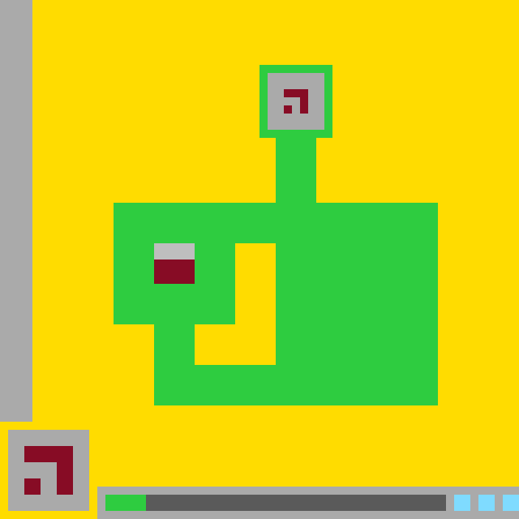

# `ls20` level `1` — LEFT / LEFT / LEFT / UP / UP / UP

## Navigation

[Level start](../../../../../../README.md) · [Parent](../README.md)

### Actions

*No child actions recorded yet.*

---

- **Full game ID:** `ls20-9607627b`
- **State:** `NOT_FINISHED`
- **Image hash:** `87526fc406bb7d58`
- **Incoming action:** `ACTION1`

## Image



## Files

- [image.png](image.png)
- [state.json](state.json)
- [object_registry.pl](../../../../../../object_registry.pl) — shared level registry (10 canonical identities)
- [differences.pl](differences.pl)
- [objects.pl](objects.pl)
- [rules.pl](rules.pl)
- [similarities.pl](similarities.pl)
- [turtle_from_diff.pl](turtle_from_diff.pl)
- [turtle_from_image.pl](turtle_from_image.pl)

## Embedded files

*Canonical identities are shared through [`object_registry.pl`](../../../../../../object_registry.pl) and are not repeated in every node.*

<details>
<summary><code>state.json</code></summary>

````json
{
  "state": "NOT_FINISHED",
  "observation": {
    "game_id": "ls20-9607627b",
    "state": "NOT_FINISHED",
    "levels_completed": 0,
    "win_levels": 7,
    "action_input": {
      "id": "ACTION1",
      "data": {},
      "reasoning": null
    },
    "guid": "ecab9663-aa57-40e3-bca1-a90e2c5a3966",
    "full_reset": false,
    "available_actions": [
      1,
      2,
      3,
      4
    ]
  },
  "step_count": 5,
  "game_id": "ls20-9607627b",
  "game_directory": "ls20",
  "level": "1",
  "image_hash": "87526fc406bb7d58",
  "incoming_action": "ACTION1",
  "action_directory": "UP",
  "action_data": {},
  "parent_node": "..",
  "action_path": [
    "LEFT",
    "LEFT",
    "LEFT",
    "UP",
    "UP",
    "UP"
  ]
}
````

[Open `state.json`](state.json)

</details>

<details>
<summary><code>differences.pl</code></summary>

````prolog
transition(parent, current, 'ACTION1').

visibility_change(parent, current, player_cursor, visible, not_visibly_detected).
prior_footprint_fully_covered_by(parent, player_cursor, current, base_glyph).
prior_bbox(parent, player_cursor, bbox(20,31,22,33)).
covering_bbox(current, base_glyph, bbox(19,30,23,34)).

object_translation(parent, current, base_glyph, delta(0,-5)).
bbox_change(parent, current, base_glyph, bbox(19,35,23,39), bbox(19,30,23,34)).
shape_change(parent, current, base_glyph,
    layered([rectangle(19,35,23,36,gray),rectangle(19,37,23,39,dark_red)]),
    layered([rectangle(19,30,23,31,gray),rectangle(19,32,23,34,dark_red)])).

internal_shape_transform(parent, current, hud_panel, status_glyph, horizontal_reflection(rational_axis_x(11,2))).
removed_cells(parent, current, hud_panel, rectangle(3,57,4,58,dark_red)).
added_cells(parent, current, hud_panel, rectangle(7,57,8,58,dark_red)).

unchanged_background(parent, current, yellow).
unchanged_object_geometry(parent, current, left_boundary_bar).
unchanged_object_geometry(parent, current, green_structure).
unchanged_object_geometry(parent, current, top_glyph).
unchanged_object_geometry(parent, current, central_hole).
unchanged_object_geometry(parent, current, status_track).
unchanged_object_geometry(parent, current, status_marker).
unchanged_object_geometry(parent, current, status_pips).
````

[Open `differences.pl`](differences.pl)

</details>

<details>
<summary><code>objects.pl</code></summary>

````prolog
% Canonical identities are loaded from the level registry.
:- ensure_loaded('../../../../../../object_registry.pl').

% State-specific facts for this action-tree node.
state(current).
logical_grid(current, 64, 64).
coordinate_system(current, zero_based, x_right_y_down).
background_color(current, yellow).

present_object(current, base_glyph, compound_object).
present_object(current, central_hole, hole).
present_object(current, green_structure, compound_object).
present_object(current, hud_panel, interface_object).
present_object(current, left_boundary_bar, bar).
present_object(current, status_marker, interface_object).
present_object(current, status_pips, interface_object).
present_object(current, status_track, interface_object).
present_object(current, top_glyph, glyph).
not_visibly_detected(current, player_cursor).
possible_occlusion_or_removal(current, player_cursor, base_glyph).

object_bbox(current, left_boundary_bar, 0, 0, 3, 51).
object_shape(current, left_boundary_bar, rectangle(0,0,3,51,gray)).

object_bbox(current, green_structure, 14, 8, 53, 49).
object_shape(current, green_structure, union([
    rectangle(32,8,40,8,green),
    rectangle(32,9,32,15,green),
    rectangle(40,9,40,15,green),
    rectangle(32,16,40,16,green),
    rectangle(34,17,38,24,green),
    rectangle(14,25,53,29,green),
    rectangle(14,30,28,39,green),
    rectangle(19,40,23,44,green),
    rectangle(34,30,53,44,green),
    rectangle(19,45,53,49,green)
])).
structural_part(current, green_structure, top_frame, frame(32,8,40,16,1,green)).
structural_part(current, green_structure, neck, rectangle(34,17,38,24,green)).
structural_part(current, green_structure, upper_bar, rectangle(14,25,53,29,green)).
structural_part(current, green_structure, left_lobe, rectangle(14,30,28,39,green)).
structural_part(current, green_structure, left_lower_connector, rectangle(19,40,23,44,green)).
structural_part(current, green_structure, right_body, rectangle(34,30,53,44,green)).
structural_part(current, green_structure, bottom_bar, rectangle(19,45,53,49,green)).
subobject_geometry(current, green_structure, top_chamber_panel, rectangle(33,9,39,15,gray)).

object_bbox(current, top_glyph, 35, 11, 37, 13).
object_shape(current, top_glyph, union([
    rectangle(35,11,37,11,dark_red),
    rectangle(37,12,37,13,dark_red),
    cell(35,13,dark_red)
])).
contained_in(current, top_glyph, green_structure).

object_bbox(current, central_hole, 24, 30, 33, 44).
object_shape(current, central_hole, union([
    rectangle(29,30,33,39,yellow),
    rectangle(24,40,33,44,yellow)
])).
enclosed_by(current, central_hole, [green_structure]).

object_bbox(current, base_glyph, 19, 30, 23, 34).
object_shape(current, base_glyph, layered([
    rectangle(19,30,23,31,gray),
    rectangle(19,32,23,34,dark_red)
])).
structural_part(current, base_glyph, gray_cap, rectangle(19,30,23,31,gray)).
structural_part(current, base_glyph, dark_red_body, rectangle(19,32,23,34,dark_red)).
overlays(current, base_glyph, green_structure).

object_bbox(current, hud_panel, 1, 53, 10, 62).
object_shape(current, hud_panel, layered([
    rectangle(1,53,10,62,gray),
    rectangle(3,55,8,56,dark_red),
    rectangle(7,57,8,60,dark_red),
    rectangle(3,59,4,60,dark_red)
])).
subobject_geometry(current, hud_panel, status_glyph, union([
    rectangle(3,55,8,56,dark_red),
    rectangle(7,57,8,60,dark_red),
    rectangle(3,59,4,60,dark_red)
])).

object_bbox(current, status_track, 12, 60, 63, 63).
object_shape(current, status_track, layered([
    rectangle(12,60,63,63,gray),
    rectangle(17,61,54,62,dark_gray)
])).

object_bbox(current, status_marker, 13, 61, 17, 62).
object_shape(current, status_marker, rectangle(13,61,17,62,green)).

object_bbox(current, status_pips, 56, 61, 63, 62).
object_shape(current, status_pips, union([
    rectangle(56,61,57,62,cyan),
    rectangle(59,61,60,62,cyan),
    rectangle(62,61,63,62,cyan)
])).
overlays(current, status_marker, status_track).
overlays(current, status_pips, status_track).

z_order(current, [background,left_boundary_bar,green_structure,top_chamber_panel,top_glyph,central_hole,base_glyph,hud_panel,status_track,status_marker,status_pips]).

turtle_program(left_boundary_bar, [set_color(gray),fill_rect(0,0,3,51)]).
turtle_program(green_structure, [set_color(green),fill_rect(32,8,40,8),fill_rect(32,9,32,15),fill_rect(40,9,40,15),fill_rect(32,16,40,16),fill_rect(34,17,38,24),fill_rect(14,25,53,29),fill_rect(14,30,28,39),fill_rect(19,40,23,44),fill_rect(34,30,53,44),fill_rect(19,45,53,49),set_color(gray),fill_rect(33,9,39,15)]).
turtle_program(top_glyph, [set_color(dark_red),fill_rect(35,11,37,11),fill_rect(37,12,37,13),fill_cell(35,13)]).
turtle_program(central_hole, [set_color(yellow),fill_rect(29,30,33,39),fill_rect(24,40,33,44)]).
turtle_program(base_glyph, [set_color(gray),fill_rect(19,30,23,31),set_color(dark_red),fill_rect(19,32,23,34)]).
turtle_program(hud_panel, [set_color(gray),fill_rect(1,53,10,62),set_color(dark_red),fill_rect(3,55,8,56),fill_rect(7,57,8,60),fill_rect(3,59,4,60)]).
turtle_program(status_track, [set_color(gray),fill_rect(12,60,63,63),set_color(dark_gray),fill_rect(17,61,54,62)]).
turtle_program(status_marker, [set_color(green),fill_rect(13,61,17,62)]).
turtle_program(status_pips, [set_color(cyan),fill_rect(56,61,57,62),fill_rect(59,61,60,62),fill_rect(62,61,63,62)]).
````

[Open `objects.pl`](objects.pl)

</details>

<details>
<summary><code>rules.pl</code></summary>

````prolog
observed_rule(base_shift_observed, effect('ACTION1', translated(base_glyph,delta(0,-5)))).
observed_rule(cursor_visibility_loss_observed, effect('ACTION1', visibility_change(player_cursor,visible,not_visibly_detected))).
observed_rule(hud_reflection_observed, effect('ACTION1', reflected(hud_panel,status_glyph,horizontal,rational_axis_x(11,2)))).

hypothetical_rule(cursor_base_interaction_hypothesis, 'ACTION1', interaction(player_cursor,base_glyph,occludes_or_removes_cursor_while_shifting_base)).
hypothetical_rule(hud_action_indicator_hypothesis, 'ACTION1', hud_panel_encodes_action_by(horizontal_reflection)).
hypothetical_rule(global_upward_motion_hypothesis, 'ACTION1', translated(all_present_scene_objects,delta(0,-5))).

evidence(ev_base_bbox, 'ACTION1', bbox_change(base_glyph,bbox(19,35,23,39),bbox(19,30,23,34))).
evidence(ev_base_shape, 'ACTION1', same_colored_shape_at_delta(base_glyph,delta(0,-5))).
evidence(ev_cursor_visibility, 'ACTION1', no_visible_cells_of(player_cursor)).
evidence(ev_cursor_coverage, 'ACTION1', prior_cursor_bbox_contained_in_current_base_bbox(bbox(20,31,22,33),bbox(19,30,23,34))).
evidence(ev_hud_delta, 'ACTION1', cell_delta(removed(rectangle(3,57,4,58,dark_red)),added(rectangle(7,57,8,58,dark_red)))).
evidence(ev_hud_reflection, 'ACTION1', exact_horizontal_reflection(status_glyph,rational_axis_x(11,2))).
evidence(ev_static_anchors, 'ACTION1', unchanged([left_boundary_bar,green_structure,top_glyph,central_hole,status_track,status_marker,status_pips])).

supported_by(base_shift_observed, ev_base_bbox).
supported_by(base_shift_observed, ev_base_shape).
supported_by(cursor_visibility_loss_observed, ev_cursor_visibility).
supported_by(cursor_visibility_loss_observed, ev_cursor_coverage).
supported_by(hud_reflection_observed, ev_hud_delta).
supported_by(hud_reflection_observed, ev_hud_reflection).
supported_by(cursor_base_interaction_hypothesis, ev_base_bbox).
supported_by(cursor_base_interaction_hypothesis, ev_cursor_coverage).
supported_by(hud_action_indicator_hypothesis, ev_hud_reflection).

contradicted_by(global_upward_motion_hypothesis, ev_static_anchors).
````

[Open `rules.pl`](rules.pl)

</details>

<details>
<summary><code>similarities.pl</code></summary>

````prolog
object_correspondence(parent, left_boundary_bar, current, left_boundary_bar, exact_geometry_and_color).
object_correspondence(parent, green_structure, current, green_structure, exact_geometry_and_color).
object_correspondence(parent, top_glyph, current, top_glyph, exact_geometry_and_color).
object_correspondence(parent, central_hole, current, central_hole, exact_geometry_and_color).
object_correspondence(parent, base_glyph, current, base_glyph, same_shape_and_colors_translated(delta(0,-5))).
object_correspondence(parent, hud_panel, current, hud_panel, same_panel_with_reflected_internal_glyph).
object_correspondence(parent, status_track, current, status_track, exact_geometry_and_color).
object_correspondence(parent, status_marker, current, status_marker, exact_geometry_and_color).
object_correspondence(parent, status_pips, current, status_pips, exact_geometry_and_color).

unmatched_visible_parent_object(parent, player_cursor, current).
coverage_correspondence(parent, player_cursor, current, base_glyph, prior_cursor_cells_fully_covered).
````

[Open `similarities.pl`](similarities.pl)

</details>

<details>
<summary><code>turtle_from_diff.pl</code></summary>

````prolog
turtle_program(parent_to_current_patch, [
    set_color(green),
    fill_rect(19,35,23,39),
    set_color(gray),
    fill_rect(19,30,23,31),
    set_color(dark_red),
    fill_rect(19,32,23,34),
    set_color(gray),
    fill_rect(3,57,4,58),
    set_color(dark_red),
    fill_rect(7,57,8,58)
]).
````

[Open `turtle_from_diff.pl`](turtle_from_diff.pl)

</details>

<details>
<summary><code>turtle_from_image.pl</code></summary>

````prolog
turtle_program(current_frame, [
    set_color(yellow),
    fill_rect(0,0,63,63),
    set_color(gray),
    fill_rect(0,0,3,51),
    set_color(green),
    fill_rect(32,8,40,8),
    fill_rect(32,9,32,15),
    fill_rect(40,9,40,15),
    fill_rect(32,16,40,16),
    fill_rect(34,17,38,24),
    fill_rect(14,25,53,29),
    fill_rect(14,30,28,39),
    fill_rect(19,40,23,44),
    fill_rect(34,30,53,44),
    fill_rect(19,45,53,49),
    set_color(gray),
    fill_rect(33,9,39,15),
    set_color(dark_red),
    fill_rect(35,11,37,11),
    fill_rect(37,12,37,13),
    fill_cell(35,13),
    set_color(yellow),
    fill_rect(29,30,33,39),
    fill_rect(24,40,33,44),
    set_color(gray),
    fill_rect(19,30,23,31),
    set_color(dark_red),
    fill_rect(19,32,23,34),
    set_color(gray),
    fill_rect(1,53,10,62),
    set_color(dark_red),
    fill_rect(3,55,8,56),
    fill_rect(7,57,8,60),
    fill_rect(3,59,4,60),
    set_color(gray),
    fill_rect(12,60,63,63),
    set_color(dark_gray),
    fill_rect(17,61,54,62),
    set_color(green),
    fill_rect(13,61,17,62),
    set_color(cyan),
    fill_rect(56,61,57,62),
    fill_rect(59,61,60,62),
    fill_rect(62,61,63,62)
]).
````

[Open `turtle_from_image.pl`](turtle_from_image.pl)

</details>
