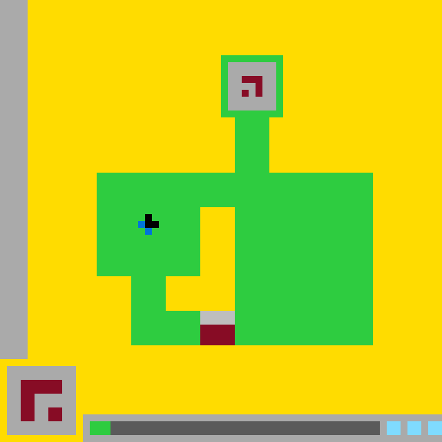

# `ls20` level `1` — UP / DOWN / LEFT

## Navigation

[Level start](../../../README.md) · [Parent](../README.md)

### Actions

[`UP`](UP/README.md)

---

- **Full game ID:** `ls20-9607627b`
- **State:** `NOT_FINISHED`
- **Image hash:** `40c8e8361d1bed5a`
- **Incoming action:** `ACTION3`

## Image



## Files

- [image.png](image.png)
- [state.json](state.json)
- [object_registry.pl](../../../object_registry.pl) — shared level registry (10 canonical identities)
- [differences.pl](differences.pl)
- [objects.pl](objects.pl)
- [rules.pl](rules.pl)
- [similarities.pl](similarities.pl)
- [turtle_from_diff.pl](turtle_from_diff.pl)
- [turtle_from_image.pl](turtle_from_image.pl)

## Embedded files

*Canonical identities are shared through [`object_registry.pl`](../../../object_registry.pl) and are not repeated in every node.*

<details>
<summary><code>state.json</code></summary>

````json
{
  "state": "NOT_FINISHED",
  "observation": {
    "game_id": "ls20-9607627b",
    "state": "NOT_FINISHED",
    "levels_completed": 0,
    "win_levels": 7,
    "action_input": {
      "id": "ACTION3",
      "data": {},
      "reasoning": null
    },
    "guid": "d46666b7-b4f5-4774-a990-f778a3ac050a",
    "full_reset": false,
    "available_actions": [
      1,
      2,
      3,
      4
    ]
  },
  "step_count": 2,
  "game_id": "ls20-9607627b",
  "game_directory": "ls20",
  "level": "1",
  "image_hash": "40c8e8361d1bed5a",
  "incoming_action": "ACTION3",
  "action_directory": "LEFT",
  "action_data": {},
  "parent_node": "..",
  "action_path": [
    "UP",
    "DOWN",
    "LEFT"
  ]
}
````

[Open `state.json`](state.json)

</details>

<details>
<summary><code>differences.pl</code></summary>

````prolog
action(current,'ACTION3').
changed(base_glyph,translation(-5,0)).
previous_geometry(base_glyph,rect(34,45,5,5)).
current_geometry(base_glyph,rect(29,45,5,5)).
recolored_region(rect(34,45,5,5),base_glyph_colors,green).
changed(status_marker,removed).
previous_geometry(status_marker,rect(13,61,2,2)).
current_state(status_marker,absent).
recolored_region(rect(13,61,2,2),green,gray).
unchanged(green_structure).
unchanged(central_hole).
unchanged(top_glyph).
unchanged(player_cursor).
unchanged(hud_panel).
unchanged(status_pips).
expanded_visible_region(status_track,rect(13,61,2,2)).
````

[Open `differences.pl`](differences.pl)

</details>

<details>
<summary><code>objects.pl</code></summary>

````prolog
% Canonical identities are loaded from the level registry.
:- ensure_loaded('../../../object_registry.pl').

% State-specific facts for this action-tree node.
state(current).
canvas_size(64,64).
background_color(yellow).

object(green_structure,compound_object,green).
object_geometry(green_structure,union([rect(33,9,8,8),rect(34,17,5,8),rect(14,25,40,15),rect(19,40,35,10)])).
sub_object(green_structure,top_enclosure,rect(33,9,8,8)).
sub_object(green_structure,vertical_stem,rect(34,17,5,8)).
sub_object(green_structure,upper_body,rect(14,25,40,15)).
sub_object(green_structure,lower_body,rect(19,40,35,10)).

object(central_hole,hole,yellow).
object_geometry(central_hole,union([rect(29,30,5,15),rect(24,40,5,5)])).
enclosed_by(central_hole,green_structure).

object(top_glyph,glyph,dark_red).
object_geometry(top_glyph,cells([(35,11),(36,11),(37,11),(35,12),(36,12),(37,12),(37,13)])).

object(base_glyph,compound_object,multicolor).
object_geometry(base_glyph,rect(29,45,5,5)).
sub_object(base_glyph,base_cap,rect(29,45,5,2)).
sub_object(base_glyph,base_body,rect(29,47,5,3)).
object_color(base_cap,light_gray).
object_color(base_body,dark_red).

object(player_cursor,compound_object,multicolor).
object_geometry(player_cursor,rect(21,31,1,3)).
sub_object(player_cursor,cursor_head,rect(21,31,1,2)).
sub_object(player_cursor,cursor_tail,cell(21,33)).
object_color(cursor_head,black).
object_color(cursor_tail,blue).

object(hud_panel,interface_object,multicolor).
object_geometry(hud_panel,rect(1,53,10,10)).
sub_object(hud_panel,hud_background,rect(1,53,10,10)).
sub_object(hud_panel,hud_red_glyph,union([rect(3,55,6,2),rect(3,57,2,4),rect(5,59,3,2)])).
sub_object(hud_panel,hud_black_inset,rect(5,57,4,2)).
object_color(hud_background,light_gray).
object_color(hud_red_glyph,dark_red).
object_color(hud_black_inset,black).

object(status_track,interface_object,gray).
object_geometry(status_track,rect(13,61,42,2)).

object(status_pips,interface_object,cyan).
object_geometry(status_pips,union([rect(56,61,2,2),rect(59,61,2,2),rect(62,61,2,2)])).

object(status_marker,interface_object,green).
object_state(status_marker,absent).

contains(green_structure,central_hole).
contains(green_structure,top_glyph).
contains(green_structure,base_glyph).
contains(green_structure,player_cursor).

turtle_program(current_frame,[set_color(yellow),fill_rect(0,0,64,64),set_color(green),fill_rect(33,9,8,8),fill_rect(34,17,5,8),fill_rect(14,25,40,15),fill_rect(19,40,35,10),set_color(yellow),fill_rect(29,30,5,15),fill_rect(24,40,5,5),set_color(light_gray),fill_rect(34,10,6,6),set_color(dark_red),fill_cells([(35,11),(36,11),(37,11),(35,12),(36,12),(37,12),(37,13)]),set_color(light_gray),fill_rect(29,45,5,2),set_color(dark_red),fill_rect(29,47,5,3),set_color(black),fill_rect(21,31,1,2),set_color(blue),fill_cell(21,33),set_color(light_gray),fill_rect(1,53,10,10),set_color(dark_red),fill_rect(3,55,6,2),fill_rect(3,57,2,4),fill_rect(5,59,3,2),set_color(black),fill_rect(5,57,4,2),set_color(gray),fill_rect(13,61,42,2),set_color(cyan),fill_rect(56,61,2,2),fill_rect(59,61,2,2),fill_rect(62,61,2,2)]).
````

[Open `objects.pl`](objects.pl)

</details>

<details>
<summary><code>rules.pl</code></summary>

````prolog
observed_rule(action3_moves_base_glyph_left,'ACTION3 translates base_glyph five logical cells left while preserving its 5-by-5 shape and colors.').
observed_rule(action3_consumes_status_marker,'ACTION3 removes the green status_marker and reveals the gray status_track beneath it.').
observed_rule(scene_remains_fixed,'green_structure, central_hole, top_glyph, player_cursor, hud_panel, status_track, and status_pips retain their geometry.').

hypothetical_rule(base_follows_horizontal_sequence,'Repeated actions may move base_glyph between five-cell-aligned positions along the lower edge of green_structure.',medium).
hypothetical_rule(marker_is_action_resource,'The green status_marker may represent a consumable action or progress token.',medium).

evidence(action3_moves_base_glyph_left,parent_current_comparison,'base_glyph changes from rect(34,45,5,5) to rect(29,45,5,5).').
evidence(action3_consumes_status_marker,parent_current_comparison,'rect(13,61,2,2) changes from green to the gray color of status_track.').
evidence(scene_remains_fixed,parent_current_comparison,'All listed objects have matching logical-grid coordinates and colors in both frames.').

supported_by(base_follows_horizontal_sequence,action3_moves_base_glyph_left).
supported_by(marker_is_action_resource,action3_consumes_status_marker).

contradicted_by(base_follows_horizontal_sequence,no_repeated_action_evidence).
contradicted_by(marker_is_action_resource,no_direct_semantic_confirmation).
````

[Open `rules.pl`](rules.pl)

</details>

<details>
<summary><code>similarities.pl</code></summary>

````prolog
correspondence(parent,current,green_structure,green_structure,unchanged).
correspondence(parent,current,central_hole,central_hole,unchanged).
correspondence(parent,current,top_glyph,top_glyph,unchanged).
correspondence(parent,current,base_glyph,base_glyph,translated(-5,0)).
correspondence(parent,current,player_cursor,player_cursor,unchanged).
correspondence(parent,current,hud_panel,hud_panel,unchanged).
correspondence(parent,current,status_track,status_track,revealed_under_marker).
correspondence(parent,current,status_pips,status_pips,unchanged).
correspondence(parent,current,status_marker,status_marker,removed).
````

[Open `similarities.pl`](similarities.pl)

</details>

<details>
<summary><code>turtle_from_diff.pl</code></summary>

````prolog
turtle_program(patch_parent_to_current,[set_color(green),fill_rect(34,45,5,5),set_color(light_gray),fill_rect(29,45,5,2),set_color(dark_red),fill_rect(29,47,5,3),set_color(gray),fill_rect(13,61,2,2)]).
````

[Open `turtle_from_diff.pl`](turtle_from_diff.pl)

</details>

<details>
<summary><code>turtle_from_image.pl</code></summary>

````prolog
turtle_program(redraw_current,[set_color(yellow),fill_rect(0,0,64,64),set_color(green),fill_rect(33,9,8,8),fill_rect(34,17,5,8),fill_rect(14,25,40,15),fill_rect(19,40,35,10),set_color(yellow),fill_rect(29,30,5,15),fill_rect(24,40,5,5),set_color(light_gray),fill_rect(34,10,6,6),set_color(dark_red),fill_cells([(35,11),(36,11),(37,11),(35,12),(36,12),(37,12),(37,13)]),set_color(light_gray),fill_rect(29,45,5,2),set_color(dark_red),fill_rect(29,47,5,3),set_color(black),fill_rect(21,31,1,2),set_color(blue),fill_cell(21,33),set_color(light_gray),fill_rect(1,53,10,10),set_color(dark_red),fill_rect(3,55,6,2),fill_rect(3,57,2,4),fill_rect(5,59,3,2),set_color(black),fill_rect(5,57,4,2),set_color(gray),fill_rect(13,61,42,2),set_color(cyan),fill_rect(56,61,2,2),fill_rect(59,61,2,2),fill_rect(62,61,2,2)]).
````

[Open `turtle_from_image.pl`](turtle_from_image.pl)

</details>
