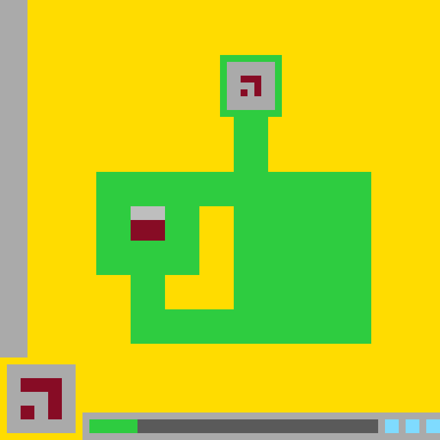

# `ls20` level `1` — UP / UP / UP / UP / LEFT / LEFT / LEFT / DOWN

## Navigation

[Level start](../../../../../../../../README.md) · [Parent](../README.md)

### Actions

[`UP`](UP/README.md)

---

- **Full game ID:** `ls20-9607627b`
- **State:** `NOT_FINISHED`
- **Image hash:** `d5f139ccc4cb41fb`
- **Incoming action:** `ACTION2`

## Image



## Files

- [image.png](image.png)
- [state.json](state.json)
- [object_registry.pl](../../../../../../../../object_registry.pl) — shared level registry (10 canonical identities)
- [differences.pl](differences.pl)
- [objects.pl](objects.pl)
- [rules.pl](rules.pl)
- [similarities.pl](similarities.pl)
- [turtle_from_diff.pl](turtle_from_diff.pl)
- [turtle_from_image.pl](turtle_from_image.pl)

## Embedded files

*Canonical identities are shared through [`object_registry.pl`](../../../../../../../../object_registry.pl) and are not repeated in every node.*

<details>
<summary><code>state.json</code></summary>

````json
{
  "state": "NOT_FINISHED",
  "observation": {
    "game_id": "ls20-9607627b",
    "state": "NOT_FINISHED",
    "levels_completed": 0,
    "win_levels": 7,
    "action_input": {
      "id": "ACTION2",
      "data": {},
      "reasoning": null
    },
    "guid": "11aa4572-692c-4dac-b119-d76cbef6eeba",
    "full_reset": false,
    "available_actions": [
      1,
      2,
      3,
      4
    ]
  },
  "step_count": 7,
  "game_id": "ls20-9607627b",
  "game_directory": "ls20",
  "level": "1",
  "image_hash": "d5f139ccc4cb41fb",
  "incoming_action": "ACTION2",
  "action_directory": "DOWN",
  "action_data": {},
  "parent_node": "..",
  "action_path": [
    "UP",
    "UP",
    "UP",
    "UP",
    "LEFT",
    "LEFT",
    "LEFT",
    "DOWN"
  ]
}
````

[Open `state.json`](state.json)

</details>

<details>
<summary><code>differences.pl</code></summary>

````prolog
action_transition('ACTION2',parent,current).
changed(base_glyph).
recolored_region(rectangle(19,25,23,29),gray_and_dark_red,green).
added_region(base_glyph,rectangle(19,30,23,34),dark_red).
removed_object(player_cursor).
removed_region(player_cursor,rectangle(20,31,22,33),black_and_blue).
changed(hud_panel).
changed_region(hud_panel,rectangle(3,55,8,60),dark_red).
removed_object(status_marker).
recolored_region(rectangle(13,61,15,62),green,gray).
unchanged(green_structure).
unchanged(central_hole).
unchanged(top_glyph).
unchanged(status_track).
unchanged(status_pips).
````

[Open `differences.pl`](differences.pl)

</details>

<details>
<summary><code>objects.pl</code></summary>

````prolog
% Canonical identities are loaded from the level registry.
:- ensure_loaded('../../../../../../../../object_registry.pl').

% State-specific facts for this action-tree node.
state(current).
canvas_size(64,64).
background_color(yellow).

object(green_structure,compound_object,green).
object_bbox(green_structure,14,9,53,49).
object_part(green_structure,rectangle(33,9,40,16)).
object_part(green_structure,rectangle(34,17,38,24)).
object_part(green_structure,rectangle(14,25,53,29)).
object_part(green_structure,rectangle(19,30,23,49)).
object_part(green_structure,rectangle(34,30,53,49)).
object_part(green_structure,rectangle(24,45,33,49)).

object(central_hole,hole,yellow).
object_bbox(central_hole,24,30,33,44).
enclosed_by(central_hole,green_structure).

object(top_glyph,glyph,dark_red).
object_bbox(top_glyph,35,11,37,13).
object_cells(top_glyph,[(35,11),(36,11),(37,11),(37,12),(37,13)]).

object(base_glyph,compound_object,dark_red).
object_bbox(base_glyph,19,30,23,34).
object_part(base_glyph,rectangle(19,30,23,34)).

object(hud_panel,interface_object,gray).
object_bbox(hud_panel,1,53,10,62).
object_part(hud_panel,rectangle(1,53,10,62)).
object_cells(hud_panel,[rectangle(1,53,10,62)]).

object(status_track,interface_object,gray).
object_bbox(status_track,13,61,54,62).
object_part(status_track,rectangle(13,61,54,62)).

object(status_pips,interface_object,cyan).
object_bbox(status_pips,56,61,63,62).
object_part(status_pips,rectangle(56,61,57,62)).
object_part(status_pips,rectangle(59,61,60,62)).
object_part(status_pips,rectangle(62,61,63,62)).

object(base_glyph_hud_copy,glyph,dark_red).
object_bbox(base_glyph_hud_copy,3,55,8,60).
object_cells(base_glyph_hud_copy,[(3,55),(4,55),(5,55),(6,55),(7,55),(8,55),(3,56),(4,56),(5,56),(6,56),(7,56),(8,56),(3,57),(4,57),(7,57),(8,57),(3,58),(4,58),(7,58),(8,58),(3,59),(4,59),(7,59),(8,59),(3,60),(4,60),(7,60),(8,60)]).
sub_object(base_glyph_hud_copy,hud_panel).

absent(player_cursor).
absent(status_marker).

same_shape_palette_role(top_glyph,base_glyph_hud_copy,dark_red).

turtle_program(current_frame,[clear(yellow),fill_rect(33,9,40,16,green),fill_rect(34,17,38,24,green),fill_rect(14,25,53,29,green),fill_rect(19,30,23,49,green),fill_rect(34,30,53,49,green),fill_rect(24,45,33,49,green),fill_rect(24,30,33,44,yellow),fill_rect(35,11,37,11,dark_red),fill_rect(37,12,37,13,dark_red),fill_rect(19,30,23,34,dark_red),fill_rect(1,53,10,62,gray),fill_cells([(3,55),(4,55),(5,55),(6,55),(7,55),(8,55),(3,56),(4,56),(5,56),(6,56),(7,56),(8,56),(3,57),(4,57),(7,57),(8,57),(3,58),(4,58),(7,58),(8,58),(3,59),(4,59),(7,59),(8,59),(3,60),(4,60),(7,60),(8,60)],dark_red),fill_rect(13,61,54,62,gray),fill_rect(56,61,57,62,cyan),fill_rect(59,61,60,62,cyan),fill_rect(62,61,63,62,cyan)]).
````

[Open `objects.pl`](objects.pl)

</details>

<details>
<summary><code>rules.pl</code></summary>

````prolog
observed_rule(action2_removes_cursor,'ACTION2 removes the visible player cursor from the enclosure area.').
observed_rule(action2_updates_base_glyph,'ACTION2 replaces the upper-left gray and dark-red base-glyph configuration with a solid dark-red 5 by 5 block at rows 30 through 34.').
observed_rule(action2_consumes_marker,'ACTION2 removes the green status marker and restores the underlying status-track cells to gray.').
observed_rule(action2_updates_hud,'ACTION2 changes the dark-red glyph displayed inside the lower-left HUD panel.').

hypothetical_rule(cursor_activation_transforms_target,'The cursor activated the base glyph, causing its transformed current form.',medium).
hypothetical_rule(status_marker_is_action_resource,'The green status marker represents a consumable action resource.',medium).
hypothetical_rule(hud_reports_action_state,'The HUD glyph encodes the state reached after the action.',medium).

evidence(action2_removes_cursor,parent_cursor_present_current_absent,direct_image_difference).
evidence(action2_updates_base_glyph,parent_upper_left_glyph_current_lower_solid_block,direct_image_difference).
evidence(action2_consumes_marker,parent_green_track_segment_current_gray_track,direct_image_difference).
evidence(action2_updates_hud,parent_and_current_hud_glyphs_differ,direct_image_difference).
evidence(cursor_activation_transforms_target,cursor_was_adjacent_to_base_glyph,spatial_proximity).
evidence(status_marker_is_action_resource,marker_disappears_after_action2,interface_change).
evidence(hud_reports_action_state,hud_glyph_changes_synchronously_with_action2,interface_change).

supported_by(cursor_activation_transforms_target,action2_removes_cursor).
supported_by(cursor_activation_transforms_target,action2_updates_base_glyph).
supported_by(status_marker_is_action_resource,action2_consumes_marker).
supported_by(hud_reports_action_state,action2_updates_hud).

contradicted_by(cursor_activation_transforms_target,no_counterevidence_observed).
contradicted_by(status_marker_is_action_resource,no_counterevidence_observed).
contradicted_by(hud_reports_action_state,no_counterevidence_observed).
````

[Open `rules.pl`](rules.pl)

</details>

<details>
<summary><code>similarities.pl</code></summary>

````prolog
correspondence(parent:green_structure,current:green_structure,identity).
correspondence(parent:central_hole,current:central_hole,identity).
correspondence(parent:top_glyph,current:top_glyph,identity).
correspondence(parent:base_glyph,current:base_glyph,transformed_and_shifted).
correspondence(parent:hud_panel,current:hud_panel,updated_interface_glyph).
correspondence(parent:status_track,current:status_track,identity_except_removed_marker_overlay).
correspondence(parent:status_pips,current:status_pips,identity).
no_current_correspondent(parent:player_cursor).
no_current_correspondent(parent:status_marker).
````

[Open `similarities.pl`](similarities.pl)

</details>

<details>
<summary><code>turtle_from_diff.pl</code></summary>

````prolog
turtle_program(patch_parent_to_current,[fill_rect(19,25,23,29,green),fill_rect(19,30,23,34,dark_red),fill_rect(20,31,22,33,dark_red),fill_rect(1,53,10,62,gray),fill_cells([(3,55),(4,55),(5,55),(6,55),(7,55),(8,55),(3,56),(4,56),(5,56),(6,56),(7,56),(8,56),(3,57),(4,57),(7,57),(8,57),(3,58),(4,58),(7,58),(8,58),(3,59),(4,59),(7,59),(8,59),(3,60),(4,60),(7,60),(8,60)],dark_red),fill_rect(13,61,15,62,gray)]).
````

[Open `turtle_from_diff.pl`](turtle_from_diff.pl)

</details>

<details>
<summary><code>turtle_from_image.pl</code></summary>

````prolog
turtle_program(redraw_current,[clear(yellow),fill_rect(33,9,40,16,green),fill_rect(34,17,38,24,green),fill_rect(14,25,53,29,green),fill_rect(19,30,23,49,green),fill_rect(34,30,53,49,green),fill_rect(24,45,33,49,green),fill_rect(24,30,33,44,yellow),fill_rect(35,11,37,11,dark_red),fill_rect(37,12,37,13,dark_red),fill_rect(19,30,23,34,dark_red),fill_rect(1,53,10,62,gray),fill_cells([(3,55),(4,55),(5,55),(6,55),(7,55),(8,55),(3,56),(4,56),(5,56),(6,56),(7,56),(8,56),(3,57),(4,57),(7,57),(8,57),(3,58),(4,58),(7,58),(8,58),(3,59),(4,59),(7,59),(8,59),(3,60),(4,60),(7,60),(8,60)],dark_red),fill_rect(13,61,54,62,gray),fill_rect(56,61,57,62,cyan),fill_rect(59,61,60,62,cyan),fill_rect(62,61,63,62,cyan)]).
````

[Open `turtle_from_image.pl`](turtle_from_image.pl)

</details>
