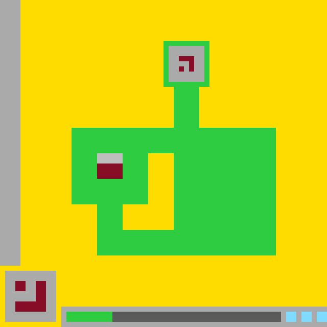

# `ls20` level `1` — UP / UP / UP / UP / LEFT / LEFT / LEFT / DOWN / UP / DOWN

## Navigation

[Level start](../../../../../../../../../../README.md) · [Parent](../README.md)

### Actions

*No child actions recorded yet.*

---

- **Full game ID:** `ls20-9607627b`
- **State:** `NOT_FINISHED`
- **Image hash:** `29749f9003404296`
- **Incoming action:** `ACTION2`

## Image



## Files

- [image.png](image.png)
- [state.json](state.json)
- [object_registry.pl](../../../../../../../../../../object_registry.pl) — shared level registry (10 canonical identities)

## Embedded files

*Canonical identities are shared through [`object_registry.pl`](../../../../../../../../../../object_registry.pl) and are not repeated in every node.*

<details>
<summary><code>state.json</code></summary>

````json
{
  "state": "NOT_FINISHED",
  "observation": {
    "game_id": "ls20-9607627b",
    "state": "NOT_FINISHED",
    "levels_completed": 0,
    "win_levels": 7,
    "action_input": {
      "id": "ACTION2",
      "data": {},
      "reasoning": null
    },
    "guid": "11aa4572-692c-4dac-b119-d76cbef6eeba",
    "full_reset": false,
    "available_actions": [
      1,
      2,
      3,
      4
    ]
  },
  "step_count": 9,
  "game_id": "ls20-9607627b",
  "game_directory": "ls20",
  "level": "1",
  "image_hash": "29749f9003404296",
  "incoming_action": "ACTION2",
  "action_directory": "DOWN",
  "action_data": {},
  "parent_node": "..",
  "action_path": [
    "UP",
    "UP",
    "UP",
    "UP",
    "LEFT",
    "LEFT",
    "LEFT",
    "DOWN",
    "UP",
    "DOWN"
  ]
}
````

[Open `state.json`](state.json)

</details>
