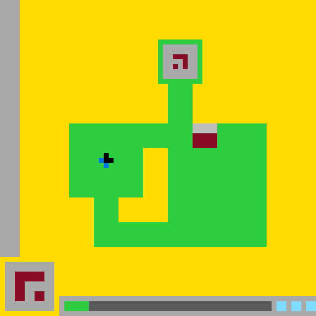

# `ls20` level `1` — UP / UP / UP / UP / RIGHT

## Navigation

[Level start](../../../../../README.md) · [Parent](../README.md)

### Actions

*No child actions recorded yet.*

---

- **Full game ID:** `ls20-9607627b`
- **State:** `NOT_FINISHED`
- **Image hash:** `d5d9a9a978b3b680`
- **Incoming action:** `ACTION4`

## Image



## Files

- [image.png](image.png)
- [state.json](state.json)
- [object_registry.pl](../../../../../object_registry.pl) — shared level registry (10 canonical identities)

## Embedded files

*Canonical identities are shared through [`object_registry.pl`](../../../../../object_registry.pl) and are not repeated in every node.*

<details>
<summary><code>state.json</code></summary>

````json
{
  "state": "NOT_FINISHED",
  "observation": {
    "game_id": "ls20-9607627b",
    "state": "NOT_FINISHED",
    "levels_completed": 0,
    "win_levels": 7,
    "action_input": {
      "id": "ACTION4",
      "data": {},
      "reasoning": null
    },
    "guid": "8937187f-a35e-4052-bb35-e109c83d30d1",
    "full_reset": false,
    "available_actions": [
      1,
      2,
      3,
      4
    ]
  },
  "step_count": 4,
  "game_id": "ls20-9607627b",
  "game_directory": "ls20",
  "level": "1",
  "image_hash": "d5d9a9a978b3b680",
  "incoming_action": "ACTION4",
  "action_directory": "RIGHT",
  "action_data": {},
  "parent_node": "..",
  "action_path": [
    "UP",
    "UP",
    "UP",
    "UP",
    "RIGHT"
  ]
}
````

[Open `state.json`](state.json)

</details>
