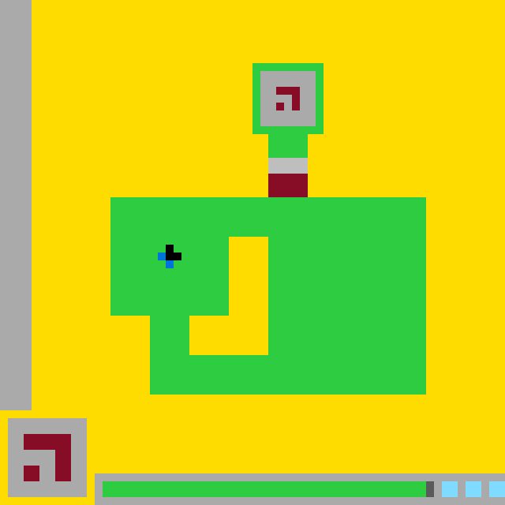

# `ls20` level `1` — UP / UP / UP / UP / UP / UP / UP / DOWN / DOWN / DOWN / DOWN / LEFT / LEFT / LEFT / LEFT / LEFT / LEFT / LEFT / UP / UP / LEFT / LEFT / LEFT / DOWN / UP / UP / RIGHT / RIGHT / RIGHT / RIGHT / RIGHT / RIGHT / RIGHT / UP / LEFT / LEFT / LEFT / LEFT / LEFT / RIGHT / RIGHT / UP / LEFT

## Navigation

[Level start](../../../../../../../../../../../../../../../../../../../../../../../../../../../../../../../../../../../../../../../../../../../README.md) · [Parent](../README.md)

### Actions

*No child actions recorded yet.*

---

- **Full game ID:** `ls20-9607627b`
- **State:** `NOT_FINISHED`
- **Image hash:** `6792a7ff1aa30104`
- **Incoming action:** `ACTION3`

## Image



## Files

- [image.png](image.png)
- [state.json](state.json)
- [object_registry.pl](../../../../../../../../../../../../../../../../../../../../../../../../../../../../../../../../../../../../../../../../../../../object_registry.pl) — shared level registry (10 canonical identities)
- [differences.pl](differences.pl)
- [objects.pl](objects.pl)
- [rules.pl](rules.pl)
- [similarities.pl](similarities.pl)
- [turtle_from_diff.pl](turtle_from_diff.pl)
- [turtle_from_image.pl](turtle_from_image.pl)

## Embedded files

*Canonical identities are shared through [`object_registry.pl`](../../../../../../../../../../../../../../../../../../../../../../../../../../../../../../../../../../../../../../../../../../../object_registry.pl) and are not repeated in every node.*

<details>
<summary><code>state.json</code></summary>

````json
{
  "state": "NOT_FINISHED",
  "observation": {
    "game_id": "ls20-9607627b",
    "state": "NOT_FINISHED",
    "levels_completed": 0,
    "win_levels": 7,
    "action_input": {
      "id": "ACTION3",
      "data": {},
      "reasoning": null
    },
    "guid": "90c8efcc-ecd6-4e6a-a7fb-ade0a712b2d8",
    "full_reset": false,
    "available_actions": [
      1,
      2,
      3,
      4
    ]
  },
  "step_count": 42,
  "game_id": "ls20-9607627b",
  "game_directory": "ls20",
  "level": "1",
  "image_hash": "6792a7ff1aa30104",
  "incoming_action": "ACTION3",
  "action_directory": "LEFT",
  "action_data": {},
  "parent_node": "..",
  "action_path": [
    "UP",
    "UP",
    "UP",
    "UP",
    "UP",
    "UP",
    "UP",
    "DOWN",
    "DOWN",
    "DOWN",
    "DOWN",
    "LEFT",
    "LEFT",
    "LEFT",
    "LEFT",
    "LEFT",
    "LEFT",
    "LEFT",
    "UP",
    "UP",
    "LEFT",
    "LEFT",
    "LEFT",
    "DOWN",
    "UP",
    "UP",
    "RIGHT",
    "RIGHT",
    "RIGHT",
    "RIGHT",
    "RIGHT",
    "RIGHT",
    "RIGHT",
    "UP",
    "LEFT",
    "LEFT",
    "LEFT",
    "LEFT",
    "LEFT",
    "RIGHT",
    "RIGHT",
    "UP",
    "LEFT"
  ]
}
````

[Open `state.json`](state.json)

</details>

<details>
<summary><code>differences.pl</code></summary>

````prolog
parent_state(previous).
current_state(current).
action_between(previous,current,'ACTION3').
changed_region(previous,current,53,61,53,62).
cell_color_change(previous,current,53,61,gray,green).
cell_color_change(previous,current,53,62,gray,green).
object_change(status_marker,extended_right,1).
object_bbox_change(status_marker,rect(13,61,52,62),rect(13,61,53,62)).
object_change(status_track,gray_segment_shortened_left,1).
object_part_bbox_change(status_track,gray,rect(53,61,54,62),rect(54,61,54,62)).
unchanged_object(green_structure).
unchanged_object(central_hole).
unchanged_object(player_cursor).
unchanged_object(hud_panel).
unchanged_object(status_pips).
unchanged_object(top_glyph).
unchanged_object(base_glyph).
unchanged_object(left_boundary_bar).
````

[Open `differences.pl`](differences.pl)

</details>

<details>
<summary><code>objects.pl</code></summary>

````prolog
% Canonical identities are loaded from the level registry.
:- ensure_loaded('../../../../../../../../../../../../../../../../../../../../../../../../../../../../../../../../../../../../../../../../../../../object_registry.pl').

% State-specific facts for this action-tree node.
state(current).
logical_grid_size(64,64).
background_color(yellow).
object(base_glyph,compound_object).
object_bbox(base_glyph,1,53,10,62).
object_color(base_glyph,gray).
object_subobject(base_glyph,top_glyph).
object(top_glyph,glyph).
object_bbox(top_glyph,3,55,8,60).
object_color(top_glyph,dark_red).
object_cells(top_glyph,[(3,55),(4,55),(5,55),(6,55),(7,55),(8,55),(3,56),(8,56),(3,57),(4,57),(5,57),(6,57),(8,57),(6,58),(8,58),(3,59),(6,59),(8,59),(3,60),(4,60),(6,60),(7,60),(8,60)]).
object(green_structure,compound_object).
object_bbox(green_structure,14,9,53,49).
object_color(green_structure,green).
object_rect(green_structure,14,25,53,29).
object_rect(green_structure,19,30,23,49).
object_rect(green_structure,34,30,53,49).
object_rect(green_structure,24,45,33,49).
object_rect(green_structure,33,9,40,16).
object_rect(green_structure,34,17,38,21).
object_subobject(green_structure,central_hole).
object_subobject(green_structure,top_glyph).
object(central_hole,hole).
object_bbox(central_hole,24,30,33,44).
object_color(central_hole,yellow).
object_enclosed_by(central_hole,green_structure).
object(top_glyph,glyph).
object_bbox(top_glyph,35,11,37,13).
object_color(top_glyph,dark_red).
object_cells(top_glyph,[(35,11),(36,11),(37,11),(35,12),(37,12),(37,13)]).
object(left_boundary_bar,bar).
object_bbox(left_boundary_bar,34,17,38,21).
object_color(left_boundary_bar,gray).
object(base_glyph,compound_object).
object_bbox(base_glyph,34,22,38,24).
object_color(base_glyph,dark_red).
object(player_cursor,compound_object).
object_bbox(player_cursor,21,31,22,33).
object_cells(player_cursor,[(21,31),(21,32),(21,33),(22,33)]).
object_part_color(player_cursor,black,[(21,31),(21,32)]).
object_part_color(player_cursor,blue,[(21,33),(22,33)]).
object(hud_panel,interface_object).
object_bbox(hud_panel,1,53,10,62).
object_color(hud_panel,gray).
object(status_track,interface_object).
object_bbox(status_track,13,61,63,62).
object_part_color(status_track,green,rect(13,61,53,62)).
object_part_color(status_track,gray,rect(54,61,54,62)).
object_part_color(status_track,cyan,[rect(56,61,57,62),rect(59,61,60,62),rect(62,61,63,62)]).
object(status_marker,interface_object).
object_bbox(status_marker,13,61,53,62).
object_color(status_marker,green).
object(status_pips,interface_object).
object_bbox(status_pips,56,61,63,62).
object_color(status_pips,cyan).
object_rect(status_pips,56,61,57,62).
object_rect(status_pips,59,61,60,62).
object_rect(status_pips,62,61,63,62).
turtle_program(green_structure,[set_color(green),fill_rect(14,25,53,29),fill_rect(19,30,23,49),fill_rect(34,30,53,49),fill_rect(24,45,33,49),fill_rect(33,9,40,16),fill_rect(34,17,38,21)]).
turtle_program(player_cursor,[set_color(black),fill_rect(21,31,21,32),set_color(blue),fill_rect(21,33,22,33)]).
turtle_program(status_track,[set_color(green),fill_rect(13,61,53,62),set_color(gray),fill_rect(54,61,54,62),set_color(cyan),fill_rect(56,61,57,62),fill_rect(59,61,60,62),fill_rect(62,61,63,62)]).
````

[Open `objects.pl`](objects.pl)

</details>

<details>
<summary><code>rules.pl</code></summary>

````prolog
observed_rule(action3_advances_status_marker,'ACTION3 recolors the leftmost gray status-track cell column green, extending the marker one logical cell to the right.').
observed_rule(scene_geometry_preserved,'ACTION3 leaves the puzzle structure, glyphs, cursor, panel, and cyan pips unchanged.').
evidence(action3_advances_status_marker,color_change(rect(53,61,53,62),gray,green),direct_parent_current_comparison).
evidence(scene_geometry_preserved,unchanged([green_structure,central_hole,player_cursor,hud_panel,status_pips,top_glyph,base_glyph,left_boundary_bar]),direct_parent_current_comparison).
supported_by(action3_advances_status_marker,color_change(rect(53,61,53,62),gray,green)).
supported_by(scene_geometry_preserved,unchanged_non_track_pixels).
contradicted_by(action3_advances_status_marker,none).
contradicted_by(scene_geometry_preserved,none).
hypothetical_rule(repeated_action3_progresses_track,'A further ACTION3 may convert the next gray track column to green while gray capacity remains.',single_transition_extrapolation).
evidence(repeated_action3_progresses_track,one_column_rightward_extension,transition(previous,current)).
supported_by(repeated_action3_progresses_track,action3_advances_status_marker).
contradicted_by(repeated_action3_progresses_track,insufficient_repeated_trials).
````

[Open `rules.pl`](rules.pl)

</details>

<details>
<summary><code>similarities.pl</code></summary>

````prolog
correspondence(previous,current,green_structure,green_structure,exact_geometry_and_color).
correspondence(previous,current,central_hole,central_hole,exact_geometry_and_color).
correspondence(previous,current,player_cursor,player_cursor,exact_geometry_and_color).
correspondence(previous,current,hud_panel,hud_panel,exact_geometry_and_color).
correspondence(previous,current,status_pips,status_pips,exact_geometry_and_color).
correspondence(previous,current,status_track,status_track,same_track_with_one_cell_progress).
correspondence(previous,current,status_marker,status_marker,rightward_extension).
correspondence(previous,current,top_glyph,top_glyph,exact_geometry_and_color).
correspondence(previous,current,base_glyph,base_glyph,exact_geometry_and_color).
correspondence(previous,current,left_boundary_bar,left_boundary_bar,exact_geometry_and_color).
````

[Open `similarities.pl`](similarities.pl)

</details>

<details>
<summary><code>turtle_from_diff.pl</code></summary>

````prolog
turtle_program(patch_previous_to_current,[set_color(green),fill_rect(53,61,53,62)]).
````

[Open `turtle_from_diff.pl`](turtle_from_diff.pl)

</details>

<details>
<summary><code>turtle_from_image.pl</code></summary>

````prolog
turtle_program(redraw_current,[set_color(yellow),fill_rect(0,0,63,63),set_color(green),fill_rect(14,25,53,29),fill_rect(19,30,23,49),fill_rect(34,30,53,49),fill_rect(24,45,33,49),fill_rect(33,9,40,16),fill_rect(34,17,38,21),set_color(gray),fill_rect(34,17,38,21),set_color(dark_red),fill_rect(34,22,38,24),fill_cells([(35,11),(36,11),(37,11),(35,12),(37,12),(37,13)]),set_color(black),fill_rect(21,31,21,32),set_color(blue),fill_rect(21,33,22,33),set_color(gray),fill_rect(1,53,10,62),set_color(dark_red),fill_cells([(3,55),(4,55),(5,55),(6,55),(7,55),(8,55),(3,56),(8,56),(3,57),(4,57),(5,57),(6,57),(8,57),(6,58),(8,58),(3,59),(6,59),(8,59),(3,60),(4,60),(6,60),(7,60),(8,60)]),set_color(green),fill_rect(13,61,53,62),set_color(gray),fill_rect(54,61,54,62),set_color(cyan),fill_rect(56,61,57,62),fill_rect(59,61,60,62),fill_rect(62,61,63,62)]).
````

[Open `turtle_from_image.pl`](turtle_from_image.pl)

</details>
