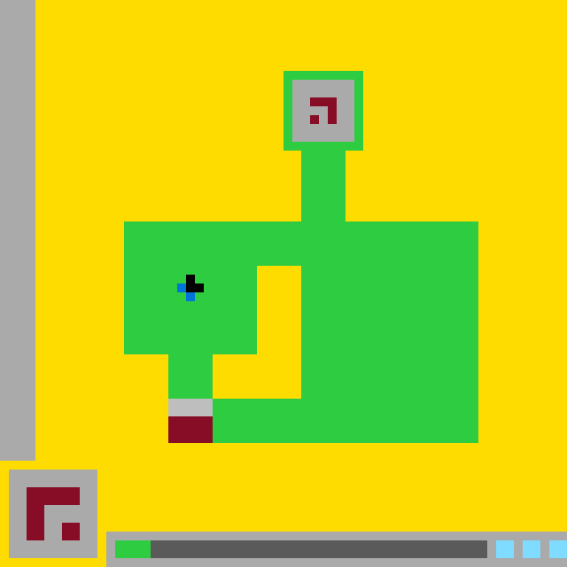

# `ls20` level `1` — LEFT / LEFT / DOWN / LEFT

- **Full game ID:** `ls20`
- **State:** `NOT_FINISHED`
- **Image hash:** `779ebe400b4830b9`
- **Incoming action:** `ACTION3`

## Navigation

- [Level start](../../../../README.md)
- [Parent state](../README.md)

## Image



## Files

- [state.json](state.json)
- [differences.pl](differences.pl)
- [objects.pl](objects.pl)
- [redraw.pl](redraw.pl)

## `objects.pl`

```prolog
:- discontiguous object/2.
:- discontiguous bbox/5.
:- discontiguous color/2.
:- discontiguous geometry/2.
:- discontiguous turtle_program/2.

canvas_size(640,640).
coordinate_system(pixel,origin_top_left,x_right,y_down).
bbox_convention(half_open).
turtle_cell_units(pixels).
turtle_set_cell_semantics(filled_rectangle_from_current_position).

color_rgb(yellow,255,220,0).
color_rgb(green,46,204,64).
color_rgb(gray,170,170,170).
color_rgb(dark_gray,102,102,102).
color_rgb(burgundy,133,20,75).
color_rgb(black,0,0,0).
color_rgb(navy,0,31,63).
color_rgb(blue,0,116,217).
color_rgb(light_blue,127,219,255).

object(background,background).
bbox(background,0,0,640,640).
color(background,yellow).
geometry(background,rectangle(0,0,640,640)).
render_order(background,0).
turtle_program(background,
 [penup,setcolor(yellow),set_pos(0,0),pendown,set_cell(640,640),penup]).

object(left_sidebar,solid_rectangle).
bbox(left_sidebar,0,0,40,520).
color(left_sidebar,gray).
geometry(left_sidebar,rectangle(0,0,40,520)).
render_order(left_sidebar,10).
turtle_program(left_sidebar,
 [penup,setcolor(gray),set_pos(0,0),pendown,set_cell(40,520),penup]).

object(main_green_structure,connected_rectilinear_region).
bbox(main_green_structure,140,80,400,420).
color(main_green_structure,green).
geometry(main_green_structure,
 rect_union([
  rectangle(320,80,90,90),
  rectangle(340,160,50,90),
  rectangle(140,250,400,50),
  rectangle(140,300,150,100),
  rectangle(340,300,200,150),
  rectangle(190,400,50,50),
  rectangle(240,450,300,50)
 ])).
property(main_green_structure,connected).
property(main_green_structure,orthogonal).
property(main_green_structure,bridge_and_chamber_shape).
render_order(main_green_structure,20).
turtle_program(main_green_structure,
 [penup,setcolor(green),
  set_pos(320,80),pendown,set_cell(90,90),
  penup,set_pos(340,160),pendown,set_cell(50,90),
  penup,set_pos(140,250),pendown,set_cell(400,50),
  penup,set_pos(140,300),pendown,set_cell(150,100),
  penup,set_pos(340,300),pendown,set_cell(200,150),
  penup,set_pos(190,400),pendown,set_cell(50,50),
  penup,set_pos(240,450),pendown,set_cell(300,50),
  penup]).

object(top_panel,solid_rectangle).
bbox(top_panel,330,90,70,70).
color(top_panel,gray).
geometry(top_panel,rectangle(330,90,70,70)).
property(top_panel,square).
contained_by(top_panel,main_green_structure).
surrounded_by(top_panel,main_green_structure).
render_order(top_panel,30).
turtle_program(top_panel,
 [penup,setcolor(gray),set_pos(330,90),pendown,set_cell(70,70),penup]).

object(top_burgundy_glyph,rectilinear_glyph).
bbox(top_burgundy_glyph,350,110,30,30).
color(top_burgundy_glyph,burgundy).
geometry(top_burgundy_glyph,
 rect_union([
  rectangle(350,110,30,10),
  rectangle(370,120,10,20),
  rectangle(350,130,10,10)
 ])).
property(top_burgundy_glyph,three_segment_glyph).
contained_by(top_burgundy_glyph,top_panel).
render_order(top_burgundy_glyph,40).
turtle_program(top_burgundy_glyph,
 [penup,setcolor(burgundy),
  set_pos(350,110),pendown,set_cell(30,10),
  penup,set_pos(370,120),pendown,set_cell(10,20),
  penup,set_pos(350,130),pendown,set_cell(10,10),
  penup]).

object(avatar,composite_sprite).
bbox(avatar,200,310,30,30).
geometry(avatar,
 composite([avatar_black,avatar_navy,avatar_blue])).
contained_by(avatar,main_green_structure).
property(avatar,four_cell_sprite).

object(avatar_black,rectilinear_patch).
bbox(avatar_black,210,310,20,20).
color(avatar_black,black).
geometry(avatar_black,
 rect_union([
  rectangle(210,310,10,10),
  rectangle(210,320,20,10)
 ])).
part_of(avatar_black,avatar).
render_order(avatar_black,50).
turtle_program(avatar_black,
 [penup,setcolor(black),
  set_pos(210,310),pendown,set_cell(10,10),
  penup,set_pos(210,320),pendown,set_cell(20,10),
  penup]).

object(avatar_navy,solid_rectangle).
bbox(avatar_navy,200,320,10,10).
color(avatar_navy,navy).
geometry(avatar_navy,rectangle(200,320,10,10)).
part_of(avatar_navy,avatar).
adjacent(avatar_navy,avatar_black,right).
render_order(avatar_navy,51).
turtle_program(avatar_navy,
 [penup,setcolor(navy),set_pos(200,320),pendown,set_cell(10,10),penup]).

object(avatar_blue,solid_rectangle).
bbox(avatar_blue,210,330,10,10).
color(avatar_blue,blue).
geometry(avatar_blue,rectangle(210,330,10,10)).
part_of(avatar_blue,avatar).
adjacent(avatar_blue,avatar_black,above).
render_order(avatar_blue,52).
turtle_program(avatar_blue,
 [penup,setcolor(blue),set_pos(210,330),pendown,set_cell(10,10),penup]).

object(lower_connector_gray,solid_rectangle).
bbox(lower_connector_gray,190,450,50,20).
color(lower_connector_gray,gray).
geometry(lower_connector_gray,rectangle(190,450,50,20)).
property(lower_connector_gray,terminal_cap).
adjacent(lower_connector_gray,main_green_structure,above).
adjacent(lower_connector_gray,main_green_structure,right).
render_order(lower_connector_gray,60).
turtle_program(lower_connector_gray,
 [penup,setcolor(gray),set_pos(190,450),pendown,set_cell(50,20),penup]).

object(lower_connector_burgundy,solid_rectangle).
bbox(lower_connector_burgundy,190,470,50,30).
color(lower_connector_burgundy,burgundy).
geometry(lower_connector_burgundy,rectangle(190,470,50,30)).
property(lower_connector_burgundy,terminal_block).
adjacent(lower_connector_burgundy,lower_connector_gray,above).
adjacent(lower_connector_burgundy,main_green_structure,right).
render_order(lower_connector_burgundy,61).
turtle_program(lower_connector_burgundy,
 [penup,setcolor(burgundy),set_pos(190,470),pendown,set_cell(50,30),penup]).

object(lower_left_panel,solid_rectangle).
bbox(lower_left_panel,10,530,100,100).
color(lower_left_panel,gray).
geometry(lower_left_panel,rectangle(10,530,100,100)).
property(lower_left_panel,square).
render_order(lower_left_panel,70).
turtle_program(lower_left_panel,
 [penup,setcolor(gray),set_pos(10,530),pendown,set_cell(100,100),penup]).

object(lower_left_burgundy_glyph,rectilinear_glyph).
bbox(lower_left_burgundy_glyph,30,550,60,60).
color(lower_left_burgundy_glyph,burgundy).
geometry(lower_left_burgundy_glyph,
 rect_union([
  rectangle(30,550,60,20),
  rectangle(30,570,20,40),
  rectangle(70,590,20,20)
 ])).
property(lower_left_burgundy_glyph,three_segment_glyph).
contained_by(lower_left_burgundy_glyph,lower_left_panel).
render_order(lower_left_burgundy_glyph,80).
turtle_program(lower_left_burgundy_glyph,
 [penup,setcolor(burgundy),
  set_pos(30,550),pendown,set_cell(60,20),
  penup,set_pos(30,570),pendown,set_cell(20,40),
  penup,set_pos(70,590),pendown,set_cell(20,20),
  penup]).

object(status_tray,solid_rectangle).
bbox(status_tray,120,600,520,40).
color(status_tray,gray).
geometry(status_tray,rectangle(120,600,520,40)).
property(status_tray,horizontal_ui_container).
render_order(status_tray,90).
turtle_program(status_tray,
 [penup,setcolor(gray),set_pos(120,600),pendown,set_cell(520,40),penup]).

object(status_green_segment,solid_rectangle).
bbox(status_green_segment,130,610,40,20).
color(status_green_segment,green).
geometry(status_green_segment,rectangle(130,610,40,20)).
contained_by(status_green_segment,status_tray).
render_order(status_green_segment,100).
turtle_program(status_green_segment,
 [penup,setcolor(green),set_pos(130,610),pendown,set_cell(40,20),penup]).

object(status_dark_segment,solid_rectangle).
bbox(status_dark_segment,170,610,380,20).
color(status_dark_segment,dark_gray).
geometry(status_dark_segment,rectangle(170,610,380,20)).
contained_by(status_dark_segment,status_tray).
adjacent(status_dark_segment,status_green_segment,left).
render_order(status_dark_segment,101).
turtle_program(status_dark_segment,
 [penup,setcolor(dark_gray),set_pos(170,610),pendown,set_cell(380,20),penup]).

object(status_blue_segment_1,solid_rectangle).
bbox(status_blue_segment_1,560,610,20,20).
color(status_blue_segment_1,light_blue).
geometry(status_blue_segment_1,rectangle(560,610,20,20)).
contained_by(status_blue_segment_1,status_tray).
render_order(status_blue_segment_1,102).
turtle_program(status_blue_segment_1,
 [penup,setcolor(light_blue),set_pos(560,610),pendown,set_cell(20,20),penup]).

object(status_blue_segment_2,solid_rectangle).
bbox(status_blue_segment_2,590,610,20,20).
color(status_blue_segment_2,light_blue).
geometry(status_blue_segment_2,rectangle(590,610,20,20)).
contained_by(status_blue_segment_2,status_tray).
render_order(status_blue_segment_2,103).
turtle_program(status_blue_segment_2,
 [penup,setcolor(light_blue),set_pos(590,610),pendown,set_cell(20,20),penup]).

object(status_blue_segment_3,solid_rectangle).
bbox(status_blue_segment_3,620,610,20,20).
color(status_blue_segment_3,light_blue).
geometry(status_blue_segment_3,rectangle(620,610,20,20)).
contained_by(status_blue_segment_3,status_tray).
property(status_blue_segment_3,clipped_at_right_canvas_edge).
render_order(status_blue_segment_3,104).
turtle_program(status_blue_segment_3,
 [penup,setcolor(light_blue),set_pos(620,610),pendown,set_cell(20,20),penup]).

gap(status_dark_segment,status_blue_segment_1,10).
gap(status_blue_segment_1,status_blue_segment_2,10).
gap(status_blue_segment_2,status_blue_segment_3,10).

aligned_horizontal(status_green_segment,status_dark_segment).
aligned_horizontal(status_dark_segment,status_blue_segment_1).
aligned_horizontal(status_blue_segment_1,status_blue_segment_2).
aligned_horizontal(status_blue_segment_2,status_blue_segment_3).

same_color(main_green_structure,status_green_segment).
same_color(top_burgundy_glyph,lower_connector_burgundy).
same_color(top_burgundy_glyph,lower_left_burgundy_glyph).
same_color(top_panel,lower_connector_gray).
same_color(top_panel,lower_left_panel).
same_color(top_panel,status_tray).
```

## `differences.pl`

```prolog
:- discontiguous changed_object/3.
:- discontiguous unchanged_object/2.
:- discontiguous moved_object/4.
:- discontiguous recolored_object/3.
:- discontiguous resized_object/3.
:- discontiguous action_effect/2.

state(previous).
state(current).

comparison_basis(rendered_state_and_object_descriptions).

added_object(Object) :-
    observed_added_object(Object).

removed_object(Object) :-
    observed_removed_object(Object).

observed_added_object(_) :-
    fail.

observed_removed_object(_) :-
    fail.

observation(no_wholly_new_rendered_object).
observation(no_wholly_removed_rendered_object).

object_correspondence(background,background,exact).
object_correspondence(left_sidebar,left_sidebar,exact).
object_correspondence(main_green_structure,main_green_structure,modified).
object_correspondence(main_cutout,implicit_main_cutout,exact_visible_region).
object_correspondence(top_terminal_panel,top_panel,renamed).
object_correspondence(top_terminal_glyph,top_burgundy_glyph,renamed).
object_correspondence(player,avatar,modified).
object_correspondence(player_black,avatar_black,modified).
object_correspondence(player_blue,avatar_blue,split_and_recolored).
object_correspondence(lower_terminal_cap,lower_connector_gray,moved_and_renamed).
object_correspondence(lower_terminal_core,lower_connector_burgundy,moved_and_renamed).
object_correspondence(lower_terminal,lower_connector,moved_and_renamed).
object_correspondence(lower_left_panel,lower_left_panel,exact).
object_correspondence(lower_left_glyph,lower_left_burgundy_glyph,renamed).
object_correspondence(bottom_toolbar,status_tray,renamed).
object_correspondence(toolbar_green_segment,status_green_segment,resized).
object_correspondence(toolbar_dark_segment,status_dark_segment,moved_and_resized).
object_correspondence(toolbar_blue_slot_1,status_blue_segment_1,renamed).
object_correspondence(toolbar_blue_slot_2,status_blue_segment_2,renamed).
object_correspondence(toolbar_blue_slot_3,status_blue_segment_3,renamed).

renamed_object(top_terminal_panel,top_panel).
renamed_object(top_terminal_glyph,top_burgundy_glyph).
renamed_object(player,avatar).
renamed_object(player_black,avatar_black).
renamed_object(lower_terminal_cap,lower_connector_gray).
renamed_object(lower_terminal_core,lower_connector_burgundy).
renamed_object(lower_terminal,lower_connector).
renamed_object(lower_left_glyph,lower_left_burgundy_glyph).
renamed_object(bottom_toolbar,status_tray).
renamed_object(toolbar_green_segment,status_green_segment).
renamed_object(toolbar_dark_segment,status_dark_segment).
renamed_object(toolbar_blue_slot_1,status_blue_segment_1).
renamed_object(toolbar_blue_slot_2,status_blue_segment_2).
renamed_object(toolbar_blue_slot_3,status_blue_segment_3).

color_alias(light_gray,gray).
color_alias(maroon,burgundy).

unchanged_object(background,background).
unchanged_object(left_sidebar,left_sidebar).
unchanged_object(main_cutout,implicit_main_cutout).
unchanged_object(top_terminal_panel,top_panel).
unchanged_object(top_terminal_glyph,top_burgundy_glyph).
unchanged_object(lower_left_panel,lower_left_panel).
unchanged_object(lower_left_glyph,lower_left_burgundy_glyph).
unchanged_object(bottom_toolbar,status_tray).
unchanged_object(toolbar_blue_slot_1,status_blue_segment_1).
unchanged_object(toolbar_blue_slot_2,status_blue_segment_2).
unchanged_object(toolbar_blue_slot_3,status_blue_segment_3).

unchanged_bbox(background,bbox(0,0,640,640)).
unchanged_bbox(left_sidebar,bbox(0,0,40,520)).
unchanged_bbox(main_green_structure,bbox(140,80,400,420)).
unchanged_bbox(main_cutout,bbox(240,300,100,150)).
unchanged_bbox(top_terminal_panel,bbox(330,90,70,70)).
unchanged_bbox(top_terminal_glyph,bbox(350,110,30,30)).
unchanged_bbox(player,bbox(200,310,30,30)).
unchanged_bbox(player_black,bbox(210,310,20,20)).
unchanged_bbox(lower_left_panel,bbox(10,530,100,100)).
unchanged_bbox(lower_left_glyph,bbox(30,550,60,60)).
unchanged_bbox(bottom_toolbar,bbox(120,600,520,40)).
unchanged_bbox(toolbar_blue_slot_1,bbox(560,610,20,20)).
unchanged_bbox(toolbar_blue_slot_2,bbox(590,610,20,20)).
unchanged_bbox(toolbar_blue_slot_3,bbox(620,610,20,20)).

changed_object(main_green_structure,main_green_structure,
    geometry_changed([
        removed_rectangle(rectangle(190,450,50,50)),
        added_rectangle(rectangle(240,450,50,50))
    ])).

changed_object(player,avatar,
    component_colors_changed([black,blue],[black,navy,blue])).

changed_object(player_black,avatar_black,
    geometry_changed([
        removed_rectangle(rectangle(220,310,10,10))
    ])).

changed_object(player_blue,avatar_blue,
    split([
        retained_blue_part(avatar_blue,rectangle(210,330,10,10)),
        recolored_part(avatar_navy,rectangle(200,320,10,10),blue,navy)
    ])).

changed_object(lower_terminal_cap,lower_connector_gray,
    translated(delta(-50,0))).

changed_object(lower_terminal_core,lower_connector_burgundy,
    translated(delta(-50,0))).

changed_object(lower_terminal,lower_connector,
    translated(delta(-50,0))).

changed_object(toolbar_green_segment,status_green_segment,
    bbox_changed(bbox(130,610,30,20),bbox(130,610,40,20))).

changed_object(toolbar_dark_segment,status_dark_segment,
    bbox_changed(bbox(160,610,390,20),bbox(170,610,380,20))).

moved_object(lower_terminal_cap,lower_connector_gray,
    bbox(240,450,50,20),bbox(190,450,50,20)).

moved_object(lower_terminal_core,lower_connector_burgundy,
    bbox(240,470,50,30),bbox(190,470,50,30)).

moved_object(lower_terminal,lower_connector,
    bbox(240,450,50,50),bbox(190,450,50,50)).

moved_object(toolbar_dark_segment,status_dark_segment,
    bbox(160,610,390,20),bbox(170,610,380,20)).

movement_delta(lower_terminal_cap,lower_connector_gray,-50,0).
movement_delta(lower_terminal_core,lower_connector_burgundy,-50,0).
movement_delta(lower_terminal,lower_connector,-50,0).
movement_delta(toolbar_dark_segment,status_dark_segment,10,0).

recolored_object(player_blue_part_at_200_320,blue,navy).
recolored_region(rectangle(200,320,10,10),blue,navy).

resized_object(toolbar_green_segment,
    size(30,20),size(40,20)).

resized_object(toolbar_dark_segment,
    size(390,20),size(380,20)).

shape_changed(player_black,
    rectangle(210,310,20,20),
    rect_union([
        rectangle(210,310,10,10),
        rectangle(210,320,20,10)
    ])).

shape_area_change(player_black,400,300,-100).

split_object(player_blue,[avatar_navy,avatar_blue]).
split_component(player_blue,avatar_navy,rectangle(200,320,10,10)).
split_component(player_blue,avatar_blue,rectangle(210,330,10,10)).

representation_change(main_cutout,
    explicit_object,
    implicit_yellow_negative_space).

representation_change(light_gray,gray,color_name_only).
representation_change(maroon,burgundy,color_name_only).
representation_change(union_rectangles,rect_union,geometry_notation_only).
representation_change(fill_rect,set_cell,turtle_notation_only).

pixel_transfer(rectangle(190,450,50,20),green,gray).
pixel_transfer(rectangle(190,470,50,30),green,burgundy).
pixel_transfer(rectangle(240,450,50,20),gray,green).
pixel_transfer(rectangle(240,470,50,30),burgundy,green).
pixel_transfer(rectangle(160,610,10,20),dark_gray,green).
pixel_transfer(rectangle(220,310,10,10),black,green).
pixel_transfer(rectangle(200,320,10,10),blue,navy).

unchanged_region(main_cutout,
    rect_union([
        rectangle(290,300,50,150),
        rectangle(240,400,50,50)
    ])).

unchanged_region(top_terminal_panel,rectangle(330,90,70,70)).
unchanged_region(top_terminal_glyph,
    rect_union([
        rectangle(350,110,30,10),
        rectangle(370,120,10,20),
        rectangle(350,130,10,10)
    ])).

unchanged_region(lower_left_glyph,
    rect_union([
        rectangle(30,550,60,20),
        rectangle(30,570,20,40),
        rectangle(70,590,20,20)
    ])).

action_effect(observed_transition,
    moved(lower_terminal,bbox(240,450,50,50),bbox(190,450,50,50))).

action_effect(observed_transition,
    recolored(rectangle(200,320,10,10),blue,navy)).

action_effect(observed_transition,
    removed_color_region(rectangle(220,310,10,10),black)).

action_effect(observed_transition,
    expanded(status_green_segment,10,pixels)).

action_effect(observed_transition,
    contracted(status_dark_segment,10,pixels)).

action_effect(observed_transition,
    preserved(main_cutout)).

hypothesis(triggered_action,moved_lower_terminal_left_by_50).
hypothesis(status_change,green_progress_increased_by_10).
hypothesis(status_change,dark_remaining_length_decreased_by_10).
hypothesis(avatar_state_change,blue_cell_became_navy).
hypothesis(avatar_state_change,black_patch_lost_one_cell).

hypothesized_action_effect(move_left,
    moved(lower_terminal,delta(-50,0))).

hypothesized_action_effect(success_or_progress,
    toolbar_transfer(rectangle(160,610,10,20),dark_gray,green)).

evidence(moved_lower_terminal_left_by_50,
    exact_translation_of_both_terminal_components).

evidence(green_progress_increased_by_10,
    shared_boundary_shifted_from_x(160) to x(170)).

evidence(avatar_state_change,
    localized_color_and_shape_change_without_bbox_movement).

observed_difference(Difference) :-
    changed_object(_,_,Difference).

observed_difference(movement(Old,New,From,To)) :-
    moved_object(Old,New,From,To).

observed_difference(recolor(Object,OldColor,NewColor)) :-
    recolored_object(Object,OldColor,NewColor).

observed_difference(resize(Object,OldSize,NewSize)) :-
    resized_object(Object,OldSize,NewSize).

hypothetical_difference(Hypothesis) :-
    hypothesis(_,Hypothesis).

pure_rename(Old,New) :-
    renamed_object(Old,New),
    unchanged_object(Old,New).

translated_by(Old,New,DX,DY) :-
    moved_object(Old,New,bbox(X1,Y1,W,H),bbox(X2,Y2,W,H)),
    DX is X2-X1,
    DY is Y2-Y1.
```

## Actions

- [`UP`](UP/README.md)
