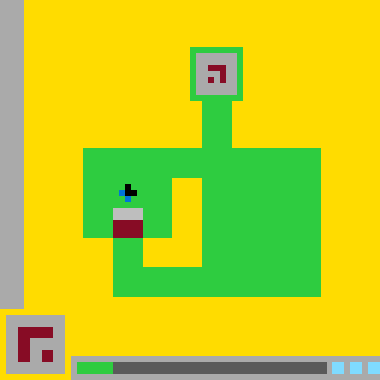

# `ls20` level `1` — LEFT / LEFT / DOWN / LEFT / UP / UP

- **Full game ID:** `ls20`
- **State:** `NOT_FINISHED`
- **Image hash:** `83c115d58c5a03cb`
- **Incoming action:** `ACTION1`

## Navigation

- [Level start](../../../../../../README.md)
- [Parent state](../README.md)

## Image



## Files

- [state.json](state.json)
- [differences.pl](differences.pl)
- [objects.pl](objects.pl)

## `objects.pl`

```prolog
canvas_size(64, 64).
coordinate_system(cell_grid, origin_top_left, x_right, y_down).
cell_size_pixels(10, 10).

color_rgb(yellow, 255, 220, 0).
color_rgb(gray, 170, 170, 170).
color_rgb(dark_gray, 102, 102, 102).
color_rgb(green, 46, 204, 64).
color_rgb(maroon, 133, 20, 75).
color_rgb(blue, 0, 116, 217).
color_rgb(aqua, 127, 219, 255).
color_rgb(black, 0, 0, 0).

object(background_yellow).
bbox(background_yellow, 0, 0, 63, 63).
color(background_yellow, yellow).
geometry(background_yellow, filled_rectangle(64, 64)).
z_order(background_yellow, 0).
turtle_program(background_yellow,
    [penup, set_pos(0,0), setcolor(yellow), pendown, fill_rect(64,64), penup]).

object(left_wall).
bbox(left_wall, 0, 0, 3, 51).
color(left_wall, gray).
geometry(left_wall, filled_rectangle(4, 52)).
z_order(left_wall, 1).
touches_canvas_edge(left_wall, left).
touches_canvas_edge(left_wall, top).
turtle_program(left_wall,
    [penup, set_pos(0,0), setcolor(gray), pendown, fill_rect(4,52), penup]).

object(arena_green).
bbox(arena_green, 14, 8, 53, 49).
color(arena_green, green).
geometry(arena_green,
    orthogonal_region(
        [rect(32,8,9,9),
         rect(34,16,5,9),
         rect(14,25,40,15),
         rect(19,40,35,10)],
        [polygon([(29,30),(34,30),(34,45),(24,45),(24,40),(29,40)])])).
z_order(arena_green, 10).
connected(arena_green).
turtle_program(arena_green,
    [penup, setcolor(green),
     set_pos(32,8), pendown, fill_rect(9,9), penup,
     set_pos(34,16), pendown, fill_rect(5,9), penup,
     set_pos(14,25), pendown, fill_rect(40,15), penup,
     set_pos(19,40), pendown, fill_rect(35,10), penup]).

object(arena_cavity).
bbox(arena_cavity, 24, 30, 33, 44).
color(arena_cavity, yellow).
geometry(arena_cavity,
    union([filled_rectangle(29,30,5,10),
           filled_rectangle(24,40,10,5)])).
z_order(arena_cavity, 11).
enclosed_by(arena_cavity, arena_green).
turtle_program(arena_cavity,
    [penup, setcolor(yellow),
     set_pos(29,30), pendown, fill_rect(5,10), penup,
     set_pos(24,40), pendown, fill_rect(10,5), penup]).

object(top_pad).
bbox(top_pad, 33, 9, 39, 15).
color(top_pad, gray).
geometry(top_pad, filled_rectangle(7, 7)).
z_order(top_pad, 12).
contained_in_bbox(top_pad, arena_green).
surrounded_by(top_pad, arena_green).
turtle_program(top_pad,
    [penup, set_pos(33,9), setcolor(gray), pendown, fill_rect(7,7), penup]).

object(top_glyph).
bbox(top_glyph, 35, 11, 37, 13).
color(top_glyph, maroon).
geometry(top_glyph,
    union([filled_rectangle(35,11,3,1),
           filled_rectangle(37,12,1,2),
           filled_rectangle(35,13,1,1)])).
z_order(top_glyph, 13).
contained_in(top_glyph, top_pad).
component_count(top_glyph, 2).
turtle_program(top_glyph,
    [penup, setcolor(maroon),
     set_pos(35,11), pendown, fill_rect(3,1), penup,
     set_pos(37,12), pendown, fill_rect(1,2), penup,
     set_pos(35,13), pendown, set_cell, penup]).

object(player_black).
bbox(player_black, 21, 31, 22, 32).
color(player_black, black).
geometry(player_black,
    union([filled_rectangle(21,31,1,2),
           filled_rectangle(22,32,1,1)])).
z_order(player_black, 20).
supported_by(player_black, arena_green).
turtle_program(player_black,
    [penup, setcolor(black),
     set_pos(21,31), pendown, fill_rect(1,2), penup,
     set_pos(22,32), pendown, set_cell, penup]).

object(player_blue).
bbox(player_blue, 20, 32, 21, 33).
color(player_blue, blue).
geometry(player_blue,
    cells([(20,32),(21,33)])).
z_order(player_blue, 21).
component_count(player_blue, 2).
supported_by(player_blue, arena_green).
adjacent(player_blue, player_black, edge).
turtle_program(player_blue,
    [penup, setcolor(blue),
     set_pos(20,32), pendown, set_cell, penup,
     set_pos(21,33), pendown, set_cell, penup]).

object(door_lintel).
bbox(door_lintel, 19, 35, 23, 36).
color(door_lintel, gray).
geometry(door_lintel, filled_rectangle(5, 2)).
z_order(door_lintel, 20).
supported_by(door_lintel, arena_green).
turtle_program(door_lintel,
    [penup, set_pos(19,35), setcolor(gray), pendown, fill_rect(5,2), penup]).

object(door_maroon).
bbox(door_maroon, 19, 37, 23, 39).
color(door_maroon, maroon).
geometry(door_maroon, filled_rectangle(5, 3)).
z_order(door_maroon, 20).
supported_by(door_maroon, arena_green).
adjacent(door_lintel, door_maroon, edge).
turtle_program(door_maroon,
    [penup, set_pos(19,37), setcolor(maroon), pendown, fill_rect(5,3), penup]).

object(inventory_card).
bbox(inventory_card, 1, 53, 10, 62).
color(inventory_card, gray).
geometry(inventory_card, filled_rectangle(10, 10)).
z_order(inventory_card, 30).
turtle_program(inventory_card,
    [penup, set_pos(1,53), setcolor(gray), pendown, fill_rect(10,10), penup]).

object(inventory_glyph).
bbox(inventory_glyph, 3, 55, 8, 60).
color(inventory_glyph, maroon).
geometry(inventory_glyph,
    union([filled_rectangle(3,55,6,2),
           filled_rectangle(3,57,2,4),
           filled_rectangle(7,59,2,2)])).
z_order(inventory_glyph, 31).
contained_in(inventory_glyph, inventory_card).
component_count(inventory_glyph, 2).
similar_shape(inventory_glyph, top_glyph).
turtle_program(inventory_glyph,
    [penup, setcolor(maroon),
     set_pos(3,55), pendown, fill_rect(6,2), penup,
     set_pos(3,57), pendown, fill_rect(2,4), penup,
     set_pos(7,59), pendown, fill_rect(2,2), penup]).

object(status_tray).
bbox(status_tray, 12, 60, 63, 63).
color(status_tray, gray).
geometry(status_tray, filled_rectangle(52, 4)).
z_order(status_tray, 30).
touches_canvas_edge(status_tray, right).
touches_canvas_edge(status_tray, bottom).
turtle_program(status_tray,
    [penup, set_pos(12,60), setcolor(gray), pendown, fill_rect(52,4), penup]).

object(status_green_segment).
bbox(status_green_segment, 13, 61, 18, 62).
color(status_green_segment, green).
geometry(status_green_segment, filled_rectangle(6, 2)).
z_order(status_green_segment, 31).
contained_in(status_green_segment, status_tray).
turtle_program(status_green_segment,
    [penup, set_pos(13,61), setcolor(green), pendown, fill_rect(6,2), penup]).

object(status_dark_segment).
bbox(status_dark_segment, 19, 61, 54, 62).
color(status_dark_segment, dark_gray).
geometry(status_dark_segment, filled_rectangle(36, 2)).
z_order(status_dark_segment, 31).
contained_in(status_dark_segment, status_tray).
adjacent(status_green_segment, status_dark_segment, edge).
turtle_program(status_dark_segment,
    [penup, set_pos(19,61), setcolor(dark_gray), pendown, fill_rect(36,2), penup]).

object(status_aqua_1).
bbox(status_aqua_1, 56, 61, 57, 62).
color(status_aqua_1, aqua).
geometry(status_aqua_1, filled_rectangle(2, 2)).
z_order(status_aqua_1, 31).
contained_in(status_aqua_1, status_tray).
turtle_program(status_aqua_1,
    [penup, set_pos(56,61), setcolor(aqua), pendown, fill_rect(2,2), penup]).

object(status_aqua_2).
bbox(status_aqua_2, 59, 61, 60, 62).
color(status_aqua_2, aqua).
geometry(status_aqua_2, filled_rectangle(2, 2)).
z_order(status_aqua_2, 31).
contained_in(status_aqua_2, status_tray).
turtle_program(status_aqua_2,
    [penup, set_pos(59,61), setcolor(aqua), pendown, fill_rect(2,2), penup]).

object(status_aqua_3).
bbox(status_aqua_3, 62, 61, 63, 62).
color(status_aqua_3, aqua).
geometry(status_aqua_3, filled_rectangle(2, 2)).
z_order(status_aqua_3, 31).
contained_in(status_aqua_3, status_tray).
touches_canvas_edge(status_aqua_3, right).
turtle_program(status_aqua_3,
    [penup, set_pos(62,61), setcolor(aqua), pendown, fill_rect(2,2), penup]).

adjacent(background_yellow, left_wall, edge).
adjacent(arena_green, arena_cavity, edge).
adjacent(arena_green, top_pad, edge).
adjacent(status_tray, inventory_card, separated_by(1)).
aligned_horizontally(inventory_card, status_tray).
aligned_horizontally(status_green_segment, status_dark_segment).
aligned_horizontally(status_aqua_1, status_aqua_2).
aligned_horizontally(status_aqua_2, status_aqua_3).
occludes(arena_green, background_yellow).
occludes(arena_cavity, arena_green).
occludes(top_pad, arena_green).
occludes(player_black, arena_green).
occludes(player_blue, arena_green).
occludes(door_lintel, arena_green).
occludes(door_maroon, arena_green).
```

## `differences.pl`

```prolog
coordinate_unit(cell).
previous_to_current_scale(10).
comparison_basis(normalized_cell_grid).

object_correspondence(background, background_yellow, identity).
object_correspondence(left_sidebar, left_wall, identity).
object_correspondence(main_structure, arena_green, identity).
object_correspondence(upper_display, top_pad, identity).
object_correspondence(upper_glyph, top_glyph, identity).
object_correspondence(avatar, player_sprite(player_black, player_blue), color_component_split).
object_correspondence(lower_barrier_gray, door_lintel, identity).
object_correspondence(lower_barrier_maroon, door_maroon, identity).
object_correspondence(lower_icon_panel, inventory_card, identity).
object_correspondence(lower_icon_glyph, inventory_glyph, identity).
object_correspondence(status_panel, status_tray, identity).
object_correspondence(status_green, status_green_segment, identity).
object_correspondence(status_dark, status_dark_segment, identity).
object_correspondence(status_light_1, status_aqua_1, identity).
object_correspondence(status_light_2, status_aqua_2, identity).
object_correspondence(status_light_3, status_aqua_3, identity).

color_equivalent(light_blue, aqua).
color_equivalent(C, C).

representation_split(avatar, [player_black, player_blue]).
representation_added_object(arena_cavity).
representation_reclassified(background, arena_cavity, exposed_background_to_explicit_cavity).
representation_renamed(light_blue, aqua).

observed_semantic_addition(_) :- fail.
observed_semantic_removal(_) :- fail.
observed_recoloring(_, _, _) :- fail.

added_object(Object) :-
    observed_semantic_addition(Object).

removed_object(Object) :-
    observed_semantic_removal(Object).

recolored_object(ObjectPair, OldColor, NewColor) :-
    observed_recoloring(ObjectPair, OldColor, NewColor).

observed_move(lower_barrier_gray, door_lintel, 0, -5).
observed_move(lower_barrier_maroon, door_maroon, 0, -5).

moved_object(Previous, Current, DX, DY) :-
    observed_move(Previous, Current, DX, DY).

observed_resize(
    status_green-status_green_segment,
    size(5, 2),
    size(6, 2)
).
observed_resize(
    status_dark-status_dark_segment,
    size(37, 2),
    size(36, 2)
).

resized_object(ObjectPair, OldSize, NewSize) :-
    observed_resize(ObjectPair, OldSize, NewSize).

observed_change(
    main_structure,
    arena_green,
    geometry_added(cell_rectangle(19, 40, 5, 5))
).
observed_change(
    lower_barrier_gray,
    door_lintel,
    displacement(0, -5)
).
observed_change(
    lower_barrier_maroon,
    door_maroon,
    displacement(0, -5)
).
observed_change(
    status_green,
    status_green_segment,
    resized(size(5, 2), size(6, 2))
).
observed_change(
    status_dark,
    status_dark_segment,
    resized_and_left_edge_shifted(size(37, 2), size(36, 2), 1)
).

changed_object(Previous, Current, Change) :-
    observed_change(Previous, Current, Change).

unchanged_object(background, background_yellow).
unchanged_object(left_sidebar, left_wall).
unchanged_object(upper_display, top_pad).
unchanged_object(upper_glyph, top_glyph).
unchanged_object(avatar, player_sprite(player_black, player_blue)).
unchanged_object(lower_icon_panel, inventory_card).
unchanged_object(lower_icon_glyph, inventory_glyph).
unchanged_object(status_panel, status_tray).
unchanged_object(status_light_1, status_aqua_1).
unchanged_object(status_light_2, status_aqua_2).
unchanged_object(status_light_3, status_aqua_3).

unchanged_bbox(background, background_yellow, bbox(0, 0, 63, 63)).
unchanged_bbox(left_sidebar, left_wall, bbox(0, 0, 3, 51)).
unchanged_bbox(main_structure, arena_green, bbox(14, 8, 53, 49)).
unchanged_bbox(upper_display, top_pad, bbox(33, 9, 39, 15)).
unchanged_bbox(upper_glyph, top_glyph, bbox(35, 11, 37, 13)).
unchanged_bbox(avatar, player_sprite(player_black, player_blue), bbox(20, 31, 22, 33)).
unchanged_bbox(lower_icon_panel, inventory_card, bbox(1, 53, 10, 62)).
unchanged_bbox(lower_icon_glyph, inventory_glyph, bbox(3, 55, 8, 60)).
unchanged_bbox(status_panel, status_tray, bbox(12, 60, 63, 63)).
unchanged_bbox(status_light_1, status_aqua_1, bbox(56, 61, 57, 62)).
unchanged_bbox(status_light_2, status_aqua_2, bbox(59, 61, 60, 62)).
unchanged_bbox(status_light_3, status_aqua_3, bbox(62, 61, 63, 62)).

unchanged_color(background, background_yellow, yellow).
unchanged_color(left_sidebar, left_wall, gray).
unchanged_color(main_structure, arena_green, green).
unchanged_color(upper_display, top_pad, gray).
unchanged_color(upper_glyph, top_glyph, maroon).
unchanged_color(lower_barrier_gray, door_lintel, gray).
unchanged_color(lower_barrier_maroon, door_maroon, maroon).
unchanged_color(lower_icon_panel, inventory_card, gray).
unchanged_color(lower_icon_glyph, inventory_glyph, maroon).
unchanged_color(status_panel, status_tray, gray).
unchanged_color(status_green, status_green_segment, green).
unchanged_color(status_dark, status_dark_segment, dark_gray).
unchanged_color(status_light_1, status_aqua_1, light_blue).
unchanged_color(status_light_2, status_aqua_2, light_blue).
unchanged_color(status_light_3, status_aqua_3, light_blue).

observed_bbox_change(
    lower_barrier_gray,
    door_lintel,
    bbox(19, 40, 23, 41),
    bbox(19, 35, 23, 36)
).
observed_bbox_change(
    lower_barrier_maroon,
    door_maroon,
    bbox(19, 42, 23, 44),
    bbox(19, 37, 23, 39)
).
observed_bbox_change(
    status_green,
    status_green_segment,
    bbox(13, 61, 17, 62),
    bbox(13, 61, 18, 62)
).
observed_bbox_change(
    status_dark,
    status_dark_segment,
    bbox(18, 61, 54, 62),
    bbox(19, 61, 54, 62)
).

observed_region_change(
    cell_rectangle(19, 35, 5, 2),
    green,
    gray
).
observed_region_change(
    cell_rectangle(19, 37, 5, 3),
    green,
    maroon
).
observed_region_change(
    cell_rectangle(19, 40, 5, 2),
    gray,
    green
).
observed_region_change(
    cell_rectangle(19, 42, 5, 3),
    maroon,
    green
).
observed_region_change(
    cell_rectangle(18, 61, 1, 2),
    dark_gray,
    green
).

recolored_region(Region, OldColor, NewColor) :-
    observed_region_change(Region, OldColor, NewColor).

observation(moved_object(P, C, DX, DY)) :-
    observed_move(P, C, DX, DY).
observation(resized_object(Pair, OldSize, NewSize)) :-
    observed_resize(Pair, OldSize, NewSize).
observation(changed_object(P, C, Change)) :-
    observed_change(P, C, Change).
observation(recolored_region(Region, OldColor, NewColor)) :-
    observed_region_change(Region, OldColor, NewColor).

hypothesized_action_effect(
    unknown_action,
    moved(door_assembly, north, 5)
).
hypothesized_action_effect(
    unknown_action,
    opened_passage_below_player
).
hypothesized_action_effect(
    unknown_action,
    filled_vacated_door_region_with_green
).
hypothesized_action_effect(
    unknown_action,
    increased_green_status_by_cells(2)
).
hypothesized_action_effect(
    unknown_action,
    decreased_dark_status_by_cells(2)
).

action_effect(Action, Effect) :-
    hypothesized_action_effect(Action, Effect).

hypothesis(action_effect(Action, Effect)) :-
    hypothesized_action_effect(Action, Effect).

hypothesis(door_assembly_moved_as_unit) :-
    observed_move(lower_barrier_gray, door_lintel, 0, -5),
    observed_move(lower_barrier_maroon, door_maroon, 0, -5).

hypothesis(status_transfer(dark_gray, green, cells(2))) :-
    observed_region_change(
        cell_rectangle(18, 61, 1, 2),
        dark_gray,
        green
    ).
```

## Actions

- [`UP`](UP/README.md)
