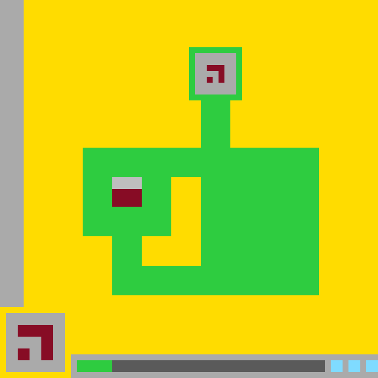

# `ls20` level `1` — LEFT / LEFT / DOWN / LEFT / UP / UP / UP

## Navigation

[Level start](../../../../../../../README.md) · [Parent](../README.md)

### Actions

[`UP`](UP/README.md)

---

- **Full game ID:** `ls20`
- **State:** `NOT_FINISHED`
- **Image hash:** `4cd6e9d3fa186d93`
- **Incoming action:** `ACTION1`

## Image



## Files

- [image.png](image.png)
- [state.json](state.json)
- [object_registry.pl](../../../../../../../object_registry.pl) — shared level registry (24 canonical identities)
- [differences.pl](differences.pl)
- [objects.pl](objects.pl)
- [rules.pl](rules.pl)
- [similarities.pl](similarities.pl)
- [turtle_from_diff.pl](turtle_from_diff.pl)
- [turtle_from_image.pl](turtle_from_image.pl)

## Embedded files

*Canonical identities are shared through [`object_registry.pl`](../../../../../../../object_registry.pl) and are not repeated in every node.*

<details>
<summary><code>state.json</code></summary>

````json
{
  "state": "NOT_FINISHED",
  "observation": {
    "game_id": "ls20-9607627b",
    "state": "NOT_FINISHED",
    "levels_completed": 0,
    "win_levels": 7,
    "action_input": {
      "id": "ACTION1",
      "data": {},
      "reasoning": null
    },
    "guid": "a992cb74-c0cd-4d3e-915e-9312cff80356",
    "full_reset": false,
    "available_actions": [
      1,
      2,
      3,
      4
    ]
  },
  "step_count": 6,
  "game_id": "ls20",
  "game_directory": "ls20",
  "level": "1",
  "image_hash": "4cd6e9d3fa186d93",
  "incoming_action": "ACTION1",
  "action_directory": "UP",
  "action_data": {},
  "parent_node": "..",
  "action_path": [
    "LEFT",
    "LEFT",
    "DOWN",
    "LEFT",
    "UP",
    "UP",
    "UP"
  ]
}
````

[Open `state.json`](state.json)

</details>

<details>
<summary><code>differences.pl</code></summary>

````prolog
% Observed transition from action7 to action8.
state_transition(action7, action8, action('ACTION1', {})).

% No object identities were created or destroyed.
added_object(_) :-
    fail.

removed_object(_) :-
    fail.

% The gate and both of its canonical components moved five cells upward.
moved_object(bottom_center_gate, center(21, 37), center(21, 32), delta(0, -5)).
moved_object(gate_gray_header, bounding_box(19, 35, 5, 2),
                              bounding_box(19, 30, 5, 2),
                              delta(0, -5)).
moved_object(gate_burgundy_panel, bounding_box(19, 37, 5, 3),
                                  bounding_box(19, 32, 5, 3),
                                  delta(0, -5)).

changed_object(bottom_center_gate,
               bounding_box(19, 35, 5, 5),
               bounding_box(19, 30, 5, 5)).
changed_object(gate_gray_header,
               bounding_box(19, 35, 5, 2),
               bounding_box(19, 30, 5, 2)).
changed_object(gate_burgundy_panel,
               bounding_box(19, 37, 5, 3),
               bounding_box(19, 32, 5, 3)).

% The player identities persist but are fully hidden behind the raised gate.
changed_object(blue_black_player,
               visibility(visible),
               visibility(fully_occluded)).
changed_object(player_black_core,
               visibility(visible),
               visibility(fully_occluded)).
changed_object(player_blue_tail,
               visibility(visible),
               visibility(fully_occluded)).

occluded_object(blue_black_player, bottom_center_gate).
occluded_object(player_black_core, bottom_center_gate).
occluded_object(player_blue_tail, bottom_center_gate).

added_relation(overlays(bottom_center_gate, blue_black_player)).
added_relation(occluded_by(blue_black_player, bottom_center_gate)).
added_relation(occluded_by(player_black_core, bottom_center_gate)).
added_relation(occluded_by(player_blue_tail, bottom_center_gate)).

% Raster observation: the lower-left glyph is horizontally rearranged
% inside the same bounding box. The current objects.pl serialization does
% not encode this raster-visible geometry change.
changed_object(lower_left_burgundy_glyph,
               component_boxes([
                   box(3, 55, 6, 2),
                   box(3, 57, 2, 4),
                   box(7, 59, 2, 2)
               ]),
               component_boxes([
                   box(3, 55, 6, 2),
                   box(7, 57, 2, 4),
                   box(3, 59, 2, 2)
               ])).

observation_conflict(
    lower_left_burgundy_glyph,
    raster_observation(horizontal_mirror),
    current_objects_pl(component_boxes_unchanged)
).

% No color or outer-size changes were observed.
recolored_object(_, _, _) :-
    fail.

resized_object(_, _, _) :-
    fail.

unchanged_object(yellow_playfield, appearance_and_position).
unchanged_object(left_boundary_wall, appearance_and_position).
unchanged_object(green_fortress, semantic_structure_and_bounding_box).
unchanged_object(fortress_main_body, semantic_structure_and_bounding_box).
unchanged_object(fortress_left_wing, appearance_and_position).
unchanged_object(fortress_right_wing, appearance_and_position).
unchanged_object(fortress_lower_bridge, appearance_and_position).
unchanged_object(fortress_upper_stem, appearance_and_position).
unchanged_object(fortress_inner_courtyard, appearance_and_position).
unchanged_object(upper_chamber_frame, appearance_and_position).
unchanged_object(upper_chamber_interior, appearance_and_position).
unchanged_object(upper_burgundy_glyph, appearance_and_position).
unchanged_object(bottom_center_gate, size_colors_and_geometry).
unchanged_object(gate_gray_header, size_color_and_geometry).
unchanged_object(gate_burgundy_panel, size_color_and_geometry).
unchanged_object(lower_left_symbol_card, appearance_and_position).
unchanged_object(lower_left_burgundy_glyph, bounding_box_and_color).
unchanged_object(bottom_status_panel, appearance_and_position).
unchanged_object(bottom_status_track, appearance_and_position).
unchanged_object(green_status_block, appearance_and_position).
unchanged_object(cyan_status_blocks, appearance_and_position).
unchanged_object(blue_black_player, canonical_identity).
unchanged_object(player_black_core, canonical_identity).
unchanged_object(player_blue_tail, canonical_identity).

observed_action_effect(action('ACTION1', {}),
                       moved_up(bottom_center_gate, 5)).
observed_action_effect(action('ACTION1', {}),
                       fully_occluded(blue_black_player,
                                      bottom_center_gate)).
observed_action_effect(action('ACTION1', {}),
                       status_progress_unchanged).

action_effect(Action, Effect) :-
    observed_action_effect(Action, Effect).

% Hypotheses are separated from directly observed differences.
hypothesized_action_effect(
    action('ACTION1', {}),
    caused_occlusion(
        moved_up(bottom_center_gate, 5),
        blue_black_player
    )
).

hypothesized_action_effect(
    action('ACTION1', {}),
    transformed_glyph(lower_left_burgundy_glyph, horizontal_mirror)
).
````

[Open `differences.pl`](differences.pl)

</details>

<details>
<summary><code>objects.pl</code></summary>

````prolog
% Canonical object identities live in the level-wide registry.
:- ensure_loaded('../../../../../../../object_registry.pl').

% State-specific facts for this action-tree node.
% Canonical object identities live in the level-wide registry.

% State-specific facts for this action-tree node.
% Canonical object identities live in the level-wide registry.

% State-specific facts for this action-tree node.
% Canonical object identities live in the level-wide registry.

% State-specific facts for this action-tree node.
% Canonical object identities live in the level-wide registry.

% State-specific facts for this action-tree node.
% Canonical object identities live in the level-wide registry.

% State-specific facts for this action-tree node.
% Canonical object identities live in the level-wide registry.

% State-specific facts for this action-tree node.
% Canonical object identities live in the level-wide registry.

% State-specific facts for this action-tree node.
state_id(action8).
incoming_action(action8, action('ACTION1', {})).
previous_state(action8, action7).

canvas_size(64, 64).
coordinate_system(origin_top_left, x_right, y_down).
grid_cell_size_pixels(10).

visible(yellow_playfield).
visible(left_boundary_wall).
visible(green_fortress).
visible(fortress_main_body).
visible(fortress_left_wing).
visible(fortress_right_wing).
visible(fortress_lower_bridge).
visible(fortress_upper_stem).
visible(fortress_inner_courtyard).
visible(upper_chamber_frame).
visible(upper_chamber_interior).
visible(upper_burgundy_glyph).
visible(bottom_center_gate).
visible(gate_gray_header).
visible(gate_burgundy_panel).
visible(lower_left_symbol_card).
visible(lower_left_burgundy_glyph).
visible(bottom_status_panel).
visible(bottom_status_track).
visible(green_status_block).
visible(cyan_status_blocks).

bounding_box(yellow_playfield, 0, 0, 64, 64).
bounding_box(left_boundary_wall, 0, 0, 4, 52).
bounding_box(green_fortress, 14, 8, 40, 42).
bounding_box(fortress_main_body, 14, 25, 40, 25).
bounding_box(fortress_left_wing, 14, 25, 15, 15).
bounding_box(fortress_right_wing, 34, 25, 20, 25).
bounding_box(fortress_lower_bridge, 19, 45, 35, 5).
bounding_box(fortress_upper_stem, 34, 17, 5, 8).
bounding_box(fortress_inner_courtyard, 24, 30, 10, 15).
bounding_box(upper_chamber_frame, 32, 8, 9, 9).
bounding_box(upper_chamber_interior, 33, 9, 7, 7).
bounding_box(upper_burgundy_glyph, 35, 11, 3, 3).
bounding_box(bottom_center_gate, 19, 30, 5, 5).
bounding_box(gate_gray_header, 19, 30, 5, 2).
bounding_box(gate_burgundy_panel, 19, 32, 5, 3).
bounding_box(lower_left_symbol_card, 1, 53, 10, 10).
bounding_box(lower_left_burgundy_glyph, 3, 55, 6, 6).
bounding_box(bottom_status_panel, 12, 60, 52, 4).
bounding_box(green_status_block, 13, 61, 6, 2).
bounding_box(bottom_status_track, 19, 61, 36, 2).
bounding_box(cyan_status_blocks, 56, 61, 8, 2).

center(green_fortress, 34, 29).
center(upper_chamber_frame, 36, 12).
center(upper_chamber_interior, 36, 12).
center(bottom_center_gate, 21, 32).
center(gate_gray_header, 21, 31).
center(gate_burgundy_panel, 21, 33).
center(lower_left_symbol_card, 5, 58).
center(green_status_block, 16, 62).
center(bottom_status_track, 37, 62).
center(cyan_status_blocks, 60, 62).

color(yellow_playfield, yellow).
color(left_boundary_wall, light_gray).
color(green_fortress, green).
color(fortress_main_body, green).
color(fortress_left_wing, green).
color(fortress_right_wing, green).
color(fortress_lower_bridge, green).
color(fortress_upper_stem, green).
color(fortress_inner_courtyard, yellow).
color(upper_chamber_frame, green).
color(upper_chamber_interior, light_gray).
color(upper_burgundy_glyph, burgundy).
colors(bottom_center_gate, [light_gray, burgundy]).
color(gate_gray_header, light_gray).
color(gate_burgundy_panel, burgundy).
color(lower_left_symbol_card, light_gray).
color(lower_left_burgundy_glyph, burgundy).
color(bottom_status_panel, light_gray).
color(bottom_status_track, dark_gray).
color(green_status_block, green).
color(cyan_status_blocks, cyan).

geometry(yellow_playfield, background_with_occlusions).
geometry(left_boundary_wall, filled_vertical_rectangle).
geometry(green_fortress, connected_compound_structure).
geometry(fortress_main_body, stepped_block_region).
geometry(fortress_left_wing, filled_rectangle).
geometry(fortress_right_wing, filled_rectangle).
geometry(fortress_lower_bridge, filled_horizontal_bar).
geometry(fortress_upper_stem, filled_vertical_rectangle).
geometry(fortress_inner_courtyard, l_shaped_hole).
geometry(upper_chamber_frame, one_cell_thick_rectangular_frame).
geometry(upper_chamber_interior, filled_rectangle).
geometry(upper_burgundy_glyph, hooked_angular_glyph).
geometry(bottom_center_gate, vertically_partitioned_rectangle).
geometry(gate_gray_header, filled_horizontal_rectangle).
geometry(gate_burgundy_panel, filled_rectangle).
geometry(lower_left_symbol_card, filled_square_panel).
geometry(lower_left_burgundy_glyph, angular_thick_glyph).
geometry(bottom_status_panel, filled_horizontal_panel).
geometry(bottom_status_track, filled_horizontal_rectangle).
geometry(green_status_block, filled_horizontal_rectangle).
geometry(cyan_status_blocks, three_separated_rectangular_blocks).

component_of(fortress_main_body, green_fortress).
component_of(fortress_left_wing, green_fortress).
component_of(fortress_right_wing, green_fortress).
component_of(fortress_lower_bridge, green_fortress).
component_of(fortress_upper_stem, green_fortress).
component_of(upper_chamber_frame, green_fortress).
component_of(gate_gray_header, bottom_center_gate).
component_of(gate_burgundy_panel, bottom_center_gate).
component_of(lower_left_burgundy_glyph, lower_left_symbol_card).
component_of(green_status_block, bottom_status_panel).
component_of(bottom_status_track, bottom_status_panel).
component_of(cyan_status_blocks, bottom_status_panel).

contains(green_fortress, fortress_inner_courtyard).
contains(fortress_main_body, fortress_inner_courtyard).
contains(upper_chamber_frame, upper_chamber_interior).
contains(upper_chamber_interior, upper_burgundy_glyph).
contains(lower_left_symbol_card, lower_left_burgundy_glyph).
contains(bottom_status_panel, green_status_block).
contains(bottom_status_panel, bottom_status_track).
contains(bottom_status_panel, cyan_status_blocks).

encloses(green_fortress, fortress_inner_courtyard).
encloses(upper_chamber_frame, upper_chamber_interior).

adjacent(left_boundary_wall, yellow_playfield).
adjacent(upper_chamber_frame, fortress_upper_stem).
adjacent(fortress_upper_stem, fortress_main_body).
adjacent(fortress_left_wing, fortress_inner_courtyard).
adjacent(fortress_right_wing, fortress_inner_courtyard).
adjacent(fortress_lower_bridge, fortress_inner_courtyard).
adjacent(gate_gray_header, gate_burgundy_panel).
adjacent(green_status_block, bottom_status_track).
adjacent(bottom_status_track, cyan_status_blocks).

embedded_in(bottom_center_gate, fortress_left_wing).
embedded_in(bottom_center_gate, green_fortress).

overlays(bottom_center_gate, fortress_left_wing).
overlays(bottom_center_gate, blue_black_player).
overlays(upper_burgundy_glyph, upper_chamber_interior).
overlays(lower_left_burgundy_glyph, lower_left_symbol_card).
overlays(green_status_block, bottom_status_panel).
overlays(bottom_status_track, bottom_status_panel).
overlays(cyan_status_blocks, bottom_status_panel).

occluded_by(blue_black_player, bottom_center_gate).
occluded_by(player_black_core, bottom_center_gate).
occluded_by(player_blue_tail, bottom_center_gate).

left_of(bottom_center_gate, fortress_inner_courtyard).
left_of(green_status_block, bottom_status_track).
left_of(bottom_status_track, cyan_status_blocks).
above(upper_chamber_frame, bottom_center_gate).
above(bottom_center_gate, fortress_lower_bridge).
below(bottom_center_gate, upper_chamber_frame).
below(fortress_lower_bridge, bottom_center_gate).

state(green_fortress, solid).
state(fortress_inner_courtyard, empty).
state(bottom_center_gate, closed).
state(bottom_center_gate, shifted_far_left).
state(bottom_center_gate, raised).
state(bottom_center_gate, raised_again).
state(bottom_center_gate, raised_third_time).
state(blue_black_player, fully_occluded).
state(bottom_status_panel, active).
state(green_status_block, lit).
state(cyan_status_blocks, three_lit_blocks).
state(action8, gate_moved_up).
state(action8, player_hidden_by_gate).
state(action8, status_progress_unchanged).

component_box(fortress_main_body, 14, 25, 40, 5).
component_box(fortress_main_body, 14, 30, 15, 10).
component_box(fortress_main_body, 34, 30, 20, 20).
component_box(fortress_main_body, 19, 45, 35, 5).
component_box(fortress_lower_bridge, 19, 45, 35, 5).
component_box(fortress_inner_courtyard, 29, 30, 5, 15).
component_box(fortress_inner_courtyard, 24, 40, 5, 5).
component_box(upper_burgundy_glyph, 35, 11, 3, 1).
component_box(upper_burgundy_glyph, 37, 12, 1, 2).
component_box(upper_burgundy_glyph, 35, 13, 1, 1).
component_box(lower_left_burgundy_glyph, 3, 55, 6, 2).
component_box(lower_left_burgundy_glyph, 3, 57, 2, 4).
component_box(lower_left_burgundy_glyph, 7, 59, 2, 2).
component_box(cyan_status_blocks, 56, 61, 2, 2).
component_box(cyan_status_blocks, 59, 61, 2, 2).
component_box(cyan_status_blocks, 62, 61, 2, 2).

turtle_program(yellow_playfield,
    [penup, set_pos(0,0), setcolor(yellow), pendown, fill_rect(64,64)]).

turtle_program(left_boundary_wall,
    [penup, set_pos(0,0), setcolor(light_gray), pendown, fill_rect(4,52)]).

turtle_program(green_fortress,
    [penup, setcolor(green),
     set_pos(32,8), pendown, fill_rect(9,1),
     penup, set_pos(32,9), pendown, fill_rect(1,7),
     penup, set_pos(40,9), pendown, fill_rect(1,7),
     penup, set_pos(32,16), pendown, fill_rect(9,1),
     penup, set_pos(34,17), pendown, fill_rect(5,8),
     penup, set_pos(14,25), pendown, fill_rect(40,5),
     penup, set_pos(14,30), pendown, fill_rect(15,10),
     penup, set_pos(34,30), pendown, fill_rect(20,15),
     penup, set_pos(19,40), pendown, fill_rect(5,10),
     penup, set_pos(24,45), pendown, fill_rect(30,5)]).

turtle_program(fortress_main_body,
    [penup, setcolor(green),
     set_pos(14,25), pendown, fill_rect(40,5),
     penup, set_pos(14,30), pendown, fill_rect(15,10),
     penup, set_pos(34,30), pendown, fill_rect(20,20),
     penup, set_pos(19,40), pendown, fill_rect(5,10),
     penup, set_pos(24,45), pendown, fill_rect(30,5)]).

turtle_program(fortress_left_wing,
    [penup, set_pos(14,25), setcolor(green), pendown, fill_rect(15,15)]).

turtle_program(fortress_right_wing,
    [penup, set_pos(34,25), setcolor(green), pendown, fill_rect(20,25)]).

turtle_program(fortress_lower_bridge,
    [penup, set_pos(19,45), setcolor(green), pendown, fill_rect(35,5)]).

turtle_program(fortress_upper_stem,
    [penup, set_pos(34,17), setcolor(green), pendown, fill_rect(5,8)]).

turtle_program(fortress_inner_courtyard,
    [penup, setcolor(yellow),
     set_pos(29,30), pendown, fill_rect(5,15),
     penup, set_pos(24,40), pendown, fill_rect(5,5)]).

turtle_program(upper_chamber_frame,
    [penup, setcolor(green),
     set_pos(32,8), pendown, fill_rect(9,1),
     penup, set_pos(32,9), pendown, fill_rect(1,7),
     penup, set_pos(40,9), pendown, fill_rect(1,7),
     penup, set_pos(32,16), pendown, fill_rect(9,1)]).

turtle_program(upper_chamber_interior,
    [penup, set_pos(33,9), setcolor(light_gray), pendown, fill_rect(7,7)]).

turtle_program(upper_burgundy_glyph,
    [penup, setcolor(burgundy),
     set_pos(35,11), pendown, fill_rect(3,1),
     penup, set_pos(37,12), pendown, fill_rect(1,2),
     penup, set_pos(35,13), pendown, set_cell]).

turtle_program(bottom_center_gate,
    [penup, set_pos(19,30), setcolor(light_gray), pendown, fill_rect(5,2),
     penup, set_pos(19,32), setcolor(burgundy), pendown, fill_rect(5,3)]).

turtle_program(gate_gray_header,
    [penup, set_pos(19,30), setcolor(light_gray), pendown, fill_rect(5,2)]).

turtle_program(gate_burgundy_panel,
    [penup, set_pos(19,32), setcolor(burgundy), pendown, fill_rect(5,3)]).

turtle_program(lower_left_symbol_card,
    [penup, set_pos(1,53), setcolor(light_gray), pendown, fill_rect(10,10)]).

turtle_program(lower_left_burgundy_glyph,
    [penup, setcolor(burgundy),
     set_pos(3,55), pendown, fill_rect(6,2),
     penup, set_pos(3,57), pendown, fill_rect(2,4),
     penup, set_pos(7,59), pendown, fill_rect(2,2)]).

turtle_program(bottom_status_panel,
    [penup, set_pos(12,60), setcolor(light_gray), pendown, fill_rect(52,4)]).

turtle_program(green_status_block,
    [penup, set_pos(13,61), setcolor(green), pendown, fill_rect(6,2)]).

turtle_program(bottom_status_track,
    [penup, set_pos(19,61), setcolor(dark_gray), pendown, fill_rect(36,2)]).

turtle_program(cyan_status_blocks,
    [penup, setcolor(cyan),
     set_pos(56,61), pendown, fill_rect(2,2),
     penup, set_pos(59,61), pendown, fill_rect(2,2),
     penup, set_pos(62,61), pendown, fill_rect(2,2)]).
````

[Open `objects.pl`](objects.pl)

</details>

<details>
<summary><code>rules.pl</code></summary>

````prolog
evidence_reference(
    e_transition_action7_action8,
    differences_pl(state_transition(action7, action8, action('ACTION1', {})))
).

evidence_reference(
    e_gate_up_five,
    differences_pl([
        moved_object(bottom_center_gate, center(21, 37), center(21, 32), delta(0, -5)),
        moved_object(gate_gray_header,
                     bounding_box(19, 35, 5, 2),
                     bounding_box(19, 30, 5, 2),
                     delta(0, -5)),
        moved_object(gate_burgundy_panel,
                     bounding_box(19, 37, 5, 3),
                     bounding_box(19, 32, 5, 3),
                     delta(0, -5))
    ])
).

evidence_reference(
    e_gate_rigid_components,
    object_registry_and_objects_pl([
        object_identity(bottom_center_gate, compound_rectangle),
        object_identity(gate_gray_header, horizontal_bar),
        object_identity(gate_burgundy_panel, rectangular_block),
        component_of(gate_gray_header, bottom_center_gate),
        component_of(gate_burgundy_panel, bottom_center_gate)
    ])
).

evidence_reference(
    e_player_occlusion,
    differences_pl([
        changed_object(blue_black_player,
                       visibility(visible),
                       visibility(fully_occluded)),
        occluded_object(blue_black_player, bottom_center_gate),
        occluded_object(player_black_core, bottom_center_gate),
        occluded_object(player_blue_tail, bottom_center_gate)
    ])
).

evidence_reference(
    e_player_identity_persists,
    object_registry_and_differences_pl([
        object_identity(blue_black_player, player_marker),
        object_identity(player_black_core, pixel_cluster),
        object_identity(player_blue_tail, pixel_cluster),
        unchanged_object(blue_black_player, canonical_identity),
        unchanged_object(player_black_core, canonical_identity),
        unchanged_object(player_blue_tail, canonical_identity)
    ])
).

evidence_reference(
    e_current_gate_player_overlap,
    current_objects_pl([
        bounding_box(bottom_center_gate, 19, 30, 5, 5),
        overlays(bottom_center_gate, blue_black_player),
        occluded_by(blue_black_player, bottom_center_gate),
        state(blue_black_player, fully_occluded)
    ])
).

evidence_reference(
    e_status_unchanged_action8,
    differences_pl(
        observed_action_effect(
            action('ACTION1', {}),
            status_progress_unchanged
        )
    )
).

evidence_reference(
    e_status_path_variation,
    action_history([
        state(action7, status_progress_increased),
        state(action8, status_progress_unchanged)
    ])
).

evidence_reference(
    e_repeated_raise_path,
    action_history([
        incoming_action(action7, action('ACTION1', {})),
        state(action7, gate_moved_up),
        state(bottom_center_gate, raised_again),
        incoming_action(action8, action('ACTION1', {})),
        state(action8, gate_moved_up),
        state(bottom_center_gate, raised_third_time)
    ])
).

evidence_reference(
    e_glyph_raster_change,
    differences_pl([
        changed_object(
            lower_left_burgundy_glyph,
            component_boxes([
                box(3, 55, 6, 2),
                box(3, 57, 2, 4),
                box(7, 59, 2, 2)
            ]),
            component_boxes([
                box(3, 55, 6, 2),
                box(7, 57, 2, 4),
                box(3, 59, 2, 2)
            ])
        ),
        observation_conflict(
            lower_left_burgundy_glyph,
            raster_observation(horizontal_mirror),
            current_objects_pl(component_boxes_unchanged)
        )
    ])
).

observed_rule(
    action7_action1_moves_gate_up,
    rule(
        when([
            state_id(action7),
            action(action('ACTION1', {})),
            center(bottom_center_gate, 21, 37)
        ]),
        then([
            next_state(action8),
            translate(bottom_center_gate, delta(0, -5)),
            translate(gate_gray_header, delta(0, -5)),
            translate(gate_burgundy_panel, delta(0, -5))
        ]),
        evidence([
            e_transition_action7_action8,
            e_gate_up_five,
            e_gate_rigid_components
        ])
    )
).

observed_rule(
    gate_overlap_fully_occludes_player_on_action8,
    rule(
        when([
            transition(action7, action8),
            moved_to(bottom_center_gate, bounding_box(19, 30, 5, 5))
        ]),
        then([
            fully_occluded(blue_black_player, bottom_center_gate),
            fully_occluded(player_black_core, bottom_center_gate),
            fully_occluded(player_blue_tail, bottom_center_gate)
        ]),
        evidence([
            e_player_occlusion,
            e_player_identity_persists,
            e_current_gate_player_overlap
        ])
    )
).

observed_rule(
    action8_status_does_not_advance,
    rule(
        when([
            transition(action7, action8),
            action(action('ACTION1', {}))
        ]),
        then([
            status_progress_unchanged
        ]),
        evidence([
            e_status_unchanged_action8
        ])
    )
).

observed_rule(
    action8_raster_mirrors_lower_left_glyph,
    rule(
        when([
            transition(action7, action8),
            action(action('ACTION1', {}))
        ]),
        then([
            raster_transform(lower_left_burgundy_glyph, horizontal_mirror)
        ]),
        caveat(current_objects_pl_does_not_encode_changed_component_boxes),
        evidence([
            e_glyph_raster_change
        ])
    )
).

hypothetical_rule(
    repeated_action1_raises_closed_gate_by_five,
    rule(
        when([
            action(action('ACTION1', {})),
            state(bottom_center_gate, closed),
            vertical_translation_permitted(bottom_center_gate, -5)
        ]),
        then([
            translate(bottom_center_gate, delta(0, -5)),
            translate(gate_gray_header, delta(0, -5)),
            translate(gate_burgundy_panel, delta(0, -5)),
            preserve_identity(bottom_center_gate),
            preserve_identity(gate_gray_header),
            preserve_identity(gate_burgundy_panel)
        ])
    ),
    support(
        confidence(medium_high),
        evidence([
            e_gate_up_five,
            e_gate_rigid_components,
            e_repeated_raise_path
        ])
    )
).

hypothetical_rule(
    next_action1_places_gate_at_y25,
    rule(
        when([
            state_id(action8),
            action(action('ACTION1', {})),
            bounding_box(bottom_center_gate, 19, 30, 5, 5),
            vertical_translation_permitted(bottom_center_gate, -5)
        ]),
        then([
            predicted_bounding_box(bottom_center_gate, 19, 25, 5, 5),
            predicted_bounding_box(gate_gray_header, 19, 25, 5, 2),
            predicted_bounding_box(gate_burgundy_panel, 19, 27, 5, 3)
        ])
    ),
    support(
        confidence(medium),
        evidence([
            e_gate_up_five,
            e_repeated_raise_path,
            e_gate_rigid_components
        ])
    )
).

hypothetical_rule(
    player_reappears_after_gate_ceases_overlap,
    rule(
        when([
            state(blue_black_player, fully_occluded),
            occluded_by(blue_black_player, bottom_center_gate),
            next_position_does_not_overlap(bottom_center_gate, blue_black_player)
        ]),
        then([
            visible_again(blue_black_player),
            visible_again(player_black_core),
            visible_again(player_blue_tail),
            preserve_position(blue_black_player),
            preserve_identity(blue_black_player)
        ])
    ),
    support(
        confidence(medium),
        evidence([
            e_player_occlusion,
            e_player_identity_persists,
            e_current_gate_player_overlap,
            e_gate_up_five
        ])
    )
).

hypothetical_rule(
    status_progress_is_phase_dependent,
    rule(
        when([
            action(action('ACTION1', {}))
        ]),
        then([
            status_effect_requires_additional_state
        ]),
        excludes([
            unconditional_status_progress_increase,
            unconditional_status_progress_unchanged
        ])
    ),
    support(
        confidence(high),
        evidence([
            e_status_unchanged_action8,
            e_status_path_variation
        ])
    )
).

hypothetical_rule(
    action1_may_toggle_lower_left_glyph_mirror,
    rule(
        when([
            action(action('ACTION1', {})),
            visible(lower_left_burgundy_glyph)
        ]),
        then([
            possible_transform(lower_left_burgundy_glyph, horizontal_mirror)
        ])
    ),
    support(
        confidence(low),
        evidence([
            e_glyph_raster_change
        ])
    )
).
````

[Open `rules.pl`](rules.pl)

</details>

<details>
<summary><code>similarities.pl</code></summary>

````prolog
object_match(yellow_playfield, yellow_playfield,
             match(1.0, [canonical_id, same_color, same_geometry, same_bounding_box])).
object_match(left_boundary_wall, left_boundary_wall,
             match(1.0, [canonical_id, same_color, same_geometry, same_bounding_box])).
object_match(green_fortress, green_fortress,
             match(1.0, [canonical_id, same_semantic_structure, same_bounding_box])).
object_match(fortress_main_body, fortress_main_body,
             match(1.0, [canonical_id, same_semantic_structure, same_bounding_box])).
object_match(fortress_left_wing, fortress_left_wing,
             match(1.0, [canonical_id, same_color, same_geometry, same_bounding_box])).
object_match(fortress_right_wing, fortress_right_wing,
             match(1.0, [canonical_id, same_color, same_geometry, same_bounding_box])).
object_match(fortress_lower_bridge, fortress_lower_bridge,
             match(1.0, [canonical_id, same_color, same_geometry, same_bounding_box])).
object_match(fortress_upper_stem, fortress_upper_stem,
             match(1.0, [canonical_id, same_color, same_geometry, same_bounding_box])).
object_match(fortress_inner_courtyard, fortress_inner_courtyard,
             match(1.0, [canonical_id, same_color, same_geometry, same_bounding_box])).
object_match(upper_chamber_frame, upper_chamber_frame,
             match(1.0, [canonical_id, same_color, same_geometry, same_bounding_box])).
object_match(upper_chamber_interior, upper_chamber_interior,
             match(1.0, [canonical_id, same_color, same_geometry, same_bounding_box])).
object_match(upper_burgundy_glyph, upper_burgundy_glyph,
             match(1.0, [canonical_id, same_color, same_geometry, same_bounding_box])).
object_match(blue_black_player, blue_black_player,
             match(1.0, [canonical_id, explicit_occlusion, occluded_by(bottom_center_gate)])).
object_match(player_black_core, player_black_core,
             match(1.0, [canonical_id, component_identity, explicit_occlusion, occluded_by(bottom_center_gate)])).
object_match(player_blue_tail, player_blue_tail,
             match(1.0, [canonical_id, component_identity, explicit_occlusion, occluded_by(bottom_center_gate)])).
object_match(bottom_center_gate, bottom_center_gate,
             match(1.0, [canonical_id, same_size, same_colors, same_geometry, translated(0, -5)])).
object_match(gate_gray_header, gate_gray_header,
             match(1.0, [canonical_id, same_component_role, same_size, same_color, translated(0, -5)])).
object_match(gate_burgundy_panel, gate_burgundy_panel,
             match(1.0, [canonical_id, same_component_role, same_size, same_color, translated(0, -5)])).
object_match(lower_left_symbol_card, lower_left_symbol_card,
             match(1.0, [canonical_id, same_color, same_geometry, same_bounding_box])).
object_match(lower_left_burgundy_glyph, lower_left_burgundy_glyph,
             match(0.99, [canonical_id, same_parent, same_color, same_bounding_box, horizontal_mirror])).
object_match(bottom_status_panel, bottom_status_panel,
             match(1.0, [canonical_id, same_color, same_geometry, same_bounding_box])).
object_match(bottom_status_track, bottom_status_track,
             match(1.0, [canonical_id, same_color, same_geometry, same_bounding_box])).
object_match(green_status_block, green_status_block,
             match(1.0, [canonical_id, same_color, same_geometry, same_bounding_box])).
object_match(cyan_status_blocks, cyan_status_blocks,
             match(1.0, [canonical_id, same_color, same_geometry, same_bounding_box])).

unmatched_previous_object(_) :-
    fail.

unmatched_current_object(_) :-
    fail.
````

[Open `similarities.pl`](similarities.pl)

</details>

<details>
<summary><code>turtle_from_diff.pl</code></summary>

````prolog
turtle_patch(action7, action8,
    [object_patch(bottom_center_gate,
        [penup, set_pos(19,35), setcolor(green), pendown, fill_rect(5,5),
         penup, set_pos(19,30), setcolor(light_gray), pendown, fill_rect(5,2),
         penup, set_pos(19,32), setcolor(burgundy), pendown, fill_rect(5,3)]),
     object_patch(lower_left_burgundy_glyph,
        [penup, set_pos(3,55), setcolor(light_gray), pendown, fill_rect(6,6),
         penup, set_pos(3,55), setcolor(burgundy), pendown, fill_rect(6,2),
         penup, set_pos(7,57), pendown, fill_rect(2,4),
         penup, set_pos(3,59), pendown, fill_rect(2,2)])]).
````

[Open `turtle_from_diff.pl`](turtle_from_diff.pl)

</details>

<details>
<summary><code>turtle_from_image.pl</code></summary>

````prolog
canvas_size(64, 64).
coordinate_system(origin_top_left, x_right, y_down).
grid_cell_size_pixels(10).

object_identity(yellow_playfield, background_region, 'Yellow playfield').
object_identity(left_boundary_wall, vertical_bar, 'Left gray boundary wall').
object_identity(green_fortress, compound_block_structure, 'Large green fortress-like structure').
object_identity(fortress_main_body, block_region, 'Main green body of the fortress').
object_identity(fortress_left_wing, rectangular_block, 'Left green wing').
object_identity(fortress_right_wing, rectangular_block, 'Right green wing').
object_identity(fortress_lower_bridge, horizontal_bar, 'Lower green connecting bridge').
object_identity(fortress_upper_stem, vertical_bar, 'Green stem connecting the main body to the upper chamber').
object_identity(fortress_inner_courtyard, enclosed_hole, 'L-shaped yellow courtyard enclosed by the fortress').
object_identity(upper_chamber_frame, rectangular_frame, 'Green frame around the upper chamber').
object_identity(upper_chamber_interior, enclosed_rectangle, 'Gray interior of the upper chamber').
object_identity(upper_burgundy_glyph, compound_glyph, 'Burgundy hooked glyph inside the upper chamber').
object_identity(bottom_center_gate, compound_rectangle, 'Two-color gate embedded at the bottom center of the fortress').
object_identity(gate_gray_header, horizontal_bar, 'Gray header of the bottom-center gate').
object_identity(gate_burgundy_panel, rectangular_block, 'Burgundy lower panel of the bottom-center gate').
object_identity(lower_left_symbol_card, rectangular_panel, 'Gray symbol card near the lower-left corner').
object_identity(lower_left_burgundy_glyph, compound_glyph, 'Burgundy angular glyph on the lower-left card').
object_identity(bottom_status_panel, interface_panel, 'Gray status panel along the bottom edge').
object_identity(bottom_status_track, horizontal_bar, 'Long dark status track inside the bottom panel').
object_identity(green_status_block, rectangular_block, 'Green status block at the left end of the bottom status track').
object_identity(cyan_status_blocks, block_cluster, 'Three cyan status blocks at the right end of the bottom panel').

visible(yellow_playfield).
visible(left_boundary_wall).
visible(green_fortress).
visible(fortress_main_body).
visible(fortress_left_wing).
visible(fortress_right_wing).
visible(fortress_lower_bridge).
visible(fortress_upper_stem).
visible(fortress_inner_courtyard).
visible(upper_chamber_frame).
visible(upper_chamber_interior).
visible(upper_burgundy_glyph).
visible(bottom_center_gate).
visible(gate_gray_header).
visible(gate_burgundy_panel).
visible(lower_left_symbol_card).
visible(lower_left_burgundy_glyph).
visible(bottom_status_panel).
visible(bottom_status_track).
visible(green_status_block).
visible(cyan_status_blocks).

turtle_program(yellow_playfield,
    [penup,
     set_pos(0,0),
     setcolor(yellow),
     pendown,
     fill_rect(64,64)]).

turtle_program(left_boundary_wall,
    [penup,
     set_pos(0,0),
     setcolor(light_gray),
     pendown,
     fill_rect(4,52)]).

turtle_program(green_fortress,
    [penup,
     setcolor(green),
     set_pos(32,8),
     pendown,
     fill_rect(9,1),
     penup,
     set_pos(32,9),
     pendown,
     fill_rect(1,7),
     penup,
     set_pos(40,9),
     pendown,
     fill_rect(1,7),
     penup,
     set_pos(32,16),
     pendown,
     fill_rect(9,1),
     penup,
     set_pos(34,17),
     pendown,
     fill_rect(5,8),
     penup,
     set_pos(14,25),
     pendown,
     fill_rect(40,5),
     penup,
     set_pos(14,30),
     pendown,
     fill_rect(15,10),
     penup,
     set_pos(34,30),
     pendown,
     fill_rect(20,20),
     penup,
     set_pos(19,40),
     pendown,
     fill_rect(5,10),
     penup,
     set_pos(24,45),
     pendown,
     fill_rect(30,5)]).

turtle_program(fortress_main_body,
    [penup,
     setcolor(green),
     set_pos(14,25),
     pendown,
     fill_rect(40,5),
     penup,
     set_pos(14,30),
     pendown,
     fill_rect(15,10),
     penup,
     set_pos(34,30),
     pendown,
     fill_rect(20,20),
     penup,
     set_pos(19,40),
     pendown,
     fill_rect(5,10),
     penup,
     set_pos(24,45),
     pendown,
     fill_rect(30,5)]).

turtle_program(fortress_left_wing,
    [penup,
     set_pos(14,25),
     setcolor(green),
     pendown,
     fill_rect(15,15)]).

turtle_program(fortress_right_wing,
    [penup,
     set_pos(34,25),
     setcolor(green),
     pendown,
     fill_rect(20,25)]).

turtle_program(fortress_lower_bridge,
    [penup,
     set_pos(19,45),
     setcolor(green),
     pendown,
     fill_rect(35,5)]).

turtle_program(fortress_upper_stem,
    [penup,
     set_pos(34,17),
     setcolor(green),
     pendown,
     fill_rect(5,8)]).

turtle_program(fortress_inner_courtyard,
    [penup,
     setcolor(yellow),
     set_pos(29,30),
     pendown,
     fill_rect(5,15),
     penup,
     set_pos(24,40),
     pendown,
     fill_rect(5,5)]).

turtle_program(upper_chamber_frame,
    [penup,
     setcolor(green),
     set_pos(32,8),
     pendown,
     fill_rect(9,1),
     penup,
     set_pos(32,9),
     pendown,
     fill_rect(1,7),
     penup,
     set_pos(40,9),
     pendown,
     fill_rect(1,7),
     penup,
     set_pos(32,16),
     pendown,
     fill_rect(9,1)]).

turtle_program(upper_chamber_interior,
    [penup,
     set_pos(33,9),
     setcolor(light_gray),
     pendown,
     fill_rect(7,7)]).

turtle_program(upper_burgundy_glyph,
    [penup,
     setcolor(burgundy),
     set_pos(35,11),
     pendown,
     fill_rect(3,1),
     penup,
     set_pos(37,12),
     pendown,
     fill_rect(1,2),
     penup,
     set_pos(35,13),
     pendown,
     set_cell]).

turtle_program(bottom_center_gate,
    [penup,
     set_pos(19,30),
     setcolor(light_gray),
     pendown,
     fill_rect(5,2),
     penup,
     set_pos(19,32),
     setcolor(burgundy),
     pendown,
     fill_rect(5,3)]).

turtle_program(gate_gray_header,
    [penup,
     set_pos(19,30),
     setcolor(light_gray),
     pendown,
     fill_rect(5,2)]).

turtle_program(gate_burgundy_panel,
    [penup,
     set_pos(19,32),
     setcolor(burgundy),
     pendown,
     fill_rect(5,3)]).

turtle_program(lower_left_symbol_card,
    [penup,
     set_pos(1,53),
     setcolor(light_gray),
     pendown,
     fill_rect(10,10)]).

turtle_program(lower_left_burgundy_glyph,
    [penup,
     setcolor(burgundy),
     set_pos(3,55),
     pendown,
     fill_rect(6,2),
     penup,
     set_pos(7,57),
     pendown,
     fill_rect(2,4),
     penup,
     set_pos(3,59),
     pendown,
     fill_rect(2,2)]).

turtle_program(bottom_status_panel,
    [penup,
     set_pos(12,60),
     setcolor(light_gray),
     pendown,
     fill_rect(52,4)]).

turtle_program(green_status_block,
    [penup,
     set_pos(13,61),
     setcolor(green),
     pendown,
     fill_rect(6,2)]).

turtle_program(bottom_status_track,
    [penup,
     set_pos(19,61),
     setcolor(dark_gray),
     pendown,
     fill_rect(36,2)]).

turtle_program(cyan_status_blocks,
    [penup,
     setcolor(cyan),
     set_pos(56,61),
     pendown,
     fill_rect(2,2),
     penup,
     set_pos(59,61),
     pendown,
     fill_rect(2,2),
     penup,
     set_pos(62,61),
     pendown,
     fill_rect(2,2)]).
````

[Open `turtle_from_image.pl`](turtle_from_image.pl)

</details>
