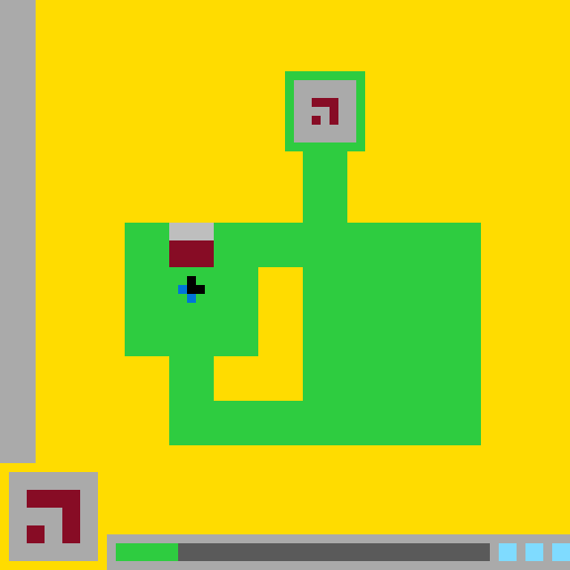

# `ls20` level `1` — LEFT / LEFT / DOWN / LEFT / UP / UP / UP / UP

## Navigation

[Level start](../../../../../../../../README.md) · [Parent](../README.md)

### Actions

[`RIGHT`](RIGHT/README.md)

---

- **Full game ID:** `ls20`
- **State:** `NOT_FINISHED`
- **Image hash:** `3aa89c287739e460`
- **Incoming action:** `ACTION1`

## Image



## Files

- [image.png](image.png)
- [state.json](state.json)
- [object_registry.pl](../../../../../../../../object_registry.pl) — shared level registry (26 canonical identities)
- [differences.pl](differences.pl)
- [objects.pl](objects.pl)
- [rules.pl](rules.pl)
- [similarities.pl](similarities.pl)
- [turtle_from_diff.pl](turtle_from_diff.pl)
- [turtle_from_image.pl](turtle_from_image.pl)

## Embedded files

*Canonical identities are shared through [`object_registry.pl`](../../../../../../../../object_registry.pl) and are not repeated in every node.*

<details>
<summary><code>state.json</code></summary>

````json
{
  "state": "NOT_FINISHED",
  "observation": {
    "game_id": "ls20-9607627b",
    "state": "NOT_FINISHED",
    "levels_completed": 0,
    "win_levels": 7,
    "action_input": {
      "id": "ACTION1",
      "data": {},
      "reasoning": null
    },
    "guid": "a992cb74-c0cd-4d3e-915e-9312cff80356",
    "full_reset": false,
    "available_actions": [
      1,
      2,
      3,
      4
    ]
  },
  "step_count": 7,
  "game_id": "ls20",
  "game_directory": "ls20",
  "level": "1",
  "image_hash": "3aa89c287739e460",
  "incoming_action": "ACTION1",
  "action_directory": "UP",
  "action_data": {},
  "parent_node": "..",
  "action_path": [
    "LEFT",
    "LEFT",
    "DOWN",
    "LEFT",
    "UP",
    "UP",
    "UP",
    "UP"
  ]
}
````

[Open `state.json`](state.json)

</details>

<details>
<summary><code>differences.pl</code></summary>

````prolog
% Observed transition from action8 to action9.

previous_state(action9, action8).
transition_action(action8, action9, action('ACTION1', {})).

% No canonical object was created or destroyed.
added_object(_Object) :-
    fail.

removed_object(_Object) :-
    fail.

% The gate and its canonical components moved upward by five pixels.
moved_object(bottom_center_gate, position(19, 30), position(19, 25), delta(0, -5)).
moved_object(gate_gray_header, position(19, 30), position(19, 25), delta(0, -5)).
moved_object(gate_burgundy_panel, position(19, 32), position(19, 27), delta(0, -5)).

changed_object(bottom_center_gate,
               bounding_box(19, 30, 5, 5),
               bounding_box(19, 25, 5, 5)).
changed_object(gate_gray_header,
               bounding_box(19, 30, 5, 2),
               bounding_box(19, 25, 5, 2)).
changed_object(gate_burgundy_panel,
               bounding_box(19, 32, 5, 3),
               bounding_box(19, 27, 5, 3)).

changed_object(bottom_center_gate,
               center(21, 32),
               center(21, 27)).
changed_object(gate_gray_header,
               center(21, 31),
               center(21, 26)).
changed_object(gate_burgundy_panel,
               center(21, 33),
               center(21, 28)).

changed_object(bottom_center_gate,
               raised_third_time,
               raised_to_main_body_top).

% The player already existed in the registry and was previously occluded.
% It is newly observed, not a newly added object.
newly_visible_object(blue_black_player).
newly_visible_object(player_black_core).
newly_visible_object(player_blue_tail).

revealed_object(blue_black_player, bottom_center_gate).
revealed_object(player_black_core, bottom_center_gate).
revealed_object(player_blue_tail, bottom_center_gate).

changed_object(blue_black_player, fully_occluded, visible).

removed_relation(occluded_by(blue_black_player, bottom_center_gate)).
removed_relation(occluded_by(player_black_core, bottom_center_gate)).
removed_relation(occluded_by(player_blue_tail, bottom_center_gate)).
removed_relation(overlays(bottom_center_gate, blue_black_player)).

added_relation(component_of(player_black_core, blue_black_player)).
added_relation(component_of(player_blue_tail, blue_black_player)).
added_relation(contains(blue_black_player, player_black_core)).
added_relation(contains(blue_black_player, player_blue_tail)).
added_relation(adjacent(player_black_core, player_blue_tail)).
added_relation(embedded_in(blue_black_player, fortress_left_wing)).
added_relation(embedded_in(blue_black_player, green_fortress)).
added_relation(overlays(blue_black_player, fortress_left_wing)).
added_relation(above(bottom_center_gate, blue_black_player)).
added_relation(below(blue_black_player, bottom_center_gate)).

% Status progress advanced by one pixel.
resized_object(green_status_block, size(6, 2), size(7, 2)).
resized_object(bottom_status_track, size(36, 2), size(35, 2)).

changed_object(green_status_block,
               bounding_box(13, 61, 6, 2),
               bounding_box(13, 61, 7, 2)).
changed_object(bottom_status_track,
               bounding_box(19, 61, 36, 2),
               bounding_box(20, 61, 35, 2)).

changed_object(green_status_block,
               lit,
               expanded_by_one_cell).

% No object changed color.
recolored_object(_Object, _OldColor, _NewColor) :-
    fail.

% Objects whose observed appearance and location remained unchanged.
unchanged_object(yellow_playfield, appearance_and_location).
unchanged_object(left_boundary_wall, appearance_and_location).
unchanged_object(green_fortress, appearance_and_location).
unchanged_object(fortress_main_body, appearance_and_location).
unchanged_object(fortress_left_wing, appearance_and_location).
unchanged_object(fortress_right_wing, appearance_and_location).
unchanged_object(fortress_lower_bridge, appearance_and_location).
unchanged_object(fortress_upper_stem, appearance_and_location).
unchanged_object(fortress_inner_courtyard, appearance_and_location).
unchanged_object(upper_chamber_frame, appearance_and_location).
unchanged_object(upper_chamber_interior, appearance_and_location).
unchanged_object(upper_burgundy_glyph, appearance_and_location).
unchanged_object(lower_left_symbol_card, appearance_and_location).
unchanged_object(lower_left_burgundy_glyph, appearance_and_location).
unchanged_object(bottom_status_panel, appearance_and_location).
unchanged_object(cyan_status_blocks, appearance_and_location).

unchanged_object(bottom_center_gate, size_and_color).
unchanged_object(gate_gray_header, size_and_color).
unchanged_object(gate_burgundy_panel, size_and_color).
unchanged_object(green_status_block, color_and_height).
unchanged_object(bottom_status_track, color_and_height).

% Directly observed effects of ACTION1.
action_effect(action('ACTION1', {}),
              moved(bottom_center_gate, delta(0, -5))).
action_effect(action('ACTION1', {}),
              revealed(blue_black_player)).
action_effect(action('ACTION1', {}),
              expanded(green_status_block, delta_size(1, 0))).
action_effect(action('ACTION1', {}),
              contracted_from_left(bottom_status_track, delta_size(-1, 0))).
action_effect(action('ACTION1', {}),
              status_progress_advanced).

observed_difference(moved_object(bottom_center_gate,
                                 position(19, 30),
                                 position(19, 25),
                                 delta(0, -5))).
observed_difference(revealed_object(blue_black_player,
                                    bottom_center_gate)).
observed_difference(resized_object(green_status_block,
                                   size(6, 2),
                                   size(7, 2))).
observed_difference(resized_object(bottom_status_track,
                                   size(36, 2),
                                   size(35, 2))).

% Hypotheses are explicitly separated from observations.
hypothesis(player_persisted_while_occluded(blue_black_player)).
hypothesis(player_position_unchanged_during_transition(blue_black_player)).
hypothesis(gate_motion_caused_reveal(bottom_center_gate,
                                     blue_black_player)).
hypothesis(status_progress_corresponds_to_action_count(green_status_block)).
````

[Open `differences.pl`](differences.pl)

</details>

<details>
<summary><code>objects.pl</code></summary>

````prolog
% Canonical object identities live in the level-wide registry.
:- ensure_loaded('../../../../../../../../object_registry.pl').

% State-specific facts for this action-tree node.
% Canonical object identities live in the level-wide registry.

% State-specific facts for this action-tree node.
% Canonical object identities live in the level-wide registry.

% State-specific facts for this action-tree node.
% Canonical object identities live in the level-wide registry.

% State-specific facts for this action-tree node.
% Canonical object identities live in the level-wide registry.

% State-specific facts for this action-tree node.
% Canonical object identities live in the level-wide registry.

% State-specific facts for this action-tree node.
% Canonical object identities live in the level-wide registry.

% State-specific facts for this action-tree node.
% Canonical object identities live in the level-wide registry.

% State-specific facts for this action-tree node.
% Canonical object identities live in the level-wide registry.

% State-specific facts for this action-tree node.
% Canonical object identities live in the level-wide registry.

% State-specific facts for this action-tree node.
% Canonical object identities live in the level-wide registry.

% State-specific facts for this action-tree node.
% Canonical object identities live in the level-wide registry.

% State-specific facts for this action-tree node.
% Canonical object identities live in the level-wide registry.

% State-specific facts for this action-tree node.
% Canonical object identities live in the level-wide registry.

% State-specific facts for this action-tree node.
% Canonical object identities live in the level-wide registry.

% State-specific facts for this action-tree node.
% Canonical object identities live in the level-wide registry.

% State-specific facts for this action-tree node.
% Canonical object identities live in the level-wide registry.

% State-specific facts for this action-tree node.
% Canonical object identities live in the level-wide registry.

% State-specific facts for this action-tree node.
% Canonical object identities live in the level-wide registry.

% State-specific facts for this action-tree node.
% Canonical object identities live in the level-wide registry.

% State-specific facts for this action-tree node.
% Canonical object identities live in the level-wide registry.

% State-specific facts for this action-tree node.
% Canonical object identities live in the level-wide registry.

% State-specific facts for this action-tree node.
% Canonical object identities live in the level-wide registry.

% State-specific facts for this action-tree node.
% Canonical object identities live in the level-wide registry.

% State-specific facts for this action-tree node.
% Canonical object identities live in the level-wide registry.

% State-specific facts for this action-tree node.
% Canonical object identities live in the level-wide registry.

% State-specific facts for this action-tree node.
% Canonical object identities live in the level-wide registry.

% State-specific facts for this action-tree node.
% Canonical object identities live in the level-wide registry.

% State-specific facts for this action-tree node.
% Canonical object identities live in the level-wide registry.

% State-specific facts for this action-tree node.
% Canonical object identities live in the level-wide registry.

% State-specific facts for this action-tree node.
% Canonical object identities live in the level-wide registry.

% State-specific facts for this action-tree node.
% Canonical object identities live in the level-wide registry.

% State-specific facts for this action-tree node.
% Canonical object identities live in the level-wide registry.

% State-specific facts for this action-tree node.
% Canonical object identities live in the level-wide registry.

% State-specific facts for this action-tree node.
% Canonical object identities live in the level-wide registry.

% State-specific facts for this action-tree node.
% Canonical object identities live in the level-wide registry.

% State-specific facts for this action-tree node.
% Canonical object identities live in the level-wide registry.

% State-specific facts for this action-tree node.
% Canonical object identities live in the level-wide registry.

% State-specific facts for this action-tree node.
% Canonical object identities live in the level-wide registry.

% State-specific facts for this action-tree node.
% Canonical object identities live in the level-wide registry.

% State-specific facts for this action-tree node.
% Canonical object identities live in the level-wide registry.

% State-specific facts for this action-tree node.
state_id(action9).
incoming_action(action9, action('ACTION1', {})).
previous_state(action9, action8).

canvas_size(64, 64).
coordinate_system(origin_top_left, x_right, y_down).
grid_cell_size_pixels(10).

visible(yellow_playfield).
visible(left_boundary_wall).
visible(green_fortress).
visible(fortress_main_body).
visible(fortress_left_wing).
visible(fortress_right_wing).
visible(fortress_lower_bridge).
visible(fortress_upper_stem).
visible(fortress_inner_courtyard).
visible(upper_chamber_frame).
visible(upper_chamber_interior).
visible(upper_burgundy_glyph).
visible(bottom_center_gate).
visible(gate_gray_header).
visible(gate_burgundy_panel).
visible(blue_black_player).
visible(player_black_core).
visible(player_blue_tail).
visible(lower_left_symbol_card).
visible(lower_left_burgundy_glyph).
visible(bottom_status_panel).
visible(bottom_status_track).
visible(green_status_block).
visible(cyan_status_blocks).

bounding_box(yellow_playfield, 0, 0, 64, 64).
bounding_box(left_boundary_wall, 0, 0, 4, 52).
bounding_box(green_fortress, 14, 8, 40, 42).
bounding_box(fortress_main_body, 14, 25, 40, 25).
bounding_box(fortress_left_wing, 14, 25, 15, 15).
bounding_box(fortress_right_wing, 34, 25, 20, 25).
bounding_box(fortress_lower_bridge, 19, 45, 35, 5).
bounding_box(fortress_upper_stem, 34, 17, 5, 8).
bounding_box(fortress_inner_courtyard, 24, 30, 10, 15).
bounding_box(upper_chamber_frame, 32, 8, 9, 9).
bounding_box(upper_chamber_interior, 33, 9, 7, 7).
bounding_box(upper_burgundy_glyph, 35, 11, 3, 3).
bounding_box(bottom_center_gate, 19, 25, 5, 5).
bounding_box(gate_gray_header, 19, 25, 5, 2).
bounding_box(gate_burgundy_panel, 19, 27, 5, 3).
bounding_box(blue_black_player, 20, 31, 3, 3).
bounding_box(player_black_core, 21, 31, 2, 2).
bounding_box(player_blue_tail, 20, 31, 2, 3).
bounding_box(lower_left_symbol_card, 1, 53, 10, 10).
bounding_box(lower_left_burgundy_glyph, 3, 55, 6, 6).
bounding_box(bottom_status_panel, 12, 60, 52, 4).
bounding_box(green_status_block, 13, 61, 7, 2).
bounding_box(bottom_status_track, 20, 61, 35, 2).
bounding_box(cyan_status_blocks, 56, 61, 8, 2).

center(green_fortress, 34, 29).
center(upper_chamber_frame, 36, 12).
center(upper_chamber_interior, 36, 12).
center(bottom_center_gate, 21, 27).
center(gate_gray_header, 21, 26).
center(gate_burgundy_panel, 21, 28).
center(blue_black_player, 21, 32).
center(player_black_core, 22, 32).
center(player_blue_tail, 21, 32).
center(lower_left_symbol_card, 5, 58).
center(green_status_block, 16, 62).
center(bottom_status_track, 37, 62).
center(cyan_status_blocks, 60, 62).

color(yellow_playfield, yellow).
color(left_boundary_wall, light_gray).
color(green_fortress, green).
color(fortress_main_body, green).
color(fortress_left_wing, green).
color(fortress_right_wing, green).
color(fortress_lower_bridge, green).
color(fortress_upper_stem, green).
color(fortress_inner_courtyard, yellow).
color(upper_chamber_frame, green).
color(upper_chamber_interior, light_gray).
color(upper_burgundy_glyph, burgundy).
colors(bottom_center_gate, [light_gray, burgundy]).
color(gate_gray_header, light_gray).
color(gate_burgundy_panel, burgundy).
colors(blue_black_player, [blue, black]).
color(player_black_core, black).
color(player_blue_tail, blue).
color(lower_left_symbol_card, light_gray).
color(lower_left_burgundy_glyph, burgundy).
color(bottom_status_panel, light_gray).
color(bottom_status_track, dark_gray).
color(green_status_block, green).
color(cyan_status_blocks, cyan).

geometry(yellow_playfield, background_with_occlusions).
geometry(left_boundary_wall, filled_vertical_rectangle).
geometry(green_fortress, connected_compound_structure).
geometry(fortress_main_body, stepped_block_region).
geometry(fortress_left_wing, filled_rectangle).
geometry(fortress_right_wing, filled_rectangle).
geometry(fortress_lower_bridge, filled_horizontal_bar).
geometry(fortress_upper_stem, filled_vertical_rectangle).
geometry(fortress_inner_courtyard, l_shaped_hole).
geometry(upper_chamber_frame, one_cell_thick_rectangular_frame).
geometry(upper_chamber_interior, filled_rectangle).
geometry(upper_burgundy_glyph, hooked_angular_glyph).
geometry(bottom_center_gate, vertically_partitioned_rectangle).
geometry(gate_gray_header, filled_horizontal_rectangle).
geometry(gate_burgundy_panel, filled_rectangle).
geometry(blue_black_player, asymmetric_two_color_marker).
geometry(player_black_core, filled_rectangular_cluster).
geometry(player_blue_tail, bent_three_cell_cluster).
geometry(lower_left_symbol_card, filled_square_panel).
geometry(lower_left_burgundy_glyph, angular_thick_glyph).
geometry(bottom_status_panel, filled_horizontal_panel).
geometry(bottom_status_track, filled_horizontal_rectangle).
geometry(green_status_block, filled_horizontal_rectangle).
geometry(cyan_status_blocks, three_separated_rectangular_blocks).

component_of(fortress_main_body, green_fortress).
component_of(fortress_left_wing, green_fortress).
component_of(fortress_right_wing, green_fortress).
component_of(fortress_lower_bridge, green_fortress).
component_of(fortress_upper_stem, green_fortress).
component_of(upper_chamber_frame, green_fortress).
component_of(gate_gray_header, bottom_center_gate).
component_of(gate_burgundy_panel, bottom_center_gate).
component_of(player_black_core, blue_black_player).
component_of(player_blue_tail, blue_black_player).
component_of(lower_left_burgundy_glyph, lower_left_symbol_card).
component_of(green_status_block, bottom_status_panel).
component_of(bottom_status_track, bottom_status_panel).
component_of(cyan_status_blocks, bottom_status_panel).

contains(green_fortress, fortress_inner_courtyard).
contains(fortress_main_body, fortress_inner_courtyard).
contains(upper_chamber_frame, upper_chamber_interior).
contains(upper_chamber_interior, upper_burgundy_glyph).
contains(blue_black_player, player_black_core).
contains(blue_black_player, player_blue_tail).
contains(lower_left_symbol_card, lower_left_burgundy_glyph).
contains(bottom_status_panel, green_status_block).
contains(bottom_status_panel, bottom_status_track).
contains(bottom_status_panel, cyan_status_blocks).

encloses(green_fortress, fortress_inner_courtyard).
encloses(upper_chamber_frame, upper_chamber_interior).

adjacent(left_boundary_wall, yellow_playfield).
adjacent(upper_chamber_frame, fortress_upper_stem).
adjacent(fortress_upper_stem, fortress_main_body).
adjacent(fortress_left_wing, fortress_inner_courtyard).
adjacent(fortress_right_wing, fortress_inner_courtyard).
adjacent(fortress_lower_bridge, fortress_inner_courtyard).
adjacent(gate_gray_header, gate_burgundy_panel).
adjacent(player_black_core, player_blue_tail).
adjacent(green_status_block, bottom_status_track).
adjacent(bottom_status_track, cyan_status_blocks).

embedded_in(bottom_center_gate, fortress_left_wing).
embedded_in(bottom_center_gate, green_fortress).
embedded_in(blue_black_player, fortress_left_wing).
embedded_in(blue_black_player, green_fortress).

overlays(bottom_center_gate, fortress_left_wing).
overlays(blue_black_player, fortress_left_wing).
overlays(upper_burgundy_glyph, upper_chamber_interior).
overlays(lower_left_burgundy_glyph, lower_left_symbol_card).
overlays(green_status_block, bottom_status_panel).
overlays(bottom_status_track, bottom_status_panel).
overlays(cyan_status_blocks, bottom_status_panel).

left_of(bottom_center_gate, fortress_inner_courtyard).
left_of(blue_black_player, fortress_inner_courtyard).
left_of(green_status_block, bottom_status_track).
left_of(bottom_status_track, cyan_status_blocks).
above(upper_chamber_frame, bottom_center_gate).
above(bottom_center_gate, blue_black_player).
above(bottom_center_gate, fortress_lower_bridge).
above(blue_black_player, fortress_lower_bridge).
below(bottom_center_gate, upper_chamber_frame).
below(blue_black_player, bottom_center_gate).
below(fortress_lower_bridge, blue_black_player).

state(green_fortress, solid).
state(fortress_inner_courtyard, empty).
state(bottom_center_gate, closed).
state(bottom_center_gate, shifted_far_left).
state(bottom_center_gate, raised_to_main_body_top).
state(blue_black_player, visible).
state(blue_black_player, stationary_below_gate).
state(bottom_status_panel, active).
state(green_status_block, lit).
state(green_status_block, expanded_by_one_cell).
state(cyan_status_blocks, three_lit_blocks).
state(action9, gate_moved_up).
state(action9, player_revealed).
state(action9, status_progress_advanced).

component_box(fortress_main_body, 14, 25, 40, 5).
component_box(fortress_main_body, 14, 30, 15, 10).
component_box(fortress_main_body, 34, 30, 20, 20).
component_box(fortress_main_body, 19, 45, 35, 5).
component_box(fortress_lower_bridge, 19, 45, 35, 5).
component_box(fortress_inner_courtyard, 29, 30, 5, 15).
component_box(fortress_inner_courtyard, 24, 40, 5, 5).
component_box(upper_burgundy_glyph, 35, 11, 3, 1).
component_box(upper_burgundy_glyph, 37, 12, 1, 2).
component_box(upper_burgundy_glyph, 35, 13, 1, 1).
component_box(player_black_core, 21, 31, 2, 2).
component_box(player_blue_tail, 20, 31, 1, 2).
component_box(player_blue_tail, 21, 33, 1, 1).
component_box(lower_left_burgundy_glyph, 3, 55, 6, 2).
component_box(lower_left_burgundy_glyph, 3, 57, 2, 4).
component_box(lower_left_burgundy_glyph, 7, 59, 2, 2).
component_box(cyan_status_blocks, 56, 61, 2, 2).
component_box(cyan_status_blocks, 59, 61, 2, 2).
component_box(cyan_status_blocks, 62, 61, 2, 2).

turtle_program(yellow_playfield,
    [penup, set_pos(0,0), setcolor(yellow), pendown, fill_rect(64,64)]).

turtle_program(left_boundary_wall,
    [penup, set_pos(0,0), setcolor(light_gray), pendown, fill_rect(4,52)]).

turtle_program(green_fortress,
    [penup, setcolor(green),
     set_pos(32,8), pendown, fill_rect(9,1),
     penup, set_pos(32,9), pendown, fill_rect(1,7),
     penup, set_pos(40,9), pendown, fill_rect(1,7),
     penup, set_pos(32,16), pendown, fill_rect(9,1),
     penup, set_pos(34,17), pendown, fill_rect(5,8),
     penup, set_pos(14,25), pendown, fill_rect(40,5),
     penup, set_pos(14,30), pendown, fill_rect(15,10),
     penup, set_pos(34,30), pendown, fill_rect(20,15),
     penup, set_pos(19,40), pendown, fill_rect(5,10),
     penup, set_pos(24,45), pendown, fill_rect(30,5)]).

turtle_program(fortress_main_body,
    [penup, setcolor(green),
     set_pos(14,25), pendown, fill_rect(40,5),
     penup, set_pos(14,30), pendown, fill_rect(15,10),
     penup, set_pos(34,30), pendown, fill_rect(20,20),
     penup, set_pos(19,40), pendown, fill_rect(5,10),
     penup, set_pos(24,45), pendown, fill_rect(30,5)]).

turtle_program(fortress_left_wing,
    [penup, set_pos(14,25), setcolor(green), pendown, fill_rect(15,15)]).

turtle_program(fortress_right_wing,
    [penup, set_pos(34,25), setcolor(green), pendown, fill_rect(20,25)]).

turtle_program(fortress_lower_bridge,
    [penup, set_pos(19,45), setcolor(green), pendown, fill_rect(35,5)]).

turtle_program(fortress_upper_stem,
    [penup, set_pos(34,17), setcolor(green), pendown, fill_rect(5,8)]).

turtle_program(fortress_inner_courtyard,
    [penup, setcolor(yellow),
     set_pos(29,30), pendown, fill_rect(5,15),
     penup, set_pos(24,40), pendown, fill_rect(5,5)]).

turtle_program(upper_chamber_frame,
    [penup, setcolor(green),
     set_pos(32,8), pendown, fill_rect(9,1),
     penup, set_pos(32,9), pendown, fill_rect(1,7),
     penup, set_pos(40,9), pendown, fill_rect(1,7),
     penup, set_pos(32,16), pendown, fill_rect(9,1)]).

turtle_program(upper_chamber_interior,
    [penup, set_pos(33,9), setcolor(light_gray), pendown, fill_rect(7,7)]).

turtle_program(upper_burgundy_glyph,
    [penup, setcolor(burgundy),
     set_pos(35,11), pendown, fill_rect(3,1),
     penup, set_pos(37,12), pendown, fill_rect(1,2),
     penup, set_pos(35,13), pendown, set_cell]).

turtle_program(bottom_center_gate,
    [penup, set_pos(19,25), setcolor(light_gray), pendown, fill_rect(5,2),
     penup, set_pos(19,27), setcolor(burgundy), pendown, fill_rect(5,3)]).

turtle_program(gate_gray_header,
    [penup, set_pos(19,25), setcolor(light_gray), pendown, fill_rect(5,2)]).

turtle_program(gate_burgundy_panel,
    [penup, set_pos(19,27), setcolor(burgundy), pendown, fill_rect(5,3)]).

turtle_program(blue_black_player,
    [penup, setcolor(blue),
     set_pos(20,31), pendown, fill_rect(1,2),
     penup, set_pos(21,33), pendown, set_cell,
     penup, set_pos(21,31), setcolor(black), pendown, fill_rect(2,2)]).

turtle_program(player_black_core,
    [penup, set_pos(21,31), setcolor(black), pendown, fill_rect(2,2)]).

turtle_program(player_blue_tail,
    [penup, setcolor(blue),
     set_pos(20,31), pendown, fill_rect(1,2),
     penup, set_pos(21,33), pendown, set_cell]).

turtle_program(lower_left_symbol_card,
    [penup, set_pos(1,53), setcolor(light_gray), pendown, fill_rect(10,10)]).

turtle_program(lower_left_burgundy_glyph,
    [penup, setcolor(burgundy),
     set_pos(3,55), pendown, fill_rect(6,2),
     penup, set_pos(3,57), pendown, fill_rect(2,4),
     penup, set_pos(7,59), pendown, fill_rect(2,2)]).

turtle_program(bottom_status_panel,
    [penup, set_pos(12,60), setcolor(light_gray), pendown, fill_rect(52,4)]).

turtle_program(green_status_block,
    [penup, set_pos(13,61), setcolor(green), pendown, fill_rect(7,2)]).

turtle_program(bottom_status_track,
    [penup, set_pos(20,61), setcolor(dark_gray), pendown, fill_rect(35,2)]).

turtle_program(cyan_status_blocks,
    [penup, setcolor(cyan),
     set_pos(56,61), pendown, fill_rect(2,2),
     penup, set_pos(59,61), pendown, fill_rect(2,2),
     penup, set_pos(62,61), pendown, fill_rect(2,2)]).
````

[Open `objects.pl`](objects.pl)

</details>

<details>
<summary><code>rules.pl</code></summary>

````prolog
evidence_reference(ev_action8_action9,
                   transition_action(action8, action9, action('ACTION1', {}))).

evidence_reference(ev_gate_translation,
                   moved_object(bottom_center_gate,
                                position(19, 30),
                                position(19, 25),
                                delta(0, -5))).

evidence_reference(ev_gate_component_translation,
                   [moved_object(gate_gray_header,
                                 position(19, 30),
                                 position(19, 25),
                                 delta(0, -5)),
                    moved_object(gate_burgundy_panel,
                                 position(19, 32),
                                 position(19, 27),
                                 delta(0, -5))]).

evidence_reference(ev_player_reveal,
                   revealed_object(blue_black_player, bottom_center_gate)).

evidence_reference(ev_player_occlusion_removed,
                   [removed_relation(occluded_by(blue_black_player,
                                                 bottom_center_gate)),
                    removed_relation(overlays(bottom_center_gate,
                                              blue_black_player))]).

evidence_reference(ev_status_advance,
                   [resized_object(green_status_block,
                                   size(6, 2),
                                   size(7, 2)),
                    resized_object(bottom_status_track,
                                   size(36, 2),
                                   size(35, 2))]).

evidence_reference(ev_no_object_lifecycle_change,
                   [no_added_object, no_removed_object]).

evidence_reference(ev_action8_status_unchanged,
                   state(action8, status_progress_unchanged)).

evidence_reference(ev_current_gate_endpoint,
                   [bounding_box(bottom_center_gate, 19, 25, 5, 5),
                    state(bottom_center_gate, raised_to_main_body_top)]).

evidence_reference(ev_current_player_position,
                   [bounding_box(blue_black_player, 20, 31, 3, 3),
                    state(blue_black_player, visible),
                    state(blue_black_player, stationary_below_gate)]).

observed_rule(action1_translated_gate_up_at_action9,
              rule(
                  conditions([
                      state_id(action9),
                      previous_state(action9, action8),
                      incoming_action(action9, action('ACTION1', {}))
                  ]),
                  effects([
                      moved(bottom_center_gate, delta(0, -5)),
                      moved(gate_gray_header, delta(0, -5)),
                      moved(gate_burgundy_panel, delta(0, -5))
                  ]),
                  evidence([
                      ev_action8_action9,
                      ev_gate_translation,
                      ev_gate_component_translation
                  ]))).

observed_rule(gate_translation_revealed_player_at_action9,
              rule(
                  conditions([
                      moved(bottom_center_gate, delta(0, -5)),
                      previously_occluded(blue_black_player,
                                          bottom_center_gate)
                  ]),
                  effects([
                      revealed(blue_black_player),
                      revealed(player_black_core),
                      revealed(player_blue_tail),
                      removed_occlusion(blue_black_player,
                                        bottom_center_gate)
                  ]),
                  evidence([
                      ev_gate_translation,
                      ev_player_reveal,
                      ev_player_occlusion_removed
                  ]))).

observed_rule(action9_advanced_status_by_one_pixel,
              rule(
                  conditions([
                      state_id(action9),
                      incoming_action(action9, action('ACTION1', {}))
                  ]),
                  effects([
                      expanded_right(green_status_block, 1),
                      contracted_from_left(bottom_status_track, 1),
                      status_progress_advanced
                  ]),
                  evidence([
                      ev_action8_action9,
                      ev_status_advance
                  ]))).

observed_rule(action9_preserved_registered_objects,
              rule(
                  conditions([
                      transition(action8, action9)
                  ]),
                  effects([
                      preserved(bottom_center_gate),
                      preserved(blue_black_player),
                      preserved(green_fortress),
                      no_object_created,
                      no_object_destroyed
                  ]),
                  evidence([
                      ev_no_object_lifecycle_change
                  ]))).

hypothetical_rule(gate_components_follow_gate_rigidly,
                  rule(
                      conditions([
                          action(action('ACTION1', {})),
                          movable(bottom_center_gate),
                          moved(bottom_center_gate, delta(DX, DY))
                      ]),
                      effects([
                          moved(gate_gray_header, delta(DX, DY)),
                          moved(gate_burgundy_panel, delta(DX, DY)),
                          preserved_relative_layout(bottom_center_gate,
                                                    gate_gray_header),
                          preserved_relative_layout(bottom_center_gate,
                                                    gate_burgundy_panel)
                      ])),
                  assessment(
                      high,
                      evidence([
                          ev_gate_translation,
                          ev_gate_component_translation
                      ]),
                      caveat(observed_on_one_transition))).

hypothetical_rule(player_persists_when_gate_occludes_it,
                  rule(
                      conditions([
                          overlaps(bottom_center_gate, blue_black_player)
                      ]),
                      effects([
                          persists(blue_black_player),
                          visually_occluded(blue_black_player,
                                            bottom_center_gate),
                          not_created_on_later_reveal(blue_black_player)
                      ])),
                  assessment(
                      high,
                      evidence([
                          ev_player_reveal,
                          ev_player_occlusion_removed,
                          ev_no_object_lifecycle_change
                      ]),
                      caveat(position_while_fully_occluded_is_inferred))).

hypothetical_rule(gate_motion_controls_player_visibility,
                  rule(
                      conditions([
                          moved(bottom_center_gate, delta(0, DY)),
                          DY < 0,
                          ceases_to_overlap(bottom_center_gate,
                                            blue_black_player)
                      ]),
                      effects([
                          visible(blue_black_player),
                          visible(player_black_core),
                          visible(player_blue_tail)
                      ])),
                  assessment(
                      medium,
                      evidence([
                          ev_gate_translation,
                          ev_player_reveal,
                          ev_player_occlusion_removed
                      ]),
                      caveat(correlation_does_not_prove_general_causation))).

hypothetical_rule(repeated_action1_may_continue_upward_step,
                  rule(
                      conditions([
                          current_state(action9),
                          next_action(action('ACTION1', {})),
                          upward_motion_permitted(bottom_center_gate)
                      ]),
                      effects([
                          predicted_bounding_box(bottom_center_gate,
                                                 19, 20, 5, 5),
                          predicted_bounding_box(gate_gray_header,
                                                 19, 20, 5, 2),
                          predicted_bounding_box(gate_burgundy_panel,
                                                 19, 22, 5, 3),
                          moved(bottom_center_gate, delta(0, -5)),
                          moved(gate_gray_header, delta(0, -5)),
                          moved(gate_burgundy_panel, delta(0, -5))
                      ])),
                  assessment(
                      low,
                      evidence([
                          ev_gate_translation,
                          ev_gate_component_translation,
                          ev_current_gate_endpoint
                      ]),
                      caveat(raised_to_main_body_top_may_be_a_motion_endpoint))).

hypothetical_rule(gate_may_stop_at_main_body_top,
                  rule(
                      conditions([
                          current_state(action9),
                          next_action(action('ACTION1', {})),
                          state(bottom_center_gate,
                                raised_to_main_body_top),
                          no_further_upward_route(bottom_center_gate)
                      ]),
                      effects([
                          unchanged_position(bottom_center_gate),
                          unchanged_position(gate_gray_header),
                          unchanged_position(gate_burgundy_panel)
                      ])),
                  assessment(
                      low,
                      evidence([
                          ev_current_gate_endpoint
                      ]),
                      caveat(competing_with_continued_upward_motion))).

hypothetical_rule(status_advance_marks_reveal_or_gate_milestone,
                  rule(
                      conditions([
                          action(action('ACTION1', {})),
                          newly_revealed(blue_black_player),
                          reached_gate_milestone(bottom_center_gate,
                                                 raised_to_main_body_top)
                      ]),
                      effects([
                          expanded_right(green_status_block, 1),
                          contracted_from_left(bottom_status_track, 1)
                      ])),
                  assessment(
                      medium,
                      evidence([
                          ev_player_reveal,
                          ev_status_advance,
                          ev_current_gate_endpoint,
                          ev_action8_status_unchanged
                      ]),
                      caveat(reveal_and_gate_milestone_coincide_in_the_observation))).

hypothetical_rule(no_new_milestone_preserves_status_progress,
                  rule(
                      conditions([
                          current_state(action9),
                          next_action(action('ACTION1', {})),
                          no_new_reveal,
                          no_new_gate_milestone
                      ]),
                      effects([
                          unchanged_size(green_status_block),
                          unchanged_size(bottom_status_track),
                          status_progress_unchanged
                      ])),
                  assessment(
                      medium,
                      evidence([
                          ev_action8_status_unchanged,
                          ev_status_advance,
                          ev_current_player_position
                      ]),
                      caveat(status_may_track_an_unobserved_action_counter))).
````

[Open `rules.pl`](rules.pl)

</details>

<details>
<summary><code>similarities.pl</code></summary>

````prolog
object_match(yellow_playfield, yellow_playfield,
             confidence(1.0, evidence([same_canonical_id, unchanged_appearance_and_location]))).
object_match(left_boundary_wall, left_boundary_wall,
             confidence(1.0, evidence([same_canonical_id, unchanged_appearance_and_location]))).
object_match(green_fortress, green_fortress,
             confidence(1.0, evidence([same_canonical_id, unchanged_appearance_and_location]))).
object_match(fortress_main_body, fortress_main_body,
             confidence(1.0, evidence([same_canonical_id, unchanged_appearance_and_location]))).
object_match(fortress_left_wing, fortress_left_wing,
             confidence(1.0, evidence([same_canonical_id, unchanged_appearance_and_location]))).
object_match(fortress_right_wing, fortress_right_wing,
             confidence(1.0, evidence([same_canonical_id, unchanged_appearance_and_location]))).
object_match(fortress_lower_bridge, fortress_lower_bridge,
             confidence(1.0, evidence([same_canonical_id, unchanged_appearance_and_location]))).
object_match(fortress_upper_stem, fortress_upper_stem,
             confidence(1.0, evidence([same_canonical_id, unchanged_appearance_and_location]))).
object_match(fortress_inner_courtyard, fortress_inner_courtyard,
             confidence(1.0, evidence([same_canonical_id, unchanged_appearance_and_location]))).
object_match(upper_chamber_frame, upper_chamber_frame,
             confidence(1.0, evidence([same_canonical_id, unchanged_appearance_and_location]))).
object_match(upper_chamber_interior, upper_chamber_interior,
             confidence(1.0, evidence([same_canonical_id, unchanged_appearance_and_location]))).
object_match(upper_burgundy_glyph, upper_burgundy_glyph,
             confidence(1.0, evidence([same_canonical_id, unchanged_appearance_and_location]))).

object_match(bottom_center_gate, bottom_center_gate,
             confidence(1.0,
                        evidence([same_canonical_id,
                                  same_size_color_and_geometry,
                                  moved_by(delta(0, -5))]))).
object_match(gate_gray_header, gate_gray_header,
             confidence(1.0,
                        evidence([same_canonical_id,
                                  same_component_role,
                                  same_size_color_and_geometry,
                                  moved_by(delta(0, -5))]))).
object_match(gate_burgundy_panel, gate_burgundy_panel,
             confidence(1.0,
                        evidence([same_canonical_id,
                                  same_component_role,
                                  same_size_color_and_geometry,
                                  moved_by(delta(0, -5))]))).

object_match(blue_black_player, blue_black_player,
             confidence(1.0,
                        evidence([same_canonical_id,
                                  persisted_while_occluded,
                                  revealed_from_behind(bottom_center_gate),
                                  changed_visibility(fully_occluded, visible)]))).
object_match(player_black_core, player_black_core,
             confidence(1.0,
                        evidence([same_canonical_id,
                                  persisted_while_occluded,
                                  revealed_from_behind(bottom_center_gate),
                                  component_of(blue_black_player)]))).
object_match(player_blue_tail, player_blue_tail,
             confidence(1.0,
                        evidence([same_canonical_id,
                                  persisted_while_occluded,
                                  revealed_from_behind(bottom_center_gate),
                                  component_of(blue_black_player)]))).

object_match(lower_left_symbol_card, lower_left_symbol_card,
             confidence(1.0, evidence([same_canonical_id, unchanged_appearance_and_location]))).
object_match(lower_left_burgundy_glyph, lower_left_burgundy_glyph,
             confidence(1.0, evidence([same_canonical_id, unchanged_appearance_and_location]))).
object_match(bottom_status_panel, bottom_status_panel,
             confidence(1.0, evidence([same_canonical_id, unchanged_appearance_and_location]))).
object_match(bottom_status_track, bottom_status_track,
             confidence(1.0,
                        evidence([same_canonical_id,
                                  same_color_and_height,
                                  contracted_from_left(delta_size(-1, 0))]))).
object_match(green_status_block, green_status_block,
             confidence(1.0,
                        evidence([same_canonical_id,
                                  same_color_and_height,
                                  expanded(delta_size(1, 0))]))).
object_match(cyan_status_blocks, cyan_status_blocks,
             confidence(1.0, evidence([same_canonical_id, unchanged_appearance_and_location]))).

unmatched_previous_object(_Object) :-
    fail.

unmatched_current_object(_Object) :-
    fail.
````

[Open `similarities.pl`](similarities.pl)

</details>

<details>
<summary><code>turtle_from_diff.pl</code></summary>

````prolog
turtle_patch(action8, action9,
    [paint(fortress_left_wing,
        [penup, set_pos(19,30), setcolor(green), pendown, fill_rect(5,5)]),
     paint(bottom_center_gate,
        [penup, set_pos(19,25), setcolor(light_gray), pendown, fill_rect(5,2),
         penup, set_pos(19,27), setcolor(burgundy), pendown, fill_rect(5,3)]),
     paint(blue_black_player,
        [penup, set_pos(20,31), setcolor(blue), pendown, fill_rect(1,2),
         penup, set_pos(21,33), pendown, set_cell,
         penup, set_pos(21,31), setcolor(black), pendown, fill_rect(2,2)]),
     paint(green_status_block,
        [penup, set_pos(19,61), setcolor(green), pendown, fill_rect(1,2)])
    ]).
````

[Open `turtle_from_diff.pl`](turtle_from_diff.pl)

</details>

<details>
<summary><code>turtle_from_image.pl</code></summary>

````prolog
:- ensure_loaded('../../../../../../../../object_registry.pl').

turtle_program(yellow_playfield,
    [penup, set_pos(0,0), setcolor(yellow), pendown, fill_rect(64,64)]).

turtle_program(left_boundary_wall,
    [penup, set_pos(0,0), setcolor(light_gray), pendown, fill_rect(4,52)]).

turtle_program(green_fortress,
    [penup, setcolor(green),
     set_pos(32,8), pendown, fill_rect(9,1),
     penup, set_pos(32,9), pendown, fill_rect(1,7),
     penup, set_pos(40,9), pendown, fill_rect(1,7),
     penup, set_pos(32,16), pendown, fill_rect(9,1),
     penup, set_pos(34,17), pendown, fill_rect(5,8),
     penup, set_pos(14,25), pendown, fill_rect(40,5),
     penup, set_pos(14,30), pendown, fill_rect(15,10),
     penup, set_pos(34,30), pendown, fill_rect(20,15),
     penup, set_pos(19,40), pendown, fill_rect(5,10),
     penup, set_pos(24,45), pendown, fill_rect(30,5)]).

turtle_program(fortress_main_body,
    [penup, setcolor(green),
     set_pos(14,25), pendown, fill_rect(40,5),
     penup, set_pos(14,30), pendown, fill_rect(15,10),
     penup, set_pos(34,30), pendown, fill_rect(20,20),
     penup, set_pos(19,40), pendown, fill_rect(5,10),
     penup, set_pos(24,45), pendown, fill_rect(30,5)]).

turtle_program(fortress_left_wing,
    [penup, set_pos(14,25), setcolor(green), pendown, fill_rect(15,15)]).

turtle_program(fortress_right_wing,
    [penup, set_pos(34,25), setcolor(green), pendown, fill_rect(20,25)]).

turtle_program(fortress_lower_bridge,
    [penup, set_pos(19,45), setcolor(green), pendown, fill_rect(35,5)]).

turtle_program(fortress_upper_stem,
    [penup, set_pos(34,17), setcolor(green), pendown, fill_rect(5,8)]).

turtle_program(fortress_inner_courtyard,
    [penup, setcolor(yellow),
     set_pos(29,30), pendown, fill_rect(5,15),
     penup, set_pos(24,40), pendown, fill_rect(5,5)]).

turtle_program(upper_chamber_frame,
    [penup, setcolor(green),
     set_pos(32,8), pendown, fill_rect(9,1),
     penup, set_pos(32,9), pendown, fill_rect(1,7),
     penup, set_pos(40,9), pendown, fill_rect(1,7),
     penup, set_pos(32,16), pendown, fill_rect(9,1)]).

turtle_program(upper_chamber_interior,
    [penup, set_pos(33,9), setcolor(light_gray), pendown, fill_rect(7,7)]).

turtle_program(upper_burgundy_glyph,
    [penup, setcolor(burgundy),
     set_pos(35,11), pendown, fill_rect(3,1),
     penup, set_pos(37,12), pendown, fill_rect(1,2),
     penup, set_pos(35,13), pendown, set_cell]).

turtle_program(bottom_center_gate,
    [penup, set_pos(19,25), setcolor(light_gray), pendown, fill_rect(5,2),
     penup, set_pos(19,27), setcolor(burgundy), pendown, fill_rect(5,3)]).

turtle_program(gate_gray_header,
    [penup, set_pos(19,25), setcolor(light_gray), pendown, fill_rect(5,2)]).

turtle_program(gate_burgundy_panel,
    [penup, set_pos(19,27), setcolor(burgundy), pendown, fill_rect(5,3)]).

turtle_program(blue_black_player,
    [penup, setcolor(blue),
     set_pos(20,31), pendown, fill_rect(1,2),
     penup, set_pos(21,33), pendown, set_cell,
     penup, set_pos(21,31), setcolor(black), pendown, fill_rect(2,2)]).

turtle_program(player_black_core,
    [penup, set_pos(21,31), setcolor(black), pendown, fill_rect(2,2)]).

turtle_program(player_blue_tail,
    [penup, setcolor(blue),
     set_pos(20,31), pendown, fill_rect(1,2),
     penup, set_pos(21,33), pendown, set_cell]).

turtle_program(lower_left_symbol_card,
    [penup, set_pos(1,53), setcolor(light_gray), pendown, fill_rect(10,10)]).

turtle_program(lower_left_burgundy_glyph,
    [penup, setcolor(burgundy),
     set_pos(3,55), pendown, fill_rect(6,2),
     penup, set_pos(3,57), pendown, fill_rect(2,4),
     penup, set_pos(7,59), pendown, fill_rect(2,2)]).

turtle_program(bottom_status_panel,
    [penup, set_pos(12,60), setcolor(light_gray), pendown, fill_rect(52,4)]).

turtle_program(green_status_block,
    [penup, set_pos(13,61), setcolor(green), pendown, fill_rect(7,2)]).

turtle_program(bottom_status_track,
    [penup, set_pos(20,61), setcolor(dark_gray), pendown, fill_rect(35,2)]).

turtle_program(cyan_status_blocks,
    [penup, setcolor(cyan),
     set_pos(56,61), pendown, fill_rect(2,2),
     penup, set_pos(59,61), pendown, fill_rect(2,2),
     penup, set_pos(62,61), pendown, fill_rect(2,2)]).
````

[Open `turtle_from_image.pl`](turtle_from_image.pl)

</details>
