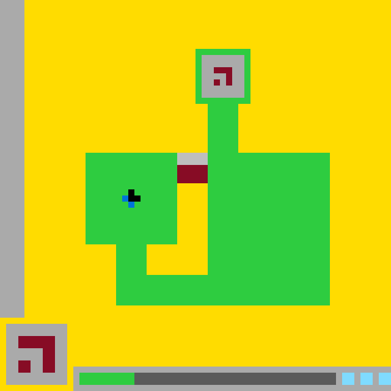

# `ls20` level `1` — LEFT / LEFT / DOWN / LEFT / UP / UP / UP / UP / RIGHT / RIGHT

- **Full game ID:** `ls20`
- **State:** `NOT_FINISHED`
- **Image hash:** `2b577505ccff9f07`
- **Incoming action:** `ACTION4`

## Navigation

- [Level start](../../../../../../../../../../README.md)
- [Parent state](../README.md)

## Image

## Files

- [state.json](state.json)
- Prolog analysis: *not generated yet*

## Actions

- [`RIGHT`](RIGHT/README.md)
