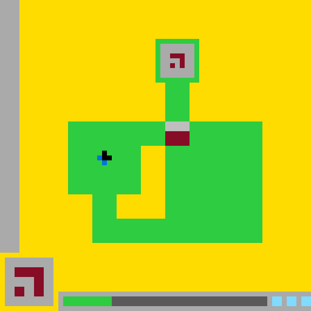

# `ls20` level `1` — LEFT / LEFT / DOWN / LEFT / UP / UP / UP / UP / RIGHT / RIGHT / RIGHT

## Navigation

[Level start](../../../../../../../../../../../README.md) · [Parent](../README.md)

### Actions

[`UP`](UP/README.md)

---

- **Full game ID:** `ls20`
- **State:** `NOT_FINISHED`
- **Image hash:** `5f2dc63c826458dd`
- **Incoming action:** `ACTION4`

## Image



## Files

- [image.png](image.png)
- [state.json](state.json)
- [object_registry.pl](../../../../../../../../../../../object_registry.pl) — shared level registry (26 canonical identities)
- [differences.pl](differences.pl)
- [objects.pl](objects.pl)
- [rules.pl](rules.pl)
- [similarities.pl](similarities.pl)
- [turtle_from_diff.pl](turtle_from_diff.pl)
- [turtle_from_image.pl](turtle_from_image.pl)

## Embedded files

*Canonical identities are shared through [`object_registry.pl`](../../../../../../../../../../../object_registry.pl) and are not repeated in every node.*

<details>
<summary><code>state.json</code></summary>

````json
{
  "state": "NOT_FINISHED",
  "observation": {
    "game_id": "ls20-9607627b",
    "state": "NOT_FINISHED",
    "levels_completed": 0,
    "win_levels": 7,
    "action_input": {
      "id": "ACTION4",
      "data": {},
      "reasoning": null
    },
    "guid": "a992cb74-c0cd-4d3e-915e-9312cff80356",
    "full_reset": false,
    "available_actions": [
      1,
      2,
      3,
      4
    ]
  },
  "step_count": 10,
  "game_id": "ls20",
  "game_directory": "ls20",
  "level": "1",
  "image_hash": "5f2dc63c826458dd",
  "incoming_action": "ACTION4",
  "action_directory": "RIGHT",
  "action_data": {},
  "parent_node": "..",
  "action_path": [
    "LEFT",
    "LEFT",
    "DOWN",
    "LEFT",
    "UP",
    "UP",
    "UP",
    "UP",
    "RIGHT",
    "RIGHT",
    "RIGHT"
  ]
}
````

[Open `state.json`](state.json)

</details>

<details>
<summary><code>differences.pl</code></summary>

````prolog
added_object(_) :-
    fail.

removed_object(_) :-
    fail.

recolored_object(_, _, _) :-
    fail.

moved_object(bottom_center_gate,
             position(29, 25),
             position(34, 25),
             delta(5, 0)).
moved_object(gate_gray_header,
             position(29, 25),
             position(34, 25),
             delta(5, 0)).
moved_object(gate_burgundy_panel,
             position(29, 27),
             position(34, 27),
             delta(5, 0)).

resized_object(player_blue_tail,
               size(2, 3),
               size(2, 2)).
resized_object(green_status_block,
               size(9, 2),
               size(10, 2)).
resized_object(bottom_status_track,
               size(33, 2),
               size(32, 2)).

changed_object(bottom_center_gate,
               bounding_box(29, 25, 5, 5),
               bounding_box(34, 25, 5, 5)).
changed_object(gate_gray_header,
               bounding_box(29, 25, 5, 2),
               bounding_box(34, 25, 5, 2)).
changed_object(gate_burgundy_panel,
               bounding_box(29, 27, 5, 3),
               bounding_box(34, 27, 5, 3)).
changed_object(player_blue_tail,
               bounding_box(20, 31, 2, 3),
               bounding_box(20, 32, 2, 2)).
changed_object(player_blue_tail,
               geometry(bent_three_cell_cluster),
               geometry(diagonal_two_cell_tail)).
changed_object(player_blue_tail,
               occupied_cells([cell(20,31), cell(20,32), cell(21,33)]),
               occupied_cells([cell(20,32), cell(21,33)])).
changed_object(green_status_block,
               bounding_box(13, 61, 9, 2),
               bounding_box(13, 61, 10, 2)).
changed_object(bottom_status_track,
               bounding_box(22, 61, 33, 2),
               bounding_box(23, 61, 32, 2)).
changed_object(bottom_center_gate,
               state(shifted_right_two_steps),
               state(shifted_right_three_steps)).
changed_object(green_status_block,
               state(expanded_by_two_cells),
               state(expanded_by_three_cells)).
changed_object(bottom_center_gate,
               separated_by_gap(blue_black_player, 6),
               separated_by_gap(blue_black_player, 11)).

removed_cell(player_blue_tail, cell(20, 31)).
added_cell(green_status_block, cell(22, 61)).
added_cell(green_status_block, cell(22, 62)).
removed_cell(bottom_status_track, cell(22, 61)).
removed_cell(bottom_status_track, cell(22, 62)).

added_relation(adjacent(fortress_upper_stem, bottom_center_gate)).
added_relation(embedded_in(bottom_center_gate, fortress_right_wing)).
added_relation(overlays(bottom_center_gate, fortress_right_wing)).
added_relation(left_of(fortress_inner_courtyard, bottom_center_gate)).
added_relation(aligned_with(bottom_center_gate, fortress_upper_stem, vertical)).
added_relation(aligned_with(bottom_center_gate, fortress_right_wing, left_edge)).
added_relation(aligned_with(green_status_block, bottom_status_track, horizontal)).

removed_relation(adjacent(bottom_center_gate, fortress_left_wing)).
removed_relation(aligned_with(bottom_center_gate,
                              fortress_inner_courtyard,
                              vertical)).
removed_relation(between(bottom_center_gate,
                         fortress_left_wing,
                         fortress_right_wing)).

unchanged_object(yellow_playfield, intrinsic_properties).
unchanged_object(left_boundary_wall, intrinsic_properties).
unchanged_object(green_fortress, intrinsic_properties).
unchanged_object(fortress_main_body, intrinsic_properties).
unchanged_object(fortress_left_wing, intrinsic_properties).
unchanged_object(fortress_right_wing, intrinsic_properties).
unchanged_object(fortress_lower_bridge, intrinsic_properties).
unchanged_object(fortress_upper_stem, intrinsic_properties).
unchanged_object(fortress_inner_courtyard, intrinsic_properties).
unchanged_object(upper_chamber_frame, intrinsic_properties).
unchanged_object(upper_chamber_interior, intrinsic_properties).
unchanged_object(upper_burgundy_glyph, intrinsic_properties).
unchanged_object(blue_black_player, bounding_box_and_center).
unchanged_object(player_black_core, intrinsic_properties).
unchanged_object(lower_left_symbol_card, intrinsic_properties).
unchanged_object(lower_left_burgundy_glyph, intrinsic_properties).
unchanged_object(bottom_status_panel, intrinsic_properties).
unchanged_object(cyan_status_blocks, intrinsic_properties).

observation(no_objects_added).
observation(no_objects_removed).
observation(no_objects_recolored).
observation(gate_translated_right_by(5)).
observation(player_black_core_stationary).
observation(player_blue_tail_lost_cell(cell(20,31))).
observation(status_progress_increased_by_one_column).
observation(all_canonical_identities_preserved).

action_effect(action('ACTION4', {}),
              observed(gate_translated(bottom_center_gate, delta(5,0)))).
action_effect(action('ACTION4', {}),
              observed(player_black_core_remained_stationary)).
action_effect(action('ACTION4', {}),
              observed(player_blue_tail_removed_cell(cell(20,31)))).
action_effect(action('ACTION4', {}),
              observed(status_progress_advanced_by_one_column)).
action_effect(action('ACTION4', {}),
              hypothesized(advances_gate_and_status_progress)).

hypothesis(action4_moves_gate_right_one_grid_step, high_confidence).
hypothesis(action4_advances_status_progress_one_column, high_confidence).
hypothesis(player_blue_tail_change_is_animation_or_occlusion, medium_confidence).
````

[Open `differences.pl`](differences.pl)

</details>

<details>
<summary><code>objects.pl</code></summary>

````prolog
% Canonical object identities live in the level-wide registry.
:- ensure_loaded('../../../../../../../../../../../object_registry.pl').

% State-specific facts for this action-tree node.
% Canonical object identities live in the level-wide registry.

% State-specific facts for this action-tree node.
% Canonical object identities live in the level-wide registry.

% State-specific facts for this action-tree node.
% Canonical object identities live in the level-wide registry.

% State-specific facts for this action-tree node.
% Canonical object identities live in the level-wide registry.

% State-specific facts for this action-tree node.
% Canonical object identities live in the level-wide registry.

% State-specific facts for this action-tree node.
% Canonical object identities live in the level-wide registry.

% State-specific facts for this action-tree node.
% Canonical object identities live in the level-wide registry.

% State-specific facts for this action-tree node.
% Canonical object identities live in the level-wide registry.

% State-specific facts for this action-tree node.
% Canonical object identities live in the level-wide registry.

% State-specific facts for this action-tree node.
% Canonical object identities live in the level-wide registry.

% State-specific facts for this action-tree node.
% Canonical object identities live in the level-wide registry.

% State-specific facts for this action-tree node.
% Canonical object identities live in the level-wide registry.

% State-specific facts for this action-tree node.
% Canonical object identities live in the level-wide registry.

% State-specific facts for this action-tree node.
% Canonical object identities live in the level-wide registry.

% State-specific facts for this action-tree node.
% Canonical object identities live in the level-wide registry.

% State-specific facts for this action-tree node.
% Canonical object identities live in the level-wide registry.

% State-specific facts for this action-tree node.
% Canonical object identities live in the level-wide registry.

% State-specific facts for this action-tree node.
% Canonical object identities live in the level-wide registry.

% State-specific facts for this action-tree node.
% Canonical object identities live in the level-wide registry.

% State-specific facts for this action-tree node.
% Canonical object identities live in the level-wide registry.

% State-specific facts for this action-tree node.
% Canonical object identities live in the level-wide registry.

% State-specific facts for this action-tree node.
% Canonical object identities live in the level-wide registry.

% State-specific facts for this action-tree node.
% Canonical object identities live in the level-wide registry.

% State-specific facts for this action-tree node.
% Canonical object identities live in the level-wide registry.

% State-specific facts for this action-tree node.
% Canonical object identities live in the level-wide registry.

% State-specific facts for this action-tree node.
% Canonical object identities live in the level-wide registry.

% State-specific facts for this action-tree node.
% Canonical object identities live in the level-wide registry.

% State-specific facts for this action-tree node.
% Canonical object identities live in the level-wide registry.

% State-specific facts for this action-tree node.
% Canonical object identities live in the level-wide registry.

% State-specific facts for this action-tree node.
% Canonical object identities live in the level-wide registry.

% State-specific facts for this action-tree node.
% Canonical object identities live in the level-wide registry.

% State-specific facts for this action-tree node.
% Canonical object identities live in the level-wide registry.

% State-specific facts for this action-tree node.
state_id(action12).
incoming_action(action12, action('ACTION4', {})).
previous_state(action12, action11).

canvas_size(64, 64).
coordinate_system(origin_top_left, x_right, y_down).
grid_cell_size_pixels(10).

visible(yellow_playfield).
visible(left_boundary_wall).
visible(green_fortress).
visible(fortress_main_body).
visible(fortress_left_wing).
visible(fortress_right_wing).
visible(fortress_lower_bridge).
visible(fortress_upper_stem).
visible(fortress_inner_courtyard).
visible(upper_chamber_frame).
visible(upper_chamber_interior).
visible(upper_burgundy_glyph).
visible(bottom_center_gate).
visible(gate_gray_header).
visible(gate_burgundy_panel).
visible(blue_black_player).
visible(player_black_core).
visible(player_blue_tail).
visible(lower_left_symbol_card).
visible(lower_left_burgundy_glyph).
visible(bottom_status_panel).
visible(bottom_status_track).
visible(green_status_block).
visible(cyan_status_blocks).

bounding_box(yellow_playfield, 0, 0, 64, 64).
bounding_box(left_boundary_wall, 0, 0, 4, 52).
bounding_box(green_fortress, 14, 8, 40, 42).
bounding_box(fortress_main_body, 14, 25, 40, 25).
bounding_box(fortress_left_wing, 14, 25, 15, 15).
bounding_box(fortress_right_wing, 34, 25, 20, 25).
bounding_box(fortress_lower_bridge, 19, 45, 35, 5).
bounding_box(fortress_upper_stem, 34, 17, 5, 8).
bounding_box(fortress_inner_courtyard, 24, 30, 10, 15).
bounding_box(upper_chamber_frame, 32, 8, 9, 9).
bounding_box(upper_chamber_interior, 33, 9, 7, 7).
bounding_box(upper_burgundy_glyph, 35, 11, 3, 3).
bounding_box(bottom_center_gate, 34, 25, 5, 5).
bounding_box(gate_gray_header, 34, 25, 5, 2).
bounding_box(gate_burgundy_panel, 34, 27, 5, 3).
bounding_box(blue_black_player, 20, 31, 3, 3).
bounding_box(player_black_core, 21, 31, 2, 2).
bounding_box(player_blue_tail, 20, 32, 2, 2).
bounding_box(lower_left_symbol_card, 1, 53, 10, 10).
bounding_box(lower_left_burgundy_glyph, 3, 55, 6, 6).
bounding_box(bottom_status_panel, 12, 60, 52, 4).
bounding_box(green_status_block, 13, 61, 10, 2).
bounding_box(bottom_status_track, 23, 61, 32, 2).
bounding_box(cyan_status_blocks, 56, 61, 8, 2).

center(green_fortress, 34, 29).
center(upper_chamber_frame, 36, 12).
center(upper_chamber_interior, 36, 12).
center(bottom_center_gate, 36, 27).
center(gate_gray_header, 36, 26).
center(gate_burgundy_panel, 36, 28).
center(blue_black_player, 21, 32).
center(player_black_core, 22, 32).
center(player_blue_tail, 21, 33).
center(lower_left_symbol_card, 5, 58).
center(lower_left_burgundy_glyph, 6, 58).
center(green_status_block, 18, 62).
center(bottom_status_track, 39, 62).
center(cyan_status_blocks, 60, 62).

color(yellow_playfield, yellow).
color(left_boundary_wall, light_gray).
color(green_fortress, green).
color(fortress_main_body, green).
color(fortress_left_wing, green).
color(fortress_right_wing, green).
color(fortress_lower_bridge, green).
color(fortress_upper_stem, green).
color(fortress_inner_courtyard, yellow).
color(upper_chamber_frame, green).
color(upper_chamber_interior, light_gray).
color(upper_burgundy_glyph, burgundy).
colors(bottom_center_gate, [light_gray, burgundy]).
color(gate_gray_header, light_gray).
color(gate_burgundy_panel, burgundy).
colors(blue_black_player, [blue, black]).
color(player_black_core, black).
color(player_blue_tail, blue).
color(lower_left_symbol_card, light_gray).
color(lower_left_burgundy_glyph, burgundy).
color(bottom_status_panel, light_gray).
color(bottom_status_track, dark_gray).
color(green_status_block, green).
color(cyan_status_blocks, cyan).

geometry(yellow_playfield, background_with_occlusions).
geometry(left_boundary_wall, filled_vertical_rectangle).
geometry(green_fortress, connected_compound_structure).
geometry(fortress_main_body, stepped_block_region).
geometry(fortress_left_wing, filled_rectangle).
geometry(fortress_right_wing, filled_rectangle).
geometry(fortress_lower_bridge, filled_horizontal_bar).
geometry(fortress_upper_stem, filled_vertical_rectangle).
geometry(fortress_inner_courtyard, l_shaped_hole).
geometry(upper_chamber_frame, one_cell_thick_rectangular_frame).
geometry(upper_chamber_interior, filled_rectangle).
geometry(upper_burgundy_glyph, hooked_angular_glyph).
geometry(bottom_center_gate, vertically_partitioned_rectangle).
geometry(gate_gray_header, filled_horizontal_rectangle).
geometry(gate_burgundy_panel, filled_rectangle).
geometry(blue_black_player, asymmetric_two_color_marker).
geometry(player_black_core, filled_rectangular_cluster).
geometry(player_blue_tail, diagonal_two_cell_tail).
geometry(lower_left_symbol_card, filled_square_panel).
geometry(lower_left_burgundy_glyph, angular_thick_glyph).
geometry(bottom_status_panel, filled_horizontal_panel).
geometry(bottom_status_track, filled_horizontal_rectangle).
geometry(green_status_block, filled_horizontal_rectangle).
geometry(cyan_status_blocks, three_separated_rectangular_blocks).

component_of(fortress_main_body, green_fortress).
component_of(fortress_left_wing, green_fortress).
component_of(fortress_right_wing, green_fortress).
component_of(fortress_lower_bridge, green_fortress).
component_of(fortress_upper_stem, green_fortress).
component_of(upper_chamber_frame, green_fortress).
component_of(gate_gray_header, bottom_center_gate).
component_of(gate_burgundy_panel, bottom_center_gate).
component_of(player_black_core, blue_black_player).
component_of(player_blue_tail, blue_black_player).
component_of(lower_left_burgundy_glyph, lower_left_symbol_card).
component_of(green_status_block, bottom_status_panel).
component_of(bottom_status_track, bottom_status_panel).
component_of(cyan_status_blocks, bottom_status_panel).

contains(green_fortress, fortress_inner_courtyard).
contains(fortress_main_body, fortress_inner_courtyard).
contains(upper_chamber_frame, upper_chamber_interior).
contains(upper_chamber_interior, upper_burgundy_glyph).
contains(blue_black_player, player_black_core).
contains(blue_black_player, player_blue_tail).
contains(lower_left_symbol_card, lower_left_burgundy_glyph).
contains(bottom_status_panel, green_status_block).
contains(bottom_status_panel, bottom_status_track).
contains(bottom_status_panel, cyan_status_blocks).

encloses(green_fortress, fortress_inner_courtyard).
encloses(upper_chamber_frame, upper_chamber_interior).

adjacent(left_boundary_wall, yellow_playfield).
adjacent(upper_chamber_frame, fortress_upper_stem).
adjacent(fortress_upper_stem, fortress_main_body).
adjacent(fortress_upper_stem, bottom_center_gate).
adjacent(fortress_left_wing, fortress_inner_courtyard).
adjacent(fortress_right_wing, fortress_inner_courtyard).
adjacent(fortress_lower_bridge, fortress_inner_courtyard).
adjacent(bottom_center_gate, fortress_inner_courtyard).
adjacent(bottom_center_gate, fortress_right_wing).
adjacent(gate_gray_header, gate_burgundy_panel).
adjacent(player_black_core, player_blue_tail).
adjacent(green_status_block, bottom_status_track).

separated_by_gap(bottom_center_gate, blue_black_player, 11).
separated_by_gap(bottom_status_track, cyan_status_blocks, 1).

embedded_in(bottom_center_gate, fortress_right_wing).
embedded_in(bottom_center_gate, fortress_main_body).
embedded_in(bottom_center_gate, green_fortress).
embedded_in(blue_black_player, fortress_left_wing).
embedded_in(blue_black_player, green_fortress).

overlays(bottom_center_gate, fortress_right_wing).
overlays(bottom_center_gate, fortress_main_body).
overlays(blue_black_player, fortress_left_wing).
overlays(upper_burgundy_glyph, upper_chamber_interior).
overlays(lower_left_burgundy_glyph, lower_left_symbol_card).
overlays(green_status_block, bottom_status_panel).
overlays(bottom_status_track, bottom_status_panel).
overlays(cyan_status_blocks, bottom_status_panel).

left_of(blue_black_player, fortress_inner_courtyard).
left_of(blue_black_player, bottom_center_gate).
left_of(fortress_inner_courtyard, bottom_center_gate).
left_of(green_status_block, bottom_status_track).
left_of(bottom_status_track, cyan_status_blocks).

above(upper_chamber_frame, bottom_center_gate).
above(bottom_center_gate, blue_black_player).
above(bottom_center_gate, fortress_lower_bridge).
above(blue_black_player, fortress_lower_bridge).
below(bottom_center_gate, upper_chamber_frame).
below(blue_black_player, bottom_center_gate).
below(fortress_lower_bridge, blue_black_player).

aligned_with(bottom_center_gate, fortress_upper_stem, vertical).
aligned_with(bottom_center_gate, fortress_right_wing, left_edge).
aligned_with(green_status_block, bottom_status_track, horizontal).

state(green_fortress, solid).
state(fortress_inner_courtyard, empty).
state(bottom_center_gate, closed).
state(bottom_center_gate, raised_to_main_body_top).
state(bottom_center_gate, shifted_right_three_steps).
state(blue_black_player, visible).
state(blue_black_player, stationary_below_and_left_of_gate).
state(player_blue_tail, two_cell_diagonal).
state(bottom_status_panel, active).
state(green_status_block, lit).
state(green_status_block, expanded_by_three_cells).
state(cyan_status_blocks, three_lit_blocks).
state(action12, gate_moved_right).
state(action12, player_stationary).
state(action12, status_progress_advanced).

component_box(fortress_main_body, 14, 25, 40, 5).
component_box(fortress_main_body, 14, 30, 15, 10).
component_box(fortress_main_body, 34, 30, 20, 20).
component_box(fortress_main_body, 19, 45, 35, 5).
component_box(fortress_lower_bridge, 19, 45, 35, 5).
component_box(fortress_inner_courtyard, 29, 30, 5, 15).
component_box(fortress_inner_courtyard, 24, 40, 5, 5).
component_box(upper_burgundy_glyph, 35, 11, 3, 1).
component_box(upper_burgundy_glyph, 37, 12, 1, 2).
component_box(upper_burgundy_glyph, 35, 13, 1, 1).
component_box(player_black_core, 21, 31, 2, 2).
component_box(player_blue_tail, 20, 32, 1, 1).
component_box(player_blue_tail, 21, 33, 1, 1).
component_box(lower_left_burgundy_glyph, 3, 55, 6, 2).
component_box(lower_left_burgundy_glyph, 7, 57, 2, 4).
component_box(lower_left_burgundy_glyph, 3, 59, 2, 2).
component_box(cyan_status_blocks, 56, 61, 2, 2).
component_box(cyan_status_blocks, 59, 61, 2, 2).
component_box(cyan_status_blocks, 62, 61, 2, 2).

turtle_program(yellow_playfield,
    [penup, set_pos(0,0), setcolor(yellow), pendown, fill_rect(64,64)]).

turtle_program(left_boundary_wall,
    [penup, set_pos(0,0), setcolor(light_gray), pendown, fill_rect(4,52)]).

turtle_program(green_fortress,
    [penup, setcolor(green),
     set_pos(32,8), pendown, fill_rect(9,1),
     penup, set_pos(32,9), pendown, fill_rect(1,7),
     penup, set_pos(40,9), pendown, fill_rect(1,7),
     penup, set_pos(32,16), pendown, fill_rect(9,1),
     penup, set_pos(34,17), pendown, fill_rect(5,8),
     penup, set_pos(14,25), pendown, fill_rect(40,5),
     penup, set_pos(14,30), pendown, fill_rect(15,10),
     penup, set_pos(34,30), pendown, fill_rect(20,15),
     penup, set_pos(19,40), pendown, fill_rect(5,10),
     penup, set_pos(24,45), pendown, fill_rect(30,5)]).

turtle_program(fortress_main_body,
    [penup, setcolor(green),
     set_pos(14,25), pendown, fill_rect(40,5),
     penup, set_pos(14,30), pendown, fill_rect(15,10),
     penup, set_pos(34,30), pendown, fill_rect(20,20),
     penup, set_pos(19,40), pendown, fill_rect(5,10),
     penup, set_pos(24,45), pendown, fill_rect(30,5)]).

turtle_program(fortress_left_wing,
    [penup, set_pos(14,25), setcolor(green), pendown, fill_rect(15,15)]).

turtle_program(fortress_right_wing,
    [penup, set_pos(34,25), setcolor(green), pendown, fill_rect(20,25)]).

turtle_program(fortress_lower_bridge,
    [penup, set_pos(19,45), setcolor(green), pendown, fill_rect(35,5)]).

turtle_program(fortress_upper_stem,
    [penup, set_pos(34,17), setcolor(green), pendown, fill_rect(5,8)]).

turtle_program(fortress_inner_courtyard,
    [penup, setcolor(yellow),
     set_pos(29,30), pendown, fill_rect(5,15),
     penup, set_pos(24,40), pendown, fill_rect(5,5)]).

turtle_program(upper_chamber_frame,
    [penup, setcolor(green),
     set_pos(32,8), pendown, fill_rect(9,1),
     penup, set_pos(32,9), pendown, fill_rect(1,7),
     penup, set_pos(40,9), pendown, fill_rect(1,7),
     penup, set_pos(32,16), pendown, fill_rect(9,1)]).

turtle_program(upper_chamber_interior,
    [penup, set_pos(33,9), setcolor(light_gray), pendown, fill_rect(7,7)]).

turtle_program(upper_burgundy_glyph,
    [penup, setcolor(burgundy),
     set_pos(35,11), pendown, fill_rect(3,1),
     penup, set_pos(37,12), pendown, fill_rect(1,2),
     penup, set_pos(35,13), pendown, set_cell]).

turtle_program(bottom_center_gate,
    [penup, set_pos(34,25), setcolor(light_gray), pendown, fill_rect(5,2),
     penup, set_pos(34,27), setcolor(burgundy), pendown, fill_rect(5,3)]).

turtle_program(gate_gray_header,
    [penup, set_pos(34,25), setcolor(light_gray), pendown, fill_rect(5,2)]).

turtle_program(gate_burgundy_panel,
    [penup, set_pos(34,27), setcolor(burgundy), pendown, fill_rect(5,3)]).

turtle_program(blue_black_player,
    [penup, setcolor(blue),
     set_pos(20,32), pendown, set_cell,
     penup, set_pos(21,33), pendown, set_cell,
     penup, set_pos(21,31), setcolor(black), pendown, fill_rect(2,2)]).

turtle_program(player_black_core,
    [penup, set_pos(21,31), setcolor(black), pendown, fill_rect(2,2)]).

turtle_program(player_blue_tail,
    [penup, setcolor(blue),
     set_pos(20,32), pendown, set_cell,
     penup, set_pos(21,33), pendown, set_cell]).

turtle_program(lower_left_symbol_card,
    [penup, set_pos(1,53), setcolor(light_gray), pendown, fill_rect(10,10)]).

turtle_program(lower_left_burgundy_glyph,
    [penup, setcolor(burgundy),
     set_pos(3,55), pendown, fill_rect(6,2),
     penup, set_pos(7,57), pendown, fill_rect(2,4),
     penup, set_pos(3,59), pendown, fill_rect(2,2)]).

turtle_program(bottom_status_panel,
    [penup, set_pos(12,60), setcolor(light_gray), pendown, fill_rect(52,4)]).

turtle_program(green_status_block,
    [penup, set_pos(13,61), setcolor(green), pendown, fill_rect(10,2)]).

turtle_program(bottom_status_track,
    [penup, set_pos(23,61), setcolor(dark_gray), pendown, fill_rect(32,2)]).

turtle_program(cyan_status_blocks,
    [penup, setcolor(cyan),
     set_pos(56,61), pendown, fill_rect(2,2),
     penup, set_pos(59,61), pendown, fill_rect(2,2),
     penup, set_pos(62,61), pendown, fill_rect(2,2)]).
````

[Open `objects.pl`](objects.pl)

</details>

<details>
<summary><code>rules.pl</code></summary>

````prolog
evidence(ev_repeated_action4_path,
         [incoming_action(action11, action('ACTION4', {})),
          incoming_action(action12, action('ACTION4', {})),
          previous_state(action12, action11)]).

evidence(ev_gate_translation,
         [moved_object(bottom_center_gate,
                       position(29,25),
                       position(34,25),
                       delta(5,0)),
          changed_object(bottom_center_gate,
                         state(shifted_right_two_steps),
                         state(shifted_right_three_steps))]).

evidence(ev_gate_component_translation,
         [moved_object(gate_gray_header,
                       position(29,25),
                       position(34,25),
                       delta(5,0)),
          moved_object(gate_burgundy_panel,
                       position(29,27),
                       position(34,27),
                       delta(5,0))]).

evidence(ev_status_progress,
         [resized_object(green_status_block,
                         size(9,2),
                         size(10,2)),
          resized_object(bottom_status_track,
                         size(33,2),
                         size(32,2)),
          added_cell(green_status_block, cell(22,61)),
          added_cell(green_status_block, cell(22,62)),
          removed_cell(bottom_status_track, cell(22,61)),
          removed_cell(bottom_status_track, cell(22,62))]).

evidence(ev_player_core_stationary,
         [unchanged_object(blue_black_player, bounding_box_and_center),
          observation(player_black_core_stationary)]).

evidence(ev_player_tail_change,
         [removed_cell(player_blue_tail, cell(20,31)),
          changed_object(player_blue_tail,
                         geometry(bent_three_cell_cluster),
                         geometry(diagonal_two_cell_tail)),
          resized_object(player_blue_tail,
                         size(2,3),
                         size(2,2))]).

evidence(ev_identity_and_palette_stability,
         [observation(no_objects_added),
          observation(no_objects_removed),
          observation(no_objects_recolored),
          observation(all_canonical_identities_preserved)]).

evidence(ev_current_gate_clearance,
         [bounding_box(bottom_center_gate,34,25,5,5),
          bounding_box(fortress_main_body,14,25,40,25),
          state(bottom_center_gate,closed),
          state(bottom_center_gate,shifted_right_three_steps)]).

evidence(ev_current_status_capacity,
         [bounding_box(green_status_block,13,61,10,2),
          bounding_box(bottom_status_track,23,61,32,2),
          adjacent(green_status_block,bottom_status_track)]).

observed_rule(
    action('ACTION4', {}),
    transition(action11,
               action12,
               translate([bottom_center_gate,
                          gate_gray_header,
                          gate_burgundy_panel],
                         delta(5,0)),
               evidence([ev_gate_translation,
                         ev_gate_component_translation]))).

observed_rule(
    action('ACTION4', {}),
    transition(action11,
               action12,
               advance_status_boundary(
                   green_status_block,
                   bottom_status_track,
                   delta(1,0)),
               evidence([ev_status_progress]))).

observed_rule(
    action('ACTION4', {}),
    transition(action11,
               action12,
               preserve_position([blue_black_player,
                                  player_black_core]),
               evidence([ev_player_core_stationary]))).

observed_rule(
    action('ACTION4', {}),
    transition(action11,
               action12,
               remove_cell(player_blue_tail,cell(20,31)),
               evidence([ev_player_tail_change]))).

observed_rule(
    action('ACTION4', {}),
    transition(action11,
               action12,
               preserve_object_set_and_colors,
               evidence([ev_identity_and_palette_stability]))).

hypothetical_rule(
    action('ACTION4', {}),
    if([state(bottom_center_gate,closed),
        state(bottom_center_gate,shifted_right_three_steps),
        next_translation_remains_within_playfield(
            bottom_center_gate,
            delta(5,0))],
       then([translate(bottom_center_gate,delta(5,0)),
             translate(gate_gray_header,delta(5,0)),
             translate(gate_burgundy_panel,delta(5,0)),
             next_bounding_box(bottom_center_gate,39,25,5,5),
             next_bounding_box(gate_gray_header,39,25,5,2),
             next_bounding_box(gate_burgundy_panel,39,27,5,3),
             next_state(bottom_center_gate,
                        shifted_right_four_steps)])),
    support(high_confidence,
            [ev_repeated_action4_path,
             ev_gate_translation,
             ev_gate_component_translation,
             ev_current_gate_clearance])).

hypothetical_rule(
    action('ACTION4', {}),
    if([adjacent(green_status_block,bottom_status_track),
        width_remaining(bottom_status_track,positive)],
       then([expand_right(green_status_block,1),
             shrink_from_left(bottom_status_track,1),
             next_bounding_box(green_status_block,13,61,11,2),
             next_bounding_box(bottom_status_track,24,61,31,2)])),
    support(high_confidence,
            [ev_repeated_action4_path,
             ev_status_progress,
             ev_current_status_capacity])).

hypothetical_rule(
    action('ACTION4', {}),
    if([visible(blue_black_player),
        visible(player_black_core)],
       then([preserve_position(blue_black_player),
             preserve_position(player_black_core)])),
    support(medium_high_confidence,
            [ev_player_core_stationary,
             ev_repeated_action4_path])).

hypothetical_rule(
    action('ACTION4', {}),
    if([visible(player_blue_tail)],
       then([allow_animation_or_occlusion_change(player_blue_tail),
             do_not_infer_player_translation_from_tail_only])),
    support(medium_confidence,
            [ev_player_tail_change,
             ev_player_core_stationary])).

hypothetical_rule(
    action('ACTION4', {}),
    if([all_current_objects_retain_intrinsic_identity],
       then([preserve_object_set,
             preserve_canonical_object_identities,
             preserve_object_colors])),
    support(medium_confidence,
            [ev_identity_and_palette_stability])).
````

[Open `rules.pl`](rules.pl)

</details>

<details>
<summary><code>similarities.pl</code></summary>

````prolog
state_pair(action11, action12).

object_match(yellow_playfield, yellow_playfield,
             [confidence(1.0), evidence([same_canonical_id, same_bounding_box, same_color, same_geometry])]).
object_match(left_boundary_wall, left_boundary_wall,
             [confidence(1.0), evidence([same_canonical_id, same_bounding_box, same_color, same_geometry])]).
object_match(green_fortress, green_fortress,
             [confidence(1.0), evidence([same_canonical_id, same_bounding_box, same_structure])]).
object_match(fortress_main_body, fortress_main_body,
             [confidence(1.0), evidence([same_canonical_id, same_bounding_box, same_geometry])]).
object_match(fortress_left_wing, fortress_left_wing,
             [confidence(1.0), evidence([same_canonical_id, same_bounding_box, same_geometry])]).
object_match(fortress_right_wing, fortress_right_wing,
             [confidence(1.0), evidence([same_canonical_id, same_bounding_box, same_geometry])]).
object_match(fortress_lower_bridge, fortress_lower_bridge,
             [confidence(1.0), evidence([same_canonical_id, same_bounding_box, same_geometry])]).
object_match(fortress_upper_stem, fortress_upper_stem,
             [confidence(1.0), evidence([same_canonical_id, same_bounding_box, same_geometry])]).
object_match(fortress_inner_courtyard, fortress_inner_courtyard,
             [confidence(1.0), evidence([same_canonical_id, same_bounding_box, same_geometry])]).
object_match(upper_chamber_frame, upper_chamber_frame,
             [confidence(1.0), evidence([same_canonical_id, same_bounding_box, same_geometry])]).
object_match(upper_chamber_interior, upper_chamber_interior,
             [confidence(1.0), evidence([same_canonical_id, same_bounding_box, same_color])]).
object_match(upper_burgundy_glyph, upper_burgundy_glyph,
             [confidence(1.0), evidence([same_canonical_id, same_bounding_box, same_glyph])]).
object_match(bottom_center_gate, bottom_center_gate,
             [confidence(1.0), evidence([same_canonical_id, same_size, same_colors, translated_by(5, 0), same_components])]).
object_match(gate_gray_header, gate_gray_header,
             [confidence(1.0), evidence([same_canonical_id, same_size, same_color, translated_by(5, 0), same_parent])]).
object_match(gate_burgundy_panel, gate_burgundy_panel,
             [confidence(1.0), evidence([same_canonical_id, same_size, same_color, translated_by(5, 0), same_parent])]).
object_match(blue_black_player, blue_black_player,
             [confidence(1.0), evidence([same_canonical_id, same_bounding_box, same_center, same_colors, same_role])]).
object_match(player_black_core, player_black_core,
             [confidence(1.0), evidence([same_canonical_id, same_bounding_box, same_color, same_parent])]).
object_match(player_blue_tail, player_blue_tail,
             [confidence(0.99), evidence([same_canonical_id, same_color, same_parent, retained_cells([cell(20,32), cell(21,33)]), animation_or_occlusion_change])]).
object_match(lower_left_symbol_card, lower_left_symbol_card,
             [confidence(1.0), evidence([same_canonical_id, same_bounding_box, same_color, same_contents])]).
object_match(lower_left_burgundy_glyph, lower_left_burgundy_glyph,
             [confidence(1.0), evidence([same_canonical_id, same_bounding_box, same_color, same_parent])]).
object_match(bottom_status_panel, bottom_status_panel,
             [confidence(1.0), evidence([same_canonical_id, same_bounding_box, same_color, same_components])]).
object_match(bottom_status_track, bottom_status_track,
             [confidence(1.0), evidence([same_canonical_id, same_color, same_parent, progress_boundary_shifted_right_by(1)])]).
object_match(green_status_block, green_status_block,
             [confidence(1.0), evidence([same_canonical_id, same_color, same_parent, expanded_right_by(1)])]).
object_match(cyan_status_blocks, cyan_status_blocks,
             [confidence(1.0), evidence([same_canonical_id, same_bounding_box, same_color, same_geometry])]).

unmatched_objects(previous, []).
unmatched_objects(current, []).
````

[Open `similarities.pl`](similarities.pl)

</details>

<details>
<summary><code>turtle_from_diff.pl</code></summary>

````prolog
turtle_patch(action11, action12, action('ACTION4', {}),
    [turtle_op(reveal, bottom_center_gate, over(fortress_main_body),
         [penup, set_pos(29,25), setcolor(green), pendown, fill_rect(5,5)]),
     turtle_op(redraw, bottom_center_gate,
         components([gate_gray_header, gate_burgundy_panel]),
         [penup, set_pos(34,25), setcolor(light_gray), pendown, fill_rect(5,2),
          penup, set_pos(34,27), setcolor(burgundy), pendown, fill_rect(5,3)]),
     turtle_op(reveal, player_blue_tail, over(fortress_left_wing),
         [penup, set_pos(20,31), setcolor(green), pendown, set_cell]),
     turtle_op(transfer_column, bottom_status_track, to(green_status_block),
         [penup, set_pos(22,61), setcolor(green), pendown, fill_rect(1,2)])
    ]).
````

[Open `turtle_from_diff.pl`](turtle_from_diff.pl)

</details>

<details>
<summary><code>turtle_from_image.pl</code></summary>

````prolog
object_identity(blue_black_player, player_marker, 'Small blue-and-black player marker').
object_identity(bottom_center_gate, compound_rectangle, 'Two-color gate embedded at the bottom center of the fortress').
object_identity(bottom_status_panel, interface_panel, 'Gray status panel along the bottom edge').
object_identity(bottom_status_track, horizontal_bar, 'Long dark status track inside the bottom panel').
object_identity(cyan_status_blocks, block_cluster, 'Three cyan status blocks at the right end of the bottom panel').
object_identity(fortress_inner_courtyard, enclosed_hole, 'L-shaped yellow courtyard enclosed by the fortress').
object_identity(fortress_left_wing, rectangular_block, 'Left green wing').
object_identity(fortress_lower_bridge, horizontal_bar, 'Lower green connecting bridge').
object_identity(fortress_main_body, block_region, 'Main green body of the fortress').
object_identity(fortress_right_wing, rectangular_block, 'Right green wing').
object_identity(fortress_upper_stem, vertical_bar, 'Green stem connecting the main body to the upper chamber').
object_identity(gate_burgundy_panel, rectangular_block, 'Burgundy lower panel of the bottom-center gate').
object_identity(gate_gray_header, horizontal_bar, 'Gray header of the bottom-center gate').
object_identity(green_fortress, compound_block_structure, 'Large green fortress-like structure').
object_identity(green_status_block, rectangular_block, 'Green status block at the left end of the bottom status track').
object_identity(left_boundary_wall, vertical_bar, 'Left gray boundary wall').
object_identity(lower_left_burgundy_glyph, compound_glyph, 'Burgundy angular glyph on the lower-left card').
object_identity(lower_left_symbol_card, rectangular_panel, 'Gray symbol card near the lower-left corner').
object_identity(player_black_core, pixel_cluster, 'Black core of the player marker').
object_identity(player_blue_tail, pixel_cluster, 'Blue lower-left portion of the player marker').
object_identity(upper_burgundy_glyph, compound_glyph, 'Burgundy hooked glyph inside the upper chamber').
object_identity(upper_chamber_frame, rectangular_frame, 'Green frame around the upper chamber').
object_identity(upper_chamber_interior, enclosed_rectangle, 'Gray interior of the upper chamber').
object_identity(yellow_playfield, background_region, 'Yellow playfield').

turtle_program(yellow_playfield,
    [penup, set_pos(0,0), setcolor(yellow), pendown, fill_rect(64,64)]).

turtle_program(left_boundary_wall,
    [penup, set_pos(0,0), setcolor(light_gray), pendown, fill_rect(4,52)]).

turtle_program(green_fortress,
    [penup, setcolor(green),
     set_pos(32,8), pendown, fill_rect(9,1),
     penup, set_pos(32,9), pendown, fill_rect(1,7),
     penup, set_pos(40,9), pendown, fill_rect(1,7),
     penup, set_pos(32,16), pendown, fill_rect(9,1),
     penup, set_pos(34,17), pendown, fill_rect(5,8),
     penup, set_pos(14,25), pendown, fill_rect(40,5),
     penup, set_pos(14,30), pendown, fill_rect(15,10),
     penup, set_pos(34,30), pendown, fill_rect(20,15),
     penup, set_pos(19,40), pendown, fill_rect(5,10),
     penup, set_pos(24,45), pendown, fill_rect(30,5)]).

turtle_program(fortress_main_body,
    [penup, setcolor(green),
     set_pos(14,25), pendown, fill_rect(40,5),
     penup, set_pos(14,30), pendown, fill_rect(15,10),
     penup, set_pos(34,30), pendown, fill_rect(20,20),
     penup, set_pos(19,40), pendown, fill_rect(5,10),
     penup, set_pos(24,45), pendown, fill_rect(30,5)]).

turtle_program(fortress_left_wing,
    [penup, set_pos(14,25), setcolor(green), pendown, fill_rect(15,15)]).

turtle_program(fortress_right_wing,
    [penup, set_pos(34,25), setcolor(green), pendown, fill_rect(20,25)]).

turtle_program(fortress_lower_bridge,
    [penup, set_pos(19,45), setcolor(green), pendown, fill_rect(35,5)]).

turtle_program(fortress_upper_stem,
    [penup, set_pos(34,17), setcolor(green), pendown, fill_rect(5,8)]).

turtle_program(fortress_inner_courtyard,
    [penup, setcolor(yellow),
     set_pos(29,30), pendown, fill_rect(5,15),
     penup, set_pos(24,40), pendown, fill_rect(5,5)]).

turtle_program(upper_chamber_frame,
    [penup, setcolor(green),
     set_pos(32,8), pendown, fill_rect(9,1),
     penup, set_pos(32,9), pendown, fill_rect(1,7),
     penup, set_pos(40,9), pendown, fill_rect(1,7),
     penup, set_pos(32,16), pendown, fill_rect(9,1)]).

turtle_program(upper_chamber_interior,
    [penup, set_pos(33,9), setcolor(light_gray), pendown, fill_rect(7,7)]).

turtle_program(upper_burgundy_glyph,
    [penup, setcolor(burgundy),
     set_pos(35,11), pendown, fill_rect(3,1),
     penup, set_pos(37,12), pendown, fill_rect(1,2),
     penup, set_pos(35,13), pendown, set_cell]).

turtle_program(bottom_center_gate,
    [penup, set_pos(34,25), setcolor(light_gray), pendown, fill_rect(5,2),
     penup, set_pos(34,27), setcolor(burgundy), pendown, fill_rect(5,3)]).

turtle_program(gate_gray_header,
    [penup, set_pos(34,25), setcolor(light_gray), pendown, fill_rect(5,2)]).

turtle_program(gate_burgundy_panel,
    [penup, set_pos(34,27), setcolor(burgundy), pendown, fill_rect(5,3)]).

turtle_program(blue_black_player,
    [penup, setcolor(blue),
     set_pos(20,32), pendown, set_cell,
     penup, set_pos(21,33), pendown, set_cell,
     penup, set_pos(21,31), setcolor(black), pendown, fill_rect(2,2)]).

turtle_program(player_black_core,
    [penup, set_pos(21,31), setcolor(black), pendown, fill_rect(2,2)]).

turtle_program(player_blue_tail,
    [penup, setcolor(blue),
     set_pos(20,32), pendown, set_cell,
     penup, set_pos(21,33), pendown, set_cell]).

turtle_program(lower_left_symbol_card,
    [penup, set_pos(1,53), setcolor(light_gray), pendown, fill_rect(10,10)]).

turtle_program(lower_left_burgundy_glyph,
    [penup, setcolor(burgundy),
     set_pos(3,55), pendown, fill_rect(6,2),
     penup, set_pos(7,57), pendown, fill_rect(2,4),
     penup, set_pos(3,59), pendown, fill_rect(2,2)]).

turtle_program(bottom_status_panel,
    [penup, set_pos(12,60), setcolor(light_gray), pendown, fill_rect(52,4)]).

turtle_program(green_status_block,
    [penup, set_pos(13,61), setcolor(green), pendown, fill_rect(10,2)]).

turtle_program(bottom_status_track,
    [penup, set_pos(23,61), setcolor(dark_gray), pendown, fill_rect(32,2)]).

turtle_program(cyan_status_blocks,
    [penup, setcolor(cyan),
     set_pos(56,61), pendown, fill_rect(2,2),
     penup, set_pos(59,61), pendown, fill_rect(2,2),
     penup, set_pos(62,61), pendown, fill_rect(2,2)]).
````

[Open `turtle_from_image.pl`](turtle_from_image.pl)

</details>
