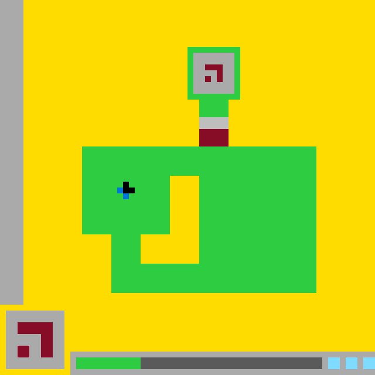

# `ls20` level `1` — LEFT / LEFT / DOWN / LEFT / UP / UP / UP / UP / RIGHT / RIGHT / RIGHT / UP

## Navigation

[Level start](../../../../../../../../../../../../README.md) · [Parent](../README.md)

### Actions

[`UP`](UP/README.md)

---

- **Full game ID:** `ls20`
- **State:** `NOT_FINISHED`
- **Image hash:** `cddc824959a7f509`
- **Incoming action:** `ACTION1`

## Image



## Files

- [image.png](image.png)
- [state.json](state.json)
- [object_registry.pl](../../../../../../../../../../../../object_registry.pl) — shared level registry (26 canonical identities)
- [differences.pl](differences.pl)
- [objects.pl](objects.pl)
- [rules.pl](rules.pl)
- [similarities.pl](similarities.pl)
- [turtle_from_diff.pl](turtle_from_diff.pl)
- [turtle_from_image.pl](turtle_from_image.pl)

## Embedded files

*Canonical identities are shared through [`object_registry.pl`](../../../../../../../../../../../../object_registry.pl) and are not repeated in every node.*

<details>
<summary><code>state.json</code></summary>

````json
{
  "state": "NOT_FINISHED",
  "observation": {
    "game_id": "ls20-9607627b",
    "state": "NOT_FINISHED",
    "levels_completed": 0,
    "win_levels": 7,
    "action_input": {
      "id": "ACTION1",
      "data": {},
      "reasoning": null
    },
    "guid": "a992cb74-c0cd-4d3e-915e-9312cff80356",
    "full_reset": false,
    "available_actions": [
      1,
      2,
      3,
      4
    ]
  },
  "step_count": 11,
  "game_id": "ls20",
  "game_directory": "ls20",
  "level": "1",
  "image_hash": "cddc824959a7f509",
  "incoming_action": "ACTION1",
  "action_directory": "UP",
  "action_data": {},
  "parent_node": "..",
  "action_path": [
    "LEFT",
    "LEFT",
    "DOWN",
    "LEFT",
    "UP",
    "UP",
    "UP",
    "UP",
    "RIGHT",
    "RIGHT",
    "RIGHT",
    "UP"
  ]
}
````

[Open `state.json`](state.json)

</details>

<details>
<summary><code>differences.pl</code></summary>

````prolog
:- discontiguous changed_object/3.
:- discontiguous action_effect/2.

transition(action12, action13, action('ACTION1', {})).

added_object(_) :-
    fail.

removed_object(_) :-
    fail.

recolored_object(_, _, _) :-
    fail.

moved_object(bottom_center_gate, point(34, 25), point(34, 20), delta(0, -5)).
moved_object(gate_gray_header, point(34, 25), point(34, 20), delta(0, -5)).
moved_object(gate_burgundy_panel, point(34, 27), point(34, 22), delta(0, -5)).
moved_object(bottom_status_track, point(23, 61), point(24, 61), delta(1, 0)).

resized_object(fortress_upper_stem, size(5, 8), size(5, 3)).
resized_object(green_status_block, size(10, 2), size(11, 2)).
resized_object(bottom_status_track, size(32, 2), size(31, 2)).

changed_object(bottom_center_gate,
               bounding_box(34, 25, 5, 5),
               bounding_box(34, 20, 5, 5)).
changed_object(gate_gray_header,
               bounding_box(34, 25, 5, 2),
               bounding_box(34, 20, 5, 2)).
changed_object(gate_burgundy_panel,
               bounding_box(34, 27, 5, 3),
               bounding_box(34, 22, 5, 3)).
changed_object(fortress_upper_stem,
               bounding_box(34, 17, 5, 8),
               bounding_box(34, 17, 5, 3)).
changed_object(fortress_upper_stem,
               geometry(filled_vertical_rectangle),
               geometry(visible_vertical_bar_segment)).
changed_object(green_status_block,
               bounding_box(13, 61, 10, 2),
               bounding_box(13, 61, 11, 2)).
changed_object(bottom_status_track,
               bounding_box(23, 61, 32, 2),
               bounding_box(24, 61, 31, 2)).
changed_object(bottom_center_gate,
               state(raised_to_main_body_top),
               state(raised_into_upper_stem)).
changed_object(bottom_center_gate,
               state(shifted_right_three_steps),
               state(shifted_up_one_step)).
changed_object(green_status_block,
               state(expanded_by_three_cells),
               state(expanded_by_four_cells)).

added_relation(contains(bottom_center_gate, gate_gray_header)).
added_relation(contains(bottom_center_gate, gate_burgundy_panel)).
added_relation(adjacent(bottom_center_gate, fortress_main_body)).
added_relation(embedded_in(bottom_center_gate, fortress_upper_stem)).
added_relation(overlays(bottom_center_gate, fortress_upper_stem)).
added_relation(above(fortress_upper_stem, bottom_center_gate)).
added_relation(above(bottom_center_gate, fortress_main_body)).
added_relation(below(bottom_center_gate, fortress_upper_stem)).

removed_relation(adjacent(fortress_upper_stem, fortress_main_body)).
removed_relation(adjacent(bottom_center_gate, fortress_inner_courtyard)).
removed_relation(embedded_in(bottom_center_gate, fortress_right_wing)).
removed_relation(embedded_in(bottom_center_gate, fortress_main_body)).
removed_relation(overlays(bottom_center_gate, fortress_right_wing)).
removed_relation(overlays(bottom_center_gate, fortress_main_body)).

unchanged_object(yellow_playfield,
                 [visibility, bounding_box, color, geometry]).
unchanged_object(left_boundary_wall,
                 [visibility, bounding_box, color, geometry]).
unchanged_object(green_fortress,
                 [visibility, bounding_box, center, color, geometry]).
unchanged_object(fortress_main_body,
                 [visibility, bounding_box, color, geometry]).
unchanged_object(fortress_left_wing,
                 [visibility, bounding_box, color, geometry]).
unchanged_object(fortress_right_wing,
                 [visibility, bounding_box, color, geometry]).
unchanged_object(fortress_lower_bridge,
                 [visibility, bounding_box, color, geometry]).
unchanged_object(fortress_inner_courtyard,
                 [visibility, bounding_box, color, geometry]).
unchanged_object(upper_chamber_frame,
                 [visibility, bounding_box, center, color, geometry]).
unchanged_object(upper_chamber_interior,
                 [visibility, bounding_box, center, color, geometry]).
unchanged_object(upper_burgundy_glyph,
                 [visibility, bounding_box, color, geometry]).
unchanged_object(blue_black_player,
                 [visibility, bounding_box, center, colors, geometry]).
unchanged_object(player_black_core,
                 [visibility, bounding_box, center, color, geometry]).
unchanged_object(player_blue_tail,
                 [visibility, bounding_box, center, color, geometry]).
unchanged_object(lower_left_symbol_card,
                 [visibility, bounding_box, center, color, geometry]).
unchanged_object(lower_left_burgundy_glyph,
                 [visibility, bounding_box, center, color, geometry]).
unchanged_object(bottom_status_panel,
                 [visibility, bounding_box, color, geometry]).
unchanged_object(cyan_status_blocks,
                 [visibility, bounding_box, center, color, geometry]).

observed_difference(moved_object(bottom_center_gate,
                                 point(34, 25),
                                 point(34, 20),
                                 delta(0, -5))).
observed_difference(resized_object(fortress_upper_stem,
                                   size(5, 8),
                                   size(5, 3))).
observed_difference(resized_object(green_status_block,
                                   size(10, 2),
                                   size(11, 2))).
observed_difference(resized_object(bottom_status_track,
                                   size(32, 2),
                                   size(31, 2))).
observed_difference(player_stationary(blue_black_player)).
observed_difference(no_object_additions).
observed_difference(no_object_removals).
observed_difference(no_recoloring).

action_effect(action('ACTION1', {}),
              gate_translation(bottom_center_gate, delta(0, -5))).
action_effect(action('ACTION1', {}),
              status_progress(green_status_block, delta_width(1))).
action_effect(action('ACTION1', {}),
              status_track_consumed(bottom_status_track, delta_width(-1))).
action_effect(action('ACTION1', {}),
              player_stationary(blue_black_player)).

hypothesis(action_effect(action('ACTION1', {}),
                         gate_translation(bottom_center_gate, delta(0, -5)))).
hypothesis(action_effect(action('ACTION1', {}),
                         status_progress(green_status_block, delta_width(1)))).
hypothesis(action_effect(action('ACTION1', {}),
                         status_track_consumed(bottom_status_track,
                                               delta_width(-1)))).

observation_status(moved_object(bottom_center_gate,
                                point(34, 25),
                                point(34, 20),
                                delta(0, -5)),
                   observed).
observation_status(resized_object(fortress_upper_stem,
                                  size(5, 8),
                                  size(5, 3)),
                   observed).
observation_status(action_effect(action('ACTION1', {}),
                                 gate_translation(bottom_center_gate,
                                                  delta(0, -5))),
                   hypothesized).
observation_status(action_effect(action('ACTION1', {}),
                                 status_progress(green_status_block,
                                                 delta_width(1))),
                   hypothesized).
````

[Open `differences.pl`](differences.pl)

</details>

<details>
<summary><code>objects.pl</code></summary>

````prolog
% Canonical object identities live in the level-wide registry.
:- ensure_loaded('../../../../../../../../../../../../object_registry.pl').

% State-specific facts for this action-tree node.
% Canonical object identities live in the level-wide registry.

% State-specific facts for this action-tree node.
% Canonical object identities live in the level-wide registry.

% State-specific facts for this action-tree node.
% Canonical object identities live in the level-wide registry.

% State-specific facts for this action-tree node.
% Canonical object identities live in the level-wide registry.

% State-specific facts for this action-tree node.
% Canonical object identities live in the level-wide registry.

% State-specific facts for this action-tree node.
% Canonical object identities live in the level-wide registry.

% State-specific facts for this action-tree node.
% Canonical object identities live in the level-wide registry.

% State-specific facts for this action-tree node.
% Canonical object identities live in the level-wide registry.

% State-specific facts for this action-tree node.
% Canonical object identities live in the level-wide registry.

% State-specific facts for this action-tree node.
% Canonical object identities live in the level-wide registry.

% State-specific facts for this action-tree node.
% Canonical object identities live in the level-wide registry.

% State-specific facts for this action-tree node.
% Canonical object identities live in the level-wide registry.

% State-specific facts for this action-tree node.
% Canonical object identities live in the level-wide registry.

% State-specific facts for this action-tree node.
% Canonical object identities live in the level-wide registry.

% State-specific facts for this action-tree node.
% Canonical object identities live in the level-wide registry.

% State-specific facts for this action-tree node.
% Canonical object identities live in the level-wide registry.

% State-specific facts for this action-tree node.
% Canonical object identities live in the level-wide registry.

% State-specific facts for this action-tree node.
% Canonical object identities live in the level-wide registry.

% State-specific facts for this action-tree node.
% Canonical object identities live in the level-wide registry.

% State-specific facts for this action-tree node.
% Canonical object identities live in the level-wide registry.

% State-specific facts for this action-tree node.
% Canonical object identities live in the level-wide registry.

% State-specific facts for this action-tree node.
% Canonical object identities live in the level-wide registry.

% State-specific facts for this action-tree node.
% Canonical object identities live in the level-wide registry.

% State-specific facts for this action-tree node.
state_id(action13).
incoming_action(action13, action('ACTION1', {})).
previous_state(action13, action12).

canvas_size(64, 64).
coordinate_system(origin_top_left, x_right, y_down).
grid_cell_size_pixels(10).

visible(yellow_playfield).
visible(left_boundary_wall).
visible(green_fortress).
visible(fortress_main_body).
visible(fortress_left_wing).
visible(fortress_right_wing).
visible(fortress_lower_bridge).
visible(fortress_upper_stem).
visible(fortress_inner_courtyard).
visible(upper_chamber_frame).
visible(upper_chamber_interior).
visible(upper_burgundy_glyph).
visible(bottom_center_gate).
visible(gate_gray_header).
visible(gate_burgundy_panel).
visible(blue_black_player).
visible(player_black_core).
visible(player_blue_tail).
visible(lower_left_symbol_card).
visible(lower_left_burgundy_glyph).
visible(bottom_status_panel).
visible(bottom_status_track).
visible(green_status_block).
visible(cyan_status_blocks).

bounding_box(yellow_playfield, 0, 0, 64, 64).
bounding_box(left_boundary_wall, 0, 0, 4, 52).
bounding_box(green_fortress, 14, 8, 40, 42).
bounding_box(fortress_main_body, 14, 25, 40, 25).
bounding_box(fortress_left_wing, 14, 25, 15, 15).
bounding_box(fortress_right_wing, 34, 25, 20, 25).
bounding_box(fortress_lower_bridge, 19, 45, 35, 5).
bounding_box(fortress_upper_stem, 34, 17, 5, 3).
bounding_box(fortress_inner_courtyard, 24, 30, 10, 15).
bounding_box(upper_chamber_frame, 32, 8, 9, 9).
bounding_box(upper_chamber_interior, 33, 9, 7, 7).
bounding_box(upper_burgundy_glyph, 35, 11, 3, 3).
bounding_box(bottom_center_gate, 34, 20, 5, 5).
bounding_box(gate_gray_header, 34, 20, 5, 2).
bounding_box(gate_burgundy_panel, 34, 22, 5, 3).
bounding_box(blue_black_player, 20, 31, 3, 3).
bounding_box(player_black_core, 21, 31, 2, 2).
bounding_box(player_blue_tail, 20, 32, 2, 2).
bounding_box(lower_left_symbol_card, 1, 53, 10, 10).
bounding_box(lower_left_burgundy_glyph, 3, 55, 6, 6).
bounding_box(bottom_status_panel, 12, 60, 52, 4).
bounding_box(green_status_block, 13, 61, 11, 2).
bounding_box(bottom_status_track, 24, 61, 31, 2).
bounding_box(cyan_status_blocks, 56, 61, 8, 2).

center(green_fortress, 34, 29).
center(fortress_main_body, 34, 37).
center(fortress_left_wing, 21, 32).
center(fortress_right_wing, 44, 37).
center(fortress_lower_bridge, 36, 47).
center(fortress_upper_stem, 36, 18).
center(fortress_inner_courtyard, 29, 37).
center(upper_chamber_frame, 36, 12).
center(upper_chamber_interior, 36, 12).
center(upper_burgundy_glyph, 36, 12).
center(bottom_center_gate, 36, 22).
center(gate_gray_header, 36, 21).
center(gate_burgundy_panel, 36, 23).
center(blue_black_player, 21, 32).
center(player_black_core, 22, 32).
center(player_blue_tail, 21, 33).
center(lower_left_symbol_card, 5, 58).
center(lower_left_burgundy_glyph, 6, 58).
center(bottom_status_panel, 38, 62).
center(green_status_block, 18, 62).
center(bottom_status_track, 39, 62).
center(cyan_status_blocks, 60, 62).

color(yellow_playfield, yellow).
color(left_boundary_wall, light_gray).
color(green_fortress, green).
color(fortress_main_body, green).
color(fortress_left_wing, green).
color(fortress_right_wing, green).
color(fortress_lower_bridge, green).
color(fortress_upper_stem, green).
color(fortress_inner_courtyard, yellow).
color(upper_chamber_frame, green).
color(upper_chamber_interior, light_gray).
color(upper_burgundy_glyph, burgundy).
colors(bottom_center_gate, [light_gray, burgundy]).
color(gate_gray_header, light_gray).
color(gate_burgundy_panel, burgundy).
colors(blue_black_player, [blue, black]).
color(player_black_core, black).
color(player_blue_tail, blue).
color(lower_left_symbol_card, light_gray).
color(lower_left_burgundy_glyph, burgundy).
color(bottom_status_panel, light_gray).
color(bottom_status_track, dark_gray).
color(green_status_block, green).
color(cyan_status_blocks, cyan).

geometry(yellow_playfield, background_with_occlusions).
geometry(left_boundary_wall, filled_vertical_rectangle).
geometry(green_fortress, connected_compound_structure).
geometry(fortress_main_body, stepped_block_region).
geometry(fortress_left_wing, filled_rectangle).
geometry(fortress_right_wing, filled_rectangle).
geometry(fortress_lower_bridge, filled_horizontal_bar).
geometry(fortress_upper_stem, visible_vertical_bar_segment).
geometry(fortress_inner_courtyard, l_shaped_hole).
geometry(upper_chamber_frame, one_cell_thick_rectangular_frame).
geometry(upper_chamber_interior, filled_rectangle).
geometry(upper_burgundy_glyph, hooked_angular_glyph).
geometry(bottom_center_gate, vertically_partitioned_rectangle).
geometry(gate_gray_header, filled_horizontal_rectangle).
geometry(gate_burgundy_panel, filled_rectangle).
geometry(blue_black_player, asymmetric_two_color_marker).
geometry(player_black_core, filled_rectangular_cluster).
geometry(player_blue_tail, diagonal_two_cell_tail).
geometry(lower_left_symbol_card, filled_square_panel).
geometry(lower_left_burgundy_glyph, angular_thick_glyph).
geometry(bottom_status_panel, filled_horizontal_panel).
geometry(bottom_status_track, filled_horizontal_rectangle).
geometry(green_status_block, filled_horizontal_rectangle).
geometry(cyan_status_blocks, three_separated_rectangular_blocks).

component_of(fortress_main_body, green_fortress).
component_of(fortress_left_wing, green_fortress).
component_of(fortress_right_wing, green_fortress).
component_of(fortress_lower_bridge, green_fortress).
component_of(fortress_upper_stem, green_fortress).
component_of(upper_chamber_frame, green_fortress).
component_of(gate_gray_header, bottom_center_gate).
component_of(gate_burgundy_panel, bottom_center_gate).
component_of(player_black_core, blue_black_player).
component_of(player_blue_tail, blue_black_player).
component_of(lower_left_burgundy_glyph, lower_left_symbol_card).
component_of(green_status_block, bottom_status_panel).
component_of(bottom_status_track, bottom_status_panel).
component_of(cyan_status_blocks, bottom_status_panel).

contains(green_fortress, fortress_inner_courtyard).
contains(fortress_main_body, fortress_inner_courtyard).
contains(upper_chamber_frame, upper_chamber_interior).
contains(upper_chamber_interior, upper_burgundy_glyph).
contains(bottom_center_gate, gate_gray_header).
contains(bottom_center_gate, gate_burgundy_panel).
contains(blue_black_player, player_black_core).
contains(blue_black_player, player_blue_tail).
contains(lower_left_symbol_card, lower_left_burgundy_glyph).
contains(bottom_status_panel, green_status_block).
contains(bottom_status_panel, bottom_status_track).
contains(bottom_status_panel, cyan_status_blocks).

encloses(green_fortress, fortress_inner_courtyard).
encloses(upper_chamber_frame, upper_chamber_interior).

adjacent(left_boundary_wall, yellow_playfield).
adjacent(upper_chamber_frame, fortress_upper_stem).
adjacent(fortress_upper_stem, bottom_center_gate).
adjacent(bottom_center_gate, fortress_main_body).
adjacent(bottom_center_gate, fortress_right_wing).
adjacent(fortress_left_wing, fortress_inner_courtyard).
adjacent(fortress_right_wing, fortress_inner_courtyard).
adjacent(fortress_lower_bridge, fortress_inner_courtyard).
adjacent(gate_gray_header, gate_burgundy_panel).
adjacent(player_black_core, player_blue_tail).
adjacent(green_status_block, bottom_status_track).

separated_by_gap(bottom_center_gate, blue_black_player, 11).
separated_by_gap(bottom_status_track, cyan_status_blocks, 1).

embedded_in(bottom_center_gate, green_fortress).
embedded_in(bottom_center_gate, fortress_upper_stem).
embedded_in(blue_black_player, fortress_left_wing).
embedded_in(blue_black_player, green_fortress).

overlays(bottom_center_gate, fortress_upper_stem).
overlays(blue_black_player, fortress_left_wing).
overlays(upper_burgundy_glyph, upper_chamber_interior).
overlays(lower_left_burgundy_glyph, lower_left_symbol_card).
overlays(green_status_block, bottom_status_panel).
overlays(bottom_status_track, bottom_status_panel).
overlays(cyan_status_blocks, bottom_status_panel).

left_of(blue_black_player, fortress_inner_courtyard).
left_of(blue_black_player, bottom_center_gate).
left_of(fortress_inner_courtyard, bottom_center_gate).
left_of(green_status_block, bottom_status_track).
left_of(bottom_status_track, cyan_status_blocks).

above(upper_chamber_frame, bottom_center_gate).
above(fortress_upper_stem, bottom_center_gate).
above(bottom_center_gate, fortress_main_body).
above(bottom_center_gate, blue_black_player).
above(bottom_center_gate, fortress_lower_bridge).
above(blue_black_player, fortress_lower_bridge).
below(bottom_center_gate, upper_chamber_frame).
below(bottom_center_gate, fortress_upper_stem).
below(blue_black_player, bottom_center_gate).
below(fortress_lower_bridge, blue_black_player).

aligned_with(bottom_center_gate, fortress_upper_stem, vertical).
aligned_with(bottom_center_gate, fortress_right_wing, left_edge).
aligned_with(green_status_block, bottom_status_track, horizontal).

state(green_fortress, solid).
state(fortress_inner_courtyard, empty).
state(bottom_center_gate, closed).
state(bottom_center_gate, raised_into_upper_stem).
state(bottom_center_gate, shifted_up_one_step).
state(blue_black_player, visible).
state(blue_black_player, stationary_below_and_left_of_gate).
state(player_blue_tail, two_cell_diagonal).
state(bottom_status_panel, active).
state(green_status_block, lit).
state(green_status_block, expanded_by_four_cells).
state(cyan_status_blocks, three_lit_blocks).
state(action13, gate_moved_up).
state(action13, player_stationary).
state(action13, status_progress_advanced).

component_box(fortress_main_body, 14, 25, 40, 5).
component_box(fortress_main_body, 14, 30, 15, 10).
component_box(fortress_main_body, 34, 30, 20, 20).
component_box(fortress_main_body, 19, 45, 35, 5).
component_box(fortress_lower_bridge, 19, 45, 35, 5).
component_box(fortress_inner_courtyard, 29, 30, 5, 15).
component_box(fortress_inner_courtyard, 24, 40, 5, 5).
component_box(upper_burgundy_glyph, 35, 11, 3, 1).
component_box(upper_burgundy_glyph, 37, 12, 1, 2).
component_box(upper_burgundy_glyph, 35, 13, 1, 1).
component_box(player_black_core, 21, 31, 2, 2).
component_box(player_blue_tail, 20, 32, 1, 1).
component_box(player_blue_tail, 21, 33, 1, 1).
component_box(lower_left_burgundy_glyph, 3, 55, 6, 2).
component_box(lower_left_burgundy_glyph, 7, 57, 2, 4).
component_box(lower_left_burgundy_glyph, 3, 59, 2, 2).
component_box(cyan_status_blocks, 56, 61, 2, 2).
component_box(cyan_status_blocks, 59, 61, 2, 2).
component_box(cyan_status_blocks, 62, 61, 2, 2).

turtle_program(yellow_playfield,
    [penup, set_pos(0,0), setcolor(yellow), pendown, fill_rect(64,64)]).

turtle_program(left_boundary_wall,
    [penup, set_pos(0,0), setcolor(light_gray), pendown, fill_rect(4,52)]).

turtle_program(green_fortress,
    [penup, setcolor(green),
     set_pos(32,8), pendown, fill_rect(9,1),
     penup, set_pos(32,9), pendown, fill_rect(1,7),
     penup, set_pos(40,9), pendown, fill_rect(1,7),
     penup, set_pos(32,16), pendown, fill_rect(9,1),
     penup, set_pos(34,17), pendown, fill_rect(5,3),
     penup, set_pos(14,25), pendown, fill_rect(40,5),
     penup, set_pos(14,30), pendown, fill_rect(15,10),
     penup, set_pos(34,30), pendown, fill_rect(20,15),
     penup, set_pos(19,40), pendown, fill_rect(5,10),
     penup, set_pos(24,45), pendown, fill_rect(30,5)]).

turtle_program(fortress_main_body,
    [penup, setcolor(green),
     set_pos(14,25), pendown, fill_rect(40,5),
     penup, set_pos(14,30), pendown, fill_rect(15,10),
     penup, set_pos(34,30), pendown, fill_rect(20,20),
     penup, set_pos(19,40), pendown, fill_rect(5,10),
     penup, set_pos(24,45), pendown, fill_rect(30,5)]).

turtle_program(fortress_left_wing,
    [penup, set_pos(14,25), setcolor(green), pendown, fill_rect(15,15)]).

turtle_program(fortress_right_wing,
    [penup, set_pos(34,25), setcolor(green), pendown, fill_rect(20,25)]).

turtle_program(fortress_lower_bridge,
    [penup, set_pos(19,45), setcolor(green), pendown, fill_rect(35,5)]).

turtle_program(fortress_upper_stem,
    [penup, set_pos(34,17), setcolor(green), pendown, fill_rect(5,3)]).

turtle_program(fortress_inner_courtyard,
    [penup, setcolor(yellow),
     set_pos(29,30), pendown, fill_rect(5,15),
     penup, set_pos(24,40), pendown, fill_rect(5,5)]).

turtle_program(upper_chamber_frame,
    [penup, setcolor(green),
     set_pos(32,8), pendown, fill_rect(9,1),
     penup, set_pos(32,9), pendown, fill_rect(1,7),
     penup, set_pos(40,9), pendown, fill_rect(1,7),
     penup, set_pos(32,16), pendown, fill_rect(9,1)]).

turtle_program(upper_chamber_interior,
    [penup, set_pos(33,9), setcolor(light_gray), pendown, fill_rect(7,7)]).

turtle_program(upper_burgundy_glyph,
    [penup, setcolor(burgundy),
     set_pos(35,11), pendown, fill_rect(3,1),
     penup, set_pos(37,12), pendown, fill_rect(1,2),
     penup, set_pos(35,13), pendown, set_cell]).

turtle_program(bottom_center_gate,
    [penup, set_pos(34,20), setcolor(light_gray), pendown, fill_rect(5,2),
     penup, set_pos(34,22), setcolor(burgundy), pendown, fill_rect(5,3)]).

turtle_program(gate_gray_header,
    [penup, set_pos(34,20), setcolor(light_gray), pendown, fill_rect(5,2)]).

turtle_program(gate_burgundy_panel,
    [penup, set_pos(34,22), setcolor(burgundy), pendown, fill_rect(5,3)]).

turtle_program(blue_black_player,
    [penup, setcolor(blue),
     set_pos(20,32), pendown, set_cell,
     penup, set_pos(21,33), pendown, set_cell,
     penup, set_pos(21,31), setcolor(black), pendown, fill_rect(2,2)]).

turtle_program(player_black_core,
    [penup, set_pos(21,31), setcolor(black), pendown, fill_rect(2,2)]).

turtle_program(player_blue_tail,
    [penup, setcolor(blue),
     set_pos(20,32), pendown, set_cell,
     penup, set_pos(21,33), pendown, set_cell]).

turtle_program(lower_left_symbol_card,
    [penup, set_pos(1,53), setcolor(light_gray), pendown, fill_rect(10,10)]).

turtle_program(lower_left_burgundy_glyph,
    [penup, setcolor(burgundy),
     set_pos(3,55), pendown, fill_rect(6,2),
     penup, set_pos(7,57), pendown, fill_rect(2,4),
     penup, set_pos(3,59), pendown, fill_rect(2,2)]).

turtle_program(bottom_status_panel,
    [penup, set_pos(12,60), setcolor(light_gray), pendown, fill_rect(52,4)]).

turtle_program(green_status_block,
    [penup, set_pos(13,61), setcolor(green), pendown, fill_rect(11,2)]).

turtle_program(bottom_status_track,
    [penup, set_pos(24,61), setcolor(dark_gray), pendown, fill_rect(31,2)]).

turtle_program(cyan_status_blocks,
    [penup, setcolor(cyan),
     set_pos(56,61), pendown, fill_rect(2,2),
     penup, set_pos(59,61), pendown, fill_rect(2,2),
     penup, set_pos(62,61), pendown, fill_rect(2,2)]).
````

[Open `objects.pl`](objects.pl)

</details>

<details>
<summary><code>rules.pl</code></summary>

````prolog
evidence_reference(ev_action12_action13_transition,
                   transition(action12, action13, action('ACTION1', {}))).

evidence_reference(ev_action1_gate_move,
                   moved_object(bottom_center_gate,
                                point(34, 25),
                                point(34, 20),
                                delta(0, -5))).

evidence_reference(ev_action1_header_move,
                   moved_object(gate_gray_header,
                                point(34, 25),
                                point(34, 20),
                                delta(0, -5))).

evidence_reference(ev_action1_panel_move,
                   moved_object(gate_burgundy_panel,
                                point(34, 27),
                                point(34, 22),
                                delta(0, -5))).

evidence_reference(ev_action1_stem_occlusion,
                   resized_object(fortress_upper_stem,
                                  size(5, 8),
                                  size(5, 3))).

evidence_reference(ev_action1_status_growth,
                   resized_object(green_status_block,
                                  size(10, 2),
                                  size(11, 2))).

evidence_reference(ev_action1_track_consumption,
                   resized_object(bottom_status_track,
                                  size(32, 2),
                                  size(31, 2))).

evidence_reference(ev_action1_track_shift,
                   moved_object(bottom_status_track,
                                point(23, 61),
                                point(24, 61),
                                delta(1, 0))).

evidence_reference(ev_action1_player_stationary,
                   observed_difference(player_stationary(blue_black_player))).

evidence_reference(ev_action1_no_object_creation,
                   observed_difference(no_object_additions)).

evidence_reference(ev_action1_no_object_removal,
                   observed_difference(no_object_removals)).

evidence_reference(ev_action1_no_recoloring,
                   observed_difference(no_recoloring)).

evidence_reference(ev_prior_action4_gate_state,
                   conjunction([
                       incoming_action(action12, action('ACTION4', {})),
                       state(action12, gate_moved_right),
                       state(bottom_center_gate, shifted_right_three_steps)
                   ])).

evidence_reference(ev_prior_status_progress,
                   conjunction([
                       state(action12, status_progress_advanced),
                       state(green_status_block, expanded_by_three_cells),
                       state(action13, status_progress_advanced),
                       state(green_status_block, expanded_by_four_cells)
                   ])).

evidence_reference(ev_current_gate_pose,
                   conjunction([
                       bounding_box(bottom_center_gate, 34, 20, 5, 5),
                       bounding_box(gate_gray_header, 34, 20, 5, 2),
                       bounding_box(gate_burgundy_panel, 34, 22, 5, 3),
                       state(bottom_center_gate, closed)
                   ])).

observed_rule(action1_translated_gate_up_one_grid_step,
              observation(
                  transition(action12, action13, action('ACTION1', {})),
                  effects([
                      translate(bottom_center_gate, delta(0, -5)),
                      translate(gate_gray_header, delta(0, -5)),
                      translate(gate_burgundy_panel, delta(0, -5))
                  ]),
                  evidence([
                      ev_action12_action13_transition,
                      ev_action1_gate_move,
                      ev_action1_header_move,
                      ev_action1_panel_move
                  ]))).

observed_rule(action1_preserved_gate_composition,
              observation(
                  action('ACTION1', {}),
                  invariants([
                      component_of(gate_gray_header, bottom_center_gate),
                      component_of(gate_burgundy_panel, bottom_center_gate),
                      color(gate_gray_header, light_gray),
                      color(gate_burgundy_panel, burgundy),
                      state(bottom_center_gate, closed)
                  ]),
                  evidence([
                      ev_action1_header_move,
                      ev_action1_panel_move,
                      ev_action1_no_recoloring
                  ]))).

observed_rule(action1_advanced_status_by_one_cell,
              observation(
                  action('ACTION1', {}),
                  effects([
                      resize(green_status_block, delta_size(1, 0)),
                      translate(bottom_status_track, delta(1, 0)),
                      resize(bottom_status_track, delta_size(-1, 0))
                  ]),
                  evidence([
                      ev_action1_status_growth,
                      ev_action1_track_shift,
                      ev_action1_track_consumption
                  ]))).

observed_rule(action1_left_player_stationary,
              observation(
                  action('ACTION1', {}),
                  invariant_pose(blue_black_player,
                                 bounding_box(20, 31, 3, 3)),
                  evidence([
                      ev_action1_player_stationary
                  ]))).

observed_rule(action1_changed_no_object_identity_set,
              observation(
                  action('ACTION1', {}),
                  effects([
                      no_object_additions,
                      no_object_removals,
                      no_recoloring
                  ]),
                  evidence([
                      ev_action1_no_object_creation,
                      ev_action1_no_object_removal,
                      ev_action1_no_recoloring
                  ]))).

observed_rule(gate_overlap_reduced_visible_upper_stem,
              observation(
                  transition(action12, action13, action('ACTION1', {})),
                  effects([
                      visible_resize(fortress_upper_stem,
                                     size(5, 8),
                                     size(5, 3)),
                      overlays(bottom_center_gate, fortress_upper_stem)
                  ]),
                  evidence([
                      ev_action1_gate_move,
                      ev_action1_stem_occlusion
                  ]))).

hypothetical_rule(action1_means_gate_up,
                  confidence(high),
                  rule(
                      conditions([
                          incoming_action(CurrentState,
                                          action('ACTION1', {})),
                          bounding_box(bottom_center_gate, X, Y, 5, 5),
                          movement_permitted(bottom_center_gate,
                                             delta(0, -5))
                      ]),
                      predicts([
                          next_bounding_box(bottom_center_gate,
                                            X, Y-5, 5, 5),
                          gate_translation(bottom_center_gate,
                                           delta(0, -5))
                      ]),
                      evidence([
                          ev_action12_action13_transition,
                          ev_action1_gate_move
                      ]))).

hypothetical_rule(gate_components_translate_rigidly,
                  confidence(high),
                  rule(
                      conditions([
                          gate_translation(bottom_center_gate,
                                           delta(DX, DY)),
                          component_of(gate_gray_header,
                                       bottom_center_gate),
                          component_of(gate_burgundy_panel,
                                       bottom_center_gate)
                      ]),
                      predicts([
                          component_translation(gate_gray_header,
                                                delta(DX, DY)),
                          component_translation(gate_burgundy_panel,
                                                delta(DX, DY)),
                          preserve_relative_layout(
                              bottom_center_gate,
                              [gate_gray_header, gate_burgundy_panel])
                      ]),
                      evidence([
                          ev_action1_gate_move,
                          ev_action1_header_move,
                          ev_action1_panel_move
                      ]))).

hypothetical_rule(action4_means_gate_right,
                  confidence(medium),
                  rule(
                      conditions([
                          incoming_action(NextState,
                                          action('ACTION4', {})),
                          bounding_box(bottom_center_gate, X, Y, 5, 5),
                          movement_permitted(bottom_center_gate,
                                             delta(5, 0))
                      ]),
                      predicts([
                          next_bounding_box(bottom_center_gate,
                                            X+5, Y, 5, 5),
                          gate_translation(bottom_center_gate,
                                           delta(5, 0))
                      ]),
                      evidence([
                          ev_prior_action4_gate_state
                      ]))).

hypothetical_rule(successful_control_action_advances_status,
                  confidence(medium_high),
                  rule(
                      conditions([
                          incoming_action(NextState, Action),
                          successful_gate_translation(Action),
                          bounding_box(green_status_block,
                                       13, 61, Width, 2),
                          bounding_box(bottom_status_track,
                                       TrackX, 61, TrackWidth, 2),
                          TrackWidth > 0
                      ]),
                      predicts([
                          next_bounding_box(green_status_block,
                                            13, 61, Width+1, 2),
                          next_bounding_box(bottom_status_track,
                                            TrackX+1, 61,
                                            TrackWidth-1, 2),
                          player_stationary(blue_black_player)
                      ]),
                      evidence([
                          ev_action1_status_growth,
                          ev_action1_track_shift,
                          ev_action1_track_consumption,
                          ev_prior_status_progress,
                          ev_action1_player_stationary
                      ]))).

hypothetical_rule(stem_resize_is_gate_occlusion_not_structural_loss,
                  confidence(medium_high),
                  rule(
                      conditions([
                          overlays(bottom_center_gate,
                                   fortress_upper_stem),
                          aligned_with(bottom_center_gate,
                                       fortress_upper_stem,
                                       vertical)
                      ]),
                      predicts([
                          preserve_identity(fortress_upper_stem),
                          preserve_color(fortress_upper_stem, green),
                          visible_geometry_only_change(
                              fortress_upper_stem)
                      ]),
                      evidence([
                          ev_action1_gate_move,
                          ev_action1_stem_occlusion,
                          ev_action1_no_object_removal,
                          ev_action1_no_recoloring
                      ]))).

hypothetical_rule(repeating_action1_from_current_pose,
                  confidence(medium),
                  rule(
                      conditions([
                          state_id(action13),
                          incoming_action(NextState,
                                          action('ACTION1', {})),
                          movement_permitted(bottom_center_gate,
                                             delta(0, -5)),
                          bounding_box(bottom_center_gate,
                                       34, 20, 5, 5)
                      ]),
                      predicts([
                          next_bounding_box(bottom_center_gate,
                                            34, 15, 5, 5),
                          next_bounding_box(gate_gray_header,
                                            34, 15, 5, 2),
                          next_bounding_box(gate_burgundy_panel,
                                            34, 17, 5, 3),
                          next_bounding_box(green_status_block,
                                            13, 61, 12, 2),
                          next_bounding_box(bottom_status_track,
                                            25, 61, 30, 2),
                          player_stationary(blue_black_player)
                      ]),
                      evidence([
                          ev_current_gate_pose,
                          ev_action1_gate_move,
                          ev_action1_header_move,
                          ev_action1_panel_move,
                          ev_action1_status_growth,
                          ev_action1_track_consumption
                      ]))).
````

[Open `rules.pl`](rules.pl)

</details>

<details>
<summary><code>similarities.pl</code></summary>

````prolog
object_match(yellow_playfield, yellow_playfield,
             confidence_evidence(1.0, [same_canonical_id, same_bounding_box, same_color, same_geometry])).
object_match(left_boundary_wall, left_boundary_wall,
             confidence_evidence(1.0, [same_canonical_id, same_bounding_box, same_color, same_geometry])).
object_match(green_fortress, green_fortress,
             confidence_evidence(1.0, [same_canonical_id, same_bounding_box, same_center, same_compound_structure])).
object_match(fortress_main_body, fortress_main_body,
             confidence_evidence(1.0, [same_canonical_id, same_bounding_box, same_color, same_geometry])).
object_match(fortress_left_wing, fortress_left_wing,
             confidence_evidence(1.0, [same_canonical_id, same_bounding_box, same_color, same_geometry])).
object_match(fortress_right_wing, fortress_right_wing,
             confidence_evidence(1.0, [same_canonical_id, same_bounding_box, same_color, same_geometry])).
object_match(fortress_lower_bridge, fortress_lower_bridge,
             confidence_evidence(1.0, [same_canonical_id, same_bounding_box, same_color, same_geometry])).
object_match(fortress_upper_stem, fortress_upper_stem,
             confidence_evidence(0.99, [same_canonical_id, same_position, same_width, same_parent, partially_occluded_by_gate])).
object_match(fortress_inner_courtyard, fortress_inner_courtyard,
             confidence_evidence(1.0, [same_canonical_id, same_bounding_box, same_color, same_geometry])).
object_match(upper_chamber_frame, upper_chamber_frame,
             confidence_evidence(1.0, [same_canonical_id, same_bounding_box, same_center, same_geometry])).
object_match(upper_chamber_interior, upper_chamber_interior,
             confidence_evidence(1.0, [same_canonical_id, same_bounding_box, same_center, same_geometry])).
object_match(upper_burgundy_glyph, upper_burgundy_glyph,
             confidence_evidence(1.0, [same_canonical_id, same_bounding_box, same_color, same_component_boxes])).
object_match(bottom_center_gate, bottom_center_gate,
             confidence_evidence(1.0, [same_canonical_id, same_size, same_colors, translated_by(0, -5)])).
object_match(gate_gray_header, gate_gray_header,
             confidence_evidence(1.0, [same_canonical_id, same_size, same_color, translated_with_parent(0, -5)])).
object_match(gate_burgundy_panel, gate_burgundy_panel,
             confidence_evidence(1.0, [same_canonical_id, same_size, same_color, translated_with_parent(0, -5)])).
object_match(blue_black_player, blue_black_player,
             confidence_evidence(1.0, [same_canonical_id, same_bounding_box, same_center, same_colors, stationary])).
object_match(player_black_core, player_black_core,
             confidence_evidence(1.0, [same_canonical_id, same_bounding_box, same_center, same_color])).
object_match(player_blue_tail, player_blue_tail,
             confidence_evidence(1.0, [same_canonical_id, same_bounding_box, same_center, same_component_boxes])).
object_match(lower_left_symbol_card, lower_left_symbol_card,
             confidence_evidence(1.0, [same_canonical_id, same_bounding_box, same_center, same_geometry])).
object_match(lower_left_burgundy_glyph, lower_left_burgundy_glyph,
             confidence_evidence(1.0, [same_canonical_id, same_bounding_box, same_center, same_component_boxes])).
object_match(bottom_status_panel, bottom_status_panel,
             confidence_evidence(1.0, [same_canonical_id, same_bounding_box, same_color, same_geometry])).
object_match(bottom_status_track, bottom_status_track,
             confidence_evidence(1.0, [same_canonical_id, same_color, same_parent, left_edge_advanced_by(1), width_changed(32, 31)])).
object_match(green_status_block, green_status_block,
             confidence_evidence(1.0, [same_canonical_id, same_position, same_color, same_parent, width_changed(10, 11)])).
object_match(cyan_status_blocks, cyan_status_blocks,
             confidence_evidence(1.0, [same_canonical_id, same_bounding_box, same_center, same_component_boxes])).

unmatched_previous_object(_) :-
    fail.

unmatched_current_object(_) :-
    fail.
````

[Open `similarities.pl`](similarities.pl)

</details>

<details>
<summary><code>turtle_from_diff.pl</code></summary>

````prolog
turtle_patch(action12, action13, action('ACTION1', {}),
    [patch_object(fortress_main_body,
        [penup, set_pos(34,25), setcolor(green), pendown, fill_rect(5,5)]),
     patch_object(gate_gray_header,
        [penup, set_pos(34,20), setcolor(light_gray), pendown, fill_rect(5,2)]),
     patch_object(gate_burgundy_panel,
        [penup, set_pos(34,22), setcolor(burgundy), pendown, fill_rect(5,3)]),
     patch_object(green_status_block,
        [penup, set_pos(23,61), setcolor(green), pendown, fill_rect(1,2)])
    ]).
````

[Open `turtle_from_diff.pl`](turtle_from_diff.pl)

</details>

<details>
<summary><code>turtle_from_image.pl</code></summary>

````prolog
:- ensure_loaded('../../../../../../../../../../../../object_registry.pl').

turtle_program(yellow_playfield,
    [penup, set_pos(0, 0), setcolor(yellow), pendown,
     fill_rect(64, 64)]).

turtle_program(left_boundary_wall,
    [penup, set_pos(0, 0), setcolor(light_gray), pendown,
     fill_rect(4, 52)]).

turtle_program(green_fortress,
    [penup, setcolor(green),
     set_pos(32, 8), pendown, fill_rect(9, 1),
     penup, set_pos(32, 9), pendown, fill_rect(1, 7),
     penup, set_pos(40, 9), pendown, fill_rect(1, 7),
     penup, set_pos(32, 16), pendown, fill_rect(9, 1),
     penup, set_pos(34, 17), pendown, fill_rect(5, 3),
     penup, set_pos(14, 25), pendown, fill_rect(40, 5),
     penup, set_pos(14, 30), pendown, fill_rect(15, 10),
     penup, set_pos(34, 30), pendown, fill_rect(20, 15),
     penup, set_pos(19, 40), pendown, fill_rect(5, 10),
     penup, set_pos(24, 45), pendown, fill_rect(30, 5)]).

turtle_program(fortress_main_body,
    [penup, setcolor(green),
     set_pos(14, 25), pendown, fill_rect(40, 5),
     penup, set_pos(14, 30), pendown, fill_rect(15, 10),
     penup, set_pos(34, 30), pendown, fill_rect(20, 20),
     penup, set_pos(19, 40), pendown, fill_rect(5, 10),
     penup, set_pos(24, 45), pendown, fill_rect(30, 5)]).

turtle_program(fortress_left_wing,
    [penup, set_pos(14, 25), setcolor(green), pendown,
     fill_rect(15, 15)]).

turtle_program(fortress_right_wing,
    [penup, set_pos(34, 25), setcolor(green), pendown,
     fill_rect(20, 25)]).

turtle_program(fortress_lower_bridge,
    [penup, set_pos(19, 45), setcolor(green), pendown,
     fill_rect(35, 5)]).

turtle_program(fortress_upper_stem,
    [penup, set_pos(34, 17), setcolor(green), pendown,
     fill_rect(5, 3)]).

turtle_program(fortress_inner_courtyard,
    [penup, setcolor(yellow),
     set_pos(29, 30), pendown, fill_rect(5, 15),
     penup, set_pos(24, 40), pendown, fill_rect(5, 5)]).

turtle_program(upper_chamber_frame,
    [penup, setcolor(green),
     set_pos(32, 8), pendown, fill_rect(9, 1),
     penup, set_pos(32, 9), pendown, fill_rect(1, 7),
     penup, set_pos(40, 9), pendown, fill_rect(1, 7),
     penup, set_pos(32, 16), pendown, fill_rect(9, 1)]).

turtle_program(upper_chamber_interior,
    [penup, set_pos(33, 9), setcolor(light_gray), pendown,
     fill_rect(7, 7)]).

turtle_program(upper_burgundy_glyph,
    [penup, setcolor(burgundy),
     set_pos(35, 11), pendown, fill_rect(3, 1),
     penup, set_pos(37, 12), pendown, fill_rect(1, 2),
     penup, set_pos(35, 13), pendown, set_cell]).

turtle_program(bottom_center_gate,
    [penup, set_pos(34, 20), setcolor(light_gray), pendown,
     fill_rect(5, 2),
     penup, set_pos(34, 22), setcolor(burgundy), pendown,
     fill_rect(5, 3)]).

turtle_program(gate_gray_header,
    [penup, set_pos(34, 20), setcolor(light_gray), pendown,
     fill_rect(5, 2)]).

turtle_program(gate_burgundy_panel,
    [penup, set_pos(34, 22), setcolor(burgundy), pendown,
     fill_rect(5, 3)]).

turtle_program(blue_black_player,
    [penup, setcolor(blue),
     set_pos(20, 32), pendown, set_cell,
     penup, set_pos(21, 33), pendown, set_cell,
     penup, set_pos(21, 31), setcolor(black), pendown,
     fill_rect(2, 2)]).

turtle_program(player_black_core,
    [penup, set_pos(21, 31), setcolor(black), pendown,
     fill_rect(2, 2)]).

turtle_program(player_blue_tail,
    [penup, setcolor(blue),
     set_pos(20, 32), pendown, set_cell,
     penup, set_pos(21, 33), pendown, set_cell]).

turtle_program(lower_left_symbol_card,
    [penup, set_pos(1, 53), setcolor(light_gray), pendown,
     fill_rect(10, 10)]).

turtle_program(lower_left_burgundy_glyph,
    [penup, setcolor(burgundy),
     set_pos(3, 55), pendown, fill_rect(6, 2),
     penup, set_pos(7, 57), pendown, fill_rect(2, 4),
     penup, set_pos(3, 59), pendown, fill_rect(2, 2)]).

turtle_program(bottom_status_panel,
    [penup, set_pos(12, 60), setcolor(light_gray), pendown,
     fill_rect(52, 4)]).

turtle_program(green_status_block,
    [penup, set_pos(13, 61), setcolor(green), pendown,
     fill_rect(11, 2)]).

turtle_program(bottom_status_track,
    [penup, set_pos(24, 61), setcolor(dark_gray), pendown,
     fill_rect(31, 2)]).

turtle_program(cyan_status_blocks,
    [penup, setcolor(cyan),
     set_pos(56, 61), pendown, fill_rect(2, 2),
     penup, set_pos(59, 61), pendown, fill_rect(2, 2),
     penup, set_pos(62, 61), pendown, fill_rect(2, 2)]).
````

[Open `turtle_from_image.pl`](turtle_from_image.pl)

</details>
