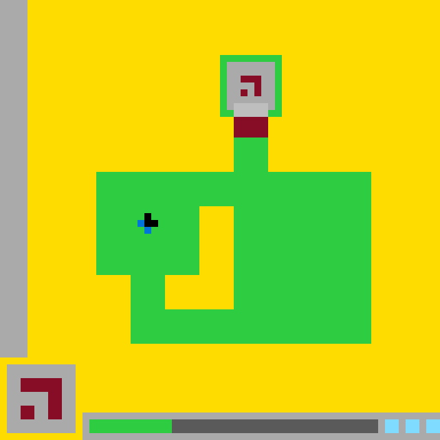

# `ls20` level `1` — LEFT / LEFT / DOWN / LEFT / UP / UP / UP / UP / RIGHT / RIGHT / RIGHT / UP / UP

- **Full game ID:** `ls20`
- **State:** `NOT_FINISHED`
- **Image hash:** `a26695415e6ab14b`
- **Incoming action:** `ACTION1`

## Navigation

- [Level start](../../../../../../../../../../../../../README.md)
- [Parent state](../README.md)

## Image



## Files

- [state.json](state.json)
- [differences.pl](differences.pl)
- [objects.pl](objects.pl)

## `objects.pl`

```prolog
coordinate_system(pixel, 640, 640, origin(top_left), x_right, y_down).
bbox_convention(half_open).

color(yellow, 255, 220, 0).
color(green, 46, 204, 64).
color(maroon, 133, 20, 75).
color(light_gray, 170, 170, 170).
color(dark_gray, 102, 102, 102).
color(blue, 0, 116, 217).
color(light_blue, 127, 219, 255).
color(black, 0, 0, 0).

object(background).
bbox(background, 0, 0, 640, 640).
color_of(background, yellow).
geometry(background, rectangle(0, 0, 640, 640)).
role(background, playfield_and_ui_background).
turtle_program(background,
  [penup, set_pos(0,0), setcolor(yellow), fill_rect(640,640)]).

object(left_border).
bbox(left_border, 0, 0, 40, 520).
color_of(left_border, light_gray).
geometry(left_border, rectangle(0, 0, 40, 520)).
role(left_border, screen_border).
adjacent(left_border, background, right).
turtle_program(left_border,
  [penup, set_pos(0,0), setcolor(light_gray), fill_rect(40,520)]).

object(portal_frame).
bbox(portal_frame, 320, 80, 410, 170).
color_of(portal_frame, green).
geometry(portal_frame,
  union([
    rectangle(320,80,90,10),
    rectangle(320,90,10,70),
    rectangle(400,90,10,70),
    rectangle(320,160,90,10)
  ])).
role(portal_frame, framed_terminal).
contains_region(portal_frame, portal_panel).
adjacent(portal_frame, portal_panel, around).
adjacent(portal_frame, portal_connector, below).
turtle_program(portal_frame,
  [penup, setcolor(green),
   set_pos(320,80), fill_rect(90,10),
   set_pos(320,90), fill_rect(10,70),
   set_pos(400,90), fill_rect(10,70),
   set_pos(320,160), fill_rect(90,10)]).

object(portal_panel).
bbox(portal_panel, 330, 90, 400, 170).
color_of(portal_panel, light_gray).
geometry(portal_panel,
  union([
    rectangle(330,90,70,70),
    rectangle(340,160,50,10)
  ])).
role(portal_panel, terminal_face).
contained_in(portal_panel, portal_frame).
contains(portal_panel, portal_glyph).
adjacent(portal_panel, portal_frame, around).
adjacent(portal_panel, portal_connector, below).
turtle_program(portal_panel,
  [penup, setcolor(light_gray),
   set_pos(330,90), fill_rect(70,70),
   set_pos(340,160), fill_rect(50,10)]).

object(portal_glyph).
bbox(portal_glyph, 350, 110, 380, 140).
color_of(portal_glyph, maroon).
geometry(portal_glyph,
  union([
    rectangle(350,110,30,10),
    rectangle(370,120,10,20),
    rectangle(350,130,10,10)
  ])).
role(portal_glyph, hook_symbol).
contained_in(portal_glyph, portal_panel).
disconnected_parts(portal_glyph, 2).
turtle_program(portal_glyph,
  [penup, setcolor(maroon),
   set_pos(350,110), fill_rect(30,10),
   set_pos(370,120), fill_rect(10,20),
   set_pos(350,130), fill_rect(10,10)]).

object(portal_connector).
bbox(portal_connector, 340, 170, 390, 200).
color_of(portal_connector, maroon).
geometry(portal_connector, rectangle(340,170,50,30)).
role(portal_connector, connector).
adjacent(portal_connector, portal_panel, above).
adjacent(portal_connector, portal_frame, above_and_sides).
adjacent(portal_connector, green_structure, below).
turtle_program(portal_connector,
  [penup, set_pos(340,170), setcolor(maroon), fill_rect(50,30)]).

object(green_structure).
bbox(green_structure, 140, 200, 540, 500).
color_of(green_structure, green).
geometry(green_structure,
  union([
    rectangle(340,200,50,50),
    rectangle(140,250,400,50),
    rectangle(140,300,150,100),
    rectangle(340,300,200,150),
    rectangle(190,400,50,100),
    rectangle(240,450,300,50)
  ])).
role(green_structure, main_playfield_object).
contains(green_structure, avatar_black).
contains(green_structure, avatar_blue).
has_hole(green_structure, structure_cavity).
adjacent(green_structure, portal_connector, above).
turtle_program(green_structure,
  [penup, setcolor(green),
   set_pos(340,200), fill_rect(50,50),
   set_pos(140,250), fill_rect(400,50),
   set_pos(140,300), fill_rect(150,100),
   set_pos(340,300), fill_rect(200,150),
   set_pos(190,400), fill_rect(50,100),
   set_pos(240,450), fill_rect(300,50)]).

object(structure_cavity).
bbox(structure_cavity, 240, 300, 340, 450).
color_of(structure_cavity, yellow).
geometry(structure_cavity,
  union([
    rectangle(290,300,50,100),
    rectangle(240,400,100,50)
  ])).
role(structure_cavity, enclosed_background_hole).
contained_in(structure_cavity, green_structure).
turtle_program(structure_cavity,
  [penup, setcolor(yellow),
   set_pos(290,300), fill_rect(50,100),
   set_pos(240,400), fill_rect(100,50)]).

object(avatar_black).
bbox(avatar_black, 210, 310, 230, 330).
color_of(avatar_black, black).
geometry(avatar_black,
  union([
    rectangle(210,310,10,10),
    rectangle(210,320,20,10)
  ])).
role(avatar_black, avatar_foreground).
contained_in(avatar_black, green_structure).
adjacent(avatar_black, avatar_blue, left_and_below).
turtle_program(avatar_black,
  [penup, setcolor(black),
   set_pos(210,310), fill_rect(10,10),
   set_pos(210,320), fill_rect(20,10)]).

object(avatar_blue).
bbox(avatar_blue, 200, 320, 220, 340).
color_of(avatar_blue, blue).
geometry(avatar_blue,
  union([
    rectangle(200,320,10,10),
    rectangle(210,330,10,10)
  ])).
role(avatar_blue, avatar_shadow_or_tail).
contained_in(avatar_blue, green_structure).
adjacent(avatar_blue, avatar_black, right_and_above).
turtle_program(avatar_blue,
  [penup, setcolor(blue),
   set_pos(200,320), fill_rect(10,10),
   set_pos(210,330), fill_rect(10,10)]).

object(control_panel).
bbox(control_panel, 10, 530, 110, 630).
color_of(control_panel, light_gray).
geometry(control_panel, rectangle(10,530,100,100)).
role(control_panel, lower_left_ui_button).
contains(control_panel, control_glyph).
turtle_program(control_panel,
  [penup, set_pos(10,530), setcolor(light_gray), fill_rect(100,100)]).

object(control_glyph).
bbox(control_glyph, 30, 550, 90, 610).
color_of(control_glyph, maroon).
geometry(control_glyph,
  union([
    rectangle(30,550,60,20),
    rectangle(70,570,20,40),
    rectangle(30,590,20,20)
  ])).
role(control_glyph, hook_symbol).
contained_in(control_glyph, control_panel).
disconnected_parts(control_glyph, 2).
similar_shape(control_glyph, portal_glyph).
scale_relative_to(control_glyph, portal_glyph, 2).
turtle_program(control_glyph,
  [penup, setcolor(maroon),
   set_pos(30,550), fill_rect(60,20),
   set_pos(70,570), fill_rect(20,40),
   set_pos(30,590), fill_rect(20,20)]).

object(status_panel).
bbox(status_panel, 120, 600, 640, 640).
color_of(status_panel, light_gray).
geometry(status_panel, rectangle(120,600,520,40)).
role(status_panel, bottom_status_bar).
contains(status_panel, status_green).
contains(status_panel, status_dark).
contains(status_panel, status_blue_1).
contains(status_panel, status_blue_2).
contains(status_panel, status_blue_3).
turtle_program(status_panel,
  [penup, set_pos(120,600), setcolor(light_gray), fill_rect(520,40)]).

object(status_green).
bbox(status_green, 130, 610, 250, 630).
color_of(status_green, green).
geometry(status_green, rectangle(130,610,120,20)).
role(status_green, status_segment).
contained_in(status_green, status_panel).
adjacent(status_green, status_dark, right).
turtle_program(status_green,
  [penup, set_pos(130,610), setcolor(green), fill_rect(120,20)]).

object(status_dark).
bbox(status_dark, 250, 610, 550, 630).
color_of(status_dark, dark_gray).
geometry(status_dark, rectangle(250,610,300,20)).
role(status_dark, status_segment).
contained_in(status_dark, status_panel).
adjacent(status_dark, status_green, left).
turtle_program(status_dark,
  [penup, set_pos(250,610), setcolor(dark_gray), fill_rect(300,20)]).

object(status_blue_1).
bbox(status_blue_1, 560, 610, 580, 630).
color_of(status_blue_1, light_blue).
geometry(status_blue_1, rectangle(560,610,20,20)).
role(status_blue_1, status_marker).
contained_in(status_blue_1, status_panel).
turtle_program(status_blue_1,
  [penup, set_pos(560,610), setcolor(light_blue), fill_rect(20,20)]).

object(status_blue_2).
bbox(status_blue_2, 590, 610, 610, 630).
color_of(status_blue_2, light_blue).
geometry(status_blue_2, rectangle(590,610,20,20)).
role(status_blue_2, status_marker).
contained_in(status_blue_2, status_panel).
turtle_program(status_blue_2,
  [penup, set_pos(590,610), setcolor(light_blue), fill_rect(20,20)]).

object(status_blue_3).
bbox(status_blue_3, 620, 610, 640, 630).
color_of(status_blue_3, light_blue).
geometry(status_blue_3, rectangle(620,610,20,20)).
role(status_blue_3, status_marker).
contained_in(status_blue_3, status_panel).
turtle_program(status_blue_3,
  [penup, set_pos(620,610), setcolor(light_blue), fill_rect(20,20)]).

gap_between(status_dark, status_blue_1, rectangle(550,610,10,20)).
gap_between(status_blue_1, status_blue_2, rectangle(580,610,10,20)).
gap_between(status_blue_2, status_blue_3, rectangle(610,610,10,20)).

draw_order([
  background,
  left_border,
  portal_frame,
  portal_panel,
  portal_glyph,
  portal_connector,
  green_structure,
  structure_cavity,
  avatar_blue,
  avatar_black,
  control_panel,
  control_glyph,
  status_panel,
  status_green,
  status_dark,
  status_blue_1,
  status_blue_2,
  status_blue_3
]).
```

## `differences.pl`

```prolog
bbox_space(pixel_half_open).

schema_normalization(previous, grid_inclusive_to_pixel_half_open, scale(10,10)).
schema_normalization(current, pixel_half_open, scale(1,1)).
color_alias(gray, light_gray).
color_alias(cyan, light_blue).

object_correspondence(background_yellow, background).
object_correspondence(left_sidebar, left_border).
object_correspondence(sign_frame, portal_frame).
object_correspondence(sign_face, portal_panel).
object_correspondence(sign_glyph, portal_glyph).
object_correspondence(sign_post_green, portal_connector).
object_correspondence(main_platform, green_structure).
object_correspondence(platform_cavity, structure_cavity).
object_correspondence(avatar_black, avatar_black).
object_correspondence(avatar_blue, avatar_blue).
object_correspondence(popup_panel, control_panel).
object_correspondence(popup_glyph, control_glyph).
object_correspondence(bottom_status_panel, status_panel).
object_correspondence(status_green_bar, status_green).
object_correspondence(status_dark_bar, status_dark).
object_correspondence(status_cyan_1, status_blue_1).
object_correspondence(status_cyan_2, status_blue_2).
object_correspondence(status_cyan_3, status_blue_3).

renamed_object(Old, Current) :-
    object_correspondence(Old, Current),
    Old \== Current.

observed_added_object(_) :-
    fail.

added_object(Object) :-
    observed_added_object(Object).

observed_removed_object(sign_post_gray).
observed_removed_object(sign_post_maroon).

removed_object(Object) :-
    observed_removed_object(Object).

absorbed_object(sign_post_gray, green_structure).
absorbed_object(sign_post_maroon, green_structure).

merged_into(green_structure, [main_platform, sign_post_gray, sign_post_maroon]).

unchanged_object(background_yellow, background).
unchanged_object(left_sidebar, left_border).
unchanged_object(sign_frame, portal_frame).
unchanged_object(sign_glyph, portal_glyph).
unchanged_object(platform_cavity, structure_cavity).
unchanged_object(avatar_black, avatar_black).
unchanged_object(avatar_blue, avatar_blue).
unchanged_object(popup_panel, control_panel).
unchanged_object(popup_glyph, control_glyph).
unchanged_object(bottom_status_panel, status_panel).
unchanged_object(status_cyan_1, status_blue_1).
unchanged_object(status_cyan_2, status_blue_2).
unchanged_object(status_cyan_3, status_blue_3).

changed_object(portal_panel,
    bbox(330,90,400,160),
    bbox(330,90,400,170)).
changed_object(portal_panel,
    geometry(filled_rectangle(330,90,70,70)),
    geometry(union([
        rectangle(330,90,70,70),
        rectangle(340,160,50,10)
    ]))).

changed_object(portal_frame,
    visible_region(rectangle(340,160,50,10), green),
    visible_region(rectangle(340,160,50,10), light_gray)).

changed_object(portal_connector,
    color(green),
    color(maroon)).

changed_object(green_structure,
    bbox(140,250,540,500),
    bbox(140,200,540,500)).
changed_object(green_structure,
    geometry(main_platform_only),
    geometry(main_platform_with_upper_stem)).

changed_object(status_green,
    bbox(130,610,240,630),
    bbox(130,610,250,630)).
changed_object(status_dark,
    bbox(240,610,550,630),
    bbox(250,610,550,630)).

recolored_object(portal_connector, green, maroon).

resized_object(portal_panel,
    bbox(330,90,400,160),
    bbox(330,90,400,170)).
resized_object(green_structure,
    bbox(140,250,540,500),
    bbox(140,200,540,500)).
resized_object(status_green,
    bbox(130,610,240,630),
    bbox(130,610,250,630)).
resized_object(status_dark,
    bbox(240,610,550,630),
    bbox(250,610,550,630)).

observed_moved_object(_, _, _, _) :-
    fail.

moved_object(Object, OldPosition, NewPosition, Delta) :-
    observed_moved_object(Object, OldPosition, NewPosition, Delta).

observation(region_recolored(
    rectangle(340,160,50,10),
    green,
    light_gray)).
observation(region_recolored(
    rectangle(340,170,50,30),
    green,
    maroon)).
observation(region_recolored(
    rectangle(340,200,50,20),
    light_gray,
    green)).
observation(region_recolored(
    rectangle(340,220,50,30),
    maroon,
    green)).
observation(region_recolored(
    rectangle(240,610,10,20),
    dark_gray,
    green)).

observation(region_added_to_object(
    portal_panel,
    rectangle(340,160,50,10))).
observation(region_added_to_object(
    green_structure,
    rectangle(340,200,50,50))).
observation(region_added_to_object(
    status_green,
    rectangle(240,610,10,20))).

observation(region_removed_from_object(
    status_dark,
    rectangle(240,610,10,20))).

observation(independent_object_count(previous, 20)).
observation(independent_object_count(current, 18)).

observation(draw_order_changed(
    [avatar_black, avatar_blue],
    [avatar_blue, avatar_black])).

visible_pixel_change(Rectangle, OldColor, NewColor) :-
    observation(region_recolored(Rectangle, OldColor, NewColor)).

hypothesis(action_effect(
    unknown_preceding_action,
    advance_status_progress(10_pixels)),
    high).

hypothesis(action_effect(
    unknown_preceding_action,
    cycle_portal_connector_colors),
    medium).

hypothesis(action_effect(
    unknown_preceding_action,
    integrate_lower_connector_into_green_structure),
    medium).

hypothesis(color_band_motion(
    maroon,
    rectangle(340,220,50,30),
    rectangle(340,170,50,30),
    delta(0,-50)),
    medium).

hypothesis(portal_activation_phase_advanced, medium).

action_effect(Action, Effect) :-
    hypothesis(action_effect(Action, Effect), _).

hypothesis_confidence(Hypothesis, Confidence) :-
    hypothesis(Hypothesis, Confidence).

observed_difference(Difference) :-
    observation(Difference).

difference(changed(Object, Before, After)) :-
    changed_object(Object, Before, After).
difference(removed(Object)) :-
    removed_object(Object).
difference(added(Object)) :-
    added_object(Object).
difference(moved(Object, OldPosition, NewPosition, Delta)) :-
    moved_object(Object, OldPosition, NewPosition, Delta).
difference(recolored(Object, OldColor, NewColor)) :-
    recolored_object(Object, OldColor, NewColor).
difference(resized(Object, OldBounds, NewBounds)) :-
    resized_object(Object, OldBounds, NewBounds).
```

## Actions

- [`UP`](UP/README.md)
