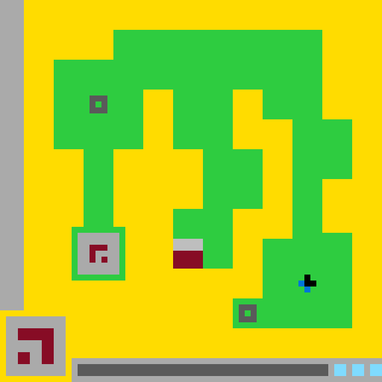

# `ls20` level `1` — LEFT / LEFT / DOWN / LEFT / UP / UP / UP / UP / RIGHT / RIGHT / RIGHT / UP / UP / UP

## Navigation

[Level start](../../../../../../../../../../../../../../README.md) · [Parent](../README.md)

### Actions

*No child actions recorded yet.*

---

- **Full game ID:** `ls20`
- **State:** `NOT_FINISHED`
- **Image hash:** `7e264c1b99b773f1`
- **Incoming action:** `ACTION1`

## Image



## Files

- [image.png](image.png)
- [state.json](state.json)
- [object_registry.pl](../../../../../../../../../../../../../../object_registry.pl) — shared level registry (26 canonical identities)
- [differences.pl](differences.pl)
- [objects.pl](objects.pl)
- [rules.pl](rules.pl)
- [similarities.pl](similarities.pl)
- [turtle_from_diff.pl](turtle_from_diff.pl)
- [turtle_from_image.pl](turtle_from_image.pl)

## Embedded files

*Canonical identities are shared through [`object_registry.pl`](../../../../../../../../../../../../../../object_registry.pl) and are not repeated in every node.*

<details>
<summary><code>state.json</code></summary>

````json
{
  "state": "NOT_FINISHED",
  "observation": {
    "game_id": "ls20-9607627b",
    "state": "NOT_FINISHED",
    "levels_completed": 1,
    "win_levels": 7,
    "action_input": {
      "id": "ACTION1",
      "data": {},
      "reasoning": null
    },
    "guid": "a992cb74-c0cd-4d3e-915e-9312cff80356",
    "full_reset": false,
    "available_actions": [
      1,
      2,
      3,
      4
    ]
  },
  "step_count": 13,
  "game_id": "ls20",
  "game_directory": "ls20",
  "level": "1",
  "image_hash": "7e264c1b99b773f1",
  "incoming_action": "ACTION1",
  "action_directory": "UP",
  "action_data": {},
  "parent_node": "..",
  "action_path": [
    "LEFT",
    "LEFT",
    "DOWN",
    "LEFT",
    "UP",
    "UP",
    "UP",
    "UP",
    "RIGHT",
    "RIGHT",
    "RIGHT",
    "UP",
    "UP",
    "UP"
  ]
}
````

[Open `state.json`](state.json)

</details>

<details>
<summary><code>differences.pl</code></summary>

````prolog
% Observed differences between action14 and action15.

previous_state_id(action14).
current_state_id(action15).
compared_action(action('ACTION1', {})).

added_object(upper_left_green_target).
added_object(lower_right_green_target).

removed_object(green_status_block).

newly_visible_registry_object(upper_left_green_target).
newly_visible_registry_object(lower_right_green_target).
newly_hidden_registry_object(green_status_block).

appeared_at(upper_left_green_target, bounding_box(15, 16, 3, 3)).
appeared_at(lower_right_green_target, bounding_box(40, 51, 3, 3)).
disappeared_from(green_status_block, bounding_box(13, 61, 12, 2)).

changed_object(green_fortress,
               geometry,
               connected_compound_structure,
               connected_branching_maze_structure).
changed_object(fortress_main_body,
               geometry,
               stepped_block_region,
               stepped_orthogonal_block_region).
changed_object(fortress_left_wing,
               geometry,
               filled_rectangle,
               branching_block_and_vertical_bar).
changed_object(fortress_right_wing,
               geometry,
               filled_rectangle,
               stepped_vertical_block_region).
changed_object(fortress_lower_bridge,
               geometry,
               filled_horizontal_bar,
               thick_lower_right_block).
changed_object(fortress_upper_stem,
               geometry,
               filled_vertical_bar,
               zigzag_vertical_connector).
changed_object(fortress_inner_courtyard,
               geometry,
               l_shaped_hole,
               winding_open_corridor).

changed_object(green_fortress,
               state,
               solid,
               reconfigured_as_maze).
changed_object(fortress_inner_courtyard,
               state,
               empty,
               open_winding_passage).
changed_object(upper_chamber_frame,
               state,
               located_in_upper_chamber,
               relocated_to_lower_left_branch).
changed_object(bottom_center_gate,
               state,
               raised_into_upper_chamber,
               relocated_to_central_lower_corridor).
changed_object(blue_black_player,
               state,
               stationary_below_and_left_of_gate,
               relocated_to_lower_right_wing).
changed_object(green_status_block,
               visibility,
               visible,
               not_visible).
changed_object(bottom_status_track,
               state,
               partially_covered_by_green_status_block,
               fully_dark).

moved_object(green_fortress,
             from(34, 29),
             to(34, 30),
             delta(0, 1)).
moved_object(fortress_main_body,
             from(34, 37),
             to(34, 30),
             delta(0, -7)).
moved_object(fortress_left_wing,
             from(21, 32),
             to(16, 28),
             delta(-5, -4)).
moved_object(fortress_right_wing,
             from(44, 37),
             to(49, 35),
             delta(5, -2)).
moved_object(fortress_lower_bridge,
             from(36, 47),
             to(51, 47),
             delta(15, 0)).
moved_object(fortress_upper_stem,
             from(36, 22),
             to(36, 30),
             delta(0, 8)).
moved_object(fortress_inner_courtyard,
             from(29, 37),
             to(34, 32),
             delta(5, -5)).

moved_object(upper_chamber_frame,
             from(36, 12),
             to(16, 42),
             delta(-20, 30)).
moved_object(upper_chamber_interior,
             from(36, 12),
             to(16, 42),
             delta(-20, 30)).
moved_object(upper_burgundy_glyph,
             from(36, 12),
             to(16, 42),
             delta(-20, 30)).

moved_object(bottom_center_gate,
             from(36, 17),
             to(31, 42),
             delta(-5, 25)).
moved_object(gate_gray_header,
             from(36, 16),
             to(31, 41),
             delta(-5, 25)).
moved_object(gate_burgundy_panel,
             from(36, 18),
             to(31, 43),
             delta(-5, 25)).

moved_object(blue_black_player,
             from(21, 32),
             to(51, 47),
             delta(30, 15)).
moved_object(player_black_core,
             from(22, 32),
             to(52, 47),
             delta(30, 15)).
moved_object(player_blue_tail,
             from(21, 33),
             to(51, 48),
             delta(30, 15)).

moved_object(bottom_status_track,
             from(40, 62),
             to(34, 62),
             delta(-6, 0)).

movement_kind(upper_chamber_frame, rigid_translation).
movement_kind(upper_chamber_interior, rigid_translation).
movement_kind(upper_burgundy_glyph, rigid_translation).
movement_kind(bottom_center_gate, rigid_translation).
movement_kind(gate_gray_header, rigid_translation).
movement_kind(gate_burgundy_panel, rigid_translation).
movement_kind(blue_black_player, rigid_translation).
movement_kind(player_black_core, rigid_translation).
movement_kind(player_blue_tail, rigid_translation).
movement_kind(bottom_status_track, leftward_expansion).
movement_kind(green_fortress, reconfiguration).
movement_kind(fortress_main_body, reconfiguration).
movement_kind(fortress_left_wing, reconfiguration).
movement_kind(fortress_right_wing, reconfiguration).
movement_kind(fortress_lower_bridge, reconfiguration).
movement_kind(fortress_upper_stem, reconfiguration).
movement_kind(fortress_inner_courtyard, reconfiguration).

resized_object(green_fortress, size(40, 42), size(50, 50)).
resized_object(fortress_main_body, size(40, 25), size(50, 50)).
resized_object(fortress_left_wing, size(15, 15), size(15, 37)).
resized_object(fortress_right_wing, size(20, 25), size(20, 40)).
resized_object(fortress_lower_bridge, size(35, 5), size(15, 15)).
resized_object(fortress_upper_stem, size(5, 5), size(15, 30)).
resized_object(fortress_inner_courtyard, size(10, 15), size(30, 35)).
resized_object(bottom_status_track, size(30, 2), size(42, 2)).

recolored_object(_Object, _OldColor, _NewColor) :-
    fail.

no_observed_difference(recoloring).

unchanged_object(yellow_playfield,
                 bounding_box(0, 0, 64, 64)).
unchanged_object(left_boundary_wall,
                 bounding_box(0, 0, 4, 52)).
unchanged_object(lower_left_symbol_card,
                 bounding_box(1, 53, 10, 10)).
unchanged_object(lower_left_burgundy_glyph,
                 bounding_box(3, 55, 6, 6)).
unchanged_object(bottom_status_panel,
                 bounding_box(12, 60, 52, 4)).
unchanged_object(cyan_status_blocks,
                 bounding_box(56, 61, 8, 2)).

unchanged_object(upper_chamber_frame,
                 size(9, 9)).
unchanged_object(upper_chamber_interior,
                 size(7, 7)).
unchanged_object(upper_burgundy_glyph,
                 size(3, 3)).
unchanged_object(bottom_center_gate,
                 size(5, 5)).
unchanged_object(gate_gray_header,
                 size(5, 2)).
unchanged_object(gate_burgundy_panel,
                 size(5, 3)).
unchanged_object(blue_black_player,
                 size(3, 3)).
unchanged_object(player_black_core,
                 size(2, 2)).
unchanged_object(player_blue_tail,
                 size(2, 2)).

unchanged_object(upper_chamber_frame,
                 geometry(one_cell_thick_rectangular_frame)).
unchanged_object(upper_chamber_interior,
                 geometry(filled_rectangle)).
unchanged_object(upper_burgundy_glyph,
                 geometry(hooked_angular_glyph)).
unchanged_object(bottom_center_gate,
                 geometry(vertically_partitioned_rectangle)).
unchanged_object(blue_black_player,
                 geometry(asymmetric_two_color_marker)).
unchanged_object(player_blue_tail,
                 geometry(diagonal_two_cell_tail)).
unchanged_object(lower_left_symbol_card,
                 geometry(filled_square_panel)).
unchanged_object(lower_left_burgundy_glyph,
                 geometry(angular_thick_glyph)).
unchanged_object(bottom_status_panel,
                 geometry(filled_horizontal_panel)).
unchanged_object(cyan_status_blocks,
                 geometry(three_separated_rectangular_blocks)).

unchanged_object(bottom_center_gate, state(closed)).
unchanged_object(blue_black_player, state(visible)).
unchanged_object(player_blue_tail, state(two_cell_diagonal)).
unchanged_object(bottom_status_panel, state(active)).
unchanged_object(cyan_status_blocks, state(three_lit_blocks)).

removed_relation(component_of(green_status_block, bottom_status_panel)).
removed_relation(contains(bottom_status_panel, green_status_block)).
removed_relation(overlays(green_status_block, bottom_status_panel)).
removed_relation(adjacent(green_status_block, bottom_status_track)).
removed_relation(embedded_in(bottom_center_gate, upper_chamber_frame)).
removed_relation(embedded_in(bottom_center_gate, green_fortress)).
removed_relation(embedded_in(blue_black_player, fortress_left_wing)).
removed_relation(contains(fortress_main_body, fortress_inner_courtyard)).

added_relation(embedded_in(upper_chamber_frame, green_fortress)).
added_relation(embedded_in(bottom_center_gate, fortress_upper_stem)).
added_relation(embedded_in(blue_black_player, fortress_right_wing)).
added_relation(embedded_in(upper_left_green_target, fortress_left_wing)).
added_relation(embedded_in(lower_right_green_target, fortress_right_wing)).
added_relation(overlays(upper_left_green_target, fortress_left_wing)).
added_relation(overlays(lower_right_green_target, fortress_right_wing)).

action_effect(action('ACTION1', {}),
              observed(reconfigured(green_fortress))).
action_effect(action('ACTION1', {}),
              observed(relocated(upper_chamber_frame,
                                 from(36, 12),
                                 to(16, 42)))).
action_effect(action('ACTION1', {}),
              observed(relocated(bottom_center_gate,
                                 from(36, 17),
                                 to(31, 42)))).
action_effect(action('ACTION1', {}),
              observed(relocated(blue_black_player,
                                 from(21, 32),
                                 to(51, 47)))).
action_effect(action('ACTION1', {}),
              observed(removed_from_view(green_status_block))).
action_effect(action('ACTION1', {}),
              observed(expanded(bottom_status_track,
                                from(size(30, 2)),
                                to(size(42, 2))))).
action_effect(action('ACTION1', {}),
              observed(revealed(upper_left_green_target))).
action_effect(action('ACTION1', {}),
              observed(revealed(lower_right_green_target))).

hypothesized_action_effect(action('ACTION1', {}),
                           caused_global_fortress_reconfiguration).
hypothesized_action_effect(action('ACTION1', {}),
                           consumed_green_status_block).
hypothesized_action_effect(action('ACTION1', {}),
                           activated_or_exposed_green_targets).

evidence_status(added_object(upper_left_green_target), observed).
evidence_status(added_object(lower_right_green_target), observed).
evidence_status(removed_object(green_status_block), observed).
evidence_status(reconfigured(green_fortress), observed).
evidence_status(consumed_green_status_block, hypothesis).
evidence_status(caused_global_fortress_reconfiguration, hypothesis).
evidence_status(activated_or_exposed_green_targets, hypothesis).
````

[Open `differences.pl`](differences.pl)

</details>

<details>
<summary><code>objects.pl</code></summary>

````prolog
% Canonical object identities live in the level-wide registry.
:- ensure_loaded('../../../../../../../../../../../../../../object_registry.pl').

% State-specific facts for this action-tree node.
% Canonical object identities live in the level-wide registry.

% State-specific facts for this action-tree node.
% Canonical object identities live in the level-wide registry.

% State-specific facts for this action-tree node.
% Canonical object identities live in the level-wide registry.

% State-specific facts for this action-tree node.
% Canonical object identities live in the level-wide registry.

% State-specific facts for this action-tree node.
% Canonical object identities live in the level-wide registry.

% State-specific facts for this action-tree node.
state_id(action15).
incoming_action(action15, action('ACTION1', {})).
previous_state(action15, action14).

canvas_size(64, 64).
coordinate_system(origin_top_left, x_right, y_down).
grid_cell_size_pixels(10).

visible(yellow_playfield).
visible(left_boundary_wall).
visible(green_fortress).
visible(fortress_main_body).
visible(fortress_left_wing).
visible(fortress_right_wing).
visible(fortress_lower_bridge).
visible(fortress_upper_stem).
visible(fortress_inner_courtyard).
visible(upper_chamber_frame).
visible(upper_chamber_interior).
visible(upper_burgundy_glyph).
visible(bottom_center_gate).
visible(gate_gray_header).
visible(gate_burgundy_panel).
visible(blue_black_player).
visible(player_black_core).
visible(player_blue_tail).
visible(lower_left_symbol_card).
visible(lower_left_burgundy_glyph).
visible(bottom_status_panel).
visible(bottom_status_track).
visible(cyan_status_blocks).
visible(upper_left_green_target).
visible(lower_right_green_target).

bounding_box(yellow_playfield, 0, 0, 64, 64).
bounding_box(left_boundary_wall, 0, 0, 4, 52).
bounding_box(green_fortress, 9, 5, 50, 50).
bounding_box(fortress_main_body, 9, 5, 50, 50).
bounding_box(fortress_left_wing, 9, 10, 15, 37).
bounding_box(fortress_right_wing, 39, 15, 20, 40).
bounding_box(fortress_lower_bridge, 44, 40, 15, 15).
bounding_box(fortress_upper_stem, 29, 15, 15, 30).
bounding_box(fortress_inner_courtyard, 19, 15, 30, 35).
bounding_box(upper_chamber_frame, 12, 38, 9, 9).
bounding_box(upper_chamber_interior, 13, 39, 7, 7).
bounding_box(upper_burgundy_glyph, 15, 41, 3, 3).
bounding_box(bottom_center_gate, 29, 40, 5, 5).
bounding_box(gate_gray_header, 29, 40, 5, 2).
bounding_box(gate_burgundy_panel, 29, 42, 5, 3).
bounding_box(blue_black_player, 50, 46, 3, 3).
bounding_box(player_black_core, 51, 46, 2, 2).
bounding_box(player_blue_tail, 50, 47, 2, 2).
bounding_box(lower_left_symbol_card, 1, 53, 10, 10).
bounding_box(lower_left_burgundy_glyph, 3, 55, 6, 6).
bounding_box(bottom_status_panel, 12, 60, 52, 4).
bounding_box(bottom_status_track, 13, 61, 42, 2).
bounding_box(cyan_status_blocks, 56, 61, 8, 2).
bounding_box(upper_left_green_target, 15, 16, 3, 3).
bounding_box(lower_right_green_target, 40, 51, 3, 3).

center(green_fortress, 34, 30).
center(fortress_main_body, 34, 30).
center(fortress_left_wing, 16, 28).
center(fortress_right_wing, 49, 35).
center(fortress_lower_bridge, 51, 47).
center(fortress_upper_stem, 36, 30).
center(fortress_inner_courtyard, 34, 32).
center(upper_chamber_frame, 16, 42).
center(upper_chamber_interior, 16, 42).
center(upper_burgundy_glyph, 16, 42).
center(bottom_center_gate, 31, 42).
center(gate_gray_header, 31, 41).
center(gate_burgundy_panel, 31, 43).
center(blue_black_player, 51, 47).
center(player_black_core, 52, 47).
center(player_blue_tail, 51, 48).
center(lower_left_symbol_card, 5, 58).
center(lower_left_burgundy_glyph, 6, 58).
center(bottom_status_panel, 38, 62).
center(bottom_status_track, 34, 62).
center(cyan_status_blocks, 60, 62).
center(upper_left_green_target, 16, 17).
center(lower_right_green_target, 41, 52).

color(yellow_playfield, yellow).
color(left_boundary_wall, light_gray).
color(green_fortress, green).
color(fortress_main_body, green).
color(fortress_left_wing, green).
color(fortress_right_wing, green).
color(fortress_lower_bridge, green).
color(fortress_upper_stem, green).
color(fortress_inner_courtyard, yellow).
color(upper_chamber_frame, green).
color(upper_chamber_interior, light_gray).
color(upper_burgundy_glyph, burgundy).
colors(bottom_center_gate, [light_gray, burgundy]).
color(gate_gray_header, light_gray).
color(gate_burgundy_panel, burgundy).
colors(blue_black_player, [blue, black]).
color(player_black_core, black).
color(player_blue_tail, blue).
color(lower_left_symbol_card, light_gray).
color(lower_left_burgundy_glyph, burgundy).
color(bottom_status_panel, light_gray).
color(bottom_status_track, dark_gray).
color(cyan_status_blocks, cyan).
colors(upper_left_green_target, [light_gray, green]).
colors(lower_right_green_target, [light_gray, green]).

geometry(yellow_playfield, background_with_occlusions).
geometry(left_boundary_wall, filled_vertical_rectangle).
geometry(green_fortress, connected_branching_maze_structure).
geometry(fortress_main_body, stepped_orthogonal_block_region).
geometry(fortress_left_wing, branching_block_and_vertical_bar).
geometry(fortress_right_wing, stepped_vertical_block_region).
geometry(fortress_lower_bridge, thick_lower_right_block).
geometry(fortress_upper_stem, zigzag_vertical_connector).
geometry(fortress_inner_courtyard, winding_open_corridor).
geometry(upper_chamber_frame, one_cell_thick_rectangular_frame).
geometry(upper_chamber_interior, filled_rectangle).
geometry(upper_burgundy_glyph, hooked_angular_glyph).
geometry(bottom_center_gate, vertically_partitioned_rectangle).
geometry(gate_gray_header, filled_horizontal_rectangle).
geometry(gate_burgundy_panel, filled_rectangle).
geometry(blue_black_player, asymmetric_two_color_marker).
geometry(player_black_core, filled_rectangular_cluster).
geometry(player_blue_tail, diagonal_two_cell_tail).
geometry(lower_left_symbol_card, filled_square_panel).
geometry(lower_left_burgundy_glyph, angular_thick_glyph).
geometry(bottom_status_panel, filled_horizontal_panel).
geometry(bottom_status_track, filled_horizontal_rectangle).
geometry(cyan_status_blocks, three_separated_rectangular_blocks).
geometry(upper_left_green_target, gray_square_with_green_center).
geometry(lower_right_green_target, gray_square_with_green_center).

component_of(fortress_main_body, green_fortress).
component_of(fortress_left_wing, green_fortress).
component_of(fortress_right_wing, green_fortress).
component_of(fortress_lower_bridge, green_fortress).
component_of(fortress_upper_stem, green_fortress).
component_of(upper_chamber_frame, green_fortress).
component_of(gate_gray_header, bottom_center_gate).
component_of(gate_burgundy_panel, bottom_center_gate).
component_of(player_black_core, blue_black_player).
component_of(player_blue_tail, blue_black_player).
component_of(lower_left_burgundy_glyph, lower_left_symbol_card).
component_of(bottom_status_track, bottom_status_panel).
component_of(cyan_status_blocks, bottom_status_panel).

contains(green_fortress, fortress_inner_courtyard).
contains(upper_chamber_frame, upper_chamber_interior).
contains(upper_chamber_interior, upper_burgundy_glyph).
contains(bottom_center_gate, gate_gray_header).
contains(bottom_center_gate, gate_burgundy_panel).
contains(blue_black_player, player_black_core).
contains(blue_black_player, player_blue_tail).
contains(lower_left_symbol_card, lower_left_burgundy_glyph).
contains(bottom_status_panel, bottom_status_track).
contains(bottom_status_panel, cyan_status_blocks).

adjacent(left_boundary_wall, yellow_playfield).
adjacent(fortress_left_wing, fortress_inner_courtyard).
adjacent(fortress_right_wing, fortress_inner_courtyard).
adjacent(fortress_upper_stem, fortress_inner_courtyard).
adjacent(fortress_upper_stem, bottom_center_gate).
adjacent(gate_gray_header, gate_burgundy_panel).
adjacent(player_black_core, player_blue_tail).
adjacent(bottom_status_track, cyan_status_blocks).

embedded_in(upper_chamber_frame, green_fortress).
embedded_in(bottom_center_gate, fortress_upper_stem).
embedded_in(blue_black_player, fortress_right_wing).
embedded_in(blue_black_player, green_fortress).
embedded_in(upper_left_green_target, fortress_left_wing).
embedded_in(lower_right_green_target, fortress_right_wing).

overlays(upper_chamber_interior, green_fortress).
overlays(upper_burgundy_glyph, upper_chamber_interior).
overlays(bottom_center_gate, fortress_upper_stem).
overlays(blue_black_player, fortress_right_wing).
overlays(lower_left_burgundy_glyph, lower_left_symbol_card).
overlays(bottom_status_track, bottom_status_panel).
overlays(cyan_status_blocks, bottom_status_panel).
overlays(upper_left_green_target, fortress_left_wing).
overlays(lower_right_green_target, fortress_right_wing).

left_of(upper_left_green_target, bottom_center_gate).
left_of(upper_chamber_frame, bottom_center_gate).
left_of(bottom_center_gate, blue_black_player).
left_of(lower_right_green_target, blue_black_player).
left_of(bottom_status_track, cyan_status_blocks).

above(upper_left_green_target, upper_chamber_frame).
above(upper_chamber_frame, lower_left_symbol_card).
above(bottom_center_gate, blue_black_player).
above(blue_black_player, lower_right_green_target).
above(lower_right_green_target, bottom_status_panel).
above(lower_left_symbol_card, bottom_status_panel).

aligned_with(upper_chamber_frame, upper_left_green_target, vertical).
aligned_with(bottom_center_gate, fortress_upper_stem, vertical).
aligned_with(blue_black_player, lower_right_green_target, vertical).
aligned_with(bottom_status_track, cyan_status_blocks, horizontal).

separated_by_gap(upper_chamber_frame, bottom_center_gate, 8).
separated_by_gap(bottom_center_gate, blue_black_player, 16).
separated_by_gap(bottom_status_track, cyan_status_blocks, 1).

state(green_fortress, solid).
state(green_fortress, reconfigured_as_maze).
state(fortress_inner_courtyard, open_winding_passage).
state(upper_chamber_frame, relocated_to_lower_left_branch).
state(bottom_center_gate, closed).
state(bottom_center_gate, relocated_to_central_lower_corridor).
state(blue_black_player, visible).
state(blue_black_player, relocated_to_lower_right_wing).
state(player_blue_tail, two_cell_diagonal).
state(bottom_status_panel, active).
state(bottom_status_track, fully_dark).
state(green_status_block, not_visible).
state(cyan_status_blocks, three_lit_blocks).
state(upper_left_green_target, active).
state(lower_right_green_target, active).
state(action15, fortress_reconfigured).
state(action15, player_moved_to_lower_right).
state(action15, gate_moved_to_central_corridor).
state(action15, green_status_block_depleted).

component_box(green_fortress, 19, 5, 35, 10).
component_box(green_fortress, 9, 10, 15, 15).
component_box(green_fortress, 29, 15, 10, 10).
component_box(green_fortress, 44, 15, 10, 5).
component_box(green_fortress, 49, 20, 10, 10).
component_box(green_fortress, 14, 25, 5, 13).
component_box(green_fortress, 34, 25, 10, 10).
component_box(green_fortress, 49, 30, 5, 10).
component_box(green_fortress, 29, 35, 10, 10).
component_box(green_fortress, 12, 38, 9, 9).
component_box(green_fortress, 44, 40, 15, 15).
component_box(green_fortress, 39, 50, 5, 5).

component_box(fortress_inner_courtyard, 24, 15, 5, 10).
component_box(fortress_inner_courtyard, 39, 15, 5, 5).
component_box(fortress_inner_courtyard, 39, 20, 10, 5).
component_box(fortress_inner_courtyard, 19, 25, 15, 10).
component_box(fortress_inner_courtyard, 19, 35, 10, 3).
component_box(fortress_inner_courtyard, 21, 38, 8, 7).
component_box(fortress_inner_courtyard, 21, 45, 18, 5).
component_box(fortress_inner_courtyard, 39, 25, 10, 15).
component_box(fortress_inner_courtyard, 39, 40, 5, 10).

component_box(upper_burgundy_glyph, 15, 41, 3, 1).
component_box(upper_burgundy_glyph, 17, 42, 1, 2).
component_box(upper_burgundy_glyph, 15, 43, 1, 1).
component_box(player_black_core, 51, 46, 2, 2).
component_box(player_blue_tail, 50, 47, 1, 1).
component_box(player_blue_tail, 51, 48, 1, 1).
component_box(lower_left_burgundy_glyph, 3, 55, 6, 2).
component_box(lower_left_burgundy_glyph, 7, 57, 2, 4).
component_box(lower_left_burgundy_glyph, 3, 59, 2, 2).
component_box(cyan_status_blocks, 56, 61, 2, 2).
component_box(cyan_status_blocks, 59, 61, 2, 2).
component_box(cyan_status_blocks, 62, 61, 2, 2).

turtle_program(yellow_playfield,
    [penup, set_pos(0,0), setcolor(yellow), pendown, fill_rect(64,64)]).

turtle_program(left_boundary_wall,
    [penup, set_pos(0,0), setcolor(light_gray), pendown, fill_rect(4,52)]).

turtle_program(green_fortress,
    [penup, setcolor(green),
     set_pos(19,5), pendown, fill_rect(35,10),
     penup, set_pos(9,10), pendown, fill_rect(15,15),
     penup, set_pos(29,15), pendown, fill_rect(10,10),
     penup, set_pos(44,15), pendown, fill_rect(10,5),
     penup, set_pos(49,20), pendown, fill_rect(10,10),
     penup, set_pos(14,25), pendown, fill_rect(5,13),
     penup, set_pos(34,25), pendown, fill_rect(10,10),
     penup, set_pos(49,30), pendown, fill_rect(5,10),
     penup, set_pos(29,35), pendown, fill_rect(10,10),
     penup, set_pos(12,38), pendown, fill_rect(9,9),
     penup, set_pos(44,40), pendown, fill_rect(15,15),
     penup, set_pos(39,50), pendown, fill_rect(5,5)]).

turtle_program(fortress_main_body,
    [penup, setcolor(green),
     set_pos(19,5), pendown, fill_rect(35,10),
     penup, set_pos(9,10), pendown, fill_rect(15,15),
     penup, set_pos(29,15), pendown, fill_rect(10,10),
     penup, set_pos(44,15), pendown, fill_rect(10,5),
     penup, set_pos(49,20), pendown, fill_rect(10,10),
     penup, set_pos(14,25), pendown, fill_rect(5,13),
     penup, set_pos(34,25), pendown, fill_rect(10,10),
     penup, set_pos(49,30), pendown, fill_rect(5,10),
     penup, set_pos(29,35), pendown, fill_rect(10,10),
     penup, set_pos(12,38), pendown, fill_rect(9,9),
     penup, set_pos(44,40), pendown, fill_rect(15,15),
     penup, set_pos(39,50), pendown, fill_rect(5,5)]).

turtle_program(fortress_left_wing,
    [penup, setcolor(green),
     set_pos(9,10), pendown, fill_rect(15,15),
     penup, set_pos(14,25), pendown, fill_rect(5,13),
     penup, set_pos(12,38), pendown, fill_rect(9,9)]).

turtle_program(fortress_right_wing,
    [penup, setcolor(green),
     set_pos(44,15), pendown, fill_rect(10,5),
     penup, set_pos(49,20), pendown, fill_rect(10,20),
     penup, set_pos(44,40), pendown, fill_rect(15,15),
     penup, set_pos(39,50), pendown, fill_rect(5,5)]).

turtle_program(fortress_lower_bridge,
    [penup, set_pos(44,40), setcolor(green), pendown, fill_rect(15,15),
     penup, set_pos(39,50), pendown, fill_rect(5,5)]).

turtle_program(fortress_upper_stem,
    [penup, setcolor(green),
     set_pos(29,15), pendown, fill_rect(10,10),
     penup, set_pos(34,25), pendown, fill_rect(10,10),
     penup, set_pos(29,35), pendown, fill_rect(10,10)]).

turtle_program(fortress_inner_courtyard,
    [penup, setcolor(yellow),
     set_pos(24,15), pendown, fill_rect(5,10),
     penup, set_pos(39,15), pendown, fill_rect(5,5),
     penup, set_pos(39,20), pendown, fill_rect(10,5),
     penup, set_pos(19,25), pendown, fill_rect(15,10),
     penup, set_pos(19,35), pendown, fill_rect(10,3),
     penup, set_pos(21,38), pendown, fill_rect(8,7),
     penup, set_pos(21,45), pendown, fill_rect(18,5),
     penup, set_pos(39,25), pendown, fill_rect(10,15),
     penup, set_pos(39,40), pendown, fill_rect(5,10)]).

turtle_program(upper_chamber_frame,
    [penup, setcolor(green),
     set_pos(12,38), pendown, fill_rect(9,1),
     penup, set_pos(12,39), pendown, fill_rect(1,7),
     penup, set_pos(20,39), pendown, fill_rect(1,7),
     penup, set_pos(12,46), pendown, fill_rect(9,1)]).

turtle_program(upper_chamber_interior,
    [penup, set_pos(13,39), setcolor(light_gray), pendown, fill_rect(7,7)]).

turtle_program(upper_burgundy_glyph,
    [penup, setcolor(burgundy),
     set_pos(15,41), pendown, fill_rect(3,1),
     penup, set_pos(17,42), pendown, fill_rect(1,2),
     penup, set_pos(15,43), pendown, set_cell]).

turtle_program(bottom_center_gate,
    [penup, set_pos(29,40), setcolor(light_gray), pendown, fill_rect(5,2),
     penup, set_pos(29,42), setcolor(burgundy), pendown, fill_rect(5,3)]).

turtle_program(gate_gray_header,
    [penup, set_pos(29,40), setcolor(light_gray), pendown, fill_rect(5,2)]).

turtle_program(gate_burgundy_panel,
    [penup, set_pos(29,42), setcolor(burgundy), pendown, fill_rect(5,3)]).

turtle_program(blue_black_player,
    [penup, setcolor(blue),
     set_pos(50,47), pendown, set_cell,
     penup, set_pos(51,48), pendown, set_cell,
     penup, set_pos(51,46), setcolor(black), pendown, fill_rect(2,2)]).

turtle_program(player_black_core,
    [penup, set_pos(51,46), setcolor(black), pendown, fill_rect(2,2)]).

turtle_program(player_blue_tail,
    [penup, setcolor(blue),
     set_pos(50,47), pendown, set_cell,
     penup, set_pos(51,48), pendown, set_cell]).

turtle_program(lower_left_symbol_card,
    [penup, set_pos(1,53), setcolor(light_gray), pendown, fill_rect(10,10)]).

turtle_program(lower_left_burgundy_glyph,
    [penup, setcolor(burgundy),
     set_pos(3,55), pendown, fill_rect(6,2),
     penup, set_pos(7,57), pendown, fill_rect(2,4),
     penup, set_pos(3,59), pendown, fill_rect(2,2)]).

turtle_program(bottom_status_panel,
    [penup, set_pos(12,60), setcolor(light_gray), pendown, fill_rect(52,4)]).

turtle_program(bottom_status_track,
    [penup, set_pos(13,61), setcolor(dark_gray), pendown, fill_rect(42,2)]).

turtle_program(cyan_status_blocks,
    [penup, setcolor(cyan),
     set_pos(56,61), pendown, fill_rect(2,2),
     penup, set_pos(59,61), pendown, fill_rect(2,2),
     penup, set_pos(62,61), pendown, fill_rect(2,2)]).

turtle_program(upper_left_green_target,
    [penup, set_pos(15,16), setcolor(dark_gray), pendown, fill_rect(3,3),
     penup, set_pos(16,17), setcolor(green), pendown, set_cell]).

turtle_program(lower_right_green_target,
    [penup, set_pos(40,51), setcolor(dark_gray), pendown, fill_rect(3,3),
     penup, set_pos(41,52), setcolor(green), pendown, set_cell]).
````

[Open `objects.pl`](objects.pl)

</details>

<details>
<summary><code>rules.pl</code></summary>

````prolog
current_state(action15).
previous_state(action15, action14).

action_history_step(action13, action('ACTION1', {}), action14).
action_history_step(action14, action('ACTION1', {}), action15).
current_action_path([
    step(action13, action('ACTION1', {}), action14),
    step(action14, action('ACTION1', {}), action15)
]).

evidence_ref(ev_action15_input,
             source(current_objects,
                    incoming_action(action15, action('ACTION1', {})))).

evidence_ref(ev_fortress_reconfigured,
             source(differences,
                    changed_object(green_fortress,
                                   geometry,
                                   connected_compound_structure,
                                   connected_branching_maze_structure))).

evidence_ref(ev_courtyard_opened,
             source(differences,
                    changed_object(fortress_inner_courtyard,
                                   state,
                                   empty,
                                   open_winding_passage))).

evidence_ref(ev_chamber_relocated,
             source(differences,
                    moved_object(upper_chamber_frame,
                                 from(36, 12),
                                 to(16, 42),
                                 delta(-20, 30)))).

evidence_ref(ev_gate_relocated,
             source(differences,
                    moved_object(bottom_center_gate,
                                 from(36, 17),
                                 to(31, 42),
                                 delta(-5, 25)))).

evidence_ref(ev_player_relocated,
             source(differences,
                    moved_object(blue_black_player,
                                 from(21, 32),
                                 to(51, 47),
                                 delta(30, 15)))).

evidence_ref(ev_green_status_removed,
             source(differences,
                    removed_object(green_status_block))).

evidence_ref(ev_status_track_expanded,
             source(differences,
                    resized_object(bottom_status_track,
                                   size(30, 2),
                                   size(42, 2)))).

evidence_ref(ev_upper_target_revealed,
             source(differences,
                    newly_visible_registry_object(
                        upper_left_green_target))).

evidence_ref(ev_lower_target_revealed,
             source(differences,
                    newly_visible_registry_object(
                        lower_right_green_target))).

evidence_ref(ev_upper_target_registry_identity,
             source(object_registry,
                    object_identity(
                        upper_left_green_target,
                        target_marker,
                        'Gray target marker with a green center in the upper-left wing'))).

evidence_ref(ev_lower_target_registry_identity,
             source(object_registry,
                    object_identity(
                        lower_right_green_target,
                        target_marker,
                        'Gray target marker with a green center in the lower-right wing'))).

evidence_ref(ev_gate_compound_preserved,
             source(differences,
                    movement_kind(bottom_center_gate,
                                  rigid_translation))).

evidence_ref(ev_player_compound_preserved,
             source(differences,
                    movement_kind(blue_black_player,
                                  rigid_translation))).

evidence_ref(ev_chamber_compound_preserved,
             source(differences,
                    movement_kind(upper_chamber_frame,
                                  rigid_translation))).

evidence_ref(ev_parent_status_progress,
             source(parent_objects,
                    state(green_status_block,
                          expanded_by_five_cells))).

evidence_ref(ev_parent_gate_progress,
             source(parent_objects,
                    state(bottom_center_gate,
                          shifted_up_two_steps))).

evidence_ref(ev_current_status_depleted,
             source(current_objects,
                    state(green_status_block, not_visible))).

evidence_ref(ev_current_targets_active,
             source(current_objects,
                    states([
                        state(upper_left_green_target, active),
                        state(lower_right_green_target, active)
                    ]))).

evidence_ref(ev_unchanged_interface,
             source(differences,
                    unchanged_objects([
                        yellow_playfield,
                        left_boundary_wall,
                        lower_left_symbol_card,
                        lower_left_burgundy_glyph,
                        bottom_status_panel,
                        cyan_status_blocks
                    ]))).

observed_rule(
    action('ACTION1', {}),
    transition_rule(
        from(action14),
        to(action15),
        observed_effects([
            reconfigured(green_fortress,
                         connected_branching_maze_structure),
            opened_passage(fortress_inner_courtyard,
                           open_winding_passage)
        ]),
        supported_by([
            ev_action15_input,
            ev_fortress_reconfigured,
            ev_courtyard_opened
        ])
    )
).

observed_rule(
    action('ACTION1', {}),
    transition_rule(
        from(action14),
        to(action15),
        observed_effects([
            relocated(upper_chamber_frame,
                      from(36, 12),
                      to(16, 42)),
            relocated(upper_chamber_interior,
                      from(36, 12),
                      to(16, 42)),
            relocated(upper_burgundy_glyph,
                      from(36, 12),
                      to(16, 42)),
            preserved_compound_identity(upper_chamber_frame)
        ]),
        supported_by([
            ev_chamber_relocated,
            ev_chamber_compound_preserved
        ])
    )
).

observed_rule(
    action('ACTION1', {}),
    transition_rule(
        from(action14),
        to(action15),
        observed_effects([
            relocated(bottom_center_gate,
                      from(36, 17),
                      to(31, 42)),
            relocated(gate_gray_header,
                      from(36, 16),
                      to(31, 41)),
            relocated(gate_burgundy_panel,
                      from(36, 18),
                      to(31, 43)),
            preserved_state(bottom_center_gate, closed),
            preserved_compound_identity(bottom_center_gate)
        ]),
        supported_by([
            ev_gate_relocated,
            ev_gate_compound_preserved
        ])
    )
).

observed_rule(
    action('ACTION1', {}),
    transition_rule(
        from(action14),
        to(action15),
        observed_effects([
            relocated(blue_black_player,
                      from(21, 32),
                      to(51, 47)),
            relocated(player_black_core,
                      from(22, 32),
                      to(52, 47)),
            relocated(player_blue_tail,
                      from(21, 33),
                      to(51, 48)),
            preserved_compound_identity(blue_black_player)
        ]),
        supported_by([
            ev_player_relocated,
            ev_player_compound_preserved
        ])
    )
).

observed_rule(
    action('ACTION1', {}),
    transition_rule(
        from(action14),
        to(action15),
        observed_effects([
            hidden(green_status_block),
            expanded_leftward(bottom_status_track,
                              from(size(30, 2)),
                              to(size(42, 2))),
            revealed(upper_left_green_target),
            revealed(lower_right_green_target)
        ]),
        supported_by([
            ev_green_status_removed,
            ev_status_track_expanded,
            ev_upper_target_revealed,
            ev_lower_target_revealed,
            ev_upper_target_registry_identity,
            ev_lower_target_registry_identity
        ])
    )
).

observed_rule(
    action('ACTION1', {}),
    transition_rule(
        from(action14),
        to(action15),
        observed_effects([
            unchanged(yellow_playfield),
            unchanged(left_boundary_wall),
            unchanged(lower_left_symbol_card),
            unchanged(lower_left_burgundy_glyph),
            unchanged(bottom_status_panel),
            unchanged(cyan_status_blocks)
        ]),
        supported_by([ev_unchanged_interface])
    )
).

hypothetical_rule(
    action('ACTION1', {}),
    rule(
        when([
            status_progress_present(green_status_block),
            status_progress_reaches_terminal_step
        ]),
        may_transition_to([
            hide(green_status_block),
            expose_full_dark_track(bottom_status_track),
            reconfigure(green_fortress),
            reveal(upper_left_green_target),
            reveal(lower_right_green_target)
        ])
    ),
    evidence([
        ev_parent_status_progress,
        ev_green_status_removed,
        ev_status_track_expanded,
        ev_fortress_reconfigured,
        ev_upper_target_revealed,
        ev_lower_target_revealed
    ], confidence(cautious))
).

hypothetical_rule(
    action('ACTION1', {}),
    rule(
        when([
            gate_progressed_upward(bottom_center_gate),
            terminal_status_transition
        ]),
        may_reset_layout_anchors([
            relocate(upper_chamber_frame),
            relocate(bottom_center_gate),
            relocate(blue_black_player)
        ])
    ),
    evidence([
        ev_parent_gate_progress,
        ev_chamber_relocated,
        ev_gate_relocated,
        ev_player_relocated
    ], confidence(cautious))
).

hypothetical_rule(
    action('ACTION1', {}),
    rule(
        when([
            fortress_phase_changes_to_maze,
            green_status_block_not_visible
        ]),
        may_activate_objectives([
            upper_left_green_target,
            lower_right_green_target
        ])
    ),
    evidence([
        ev_fortress_reconfigured,
        ev_current_status_depleted,
        ev_current_targets_active,
        ev_upper_target_registry_identity,
        ev_lower_target_registry_identity
    ], confidence(cautious))
).
````

[Open `rules.pl`](rules.pl)

</details>

<details>
<summary><code>similarities.pl</code></summary>

````prolog
:- ensure_loaded('../../../../../../../../../../../../../../object_registry.pl').

object_match(yellow_playfield, yellow_playfield,
             match_confidence(1.0, evidence([canonical_identity, same_color, same_geometry, same_bounding_box]))).
object_match(left_boundary_wall, left_boundary_wall,
             match_confidence(1.0, evidence([canonical_identity, same_color, same_geometry, same_bounding_box]))).
object_match(green_fortress, green_fortress,
             match_confidence(0.99, evidence([canonical_identity, same_role, same_color, observed_reconfiguration]))).
object_match(fortress_main_body, fortress_main_body,
             match_confidence(0.98, evidence([canonical_identity, same_component_role, same_color, observed_reconfiguration]))).
object_match(fortress_left_wing, fortress_left_wing,
             match_confidence(0.98, evidence([canonical_identity, same_component_role, same_color, observed_reconfiguration]))).
object_match(fortress_right_wing, fortress_right_wing,
             match_confidence(0.98, evidence([canonical_identity, same_component_role, same_color, observed_reconfiguration]))).
object_match(fortress_lower_bridge, fortress_lower_bridge,
             match_confidence(0.97, evidence([canonical_identity, same_component_role, same_color, observed_reconfiguration]))).
object_match(fortress_upper_stem, fortress_upper_stem,
             match_confidence(0.98, evidence([canonical_identity, same_connector_role, same_color, observed_reconfiguration]))).
object_match(fortress_inner_courtyard, fortress_inner_courtyard,
             match_confidence(0.98, evidence([canonical_identity, same_contained_region_role, same_color, observed_reconfiguration]))).
object_match(upper_chamber_frame, upper_chamber_frame,
             match_confidence(1.0, evidence([canonical_identity, same_size, same_geometry, rigid_translation(delta(-20,30))]))).
object_match(upper_chamber_interior, upper_chamber_interior,
             match_confidence(1.0, evidence([canonical_identity, same_size, same_geometry, rigid_translation(delta(-20,30))]))).
object_match(upper_burgundy_glyph, upper_burgundy_glyph,
             match_confidence(1.0, evidence([canonical_identity, same_color, same_geometry, rigid_translation(delta(-20,30))]))).
object_match(bottom_center_gate, bottom_center_gate,
             match_confidence(1.0, evidence([canonical_identity, same_size, same_geometry, same_closed_state, rigid_translation(delta(-5,25))]))).
object_match(gate_gray_header, gate_gray_header,
             match_confidence(1.0, evidence([canonical_identity, same_color, same_size, same_component_role, rigid_translation(delta(-5,25))]))).
object_match(gate_burgundy_panel, gate_burgundy_panel,
             match_confidence(1.0, evidence([canonical_identity, same_color, same_size, same_component_role, rigid_translation(delta(-5,25))]))).
object_match(blue_black_player, blue_black_player,
             match_confidence(1.0, evidence([canonical_identity, same_colors, same_size, same_geometry, rigid_translation(delta(30,15))]))).
object_match(player_black_core, player_black_core,
             match_confidence(1.0, evidence([canonical_identity, same_color, same_size, same_component_role, rigid_translation(delta(30,15))]))).
object_match(player_blue_tail, player_blue_tail,
             match_confidence(1.0, evidence([canonical_identity, same_color, same_geometry, same_two_cell_diagonal_state, rigid_translation(delta(30,15))]))).
object_match(lower_left_symbol_card, lower_left_symbol_card,
             match_confidence(1.0, evidence([canonical_identity, same_color, same_geometry, same_bounding_box]))).
object_match(lower_left_burgundy_glyph, lower_left_burgundy_glyph,
             match_confidence(1.0, evidence([canonical_identity, same_color, same_geometry, same_bounding_box]))).
object_match(bottom_status_panel, bottom_status_panel,
             match_confidence(1.0, evidence([canonical_identity, same_color, same_geometry, same_bounding_box, same_active_state]))).
object_match(bottom_status_track, bottom_status_track,
             match_confidence(0.99, evidence([canonical_identity, same_color, same_panel_component, leftward_expansion, green_block_depletion]))).
object_match(cyan_status_blocks, cyan_status_blocks,
             match_confidence(1.0, evidence([canonical_identity, same_color, same_geometry, same_bounding_box, same_three_lit_blocks_state]))).

unmatched_previous(green_status_block,
                   match_confidence(1.0, evidence([removed_object, newly_hidden_registry_object, disappeared_from(bounding_box(13,61,12,2))]))).

unmatched_current(upper_left_green_target,
                  match_confidence(1.0, evidence([added_object, newly_visible_registry_object, appeared_at(bounding_box(15,16,3,3))]))).
unmatched_current(lower_right_green_target,
                  match_confidence(1.0, evidence([added_object, newly_visible_registry_object, appeared_at(bounding_box(40,51,3,3))]))).
````

[Open `similarities.pl`](similarities.pl)

</details>

<details>
<summary><code>turtle_from_diff.pl</code></summary>

````prolog
turtle_patch(action14, action15,
    [run(yellow_playfield,
         [penup, set_pos(14,8), setcolor(yellow),
          pendown, fill_rect(40,42)]),

     hide(green_status_block),

     run(green_fortress,
         [penup, setcolor(green),
          set_pos(19,5), pendown, fill_rect(35,10),
          penup, set_pos(9,10), pendown, fill_rect(15,15),
          penup, set_pos(29,15), pendown, fill_rect(10,10),
          penup, set_pos(44,15), pendown, fill_rect(10,5),
          penup, set_pos(49,20), pendown, fill_rect(10,10),
          penup, set_pos(14,25), pendown, fill_rect(5,13),
          penup, set_pos(34,25), pendown, fill_rect(10,10),
          penup, set_pos(49,30), pendown, fill_rect(5,10),
          penup, set_pos(29,35), pendown, fill_rect(10,10),
          penup, set_pos(12,38), pendown, fill_rect(9,9),
          penup, set_pos(44,40), pendown, fill_rect(15,15),
          penup, set_pos(39,50), pendown, fill_rect(5,5)]),

     run(upper_chamber_interior,
         [penup, set_pos(13,39), setcolor(light_gray),
          pendown, fill_rect(7,7)]),

     run(upper_burgundy_glyph,
         [penup, setcolor(burgundy),
          set_pos(15,41), pendown, fill_rect(3,1),
          penup, set_pos(17,42), pendown, fill_rect(1,2),
          penup, set_pos(15,43), pendown, set_cell]),

     run(bottom_center_gate,
         [penup, set_pos(29,40), setcolor(light_gray),
          pendown, fill_rect(5,2),
          penup, set_pos(29,42), setcolor(burgundy),
          pendown, fill_rect(5,3)]),

     run(blue_black_player,
         [penup, setcolor(blue),
          set_pos(50,47), pendown, set_cell,
          penup, set_pos(51,48), pendown, set_cell,
          penup, set_pos(51,46), setcolor(black),
          pendown, fill_rect(2,2)]),

     run(upper_left_green_target,
         [penup, set_pos(15,16), setcolor(dark_gray),
          pendown, fill_rect(3,3),
          penup, set_pos(16,17), setcolor(green),
          pendown, set_cell]),

     run(lower_right_green_target,
         [penup, set_pos(40,51), setcolor(dark_gray),
          pendown, fill_rect(3,3),
          penup, set_pos(41,52), setcolor(green),
          pendown, set_cell]),

     run(bottom_status_track,
         [penup, set_pos(13,61), setcolor(dark_gray),
          pendown, fill_rect(42,2)])
    ]).
````

[Open `turtle_from_diff.pl`](turtle_from_diff.pl)

</details>

<details>
<summary><code>turtle_from_image.pl</code></summary>

````prolog
:- ensure_loaded('../../../../../../../../../../../../../../object_registry.pl').

turtle_program(yellow_playfield,
    [penup, set_pos(0,0), setcolor(yellow), pendown, fill_rect(64,64)]).

turtle_program(left_boundary_wall,
    [penup, set_pos(0,0), setcolor(light_gray), pendown, fill_rect(4,52)]).

turtle_program(green_fortress,
    [penup, setcolor(green),
     set_pos(19,5), pendown, fill_rect(35,10),
     penup, set_pos(9,10), pendown, fill_rect(15,15),
     penup, set_pos(29,15), pendown, fill_rect(10,10),
     penup, set_pos(44,15), pendown, fill_rect(10,5),
     penup, set_pos(49,20), pendown, fill_rect(10,10),
     penup, set_pos(14,25), pendown, fill_rect(5,13),
     penup, set_pos(34,25), pendown, fill_rect(10,10),
     penup, set_pos(49,30), pendown, fill_rect(5,10),
     penup, set_pos(29,35), pendown, fill_rect(10,10),
     penup, set_pos(12,38), pendown, fill_rect(9,9),
     penup, set_pos(44,40), pendown, fill_rect(15,15),
     penup, set_pos(39,50), pendown, fill_rect(5,5)]).

turtle_program(fortress_main_body,
    [penup, setcolor(green),
     set_pos(19,5), pendown, fill_rect(35,10),
     penup, set_pos(9,10), pendown, fill_rect(15,15),
     penup, set_pos(29,15), pendown, fill_rect(10,10),
     penup, set_pos(44,15), pendown, fill_rect(10,5),
     penup, set_pos(49,20), pendown, fill_rect(10,10),
     penup, set_pos(14,25), pendown, fill_rect(5,13),
     penup, set_pos(34,25), pendown, fill_rect(10,10),
     penup, set_pos(49,30), pendown, fill_rect(5,10),
     penup, set_pos(29,35), pendown, fill_rect(10,10),
     penup, set_pos(12,38), pendown, fill_rect(9,9),
     penup, set_pos(44,40), pendown, fill_rect(15,15),
     penup, set_pos(39,50), pendown, fill_rect(5,5)]).

turtle_program(fortress_left_wing,
    [penup, setcolor(green),
     set_pos(9,10), pendown, fill_rect(15,15),
     penup, set_pos(14,25), pendown, fill_rect(5,13),
     penup, set_pos(12,38), pendown, fill_rect(9,9)]).

turtle_program(fortress_right_wing,
    [penup, setcolor(green),
     set_pos(44,15), pendown, fill_rect(10,5),
     penup, set_pos(49,20), pendown, fill_rect(10,20),
     penup, set_pos(44,40), pendown, fill_rect(15,15),
     penup, set_pos(39,50), pendown, fill_rect(5,5)]).

turtle_program(fortress_lower_bridge,
    [penup, setcolor(green),
     set_pos(44,40), pendown, fill_rect(15,15),
     penup, set_pos(39,50), pendown, fill_rect(5,5)]).

turtle_program(fortress_upper_stem,
    [penup, setcolor(green),
     set_pos(29,15), pendown, fill_rect(10,10),
     penup, set_pos(34,25), pendown, fill_rect(10,10),
     penup, set_pos(29,35), pendown, fill_rect(10,10)]).

turtle_program(fortress_inner_courtyard,
    [penup, setcolor(yellow),
     set_pos(24,15), pendown, fill_rect(5,10),
     penup, set_pos(39,15), pendown, fill_rect(5,5),
     penup, set_pos(39,20), pendown, fill_rect(10,5),
     penup, set_pos(19,25), pendown, fill_rect(15,10),
     penup, set_pos(19,35), pendown, fill_rect(10,3),
     penup, set_pos(21,38), pendown, fill_rect(8,7),
     penup, set_pos(21,45), pendown, fill_rect(18,5),
     penup, set_pos(39,25), pendown, fill_rect(10,15),
     penup, set_pos(39,40), pendown, fill_rect(5,10)]).

turtle_program(upper_chamber_frame,
    [penup, setcolor(green),
     set_pos(12,38), pendown, fill_rect(9,1),
     penup, set_pos(12,39), pendown, fill_rect(1,7),
     penup, set_pos(20,39), pendown, fill_rect(1,7),
     penup, set_pos(12,46), pendown, fill_rect(9,1)]).

turtle_program(upper_chamber_interior,
    [penup, set_pos(13,39), setcolor(light_gray), pendown, fill_rect(7,7)]).

turtle_program(upper_burgundy_glyph,
    [penup, setcolor(burgundy),
     set_pos(15,41), pendown, fill_rect(3,1),
     penup, set_pos(17,42), pendown, fill_rect(1,2),
     penup, set_pos(15,43), pendown, set_cell]).

turtle_program(bottom_center_gate,
    [penup, set_pos(29,40), setcolor(light_gray), pendown, fill_rect(5,2),
     penup, set_pos(29,42), setcolor(burgundy), pendown, fill_rect(5,3)]).

turtle_program(gate_gray_header,
    [penup, set_pos(29,40), setcolor(light_gray), pendown, fill_rect(5,2)]).

turtle_program(gate_burgundy_panel,
    [penup, set_pos(29,42), setcolor(burgundy), pendown, fill_rect(5,3)]).

turtle_program(blue_black_player,
    [penup, setcolor(blue),
     set_pos(50,47), pendown, set_cell,
     penup, set_pos(51,48), pendown, set_cell,
     penup, set_pos(51,46), setcolor(black), pendown, fill_rect(2,2)]).

turtle_program(player_black_core,
    [penup, set_pos(51,46), setcolor(black), pendown, fill_rect(2,2)]).

turtle_program(player_blue_tail,
    [penup, setcolor(blue),
     set_pos(50,47), pendown, set_cell,
     penup, set_pos(51,48), pendown, set_cell]).

turtle_program(upper_left_green_target,
    [penup, set_pos(15,16), setcolor(dark_gray), pendown, fill_rect(3,3),
     penup, set_pos(16,17), setcolor(green), pendown, set_cell]).

turtle_program(lower_right_green_target,
    [penup, set_pos(40,51), setcolor(dark_gray), pendown, fill_rect(3,3),
     penup, set_pos(41,52), setcolor(green), pendown, set_cell]).

turtle_program(lower_left_symbol_card,
    [penup, set_pos(1,53), setcolor(light_gray), pendown, fill_rect(10,10)]).

turtle_program(lower_left_burgundy_glyph,
    [penup, setcolor(burgundy),
     set_pos(3,55), pendown, fill_rect(6,2),
     penup, set_pos(7,57), pendown, fill_rect(2,4),
     penup, set_pos(3,59), pendown, fill_rect(2,2)]).

turtle_program(bottom_status_panel,
    [penup, set_pos(12,60), setcolor(light_gray), pendown, fill_rect(52,4)]).

turtle_program(bottom_status_track,
    [penup, set_pos(13,61), setcolor(dark_gray), pendown, fill_rect(42,2)]).

turtle_program(cyan_status_blocks,
    [penup, setcolor(cyan),
     set_pos(56,61), pendown, fill_rect(2,2),
     penup, set_pos(59,61), pendown, fill_rect(2,2),
     penup, set_pos(62,61), pendown, fill_rect(2,2)]).
````

[Open `turtle_from_image.pl`](turtle_from_image.pl)

</details>
