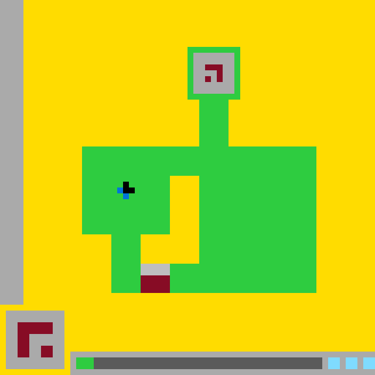

# `ls20` level `1` — LEFT / LEFT / DOWN

- **Full game ID:** `ls20`
- **State:** `NOT_FINISHED`
- **Image hash:** `c21b4677850b6e9c`
- **Incoming action:** `ACTION2`

## Navigation

- [Level start](../../../README.md)
- [Parent state](../README.md)

## Image



## Files

- [state.json](state.json)
- [differences.pl](differences.pl)
- [objects.pl](objects.pl)
- [redraw.pl](redraw.pl)
- [redraw_diff.pl](redraw_diff.pl)
- [similarities.pl](similarities.pl)

## `objects.pl`

```prolog
coordinate_system(canvas_pixels, 640, 640, origin_top_left, x_right, y_down).
cell_scale(10).

color(yellow, rgb(255,220,0)).
color(green, rgb(46,204,64)).
color(light_gray, rgb(170,170,170)).
color(dark_gray, rgb(102,102,102)).
color(maroon, rgb(133,20,75)).
color(blue, rgb(0,116,217)).
color(light_blue, rgb(127,219,255)).
color(black, rgb(0,0,0)).

object(background, background).
bbox(background, 0, 0, 640, 640).
object_colors(background, [yellow]).
geometry(background, rectangle(0,0,640,640)).
layer(background, 0).
turtle_program(background,
    [penup,set_pos(0,0),setcolor(yellow),pendown,fill_rect(640,640),penup]).

object(left_sidebar, boundary_strip).
bbox(left_sidebar, 0, 0, 40, 520).
object_colors(left_sidebar, [light_gray]).
geometry(left_sidebar, rectangle(0,0,40,520)).
layer(left_sidebar, 1).
touches_canvas_edge(left_sidebar, left).
touches_canvas_edge(left_sidebar, top).
adjacent(left_sidebar, background, right_edge).
turtle_program(left_sidebar,
    [penup,set_pos(0,0),setcolor(light_gray),pendown,fill_rect(40,520),penup]).

object(main_green_structure, traversable_structure).
bbox(main_green_structure, 140, 80, 400, 420).
object_colors(main_green_structure, [green]).
geometry(main_green_structure,
    union_rectangles([
        rect(320,80,90,90),
        rect(340,160,50,90),
        rect(140,250,400,150),
        rect(190,400,50,100),
        rect(340,400,200,100),
        rect(290,450,50,50)
    ])).
connected(main_green_structure).
layer(main_green_structure, 2).
turtle_program(main_green_structure,
    [penup,setcolor(green),
     set_pos(320,80),pendown,fill_rect(90,90),penup,
     set_pos(340,160),pendown,fill_rect(50,90),penup,
     set_pos(140,250),pendown,fill_rect(400,150),penup,
     set_pos(190,400),pendown,fill_rect(50,100),penup,
     set_pos(340,400),pendown,fill_rect(200,100),penup,
     set_pos(290,450),pendown,fill_rect(50,50),penup]).

object(main_cutout, open_negative_space).
bbox(main_cutout, 240, 300, 100, 150).
object_colors(main_cutout, [yellow]).
geometry(main_cutout,
    union_rectangles([
        rect(290,300,50,150),
        rect(240,400,50,50)
    ])).
open_to_background(main_cutout, left).
adjacent(main_cutout, main_green_structure, upper_edge).
adjacent(main_cutout, main_green_structure, right_edge).
adjacent(main_cutout, main_green_structure, lower_edge).
layer(main_cutout, 3).
turtle_program(main_cutout,
    [penup,setcolor(yellow),
     set_pos(290,300),pendown,fill_rect(50,150),penup,
     set_pos(240,400),pendown,fill_rect(50,50),penup]).

object(top_terminal_panel, inset_panel).
bbox(top_terminal_panel, 330, 90, 70, 70).
object_colors(top_terminal_panel, [light_gray]).
geometry(top_terminal_panel, rectangle(330,90,70,70)).
embedded_in(top_terminal_panel, main_green_structure).
adjacent(top_terminal_panel, main_green_structure, all_four_edges).
layer(top_terminal_panel, 4).
turtle_program(top_terminal_panel,
    [penup,set_pos(330,90),setcolor(light_gray),pendown,fill_rect(70,70),penup]).

object(top_terminal_glyph, glyph).
bbox(top_terminal_glyph, 350, 110, 30, 30).
object_colors(top_terminal_glyph, [maroon]).
geometry(top_terminal_glyph,
    union_rectangles([
        rect(350,110,30,10),
        rect(370,120,10,20),
        rect(350,130,10,10)
    ])).
component_count(top_terminal_glyph, 2).
contains(top_terminal_panel, top_terminal_glyph).
layer(top_terminal_glyph, 5).
turtle_program(top_terminal_glyph,
    [penup,setcolor(maroon),
     set_pos(350,110),pendown,fill_rect(30,10),penup,
     set_pos(370,120),pendown,fill_rect(10,20),penup,
     set_pos(350,130),pendown,fill_rect(10,10),penup]).

object(player_black, player_component).
bbox(player_black, 210, 310, 20, 20).
object_colors(player_black, [black]).
geometry(player_black, rectangle(210,310,20,20)).
contained_in(player_black, main_green_structure).
adjacent(player_black, player_blue, edge_contact).
layer(player_black, 6).
turtle_program(player_black,
    [penup,set_pos(210,310),setcolor(black),pendown,fill_rect(20,20),penup]).

object(player_blue, player_component).
bbox(player_blue, 200, 320, 20, 20).
object_colors(player_blue, [blue]).
geometry(player_blue,
    union_rectangles([
        rect(200,320,10,10),
        rect(210,330,10,10)
    ])).
component_count(player_blue, 2).
contained_in(player_blue, main_green_structure).
adjacent(player_blue, player_black, edge_contact).
layer(player_blue, 7).
turtle_program(player_blue,
    [penup,setcolor(blue),
     set_pos(200,320),pendown,fill_rect(10,10),penup,
     set_pos(210,330),pendown,fill_rect(10,10),penup]).

composite_object(player, [player_black,player_blue]).
bbox(player, 200, 310, 30, 30).
object_colors(player, [black,blue]).
contained_in(player, main_green_structure).

object(lower_terminal_cap, terminal_component).
bbox(lower_terminal_cap, 240, 450, 50, 20).
object_colors(lower_terminal_cap, [light_gray]).
geometry(lower_terminal_cap, rectangle(240,450,50,20)).
adjacent(lower_terminal_cap, lower_terminal_core, lower_edge).
adjacent(lower_terminal_cap, main_green_structure, left_right_edges).
layer(lower_terminal_cap, 8).
turtle_program(lower_terminal_cap,
    [penup,set_pos(240,450),setcolor(light_gray),pendown,fill_rect(50,20),penup]).

object(lower_terminal_core, terminal_component).
bbox(lower_terminal_core, 240, 470, 50, 30).
object_colors(lower_terminal_core, [maroon]).
geometry(lower_terminal_core, rectangle(240,470,50,30)).
adjacent(lower_terminal_core, lower_terminal_cap, upper_edge).
adjacent(lower_terminal_core, main_green_structure, left_right_edges).
layer(lower_terminal_core, 9).
turtle_program(lower_terminal_core,
    [penup,set_pos(240,470),setcolor(maroon),pendown,fill_rect(50,30),penup]).

composite_object(lower_terminal, [lower_terminal_cap,lower_terminal_core]).
bbox(lower_terminal, 240, 450, 50, 50).
object_colors(lower_terminal, [light_gray,maroon]).
embedded_in(lower_terminal, main_green_structure).

object(lower_left_panel, ui_panel).
bbox(lower_left_panel, 10, 530, 100, 100).
object_colors(lower_left_panel, [light_gray]).
geometry(lower_left_panel, rectangle(10,530,100,100)).
contained_in(lower_left_panel, background).
layer(lower_left_panel, 10).
turtle_program(lower_left_panel,
    [penup,set_pos(10,530),setcolor(light_gray),pendown,fill_rect(100,100),penup]).

object(lower_left_glyph, glyph).
bbox(lower_left_glyph, 30, 550, 60, 60).
object_colors(lower_left_glyph, [maroon]).
geometry(lower_left_glyph,
    union_rectangles([
        rect(30,550,60,20),
        rect(30,570,20,40),
        rect(70,590,20,20)
    ])).
component_count(lower_left_glyph, 2).
contains(lower_left_panel, lower_left_glyph).
layer(lower_left_glyph, 11).
turtle_program(lower_left_glyph,
    [penup,setcolor(maroon),
     set_pos(30,550),pendown,fill_rect(60,20),penup,
     set_pos(30,570),pendown,fill_rect(20,40),penup,
     set_pos(70,590),pendown,fill_rect(20,20),penup]).

object(bottom_toolbar, ui_panel).
bbox(bottom_toolbar, 120, 600, 520, 40).
object_colors(bottom_toolbar, [light_gray]).
geometry(bottom_toolbar, rectangle(120,600,520,40)).
touches_canvas_edge(bottom_toolbar, right).
touches_canvas_edge(bottom_toolbar, bottom).
layer(bottom_toolbar, 12).
turtle_program(bottom_toolbar,
    [penup,set_pos(120,600),setcolor(light_gray),pendown,fill_rect(520,40),penup]).

object(toolbar_green_segment, status_segment).
bbox(toolbar_green_segment, 130, 610, 30, 20).
object_colors(toolbar_green_segment, [green]).
geometry(toolbar_green_segment, rectangle(130,610,30,20)).
contained_in(toolbar_green_segment, bottom_toolbar).
adjacent(toolbar_green_segment, toolbar_dark_segment, right_edge).
layer(toolbar_green_segment, 13).
turtle_program(toolbar_green_segment,
    [penup,set_pos(130,610),setcolor(green),pendown,fill_rect(30,20),penup]).

object(toolbar_dark_segment, status_segment).
bbox(toolbar_dark_segment, 160, 610, 390, 20).
object_colors(toolbar_dark_segment, [dark_gray]).
geometry(toolbar_dark_segment, rectangle(160,610,390,20)).
contained_in(toolbar_dark_segment, bottom_toolbar).
adjacent(toolbar_dark_segment, toolbar_green_segment, left_edge).
layer(toolbar_dark_segment, 13).
turtle_program(toolbar_dark_segment,
    [penup,set_pos(160,610),setcolor(dark_gray),pendown,fill_rect(390,20),penup]).

object(toolbar_blue_slot_1, status_slot).
bbox(toolbar_blue_slot_1, 560, 610, 20, 20).
object_colors(toolbar_blue_slot_1, [light_blue]).
geometry(toolbar_blue_slot_1, rectangle(560,610,20,20)).
contained_in(toolbar_blue_slot_1, bottom_toolbar).
layer(toolbar_blue_slot_1, 13).
turtle_program(toolbar_blue_slot_1,
    [penup,set_pos(560,610),setcolor(light_blue),pendown,fill_rect(20,20),penup]).

object(toolbar_blue_slot_2, status_slot).
bbox(toolbar_blue_slot_2, 590, 610, 20, 20).
object_colors(toolbar_blue_slot_2, [light_blue]).
geometry(toolbar_blue_slot_2, rectangle(590,610,20,20)).
contained_in(toolbar_blue_slot_2, bottom_toolbar).
layer(toolbar_blue_slot_2, 13).
turtle_program(toolbar_blue_slot_2,
    [penup,set_pos(590,610),setcolor(light_blue),pendown,fill_rect(20,20),penup]).

object(toolbar_blue_slot_3, status_slot).
bbox(toolbar_blue_slot_3, 620, 610, 20, 20).
object_colors(toolbar_blue_slot_3, [light_blue]).
geometry(toolbar_blue_slot_3, rectangle(620,610,20,20)).
contained_in(toolbar_blue_slot_3, bottom_toolbar).
touches_canvas_edge(toolbar_blue_slot_3, right).
layer(toolbar_blue_slot_3, 13).
turtle_program(toolbar_blue_slot_3,
    [penup,set_pos(620,610),setcolor(light_blue),pendown,fill_rect(20,20),penup]).

aligned_vertical(top_terminal_panel, main_green_structure).
aligned_vertical(top_terminal_glyph, lower_terminal).
aligned_horizontal(player, main_cutout).
above(top_terminal_panel, player).
above(player, lower_terminal).
left_of(lower_left_panel, bottom_toolbar).
disjoint(lower_left_panel, bottom_toolbar).
render_order([
    background,
    left_sidebar,
    main_green_structure,
    main_cutout,
    top_terminal_panel,
    top_terminal_glyph,
    player_black,
    player_blue,
    lower_terminal_cap,
    lower_terminal_core,
    lower_left_panel,
    lower_left_glyph,
    bottom_toolbar,
    toolbar_green_segment,
    toolbar_dark_segment,
    toolbar_blue_slot_1,
    toolbar_blue_slot_2,
    toolbar_blue_slot_3
]).
```

## `differences.pl`

```prolog
comparison_basis(rendered_pixels_and_supplied_object_descriptions).

cell_scale(10).

color_equivalent(gray, light_gray).
color_equivalent(cyan, light_blue).

object_correspondence(background_1, background).
object_correspondence(left_wall_1, left_sidebar).
object_correspondence(structure_1, main_green_structure).
object_correspondence(chamber_1, top_terminal_panel).
object_correspondence(chamber_glyph_1, top_terminal_glyph).
object_correspondence(player_1, player).
object_correspondence(portal_cap_1, lower_terminal_cap).
object_correspondence(portal_1, lower_terminal_core).
object_correspondence(control_panel_1, lower_left_panel).
object_correspondence(control_glyph_1, lower_left_glyph).
object_correspondence(status_panel_1, bottom_toolbar).
object_correspondence(status_green_1, toolbar_green_segment).
object_correspondence(status_bar_1, toolbar_dark_segment).
object_correspondence(status_slot_1, toolbar_blue_slot_1).
object_correspondence(status_slot_2, toolbar_blue_slot_2).
object_correspondence(status_slot_3, toolbar_blue_slot_3).

observation(unchanged_object(background_1, background)).
observation(unchanged_object(left_wall_1, left_sidebar)).
observation(unchanged_object(structure_1, main_green_structure)).
observation(unchanged_object(chamber_1, top_terminal_panel)).
observation(unchanged_object(chamber_glyph_1, top_terminal_glyph)).
observation(unchanged_object(player_1, player)).
observation(unchanged_object(portal_cap_1, lower_terminal_cap)).
observation(unchanged_object(portal_1, lower_terminal_core)).
observation(unchanged_object(control_panel_1, lower_left_panel)).
observation(unchanged_object(control_glyph_1, lower_left_glyph)).
observation(unchanged_object(status_panel_1, bottom_toolbar)).
observation(unchanged_object(status_slot_1, toolbar_blue_slot_1)).
observation(unchanged_object(status_slot_2, toolbar_blue_slot_2)).
observation(unchanged_object(status_slot_3, toolbar_blue_slot_3)).

observation(changed_object(
    status_green_1,
    toolbar_green_segment,
    [resized(size(20,20), size(30,20)),
     right_edge_shifted(150,160)]
)).

observation(changed_object(
    status_bar_1,
    toolbar_dark_segment,
    [moved(point(150,610), point(160,610)),
     resized(size(400,20), size(390,20)),
     left_edge_shifted(150,160),
     right_edge_unchanged(550)]
)).

observation(resized_object(
    status_green_1,
    toolbar_green_segment,
    resize(size(20,20), size(30,20))
)).

observation(resized_object(
    status_bar_1,
    toolbar_dark_segment,
    resize(size(400,20), size(390,20))
)).

observation(moved_object(
    status_bar_1,
    toolbar_dark_segment,
    point(150,610),
    point(160,610)
)).

observation(pixel_region_recolored(
    rectangle(150,610,10,20),
    dark_gray,
    green
)).

observation(status_boundary_shift(
    boundary(status_green_1, status_bar_1),
    boundary(toolbar_green_segment, toolbar_dark_segment),
    delta(10,0)
)).

observation(total_status_meter_extent_unchanged(
    interval(130,550),
    interval(130,550)
)).

observation(no_scene_object_added).
observation(no_scene_object_removed).
observation(no_whole_object_recolored).
observation(no_player_motion).
observation(no_terminal_change).
observation(no_canvas_size_change).

representation_change(structure_1, main_green_structure,
    explicit_negative_space(main_cutout)).
representation_change(player_1, player,
    decomposed_into([player_black, player_blue])).
representation_change(lower_terminal_pair, lower_terminal,
    composite_grouping([lower_terminal_cap, lower_terminal_core])).
representation_change(gray, light_gray, palette_name_only).
representation_change(cyan, light_blue, palette_name_only).

representation_added_object(main_cutout).
representation_added_component(player_black).
representation_added_component(player_blue).
representation_added_composite(player).
representation_added_composite(lower_terminal).

hypothesis(action_effect(
    last_action,
    advanced_status_meter(one_cell)
)).

hypothesis(action_effect(
    last_action,
    transferred_status_area(dark_gray, green, rectangle(150,610,10,20))
)).

hypothesis(status_meter_semantics(
    toolbar_green_segment,
    completed_or_available_amount
)).

hypothesis(status_meter_semantics(
    toolbar_dark_segment,
    remaining_amount
)).

hypothesis_confidence(advanced_status_meter(one_cell), high).
hypothesis_confidence(status_meter_semantics, medium).

added_object(Object) :-
    observation(added_object(Object)).

removed_object(Object) :-
    observation(removed_object(Object)).

changed_object(Previous, Current, Changes) :-
    observation(changed_object(Previous, Current, Changes)).

moved_object(Previous, Current, From, To) :-
    observation(moved_object(Previous, Current, From, To)).

recolored_object(Previous, Current, Recoloring) :-
    observation(recolored_object(Previous, Current, Recoloring)).

resized_object(Previous, Current, Resizing) :-
    observation(resized_object(Previous, Current, Resizing)).

unchanged_object(Previous, Current) :-
    observation(unchanged_object(Previous, Current)).

action_effect(Action, Effect) :-
    hypothesis(action_effect(Action, Effect)).

scene_object_added(Object) :-
    added_object(Object).

scene_object_removed(Object) :-
    removed_object(Object).

representation_only_change(Previous, Current) :-
    representation_change(Previous, Current, _),
    \+ changed_object(Previous, Current, _).

status_meter_advanced_by_cells(Cells) :-
    observation(status_boundary_shift(_, _, delta(DX,0))),
    cell_scale(Scale),
    Cells is DX // Scale.

status_meter_advanced_by_pixels(Pixels) :-
    observation(status_boundary_shift(_, _, delta(Pixels,0))).

only_rendered_change(rectangle(150,610,10,20)) :-
    observation(pixel_region_recolored(
        rectangle(150,610,10,20),
        dark_gray,
        green
    )),
    observation(no_player_motion),
    observation(no_terminal_change),
    observation(no_scene_object_added),
    observation(no_scene_object_removed).
```

## Actions

- [`LEFT`](LEFT/README.md)
