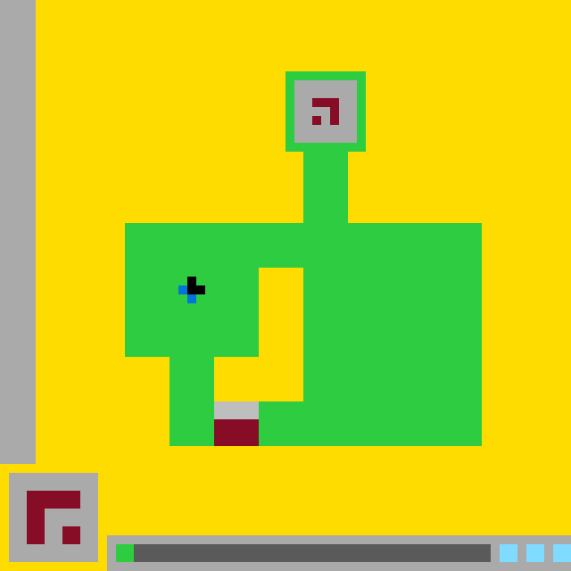

# `ls20` level `1` — LEFT / LEFT

## Navigation

[Level start](../../README.md) · [Parent](../README.md)

### Actions

[`DOWN`](DOWN/README.md) · [`LEFT`](LEFT/README.md)

---

- **Full game ID:** `ls20-9607627b`
- **State:** `NOT_FINISHED`
- **Image hash:** `256a4d182c9894fb`
- **Incoming action:** `ACTION3`

## Image



## Files

- [image.png](image.png)
- [state.json](state.json)
- [object_registry.pl](../../object_registry.pl) — shared level registry (26 canonical identities)
- [differences.pl](differences.pl)
- [objects.pl](objects.pl)
- [rules.pl](rules.pl)
- [similarities.pl](similarities.pl)
- [turtle_from_diff.pl](turtle_from_diff.pl)
- [turtle_from_image.pl](turtle_from_image.pl)

## Embedded files

*Canonical identities are shared through [`object_registry.pl`](../../object_registry.pl) and are not repeated in every node.*

<details>
<summary><code>state.json</code></summary>

````json
{
  "state": "NOT_FINISHED",
  "observation": {
    "game_id": "ls20-9607627b",
    "state": "NOT_FINISHED",
    "levels_completed": 0,
    "win_levels": 7,
    "action_input": {
      "id": "ACTION3",
      "data": {},
      "reasoning": null
    },
    "guid": "d73d77e4-0e6a-47a1-afc3-0d16210add36",
    "full_reset": false,
    "available_actions": [
      1,
      2,
      3,
      4
    ]
  },
  "step_count": 1,
  "game_id": "ls20-9607627b",
  "game_directory": "ls20",
  "level": "1",
  "image_hash": "256a4d182c9894fb",
  "incoming_action": "ACTION3",
  "action_directory": "LEFT",
  "action_data": {},
  "parent_node": "..",
  "action_path": [
    "LEFT",
    "LEFT"
  ]
}
````

[Open `state.json`](state.json)

</details>

<details>
<summary><code>differences.pl</code></summary>

````prolog
added_object(_) :-
    fail.

removed_object(_) :-
    fail.

recolored_object(_, _, _) :-
    fail.

resized_object(_, _, _) :-
    fail.

moved_object(
    bottom_center_gate,
    position(29, 45),
    position(24, 45),
    delta(-5, 0)
).
moved_object(
    gate_gray_header,
    position(29, 45),
    position(24, 45),
    delta(-5, 0)
).
moved_object(
    gate_burgundy_panel,
    position(29, 47),
    position(24, 47),
    delta(-5, 0)
).

changed_object(
    bottom_center_gate,
    bounding_box(29, 45, 5, 5),
    bounding_box(24, 45, 5, 5)
).
changed_object(
    gate_gray_header,
    bounding_box(29, 45, 5, 2),
    bounding_box(24, 45, 5, 2)
).
changed_object(
    gate_burgundy_panel,
    bounding_box(29, 47, 5, 3),
    bounding_box(24, 47, 5, 3)
).
changed_object(
    bottom_center_gate,
    center(31, 47),
    center(26, 47)
).
changed_object(
    fortress_lower_bridge,
    geometry(interrupted_horizontal_bar),
    geometry(gate_interrupted_horizontal_bar)
).
changed_object(
    fortress_lower_bridge,
    component_rectangles([
        rect(19, 45, 10, 5),
        rect(34, 45, 20, 5)
    ]),
    component_rectangles([
        rect(19, 45, 5, 5),
        rect(29, 45, 25, 5)
    ])
).
changed_object(
    fortress_main_body,
    green_fill(absent, rect(29, 45, 5, 5)),
    green_fill(present, rect(29, 45, 5, 5))
).
changed_object(
    green_fortress,
    green_fill(absent, rect(29, 45, 5, 5)),
    green_fill(present, rect(29, 45, 5, 5))
).
changed_object(
    bottom_center_gate,
    embedded_in(fortress_main_body),
    embedded_in(fortress_lower_bridge)
).

property_added(bottom_center_gate, state(shifted_left)).

removed_relation(embedded_in(bottom_center_gate, fortress_main_body)).
added_relation(embedded_in(bottom_center_gate, fortress_lower_bridge)).
removed_relation(adjacent(fortress_right_wing, bottom_center_gate)).

unchanged_object(yellow_playfield, observed_visual_properties).
unchanged_object(left_boundary_wall, observed_visual_properties).
unchanged_object(fortress_left_wing, observed_visual_properties).
unchanged_object(fortress_right_wing, observed_visual_properties).
unchanged_object(fortress_upper_stem, observed_visual_properties).
unchanged_object(fortress_inner_courtyard, observed_visual_properties).
unchanged_object(upper_chamber_frame, observed_visual_properties).
unchanged_object(upper_chamber_interior, observed_visual_properties).
unchanged_object(upper_burgundy_glyph, observed_visual_properties).
unchanged_object(blue_black_player, observed_visual_properties).
unchanged_object(player_black_core, observed_visual_properties).
unchanged_object(player_blue_tail, observed_visual_properties).
unchanged_object(lower_left_symbol_card, observed_visual_properties).
unchanged_object(lower_left_burgundy_glyph, observed_visual_properties).
unchanged_object(bottom_status_panel, observed_visual_properties).
unchanged_object(bottom_status_track, observed_visual_properties).
unchanged_object(cyan_status_blocks, observed_visual_properties).

action_effect(
    action3,
    observed(moved(bottom_center_gate, delta(-5, 0)))
).
action_effect(
    action3,
    observed(moved(gate_gray_header, delta(-5, 0)))
).
action_effect(
    action3,
    observed(moved(gate_burgundy_panel, delta(-5, 0)))
).
action_effect(
    action3,
    observed(reconfigured(fortress_lower_bridge))
).
action_effect(
    action3,
    observed(filled_region(green_fortress, rect(29, 45, 5, 5)))
).

hypothesis(
    cause_of_gate_shift,
    unspecified_because_action_payload_is_empty
).
````

[Open `differences.pl`](differences.pl)

</details>

<details>
<summary><code>objects.pl</code></summary>

````prolog
% Canonical object identities live in the level-wide registry.
:- ensure_loaded('../../object_registry.pl').

% State-specific facts for this action-tree node.
% Canonical object identities live in the level-wide registry.

% State-specific facts for this action-tree node.
% Canonical object identities live in the level-wide registry.

% State-specific facts for this action-tree node.
% Canonical object identities live in the level-wide registry.

% State-specific facts for this action-tree node.
% Canonical object identities live in the level-wide registry.

% State-specific facts for this action-tree node.
% Canonical object identities live in the level-wide registry.

% State-specific facts for this action-tree node.
% Canonical object identities live in the level-wide registry.

% State-specific facts for this action-tree node.
% Canonical object identities live in the level-wide registry.

% State-specific facts for this action-tree node.
% Canonical object identities live in the level-wide registry.

% State-specific facts for this action-tree node.
% Canonical object identities live in the level-wide registry.

% State-specific facts for this action-tree node.
% Canonical object identities live in the level-wide registry.

% State-specific facts for this action-tree node.
% Canonical object identities live in the level-wide registry.

% State-specific facts for this action-tree node.
% Canonical object identities live in the level-wide registry.

% State-specific facts for this action-tree node.
% Canonical object identities live in the level-wide registry.

% State-specific facts for this action-tree node.
% Canonical object identities live in the level-wide registry.

% State-specific facts for this action-tree node.
% Canonical object identities live in the level-wide registry.

% State-specific facts for this action-tree node.
% Canonical object identities live in the level-wide registry.

% State-specific facts for this action-tree node.
% Canonical object identities live in the level-wide registry.

% State-specific facts for this action-tree node.
% Canonical object identities live in the level-wide registry.

% State-specific facts for this action-tree node.
% Canonical object identities live in the level-wide registry.

% State-specific facts for this action-tree node.
% Canonical object identities live in the level-wide registry.

% State-specific facts for this action-tree node.
% Canonical object identities live in the level-wide registry.

% State-specific facts for this action-tree node.
% Canonical object identities live in the level-wide registry.

% State-specific facts for this action-tree node.
% Canonical object identities live in the level-wide registry.

% State-specific facts for this action-tree node.
% Canonical object identities live in the level-wide registry.

% State-specific facts for this action-tree node.
% Canonical object identities live in the level-wide registry.

% State-specific facts for this action-tree node.
% Canonical object identities live in the level-wide registry.

% State-specific facts for this action-tree node.
% Canonical object identities live in the level-wide registry.

% State-specific facts for this action-tree node.
% Canonical object identities live in the level-wide registry.

% State-specific facts for this action-tree node.
% Canonical object identities live in the level-wide registry.

% State-specific facts for this action-tree node.
% Canonical object identities live in the level-wide registry.

% State-specific facts for this action-tree node.
% Canonical object identities live in the level-wide registry.

% State-specific facts for this action-tree node.
% Canonical object identities live in the level-wide registry.

% State-specific facts for this action-tree node.
% Canonical object identities live in the level-wide registry.

% State-specific facts for this action-tree node.
% Canonical object identities live in the level-wide registry.

% State-specific facts for this action-tree node.
% Canonical object identities live in the level-wide registry.

% State-specific facts for this action-tree node.
% Canonical object identities live in the level-wide registry.

% State-specific facts for this action-tree node.
% Canonical object identities live in the level-wide registry.

% State-specific facts for this action-tree node.
% Canonical object identities live in the level-wide registry.

% State-specific facts for this action-tree node.
% Canonical object identities live in the level-wide registry.

% State-specific facts for this action-tree node.
% Canonical object identities live in the level-wide registry.

% State-specific facts for this action-tree node.
% Canonical object identities live in the level-wide registry.

% State-specific facts for this action-tree node.
% Canonical object identities live in the level-wide registry.

% State-specific facts for this action-tree node.
% Canonical object identities live in the level-wide registry.

% State-specific facts for this action-tree node.
% Canonical object identities live in the level-wide registry.

% State-specific facts for this action-tree node.
% Canonical object identities live in the level-wide registry.

% State-specific facts for this action-tree node.
% Canonical object identities live in the level-wide registry.

% State-specific facts for this action-tree node.
% Canonical object identities live in the level-wide registry.

% State-specific facts for this action-tree node.
% Canonical object identities live in the level-wide registry.

% State-specific facts for this action-tree node.
% Canonical object identities live in the level-wide registry.

% State-specific facts for this action-tree node.
% Canonical object identities live in the level-wide registry.

% State-specific facts for this action-tree node.
% Canonical object identities live in the level-wide registry.

% State-specific facts for this action-tree node.
% Canonical object identities live in the level-wide registry.

% State-specific facts for this action-tree node.
% Canonical object identities live in the level-wide registry.

% State-specific facts for this action-tree node.
% Canonical object identities live in the level-wide registry.

% State-specific facts for this action-tree node.
% Canonical object identities live in the level-wide registry.

% State-specific facts for this action-tree node.
% Canonical object identities live in the level-wide registry.

% State-specific facts for this action-tree node.
% Canonical object identities live in the level-wide registry.

% State-specific facts for this action-tree node.
% Canonical object identities live in the level-wide registry.

% State-specific facts for this action-tree node.
% Canonical object identities live in the level-wide registry.

% State-specific facts for this action-tree node.
% Canonical object identities live in the level-wide registry.

% State-specific facts for this action-tree node.
% Canonical object identities live in the level-wide registry.

% State-specific facts for this action-tree node.
% Canonical object identities live in the level-wide registry.

% State-specific facts for this action-tree node.
% Canonical object identities live in the level-wide registry.

% State-specific facts for this action-tree node.
% Canonical object identities live in the level-wide registry.

% State-specific facts for this action-tree node.
% Canonical object identities live in the level-wide registry.

% State-specific facts for this action-tree node.
% Canonical object identities live in the level-wide registry.

% State-specific facts for this action-tree node.
% Canonical object identities live in the level-wide registry.

% State-specific facts for this action-tree node.
% Canonical object identities live in the level-wide registry.

% State-specific facts for this action-tree node.
% Canonical object identities live in the level-wide registry.

% State-specific facts for this action-tree node.
% Canonical object identities live in the level-wide registry.

% State-specific facts for this action-tree node.
% Canonical object identities live in the level-wide registry.

% State-specific facts for this action-tree node.
% Canonical object identities live in the level-wide registry.

% State-specific facts for this action-tree node.
% Canonical object identities live in the level-wide registry.

% State-specific facts for this action-tree node.
% Canonical object identities live in the level-wide registry.

% State-specific facts for this action-tree node.
% Canonical object identities live in the level-wide registry.

% State-specific facts for this action-tree node.
% Canonical object identities live in the level-wide registry.

% State-specific facts for this action-tree node.
% Canonical object identities live in the level-wide registry.

% State-specific facts for this action-tree node.
% Canonical object identities live in the level-wide registry.

% State-specific facts for this action-tree node.
% Canonical object identities live in the level-wide registry.

% State-specific facts for this action-tree node.
% Canonical object identities live in the level-wide registry.

% State-specific facts for this action-tree node.
% Canonical object identities live in the level-wide registry.

% State-specific facts for this action-tree node.
% Canonical object identities live in the level-wide registry.

% State-specific facts for this action-tree node.
% Canonical object identities live in the level-wide registry.

% State-specific facts for this action-tree node.
% Canonical object identities live in the level-wide registry.

% State-specific facts for this action-tree node.
% Canonical object identities live in the level-wide registry.

% State-specific facts for this action-tree node.
% Canonical object identities live in the level-wide registry.

% State-specific facts for this action-tree node.
% Canonical object identities live in the level-wide registry.

% State-specific facts for this action-tree node.
% Canonical object identities live in the level-wide registry.

% State-specific facts for this action-tree node.
% Canonical object identities live in the level-wide registry.

% State-specific facts for this action-tree node.
% Canonical object identities live in the level-wide registry.

% State-specific facts for this action-tree node.
% Canonical object identities live in the level-wide registry.

% State-specific facts for this action-tree node.
% Canonical object identities live in the level-wide registry.

% State-specific facts for this action-tree node.
% Canonical object identities live in the level-wide registry.

% State-specific facts for this action-tree node.
% Canonical object identities live in the level-wide registry.

% State-specific facts for this action-tree node.
% Canonical object identities live in the level-wide registry.

% State-specific facts for this action-tree node.
state_id(action3).
incoming_action(action3, {}).

canvas_size(64, 64).
coordinate_system(origin_top_left, x_right, y_down).
grid_cell_size_pixels(10).

visible(yellow_playfield).
visible(left_boundary_wall).
visible(green_fortress).
visible(fortress_main_body).
visible(fortress_left_wing).
visible(fortress_right_wing).
visible(fortress_lower_bridge).
visible(fortress_upper_stem).
visible(fortress_inner_courtyard).
visible(upper_chamber_frame).
visible(upper_chamber_interior).
visible(upper_burgundy_glyph).
visible(blue_black_player).
visible(player_black_core).
visible(player_blue_tail).
visible(bottom_center_gate).
visible(gate_gray_header).
visible(gate_burgundy_panel).
visible(lower_left_symbol_card).
visible(lower_left_burgundy_glyph).
visible(bottom_status_panel).
visible(bottom_status_track).
visible(cyan_status_blocks).

bounding_box(yellow_playfield, 0, 0, 64, 64).
bounding_box(left_boundary_wall, 0, 0, 4, 52).
bounding_box(green_fortress, 14, 8, 40, 42).
bounding_box(fortress_main_body, 14, 25, 40, 25).
bounding_box(fortress_left_wing, 14, 25, 15, 15).
bounding_box(fortress_right_wing, 34, 25, 20, 25).
bounding_box(fortress_lower_bridge, 19, 45, 35, 5).
bounding_box(fortress_upper_stem, 34, 17, 5, 8).
bounding_box(fortress_inner_courtyard, 24, 30, 10, 15).
bounding_box(upper_chamber_frame, 32, 8, 9, 9).
bounding_box(upper_chamber_interior, 33, 9, 7, 7).
bounding_box(upper_burgundy_glyph, 35, 11, 3, 3).
bounding_box(blue_black_player, 20, 31, 3, 3).
bounding_box(player_black_core, 21, 31, 2, 2).
bounding_box(player_blue_tail, 20, 32, 2, 2).
bounding_box(bottom_center_gate, 24, 45, 5, 5).
bounding_box(gate_gray_header, 24, 45, 5, 2).
bounding_box(gate_burgundy_panel, 24, 47, 5, 3).
bounding_box(lower_left_symbol_card, 1, 53, 10, 10).
bounding_box(lower_left_burgundy_glyph, 3, 55, 6, 6).
bounding_box(bottom_status_panel, 12, 60, 52, 4).
bounding_box(bottom_status_track, 13, 61, 42, 2).
bounding_box(cyan_status_blocks, 56, 61, 8, 2).

center(blue_black_player, 21, 32).
center(bottom_center_gate, 26, 47).
center(upper_chamber_interior, 36, 12).
center(lower_left_symbol_card, 5, 57).

color(yellow_playfield, yellow).
color(left_boundary_wall, light_gray).
color(green_fortress, green).
color(fortress_main_body, green).
color(fortress_left_wing, green).
color(fortress_right_wing, green).
color(fortress_lower_bridge, green).
color(fortress_upper_stem, green).
color(fortress_inner_courtyard, yellow).
color(upper_chamber_frame, green).
color(upper_chamber_interior, light_gray).
color(upper_burgundy_glyph, burgundy).
colors(blue_black_player, [blue, black]).
color(player_black_core, black).
color(player_blue_tail, blue).
colors(bottom_center_gate, [light_gray, burgundy]).
color(gate_gray_header, light_gray).
color(gate_burgundy_panel, burgundy).
color(lower_left_symbol_card, light_gray).
color(lower_left_burgundy_glyph, burgundy).
color(bottom_status_panel, light_gray).
color(bottom_status_track, dark_gray).
color(cyan_status_blocks, cyan).

geometry(yellow_playfield, background_with_occlusions).
geometry(left_boundary_wall, filled_vertical_rectangle).
geometry(green_fortress, connected_compound_structure).
geometry(fortress_main_body, stepped_block_region).
geometry(fortress_left_wing, filled_rectangle).
geometry(fortress_right_wing, filled_rectangle).
geometry(fortress_lower_bridge, gate_interrupted_horizontal_bar).
geometry(fortress_upper_stem, filled_vertical_rectangle).
geometry(fortress_inner_courtyard, l_shaped_hole).
geometry(upper_chamber_frame, one_cell_thick_rectangular_frame).
geometry(upper_chamber_interior, filled_rectangle).
geometry(upper_burgundy_glyph, hooked_angular_glyph).
geometry(blue_black_player, asymmetric_five_cell_marker).
geometry(player_black_core, three_cell_corner_cluster).
geometry(player_blue_tail, two_cell_diagonal_tail).
geometry(bottom_center_gate, vertically_partitioned_rectangle).
geometry(gate_gray_header, filled_horizontal_rectangle).
geometry(gate_burgundy_panel, filled_rectangle).
geometry(lower_left_symbol_card, filled_square_panel).
geometry(lower_left_burgundy_glyph, angular_thick_glyph).
geometry(bottom_status_panel, filled_horizontal_panel).
geometry(bottom_status_track, filled_horizontal_rectangle).
geometry(cyan_status_blocks, three_separated_rectangular_blocks).

component_of(fortress_main_body, green_fortress).
component_of(fortress_left_wing, green_fortress).
component_of(fortress_right_wing, green_fortress).
component_of(fortress_lower_bridge, green_fortress).
component_of(fortress_upper_stem, green_fortress).
component_of(upper_chamber_frame, green_fortress).
component_of(player_black_core, blue_black_player).
component_of(player_blue_tail, blue_black_player).
component_of(gate_gray_header, bottom_center_gate).
component_of(gate_burgundy_panel, bottom_center_gate).
component_of(lower_left_burgundy_glyph, lower_left_symbol_card).
component_of(bottom_status_track, bottom_status_panel).
component_of(cyan_status_blocks, bottom_status_panel).

contains(green_fortress, fortress_inner_courtyard).
contains(green_fortress, bottom_center_gate).
contains(fortress_main_body, fortress_inner_courtyard).
contains(fortress_main_body, blue_black_player).
contains(upper_chamber_frame, upper_chamber_interior).
contains(upper_chamber_interior, upper_burgundy_glyph).
contains(lower_left_symbol_card, lower_left_burgundy_glyph).
contains(bottom_status_panel, bottom_status_track).
contains(bottom_status_panel, cyan_status_blocks).

encloses(green_fortress, fortress_inner_courtyard).
encloses(upper_chamber_frame, upper_chamber_interior).

embedded_in(bottom_center_gate, fortress_lower_bridge).

overlays(blue_black_player, fortress_left_wing).
overlays(upper_burgundy_glyph, upper_chamber_interior).
overlays(lower_left_burgundy_glyph, lower_left_symbol_card).
overlays(bottom_status_track, bottom_status_panel).
overlays(cyan_status_blocks, bottom_status_panel).

adjacent(left_boundary_wall, yellow_playfield).
adjacent(upper_chamber_frame, fortress_upper_stem).
adjacent(fortress_upper_stem, fortress_main_body).
adjacent(fortress_left_wing, fortress_right_wing).
adjacent(fortress_left_wing, fortress_inner_courtyard).
adjacent(fortress_right_wing, fortress_inner_courtyard).
adjacent(fortress_lower_bridge, fortress_inner_courtyard).
adjacent(fortress_lower_bridge, bottom_center_gate).
adjacent(gate_gray_header, gate_burgundy_panel).
adjacent(bottom_status_track, cyan_status_blocks).

state(blue_black_player, stationary).
state(green_fortress, solid).
state(fortress_inner_courtyard, empty).
state(bottom_center_gate, closed).
state(bottom_center_gate, shifted_left).
state(bottom_status_panel, active).
state(cyan_status_blocks, three_lit_blocks).

component_box(fortress_main_body, 14, 25, 40, 5).
component_box(fortress_main_body, 14, 30, 15, 10).
component_box(fortress_main_body, 34, 30, 20, 20).
component_box(fortress_main_body, 19, 40, 5, 10).
component_box(fortress_main_body, 29, 45, 5, 5).

component_box(fortress_lower_bridge, 19, 45, 5, 5).
component_box(fortress_lower_bridge, 29, 45, 25, 5).

component_box(fortress_inner_courtyard, 29, 30, 5, 15).
component_box(fortress_inner_courtyard, 24, 40, 5, 5).

component_box(upper_burgundy_glyph, 35, 11, 3, 1).
component_box(upper_burgundy_glyph, 37, 12, 1, 2).
component_box(upper_burgundy_glyph, 35, 13, 1, 1).

component_box(lower_left_burgundy_glyph, 3, 55, 6, 2).
component_box(lower_left_burgundy_glyph, 3, 57, 2, 4).
component_box(lower_left_burgundy_glyph, 7, 59, 2, 2).

component_box(cyan_status_blocks, 56, 61, 2, 2).
component_box(cyan_status_blocks, 59, 61, 2, 2).
component_box(cyan_status_blocks, 62, 61, 2, 2).

turtle_program(yellow_playfield,
    [penup, set_pos(0,0), setcolor(yellow), pendown, fill_rect(64,64)]).

turtle_program(left_boundary_wall,
    [penup, set_pos(0,0), setcolor(light_gray), pendown, fill_rect(4,52)]).

turtle_program(green_fortress,
    [penup, setcolor(green),
     set_pos(32,8), pendown, fill_rect(9,1),
     penup, set_pos(32,9), pendown, fill_rect(1,7),
     penup, set_pos(40,9), pendown, fill_rect(1,7),
     penup, set_pos(32,16), pendown, fill_rect(9,1),
     penup, set_pos(34,17), pendown, fill_rect(5,8),
     penup, set_pos(14,25), pendown, fill_rect(40,5),
     penup, set_pos(14,30), pendown, fill_rect(15,10),
     penup, set_pos(34,30), pendown, fill_rect(20,20),
     penup, set_pos(19,40), pendown, fill_rect(5,10),
     penup, set_pos(29,45), pendown, fill_rect(5,5)]).

turtle_program(fortress_main_body,
    [penup, setcolor(green),
     set_pos(14,25), pendown, fill_rect(40,5),
     penup, set_pos(14,30), pendown, fill_rect(15,10),
     penup, set_pos(34,30), pendown, fill_rect(20,20),
     penup, set_pos(19,40), pendown, fill_rect(5,10),
     penup, set_pos(29,45), pendown, fill_rect(5,5)]).

turtle_program(fortress_left_wing,
    [penup, set_pos(14,25), setcolor(green), pendown, fill_rect(15,15)]).

turtle_program(fortress_right_wing,
    [penup, set_pos(34,25), setcolor(green), pendown, fill_rect(20,25)]).

turtle_program(fortress_lower_bridge,
    [penup, setcolor(green),
     set_pos(19,45), pendown, fill_rect(5,5),
     penup, set_pos(29,45), pendown, fill_rect(25,5)]).

turtle_program(fortress_upper_stem,
    [penup, set_pos(34,17), setcolor(green), pendown, fill_rect(5,8)]).

turtle_program(fortress_inner_courtyard,
    [penup, setcolor(yellow),
     set_pos(29,30), pendown, fill_rect(5,15),
     penup, set_pos(24,40), pendown, fill_rect(5,5)]).

turtle_program(upper_chamber_frame,
    [penup, setcolor(green),
     set_pos(32,8), pendown, fill_rect(9,1),
     penup, set_pos(32,9), pendown, fill_rect(1,7),
     penup, set_pos(40,9), pendown, fill_rect(1,7),
     penup, set_pos(32,16), pendown, fill_rect(9,1)]).

turtle_program(upper_chamber_interior,
    [penup, set_pos(33,9), setcolor(light_gray), pendown, fill_rect(7,7)]).

turtle_program(upper_burgundy_glyph,
    [penup, setcolor(burgundy),
     set_pos(35,11), pendown, fill_rect(3,1),
     penup, set_pos(37,12), pendown, fill_rect(1,2),
     penup, set_pos(35,13), pendown, set_cell]).

turtle_program(blue_black_player,
    [penup, setcolor(black),
     set_pos(21,31), pendown, set_cell,
     penup, set_pos(21,32), pendown, set_cell,
     penup, set_pos(22,32), pendown, set_cell,
     penup, setcolor(blue),
     set_pos(20,32), pendown, set_cell,
     penup, set_pos(21,33), pendown, set_cell]).

turtle_program(player_black_core,
    [penup, setcolor(black),
     set_pos(21,31), pendown, set_cell,
     penup, set_pos(21,32), pendown, set_cell,
     penup, set_pos(22,32), pendown, set_cell]).

turtle_program(player_blue_tail,
    [penup, setcolor(blue),
     set_pos(20,32), pendown, set_cell,
     penup, set_pos(21,33), pendown, set_cell]).

turtle_program(bottom_center_gate,
    [penup, set_pos(24,45), setcolor(light_gray), pendown, fill_rect(5,2),
     penup, set_pos(24,47), setcolor(burgundy), pendown, fill_rect(5,3)]).

turtle_program(gate_gray_header,
    [penup, set_pos(24,45), setcolor(light_gray), pendown, fill_rect(5,2)]).

turtle_program(gate_burgundy_panel,
    [penup, set_pos(24,47), setcolor(burgundy), pendown, fill_rect(5,3)]).

turtle_program(lower_left_symbol_card,
    [penup, set_pos(1,53), setcolor(light_gray), pendown, fill_rect(10,10)]).

turtle_program(lower_left_burgundy_glyph,
    [penup, setcolor(burgundy),
     set_pos(3,55), pendown, fill_rect(6,2),
     penup, set_pos(3,57), pendown, fill_rect(2,4),
     penup, set_pos(7,59), pendown, fill_rect(2,2)]).

turtle_program(bottom_status_panel,
    [penup, set_pos(12,60), setcolor(light_gray), pendown, fill_rect(52,4)]).

turtle_program(bottom_status_track,
    [penup, set_pos(13,61), setcolor(dark_gray), pendown, fill_rect(42,2)]).

turtle_program(cyan_status_blocks,
    [penup, setcolor(cyan),
     set_pos(56,61), pendown, fill_rect(2,2),
     penup, set_pos(59,61), pendown, fill_rect(2,2),
     penup, set_pos(62,61), pendown, fill_rect(2,2)]).
````

[Open `objects.pl`](objects.pl)

</details>

<details>
<summary><code>rules.pl</code></summary>

````prolog
observed_rule(
    action3_translates_closed_gate_assembly_left,
    observed_transition(
        preconditions([
            incoming_action(action3, '{}'),
            state(bottom_center_gate, closed),
            position(bottom_center_gate, 29, 45)
        ]),
        effects([
            moved(bottom_center_gate, delta(-5, 0)),
            moved(gate_gray_header, delta(-5, 0)),
            moved(gate_burgundy_panel, delta(-5, 0)),
            position(bottom_center_gate, 24, 45),
            position(gate_gray_header, 24, 45),
            position(gate_burgundy_panel, 24, 47),
            state(bottom_center_gate, shifted_left)
        ]),
        evidence([
            evidence_ref(differences_pl,
                moved_object(bottom_center_gate,
                    position(29, 45), position(24, 45), delta(-5, 0))),
            evidence_ref(differences_pl,
                moved_object(gate_gray_header,
                    position(29, 45), position(24, 45), delta(-5, 0))),
            evidence_ref(differences_pl,
                moved_object(gate_burgundy_panel,
                    position(29, 47), position(24, 47), delta(-5, 0))),
            evidence_ref(objects_pl,
                component_of(gate_gray_header, bottom_center_gate)),
            evidence_ref(objects_pl,
                component_of(gate_burgundy_panel, bottom_center_gate))
        ])
    )
).

observed_rule(
    action3_preserves_gate_appearance_and_closed_state,
    observed_transition(
        preconditions([
            bounding_box(bottom_center_gate, 29, 45, 5, 5),
            colors(bottom_center_gate, [light_gray, burgundy]),
            state(bottom_center_gate, closed)
        ]),
        effects([
            bounding_box(bottom_center_gate, 24, 45, 5, 5),
            colors(bottom_center_gate, [light_gray, burgundy]),
            state(bottom_center_gate, closed)
        ]),
        evidence([
            evidence_ref(differences_pl,
                changed_object(bottom_center_gate,
                    bounding_box(29, 45, 5, 5),
                    bounding_box(24, 45, 5, 5))),
            evidence_ref(differences_pl, no_recolored_object),
            evidence_ref(differences_pl, no_resized_object),
            evidence_ref(objects_pl,
                state(bottom_center_gate, closed))
        ])
    )
).

observed_rule(
    action3_reconfigures_bridge_around_shifted_gate,
    observed_transition(
        preconditions([
            embedded_in(bottom_center_gate, fortress_main_body),
            gate_footprint(rect(29, 45, 5, 5))
        ]),
        effects([
            embedded_in(bottom_center_gate, fortress_lower_bridge),
            reconfigured(fortress_lower_bridge),
            green_fill(green_fortress, present, rect(29, 45, 5, 5)),
            green_fill(fortress_main_body, present, rect(29, 45, 5, 5)),
            gate_interruption(fortress_lower_bridge, rect(24, 45, 5, 5))
        ]),
        evidence([
            evidence_ref(differences_pl,
                changed_object(fortress_lower_bridge,
                    geometry(interrupted_horizontal_bar),
                    geometry(gate_interrupted_horizontal_bar))),
            evidence_ref(differences_pl,
                changed_object(fortress_lower_bridge,
                    component_rectangles([
                        rect(19, 45, 10, 5),
                        rect(34, 45, 20, 5)
                    ]),
                    component_rectangles([
                        rect(19, 45, 5, 5),
                        rect(29, 45, 25, 5)
                    ]))),
            evidence_ref(differences_pl,
                changed_object(green_fortress,
                    green_fill(absent, rect(29, 45, 5, 5)),
                    green_fill(present, rect(29, 45, 5, 5)))),
            evidence_ref(differences_pl,
                removed_relation(
                    embedded_in(bottom_center_gate, fortress_main_body))),
            evidence_ref(differences_pl,
                added_relation(
                    embedded_in(bottom_center_gate, fortress_lower_bridge)))
        ])
    )
).

observed_rule(
    action3_does_not_move_player_or_change_status,
    observed_transition(
        preconditions([
            incoming_action(action3, '{}'),
            center(blue_black_player, 21, 32),
            state(cyan_status_blocks, three_lit_blocks)
        ]),
        effects([
            stationary(blue_black_player),
            center(blue_black_player, 21, 32),
            unchanged(cyan_status_blocks),
            state(cyan_status_blocks, three_lit_blocks)
        ]),
        evidence([
            evidence_ref(differences_pl,
                unchanged_object(blue_black_player,
                    observed_visual_properties)),
            evidence_ref(differences_pl,
                unchanged_object(player_black_core,
                    observed_visual_properties)),
            evidence_ref(differences_pl,
                unchanged_object(player_blue_tail,
                    observed_visual_properties)),
            evidence_ref(differences_pl,
                unchanged_object(cyan_status_blocks,
                    observed_visual_properties)),
            evidence_ref(objects_pl,
                state(blue_black_player, stationary))
        ])
    )
).

hypothetical_rule(
    gate_components_follow_parent_translation,
    transition_rule(
        preconditions([
            moved(bottom_center_gate, delta(DX, DY)),
            component_of(gate_gray_header, bottom_center_gate),
            component_of(gate_burgundy_panel, bottom_center_gate)
        ]),
        predicted_effects([
            moved(gate_gray_header, delta(DX, DY)),
            moved(gate_burgundy_panel, delta(DX, DY)),
            preserve_relative_layout(bottom_center_gate, gate_gray_header),
            preserve_relative_layout(bottom_center_gate, gate_burgundy_panel)
        ]),
        confidence(high)
    ),
    evidence([
        evidence_ref(differences_pl,
            moved_object(bottom_center_gate,
                position(29, 45), position(24, 45), delta(-5, 0))),
        evidence_ref(differences_pl,
            moved_object(gate_gray_header,
                position(29, 45), position(24, 45), delta(-5, 0))),
        evidence_ref(differences_pl,
            moved_object(gate_burgundy_panel,
                position(29, 47), position(24, 47), delta(-5, 0))),
        limitation(single_observed_transition)
    ])
).

hypothetical_rule(
    bridge_interruption_tracks_gate_footprint,
    transition_rule(
        preconditions([
            moved(bottom_center_gate,
                position(OldX, 45), position(NewX, 45), delta(DX, 0)),
            DX =:= NewX - OldX,
            embedded_in(bottom_center_gate, fortress_lower_bridge)
        ]),
        predicted_effects([
            green_fill(green_fortress, present,
                rect(OldX, 45, 5, 5)),
            green_fill(fortress_main_body, present,
                rect(OldX, 45, 5, 5)),
            gate_interruption(fortress_lower_bridge,
                rect(NewX, 45, 5, 5))
        ]),
        confidence(medium)
    ),
    evidence([
        evidence_ref(differences_pl,
            changed_object(green_fortress,
                green_fill(absent, rect(29, 45, 5, 5)),
                green_fill(present, rect(29, 45, 5, 5)))),
        evidence_ref(differences_pl,
            changed_object(fortress_main_body,
                green_fill(absent, rect(29, 45, 5, 5)),
                green_fill(present, rect(29, 45, 5, 5)))),
        evidence_ref(objects_pl,
            embedded_in(bottom_center_gate, fortress_lower_bridge)),
        limitation(single_observed_gate_shift)
    ])
).

hypothetical_rule(
    repeated_empty_payload_may_shift_gate_left_by_its_width,
    transition_rule(
        preconditions([
            incoming_payload('{}'),
            bounding_box(bottom_center_gate, 24, 45, 5, 5),
            state(bottom_center_gate, closed),
            destination_within(fortress_lower_bridge,
                rect(19, 45, 5, 5))
        ]),
        predicted_effects([
            possible(moved(bottom_center_gate,
                position(24, 45), position(19, 45), delta(-5, 0))),
            possible(moved(gate_gray_header,
                position(24, 45), position(19, 45), delta(-5, 0))),
            possible(moved(gate_burgundy_panel,
                position(24, 47), position(19, 47), delta(-5, 0))),
            possible(green_fill(green_fortress, present,
                rect(24, 45, 5, 5))),
            possible(gate_interruption(fortress_lower_bridge,
                rect(19, 45, 5, 5)))
        ]),
        confidence(low)
    ),
    evidence([
        evidence_ref(action_history,
            action(action3, '{}')),
        evidence_ref(differences_pl,
            action_effect(action3,
                observed(moved(bottom_center_gate, delta(-5, 0))))),
        evidence_ref(objects_pl,
            bounding_box(bottom_center_gate, 24, 45, 5, 5)),
        evidence_ref(objects_pl,
            component_box(fortress_lower_bridge, 19, 45, 5, 5)),
        limitation(action_payload_has_no_direction),
        limitation(no_repeated_transition_observed),
        limitation(cause_of_gate_shift_unspecified)
    ])
).

hypothetical_rule(
    empty_payload_transition_is_not_player_motion,
    transition_rule(
        preconditions([
            incoming_payload('{}'),
            state(blue_black_player, stationary)
        ]),
        predicted_effects([
            likely(unchanged_position(blue_black_player)),
            possible(implicit_environment_transition(bottom_center_gate))
        ]),
        confidence(medium_low)
    ),
    evidence([
        evidence_ref(differences_pl,
            unchanged_object(blue_black_player,
                observed_visual_properties)),
        evidence_ref(differences_pl,
            action_effect(action3,
                observed(moved(bottom_center_gate, delta(-5, 0))))),
        evidence_ref(differences_pl,
            hypothesis(cause_of_gate_shift,
                unspecified_because_action_payload_is_empty)),
        limitation(single_observed_transition)
    ])
).
````

[Open `rules.pl`](rules.pl)

</details>

<details>
<summary><code>similarities.pl</code></summary>

````prolog
:- ensure_loaded('../../object_registry.pl').

object_match(yellow_playfield, yellow_playfield,
    match_confidence(1.0, [same_identity, same_bounding_box, same_color, same_geometry])).
object_match(left_boundary_wall, left_boundary_wall,
    match_confidence(1.0, [same_identity, same_bounding_box, same_color, same_geometry])).
object_match(green_fortress, green_fortress,
    match_confidence(0.99, [same_identity, same_extent, same_color, local_fill_change])).
object_match(fortress_main_body, fortress_main_body,
    match_confidence(0.99, [same_identity, same_bounding_box, same_color, local_fill_change])).
object_match(fortress_left_wing, fortress_left_wing,
    match_confidence(1.0, [same_identity, same_bounding_box, same_color, same_geometry])).
object_match(fortress_right_wing, fortress_right_wing,
    match_confidence(1.0, [same_identity, same_bounding_box, same_color, same_geometry])).
object_match(fortress_lower_bridge, fortress_lower_bridge,
    match_confidence(0.99, [same_identity, same_bounding_box, same_color, reconfigured_around_shifted_gate])).
object_match(fortress_upper_stem, fortress_upper_stem,
    match_confidence(1.0, [same_identity, same_bounding_box, same_color, same_geometry])).
object_match(fortress_inner_courtyard, fortress_inner_courtyard,
    match_confidence(1.0, [same_identity, same_bounding_box, same_color, same_geometry])).
object_match(upper_chamber_frame, upper_chamber_frame,
    match_confidence(1.0, [same_identity, same_bounding_box, same_color, same_geometry])).
object_match(upper_chamber_interior, upper_chamber_interior,
    match_confidence(1.0, [same_identity, same_bounding_box, same_color, same_geometry])).
object_match(upper_burgundy_glyph, upper_burgundy_glyph,
    match_confidence(1.0, [same_identity, same_bounding_box, same_color, same_geometry])).
object_match(blue_black_player, blue_black_player,
    match_confidence(1.0, [same_identity, same_bounding_box, same_colors, same_geometry, same_center])).
object_match(player_black_core, player_black_core,
    match_confidence(1.0, [same_identity, same_bounding_box, same_color, same_component_relationship])).
object_match(player_blue_tail, player_blue_tail,
    match_confidence(1.0, [same_identity, same_bounding_box, same_color, same_component_relationship])).
object_match(bottom_center_gate, bottom_center_gate,
    match_confidence(1.0, [same_identity, same_dimensions, same_colors, same_geometry, moved_by(-5, 0)])).
object_match(gate_gray_header, gate_gray_header,
    match_confidence(1.0, [same_identity, same_dimensions, same_color, same_geometry, moved_by(-5, 0)])).
object_match(gate_burgundy_panel, gate_burgundy_panel,
    match_confidence(1.0, [same_identity, same_dimensions, same_color, same_geometry, moved_by(-5, 0)])).
object_match(lower_left_symbol_card, lower_left_symbol_card,
    match_confidence(1.0, [same_identity, same_bounding_box, same_color, same_geometry])).
object_match(lower_left_burgundy_glyph, lower_left_burgundy_glyph,
    match_confidence(1.0, [same_identity, same_bounding_box, same_color, same_geometry])).
object_match(bottom_status_panel, bottom_status_panel,
    match_confidence(1.0, [same_identity, same_bounding_box, same_color, same_geometry])).
object_match(bottom_status_track, bottom_status_track,
    match_confidence(1.0, [same_identity, same_bounding_box, same_color, same_geometry])).
object_match(cyan_status_blocks, cyan_status_blocks,
    match_confidence(1.0, [same_identity, same_bounding_box, same_color, same_components])).

unmatched_previous_object(_) :-
    fail.

unmatched_current_object(_) :-
    fail.
````

[Open `similarities.pl`](similarities.pl)

</details>

<details>
<summary><code>turtle_from_diff.pl</code></summary>

````prolog
turtle_patch(action3,
    [object_patch(green_fortress,
        [penup, set_pos(29,45), setcolor(green),
         pendown, fill_rect(5,5)]),
     object_patch(bottom_center_gate,
        [penup, set_pos(24,45), setcolor(light_gray),
         pendown, fill_rect(5,2),
         penup, set_pos(24,47), setcolor(burgundy),
         pendown, fill_rect(5,3)])
    ]).
````

[Open `turtle_from_diff.pl`](turtle_from_diff.pl)

</details>

<details>
<summary><code>turtle_from_image.pl</code></summary>

````prolog
:- ensure_loaded('../../object_registry.pl').

state_id(action3).
incoming_action(action3, {}).

canvas_size(64, 64).
coordinate_system(origin_top_left, x_right, y_down).
grid_cell_size_pixels(10).

visible(yellow_playfield).
visible(left_boundary_wall).
visible(green_fortress).
visible(fortress_main_body).
visible(fortress_left_wing).
visible(fortress_right_wing).
visible(fortress_lower_bridge).
visible(fortress_upper_stem).
visible(fortress_inner_courtyard).
visible(upper_chamber_frame).
visible(upper_chamber_interior).
visible(upper_burgundy_glyph).
visible(blue_black_player).
visible(player_black_core).
visible(player_blue_tail).
visible(bottom_center_gate).
visible(gate_gray_header).
visible(gate_burgundy_panel).
visible(lower_left_symbol_card).
visible(lower_left_burgundy_glyph).
visible(bottom_status_panel).
visible(bottom_status_track).
visible(cyan_status_blocks).

turtle_program(yellow_playfield,
    [penup,
     set_pos(0, 0),
     setcolor(yellow),
     pendown,
     fill_rect(64, 64)]).

turtle_program(left_boundary_wall,
    [penup,
     set_pos(0, 0),
     setcolor(light_gray),
     pendown,
     fill_rect(4, 52)]).

turtle_program(green_fortress,
    [penup,
     setcolor(green),
     set_pos(32, 8),
     pendown,
     fill_rect(9, 1),
     penup,
     set_pos(32, 9),
     pendown,
     fill_rect(1, 7),
     penup,
     set_pos(40, 9),
     pendown,
     fill_rect(1, 7),
     penup,
     set_pos(32, 16),
     pendown,
     fill_rect(9, 1),
     penup,
     set_pos(34, 17),
     pendown,
     fill_rect(5, 8),
     penup,
     set_pos(14, 25),
     pendown,
     fill_rect(40, 5),
     penup,
     set_pos(14, 30),
     pendown,
     fill_rect(15, 10),
     penup,
     set_pos(34, 30),
     pendown,
     fill_rect(20, 20),
     penup,
     set_pos(19, 40),
     pendown,
     fill_rect(5, 10),
     penup,
     set_pos(29, 45),
     pendown,
     fill_rect(5, 5)]).

turtle_program(fortress_main_body,
    [penup,
     setcolor(green),
     set_pos(14, 25),
     pendown,
     fill_rect(40, 5),
     penup,
     set_pos(14, 30),
     pendown,
     fill_rect(15, 10),
     penup,
     set_pos(34, 30),
     pendown,
     fill_rect(20, 20),
     penup,
     set_pos(19, 40),
     pendown,
     fill_rect(5, 10),
     penup,
     set_pos(29, 45),
     pendown,
     fill_rect(5, 5)]).

turtle_program(fortress_left_wing,
    [penup,
     set_pos(14, 25),
     setcolor(green),
     pendown,
     fill_rect(15, 15)]).

turtle_program(fortress_right_wing,
    [penup,
     set_pos(34, 25),
     setcolor(green),
     pendown,
     fill_rect(20, 25)]).

turtle_program(fortress_lower_bridge,
    [penup,
     setcolor(green),
     set_pos(19, 45),
     pendown,
     fill_rect(5, 5),
     penup,
     set_pos(29, 45),
     pendown,
     fill_rect(25, 5)]).

turtle_program(fortress_upper_stem,
    [penup,
     set_pos(34, 17),
     setcolor(green),
     pendown,
     fill_rect(5, 8)]).

turtle_program(fortress_inner_courtyard,
    [penup,
     setcolor(yellow),
     set_pos(29, 30),
     pendown,
     fill_rect(5, 15),
     penup,
     set_pos(24, 40),
     pendown,
     fill_rect(5, 5)]).

turtle_program(upper_chamber_frame,
    [penup,
     setcolor(green),
     set_pos(32, 8),
     pendown,
     fill_rect(9, 1),
     penup,
     set_pos(32, 9),
     pendown,
     fill_rect(1, 7),
     penup,
     set_pos(40, 9),
     pendown,
     fill_rect(1, 7),
     penup,
     set_pos(32, 16),
     pendown,
     fill_rect(9, 1)]).

turtle_program(upper_chamber_interior,
    [penup,
     set_pos(33, 9),
     setcolor(light_gray),
     pendown,
     fill_rect(7, 7)]).

turtle_program(upper_burgundy_glyph,
    [penup,
     setcolor(burgundy),
     set_pos(35, 11),
     pendown,
     fill_rect(3, 1),
     penup,
     set_pos(37, 12),
     pendown,
     fill_rect(1, 2),
     penup,
     set_pos(35, 13),
     pendown,
     set_cell]).

turtle_program(blue_black_player,
    [penup,
     setcolor(black),
     set_pos(21, 31),
     pendown,
     set_cell,
     penup,
     set_pos(21, 32),
     pendown,
     set_cell,
     penup,
     set_pos(22, 32),
     pendown,
     set_cell,
     penup,
     setcolor(blue),
     set_pos(20, 32),
     pendown,
     set_cell,
     penup,
     set_pos(21, 33),
     pendown,
     set_cell]).

turtle_program(player_black_core,
    [penup,
     setcolor(black),
     set_pos(21, 31),
     pendown,
     set_cell,
     penup,
     set_pos(21, 32),
     pendown,
     set_cell,
     penup,
     set_pos(22, 32),
     pendown,
     set_cell]).

turtle_program(player_blue_tail,
    [penup,
     setcolor(blue),
     set_pos(20, 32),
     pendown,
     set_cell,
     penup,
     set_pos(21, 33),
     pendown,
     set_cell]).

turtle_program(bottom_center_gate,
    [penup,
     set_pos(24, 45),
     setcolor(light_gray),
     pendown,
     fill_rect(5, 2),
     penup,
     set_pos(24, 47),
     setcolor(burgundy),
     pendown,
     fill_rect(5, 3)]).

turtle_program(gate_gray_header,
    [penup,
     set_pos(24, 45),
     setcolor(light_gray),
     pendown,
     fill_rect(5, 2)]).

turtle_program(gate_burgundy_panel,
    [penup,
     set_pos(24, 47),
     setcolor(burgundy),
     pendown,
     fill_rect(5, 3)]).

turtle_program(lower_left_symbol_card,
    [penup,
     set_pos(1, 53),
     setcolor(light_gray),
     pendown,
     fill_rect(10, 10)]).

turtle_program(lower_left_burgundy_glyph,
    [penup,
     setcolor(burgundy),
     set_pos(3, 55),
     pendown,
     fill_rect(6, 2),
     penup,
     set_pos(3, 57),
     pendown,
     fill_rect(2, 4),
     penup,
     set_pos(7, 59),
     pendown,
     fill_rect(2, 2)]).

turtle_program(bottom_status_panel,
    [penup,
     set_pos(12, 60),
     setcolor(light_gray),
     pendown,
     fill_rect(52, 4)]).

turtle_program(bottom_status_track,
    [penup,
     set_pos(13, 61),
     setcolor(dark_gray),
     pendown,
     fill_rect(42, 2)]).

turtle_program(cyan_status_blocks,
    [penup,
     setcolor(cyan),
     set_pos(56, 61),
     pendown,
     fill_rect(2, 2),
     penup,
     set_pos(59, 61),
     pendown,
     fill_rect(2, 2),
     penup,
     set_pos(62, 61),
     pendown,
     fill_rect(2, 2)]).
````

[Open `turtle_from_image.pl`](turtle_from_image.pl)

</details>
