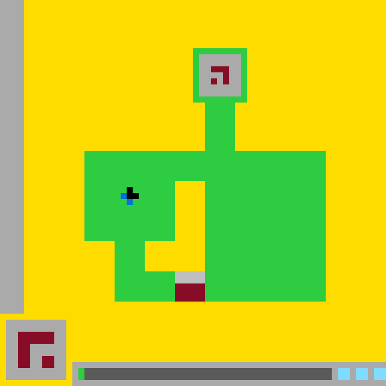

# `ls20` level `1` — LEFT

## Navigation

[Level start](../README.md) · [Parent](../README.md)

### Actions

[`LEFT`](LEFT/README.md)

---

- **Full game ID:** `ls20`
- **State:** `NOT_FINISHED`
- **Image hash:** `c8aac72598f024fd`
- **Incoming action:** `ACTION3`

## Image



## Files

- [image.png](image.png)
- [state.json](state.json)
- [object_registry.pl](../object_registry.pl) — shared level registry (26 canonical identities)
- [differences.pl](differences.pl)
- [objects.pl](objects.pl)
- [rules.pl](rules.pl)
- [similarities.pl](similarities.pl)
- [turtle_from_diff.pl](turtle_from_diff.pl)
- [turtle_from_image.pl](turtle_from_image.pl)

## Embedded files

*Canonical identities are shared through [`object_registry.pl`](../object_registry.pl) and are not repeated in every node.*

<details>
<summary><code>state.json</code></summary>

````json
{
  "state": "NOT_FINISHED",
  "observation": {
    "game_id": "ls20-9607627b",
    "state": "NOT_FINISHED",
    "levels_completed": 0,
    "win_levels": 7,
    "action_input": {
      "id": "ACTION3",
      "data": {},
      "reasoning": null
    },
    "guid": "a992cb74-c0cd-4d3e-915e-9312cff80356",
    "full_reset": false,
    "available_actions": [
      1,
      2,
      3,
      4
    ]
  },
  "step_count": 0,
  "game_id": "ls20",
  "game_directory": "ls20",
  "level": "1",
  "image_hash": "c8aac72598f024fd",
  "incoming_action": "ACTION3",
  "action_directory": "LEFT",
  "action_data": {},
  "parent_node": "..",
  "action_path": [
    "LEFT"
  ]
}
````

[Open `state.json`](state.json)

</details>

<details>
<summary><code>differences.pl</code></summary>

````prolog
:- ensure_loaded('../object_registry.pl').

object_identity(green_status_block, status_indicator,
    'Single green progress block at the left end of the bottom status track').

added_object(green_status_block).

removed_object(_) :-
    fail.

moved_object(bottom_center_gate,
    point(34, 45), point(29, 45), vector(-5, 0)).
moved_object(gate_gray_header,
    point(34, 45), point(29, 45), vector(-5, 0)).
moved_object(gate_burgundy_panel,
    point(34, 47), point(29, 47), vector(-5, 0)).

changed_object(bottom_center_gate, bounding_box,
    change(box(34, 45, 5, 5), box(29, 45, 5, 5))).
changed_object(bottom_center_gate, center,
    change(point(36, 47), point(31, 47))).
changed_object(gate_gray_header, bounding_box,
    change(box(34, 45, 5, 2), box(29, 45, 5, 2))).
changed_object(gate_burgundy_panel, bounding_box,
    change(box(34, 47, 5, 3), box(29, 47, 5, 3))).

changed_object(fortress_right_wing, geometry,
    change(filled_rectangle_with_gate_notch, filled_rectangle)).
changed_object(fortress_right_wing, occupied_regions,
    change(
        [box(34, 25, 20, 20), box(39, 45, 15, 5)],
        [box(34, 25, 20, 25)]
    )).
changed_object(fortress_lower_bridge, occupied_regions,
    change(
        [box(19, 45, 15, 5), box(39, 45, 15, 5)],
        [box(19, 45, 10, 5), box(34, 45, 20, 5)]
    )).
changed_object(fortress_main_body, occupied_regions,
    change(
        [box(19, 45, 15, 5), box(39, 45, 15, 5)],
        [box(19, 45, 10, 5), box(34, 45, 20, 5)]
    )).
changed_object(green_fortress, occupied_regions,
    change(
        [box(19, 45, 15, 5), box(39, 45, 15, 5)],
        [box(19, 45, 10, 5), box(34, 45, 20, 5)]
    )).

resized_object(_, _, _) :-
    fail.

recolored_object(_, _, _) :-
    fail.

unchanged_object(yellow_playfield,
    [bounding_box, color, geometry]).
unchanged_object(left_boundary_wall,
    [bounding_box, color, geometry]).
unchanged_object(fortress_left_wing,
    [bounding_box, color, geometry]).
unchanged_object(fortress_upper_stem,
    [bounding_box, color, geometry]).
unchanged_object(fortress_inner_courtyard,
    [bounding_box, color, geometry]).
unchanged_object(upper_chamber_frame,
    [bounding_box, color, geometry]).
unchanged_object(upper_chamber_interior,
    [bounding_box, color, geometry]).
unchanged_object(upper_burgundy_glyph,
    [bounding_box, color, geometry]).
unchanged_object(blue_black_player,
    [bounding_box, colors, geometry, center, state]).
unchanged_object(player_black_core,
    [bounding_box, color, geometry]).
unchanged_object(player_blue_tail,
    [bounding_box, color, geometry]).
unchanged_object(lower_left_symbol_card,
    [bounding_box, color, geometry, center]).
unchanged_object(lower_left_burgundy_glyph,
    [bounding_box, color, geometry]).
unchanged_object(bottom_status_panel,
    [bounding_box, color, geometry, state]).
unchanged_object(bottom_status_track,
    [bounding_box, base_color, geometry]).
unchanged_object(cyan_status_blocks,
    [bounding_box, color, geometry, state]).

observation(green_status_block, visible_in_current_render).
observation(green_status_block, bounding_box(13, 61, 1, 2)).
observation(green_status_block, color(green)).
observation(green_status_block, geometry(filled_rectangle)).
observation(green_status_block, overlays(bottom_status_track)).
observation(green_status_block, contained_by(bottom_status_panel)).

hypothesis(green_status_block, status_progress_indicator).
hypothesis(action3, advances_bottom_status_by_one_block).

action_effect(action3,
    observed_movement(bottom_center_gate, vector(-5, 0))).
action_effect(action3,
    observed_movement(gate_gray_header, vector(-5, 0))).
action_effect(action3,
    observed_movement(gate_burgundy_panel, vector(-5, 0))).
action_effect(action3,
    observed_addition(green_status_block)).
action_effect(action3,
    inferred_gate_notch_relocation(
        from(box(34, 45, 5, 5)),
        to(box(29, 45, 5, 5))
    )).
````

[Open `differences.pl`](differences.pl)

</details>

<details>
<summary><code>objects.pl</code></summary>

````prolog
% Canonical object identities live in the level-wide registry.
:- ensure_loaded('../object_registry.pl').

% State-specific facts for this action-tree node.
% Canonical object identities live in the level-wide registry.

% State-specific facts for this action-tree node.
% Canonical object identities live in the level-wide registry.

% State-specific facts for this action-tree node.
% Canonical object identities live in the level-wide registry.

% State-specific facts for this action-tree node.
% Canonical object identities live in the level-wide registry.

% State-specific facts for this action-tree node.
% Canonical object identities live in the level-wide registry.

% State-specific facts for this action-tree node.
% Canonical object identities live in the level-wide registry.

% State-specific facts for this action-tree node.
% Canonical object identities live in the level-wide registry.

% State-specific facts for this action-tree node.
% Canonical object identities live in the level-wide registry.

% State-specific facts for this action-tree node.
% Canonical object identities live in the level-wide registry.

% State-specific facts for this action-tree node.
% Canonical object identities live in the level-wide registry.

% State-specific facts for this action-tree node.
% Canonical object identities live in the level-wide registry.

% State-specific facts for this action-tree node.
% Canonical object identities live in the level-wide registry.

% State-specific facts for this action-tree node.
% Canonical object identities live in the level-wide registry.

% State-specific facts for this action-tree node.
% Canonical object identities live in the level-wide registry.

% State-specific facts for this action-tree node.
% Canonical object identities live in the level-wide registry.

% State-specific facts for this action-tree node.
% Canonical object identities live in the level-wide registry.

% State-specific facts for this action-tree node.
% Canonical object identities live in the level-wide registry.

% State-specific facts for this action-tree node.
% Canonical object identities live in the level-wide registry.

% State-specific facts for this action-tree node.
% Canonical object identities live in the level-wide registry.

% State-specific facts for this action-tree node.
% Canonical object identities live in the level-wide registry.

% State-specific facts for this action-tree node.
% Canonical object identities live in the level-wide registry.

% State-specific facts for this action-tree node.
% Canonical object identities live in the level-wide registry.

% State-specific facts for this action-tree node.
% Canonical object identities live in the level-wide registry.

% State-specific facts for this action-tree node.
% Canonical object identities live in the level-wide registry.

% State-specific facts for this action-tree node.
% Canonical object identities live in the level-wide registry.

% State-specific facts for this action-tree node.
% Canonical object identities live in the level-wide registry.

% State-specific facts for this action-tree node.
% Canonical object identities live in the level-wide registry.

% State-specific facts for this action-tree node.
% Canonical object identities live in the level-wide registry.

% State-specific facts for this action-tree node.
% Canonical object identities live in the level-wide registry.

% State-specific facts for this action-tree node.
% Canonical object identities live in the level-wide registry.

% State-specific facts for this action-tree node.
% Canonical object identities live in the level-wide registry.

% State-specific facts for this action-tree node.
% Canonical object identities live in the level-wide registry.

% State-specific facts for this action-tree node.
% Canonical object identities live in the level-wide registry.

% State-specific facts for this action-tree node.
% Canonical object identities live in the level-wide registry.

% State-specific facts for this action-tree node.
% Canonical object identities live in the level-wide registry.

% State-specific facts for this action-tree node.
% Canonical object identities live in the level-wide registry.

% State-specific facts for this action-tree node.
% Canonical object identities live in the level-wide registry.

% State-specific facts for this action-tree node.
% Canonical object identities live in the level-wide registry.

% State-specific facts for this action-tree node.
% Canonical object identities live in the level-wide registry.

% State-specific facts for this action-tree node.
% Canonical object identities live in the level-wide registry.

% State-specific facts for this action-tree node.
% Canonical object identities live in the level-wide registry.

% State-specific facts for this action-tree node.
% Canonical object identities live in the level-wide registry.

% State-specific facts for this action-tree node.
% Canonical object identities live in the level-wide registry.

% State-specific facts for this action-tree node.
% Canonical object identities live in the level-wide registry.

% State-specific facts for this action-tree node.
% Canonical object identities live in the level-wide registry.

% State-specific facts for this action-tree node.
% Canonical object identities live in the level-wide registry.

% State-specific facts for this action-tree node.
% Canonical object identities live in the level-wide registry.

% State-specific facts for this action-tree node.
% Canonical object identities live in the level-wide registry.

% State-specific facts for this action-tree node.
% Canonical object identities live in the level-wide registry.

% State-specific facts for this action-tree node.
% Canonical object identities live in the level-wide registry.

% State-specific facts for this action-tree node.
% Canonical object identities live in the level-wide registry.

% State-specific facts for this action-tree node.
% Canonical object identities live in the level-wide registry.

% State-specific facts for this action-tree node.
% Canonical object identities live in the level-wide registry.

% State-specific facts for this action-tree node.
% Canonical object identities live in the level-wide registry.

% State-specific facts for this action-tree node.
% Canonical object identities live in the level-wide registry.

% State-specific facts for this action-tree node.
% Canonical object identities live in the level-wide registry.

% State-specific facts for this action-tree node.
% Canonical object identities live in the level-wide registry.

% State-specific facts for this action-tree node.
% Canonical object identities live in the level-wide registry.

% State-specific facts for this action-tree node.
% Canonical object identities live in the level-wide registry.

% State-specific facts for this action-tree node.
% Canonical object identities live in the level-wide registry.

% State-specific facts for this action-tree node.
% Canonical object identities live in the level-wide registry.

% State-specific facts for this action-tree node.
% Canonical object identities live in the level-wide registry.

% State-specific facts for this action-tree node.
% Canonical object identities live in the level-wide registry.

% State-specific facts for this action-tree node.
% Canonical object identities live in the level-wide registry.

% State-specific facts for this action-tree node.
% Canonical object identities live in the level-wide registry.

% State-specific facts for this action-tree node.
% Canonical object identities live in the level-wide registry.

% State-specific facts for this action-tree node.
% Canonical object identities live in the level-wide registry.

% State-specific facts for this action-tree node.
% Canonical object identities live in the level-wide registry.

% State-specific facts for this action-tree node.
% Canonical object identities live in the level-wide registry.

% State-specific facts for this action-tree node.
% Canonical object identities live in the level-wide registry.

% State-specific facts for this action-tree node.
% Canonical object identities live in the level-wide registry.

% State-specific facts for this action-tree node.
% Canonical object identities live in the level-wide registry.

% State-specific facts for this action-tree node.
% Canonical object identities live in the level-wide registry.

% State-specific facts for this action-tree node.
% Canonical object identities live in the level-wide registry.

% State-specific facts for this action-tree node.
% Canonical object identities live in the level-wide registry.

% State-specific facts for this action-tree node.
% Canonical object identities live in the level-wide registry.

% State-specific facts for this action-tree node.
% Canonical object identities live in the level-wide registry.

% State-specific facts for this action-tree node.
% Canonical object identities live in the level-wide registry.

% State-specific facts for this action-tree node.
% Canonical object identities live in the level-wide registry.

% State-specific facts for this action-tree node.
% Canonical object identities live in the level-wide registry.

% State-specific facts for this action-tree node.
% Canonical object identities live in the level-wide registry.

% State-specific facts for this action-tree node.
% Canonical object identities live in the level-wide registry.

% State-specific facts for this action-tree node.
% Canonical object identities live in the level-wide registry.

% State-specific facts for this action-tree node.
% Canonical object identities live in the level-wide registry.

% State-specific facts for this action-tree node.
% Canonical object identities live in the level-wide registry.

% State-specific facts for this action-tree node.
% Canonical object identities live in the level-wide registry.

% State-specific facts for this action-tree node.
% Canonical object identities live in the level-wide registry.

% State-specific facts for this action-tree node.
% Canonical object identities live in the level-wide registry.

% State-specific facts for this action-tree node.
% Canonical object identities live in the level-wide registry.

% State-specific facts for this action-tree node.
% Canonical object identities live in the level-wide registry.

% State-specific facts for this action-tree node.
% Canonical object identities live in the level-wide registry.

% State-specific facts for this action-tree node.
% Canonical object identities live in the level-wide registry.

% State-specific facts for this action-tree node.
% Canonical object identities live in the level-wide registry.

% State-specific facts for this action-tree node.
% Canonical object identities live in the level-wide registry.

% State-specific facts for this action-tree node.
% Canonical object identities live in the level-wide registry.

% State-specific facts for this action-tree node.
% Canonical object identities live in the level-wide registry.

% State-specific facts for this action-tree node.
% Canonical object identities live in the level-wide registry.

% State-specific facts for this action-tree node.
% Canonical object identities live in the level-wide registry.

% State-specific facts for this action-tree node.
% Canonical object identities live in the level-wide registry.

% State-specific facts for this action-tree node.
% Canonical object identities live in the level-wide registry.

% State-specific facts for this action-tree node.
% Canonical object identities live in the level-wide registry.

% State-specific facts for this action-tree node.
% Canonical object identities live in the level-wide registry.

% State-specific facts for this action-tree node.
% Canonical object identities live in the level-wide registry.

% State-specific facts for this action-tree node.
% Canonical object identities live in the level-wide registry.

% State-specific facts for this action-tree node.
state_id(action3).
incoming_action(action3, {}).
canvas_size(64, 64).
coordinate_system(origin_top_left, x_right, y_down).
grid_cell_size_pixels(10).

visible(yellow_playfield).
visible(left_boundary_wall).
visible(green_fortress).
visible(fortress_main_body).
visible(fortress_left_wing).
visible(fortress_right_wing).
visible(fortress_lower_bridge).
visible(fortress_upper_stem).
visible(fortress_inner_courtyard).
visible(upper_chamber_frame).
visible(upper_chamber_interior).
visible(upper_burgundy_glyph).
visible(blue_black_player).
visible(player_black_core).
visible(player_blue_tail).
visible(bottom_center_gate).
visible(gate_gray_header).
visible(gate_burgundy_panel).
visible(lower_left_symbol_card).
visible(lower_left_burgundy_glyph).
visible(bottom_status_panel).
visible(bottom_status_track).
visible(cyan_status_blocks).

bounding_box(yellow_playfield, 0, 0, 64, 64).
bounding_box(left_boundary_wall, 0, 0, 4, 52).
bounding_box(green_fortress, 14, 8, 40, 42).
bounding_box(fortress_main_body, 14, 25, 40, 25).
bounding_box(fortress_left_wing, 14, 25, 15, 15).
bounding_box(fortress_right_wing, 34, 25, 20, 25).
bounding_box(fortress_lower_bridge, 19, 45, 35, 5).
bounding_box(fortress_upper_stem, 34, 17, 5, 8).
bounding_box(fortress_inner_courtyard, 24, 30, 10, 15).
bounding_box(upper_chamber_frame, 32, 8, 9, 9).
bounding_box(upper_chamber_interior, 33, 9, 7, 7).
bounding_box(upper_burgundy_glyph, 35, 11, 3, 3).
bounding_box(blue_black_player, 20, 31, 3, 3).
bounding_box(player_black_core, 21, 31, 2, 2).
bounding_box(player_blue_tail, 20, 32, 2, 2).
bounding_box(bottom_center_gate, 29, 45, 5, 5).
bounding_box(gate_gray_header, 29, 45, 5, 2).
bounding_box(gate_burgundy_panel, 29, 47, 5, 3).
bounding_box(lower_left_symbol_card, 1, 53, 10, 10).
bounding_box(lower_left_burgundy_glyph, 3, 55, 6, 6).
bounding_box(bottom_status_panel, 12, 60, 52, 4).
bounding_box(bottom_status_track, 13, 61, 42, 2).
bounding_box(cyan_status_blocks, 56, 61, 8, 2).

color(yellow_playfield, yellow).
color(left_boundary_wall, light_gray).
color(green_fortress, green).
color(fortress_main_body, green).
color(fortress_left_wing, green).
color(fortress_right_wing, green).
color(fortress_lower_bridge, green).
color(fortress_upper_stem, green).
color(fortress_inner_courtyard, yellow).
color(upper_chamber_frame, green).
color(upper_chamber_interior, light_gray).
color(upper_burgundy_glyph, burgundy).
colors(blue_black_player, [blue, black]).
color(player_black_core, black).
color(player_blue_tail, blue).
colors(bottom_center_gate, [light_gray, burgundy]).
color(gate_gray_header, light_gray).
color(gate_burgundy_panel, burgundy).
color(lower_left_symbol_card, light_gray).
color(lower_left_burgundy_glyph, burgundy).
color(bottom_status_panel, light_gray).
color(bottom_status_track, dark_gray).
color(cyan_status_blocks, cyan).

geometry(yellow_playfield, background_with_occlusions).
geometry(left_boundary_wall, filled_vertical_rectangle).
geometry(green_fortress, connected_compound_structure).
geometry(fortress_main_body, stepped_block_region).
geometry(fortress_left_wing, filled_rectangle).
geometry(fortress_right_wing, filled_rectangle).
geometry(fortress_lower_bridge, interrupted_horizontal_bar).
geometry(fortress_upper_stem, filled_vertical_rectangle).
geometry(fortress_inner_courtyard, l_shaped_hole).
geometry(upper_chamber_frame, one_cell_thick_rectangular_frame).
geometry(upper_chamber_interior, filled_rectangle).
geometry(upper_burgundy_glyph, hooked_angular_glyph).
geometry(blue_black_player, asymmetric_five_cell_marker).
geometry(player_black_core, three_cell_corner_cluster).
geometry(player_blue_tail, two_cell_diagonal_tail).
geometry(bottom_center_gate, vertically_partitioned_rectangle).
geometry(gate_gray_header, filled_horizontal_rectangle).
geometry(gate_burgundy_panel, filled_rectangle).
geometry(lower_left_symbol_card, filled_square_panel).
geometry(lower_left_burgundy_glyph, angular_thick_glyph).
geometry(bottom_status_panel, filled_horizontal_panel).
geometry(bottom_status_track, filled_horizontal_rectangle).
geometry(cyan_status_blocks, three_separated_rectangular_blocks).

component_of(fortress_main_body, green_fortress).
component_of(fortress_left_wing, green_fortress).
component_of(fortress_right_wing, green_fortress).
component_of(fortress_lower_bridge, green_fortress).
component_of(fortress_upper_stem, green_fortress).
component_of(upper_chamber_frame, green_fortress).
component_of(player_black_core, blue_black_player).
component_of(player_blue_tail, blue_black_player).
component_of(gate_gray_header, bottom_center_gate).
component_of(gate_burgundy_panel, bottom_center_gate).
component_of(lower_left_burgundy_glyph, lower_left_symbol_card).
component_of(bottom_status_track, bottom_status_panel).
component_of(cyan_status_blocks, bottom_status_panel).

contains(upper_chamber_frame, upper_chamber_interior).
contains(upper_chamber_interior, upper_burgundy_glyph).
contains(fortress_main_body, blue_black_player).
contains(fortress_main_body, fortress_inner_courtyard).
contains(green_fortress, bottom_center_gate).
contains(lower_left_symbol_card, lower_left_burgundy_glyph).
contains(bottom_status_panel, bottom_status_track).
contains(bottom_status_panel, cyan_status_blocks).

encloses(green_fortress, fortress_inner_courtyard).
encloses(upper_chamber_frame, upper_chamber_interior).

embedded_in(bottom_center_gate, fortress_main_body).

overlays(blue_black_player, fortress_left_wing).
overlays(upper_burgundy_glyph, upper_chamber_interior).
overlays(lower_left_burgundy_glyph, lower_left_symbol_card).
overlays(bottom_status_track, bottom_status_panel).
overlays(cyan_status_blocks, bottom_status_panel).

adjacent(left_boundary_wall, yellow_playfield).
adjacent(upper_chamber_frame, fortress_upper_stem).
adjacent(fortress_upper_stem, fortress_main_body).
adjacent(fortress_left_wing, fortress_right_wing).
adjacent(fortress_left_wing, fortress_inner_courtyard).
adjacent(fortress_right_wing, fortress_inner_courtyard).
adjacent(fortress_lower_bridge, fortress_inner_courtyard).
adjacent(fortress_lower_bridge, bottom_center_gate).
adjacent(fortress_right_wing, bottom_center_gate).
adjacent(gate_gray_header, gate_burgundy_panel).
adjacent(bottom_status_track, cyan_status_blocks).

center(blue_black_player, 21, 32).
center(bottom_center_gate, 31, 47).
center(upper_chamber_interior, 36, 12).
center(lower_left_symbol_card, 5, 57).

state(blue_black_player, stationary).
state(bottom_center_gate, closed).
state(green_fortress, solid).
state(fortress_inner_courtyard, empty).
state(bottom_status_panel, active).
state(cyan_status_blocks, three_lit_blocks).

component_box(cyan_status_blocks, 56, 61, 2, 2).
component_box(cyan_status_blocks, 59, 61, 2, 2).
component_box(cyan_status_blocks, 62, 61, 2, 2).

turtle_program(yellow_playfield,
    [penup, set_pos(0,0), setcolor(yellow), pendown, fill_rect(64,64)]).

turtle_program(left_boundary_wall,
    [penup, set_pos(0,0), setcolor(light_gray), pendown, fill_rect(4,52)]).

turtle_program(green_fortress,
    [penup, setcolor(green),
     set_pos(32,8), pendown, fill_rect(9,1),
     penup, set_pos(32,9), pendown, fill_rect(1,7),
     penup, set_pos(40,9), pendown, fill_rect(1,7),
     penup, set_pos(32,16), pendown, fill_rect(9,1),
     penup, set_pos(34,17), pendown, fill_rect(5,8),
     penup, set_pos(14,25), pendown, fill_rect(40,5),
     penup, set_pos(14,30), pendown, fill_rect(15,10),
     penup, set_pos(34,30), pendown, fill_rect(20,15),
     penup, set_pos(19,40), pendown, fill_rect(5,10),
     penup, set_pos(34,45), pendown, fill_rect(20,5)]).

turtle_program(fortress_main_body,
    [penup, setcolor(green),
     set_pos(14,25), pendown, fill_rect(40,5),
     penup, set_pos(14,30), pendown, fill_rect(15,10),
     penup, set_pos(34,30), pendown, fill_rect(20,20),
     penup, set_pos(19,40), pendown, fill_rect(5,10)]).

turtle_program(fortress_left_wing,
    [penup, set_pos(14,25), setcolor(green), pendown, fill_rect(15,15)]).

turtle_program(fortress_right_wing,
    [penup, set_pos(34,25), setcolor(green), pendown, fill_rect(20,25)]).

turtle_program(fortress_lower_bridge,
    [penup, setcolor(green),
     set_pos(19,45), pendown, fill_rect(10,5),
     penup, set_pos(34,45), pendown, fill_rect(20,5)]).

turtle_program(fortress_upper_stem,
    [penup, set_pos(34,17), setcolor(green), pendown, fill_rect(5,8)]).

turtle_program(fortress_inner_courtyard,
    [penup, setcolor(yellow),
     set_pos(29,30), pendown, fill_rect(5,15),
     penup, set_pos(24,40), pendown, fill_rect(5,5)]).

turtle_program(upper_chamber_frame,
    [penup, setcolor(green),
     set_pos(32,8), pendown, fill_rect(9,1),
     penup, set_pos(32,9), pendown, fill_rect(1,7),
     penup, set_pos(40,9), pendown, fill_rect(1,7),
     penup, set_pos(32,16), pendown, fill_rect(9,1)]).

turtle_program(upper_chamber_interior,
    [penup, set_pos(33,9), setcolor(light_gray), pendown, fill_rect(7,7)]).

turtle_program(upper_burgundy_glyph,
    [penup, setcolor(burgundy),
     set_pos(35,11), pendown, fill_rect(3,1),
     penup, set_pos(37,12), pendown, fill_rect(1,2),
     penup, set_pos(35,13), pendown, set_cell]).

turtle_program(blue_black_player,
    [penup, setcolor(black),
     set_pos(21,31), pendown, set_cell,
     penup, set_pos(21,32), pendown, fwd(1),
     penup, setcolor(blue),
     set_pos(20,32), pendown, set_cell,
     penup, set_pos(21,33), pendown, set_cell]).

turtle_program(player_black_core,
    [penup, setcolor(black),
     set_pos(21,31), pendown, set_cell,
     penup, set_pos(21,32), pendown, fwd(1)]).

turtle_program(player_blue_tail,
    [penup, setcolor(blue),
     set_pos(20,32), pendown, set_cell,
     penup, set_pos(21,33), pendown, set_cell]).

turtle_program(bottom_center_gate,
    [penup, set_pos(29,45), setcolor(light_gray), pendown, fill_rect(5,2),
     penup, set_pos(29,47), setcolor(burgundy), pendown, fill_rect(5,3)]).

turtle_program(gate_gray_header,
    [penup, set_pos(29,45), setcolor(light_gray), pendown, fill_rect(5,2)]).

turtle_program(gate_burgundy_panel,
    [penup, set_pos(29,47), setcolor(burgundy), pendown, fill_rect(5,3)]).

turtle_program(lower_left_symbol_card,
    [penup, set_pos(1,53), setcolor(light_gray), pendown, fill_rect(10,10)]).

turtle_program(lower_left_burgundy_glyph,
    [penup, setcolor(burgundy),
     set_pos(3,55), pendown, fill_rect(6,2),
     penup, set_pos(3,57), pendown, fill_rect(2,4),
     penup, set_pos(7,59), pendown, fill_rect(2,2)]).

turtle_program(bottom_status_panel,
    [penup, set_pos(12,60), setcolor(light_gray), pendown, fill_rect(52,4)]).

turtle_program(bottom_status_track,
    [penup, set_pos(13,61), setcolor(dark_gray), pendown, fill_rect(42,2)]).

turtle_program(cyan_status_blocks,
    [penup, setcolor(cyan),
     set_pos(56,61), pendown, fill_rect(2,2),
     penup, set_pos(59,61), pendown, fill_rect(2,2),
     penup, set_pos(62,61), pendown, fill_rect(2,2)]).
````

[Open `objects.pl`](objects.pl)

</details>

<details>
<summary><code>rules.pl</code></summary>

````prolog
observed_rule(
    action3_gate_translation,
    transition(
        action3,
        moved(bottom_center_gate, point(34, 45), point(29, 45), vector(-5, 0))
    )
).

observed_rule(
    action3_gate_component_translation,
    transition(
        action3,
        synchronized_moves([
            moved(gate_gray_header, point(34, 45), point(29, 45), vector(-5, 0)),
            moved(gate_burgundy_panel, point(34, 47), point(29, 47), vector(-5, 0))
        ])
    )
).

observed_rule(
    action3_gate_configuration_preserved,
    transition(
        action3,
        preserves([
            state(bottom_center_gate, closed),
            geometry(bottom_center_gate, vertically_partitioned_rectangle),
            component_of(gate_gray_header, bottom_center_gate),
            component_of(gate_burgundy_panel, bottom_center_gate)
        ])
    )
).

observed_rule(
    action3_gate_notch_relocation,
    transition(
        action3,
        relocates_gate_notch(
            bottom_center_gate,
            box(34, 45, 5, 5),
            box(29, 45, 5, 5)
        )
    )
).

observed_rule(
    action3_fortress_repair,
    transition(
        action3,
        fills_vacated_gate_region(
            green_fortress,
            fortress_main_body,
            fortress_right_wing,
            box(34, 45, 5, 5)
        )
    )
).

observed_rule(
    action3_status_increment,
    transition(
        action3,
        adds(
            green_status_block,
            box(13, 61, 1, 2),
            [color(green), geometry(filled_rectangle)]
        )
    )
).

observed_rule(
    action3_player_invariance,
    transition(
        action3,
        preserves([
            bounding_box(blue_black_player, 20, 31, 3, 3),
            center(blue_black_player, 21, 32),
            state(blue_black_player, stationary)
        ])
    )
).

evidence_reference(
    action3_gate_translation,
    [
        differences_pl(moved_object(
            bottom_center_gate,
            point(34, 45),
            point(29, 45),
            vector(-5, 0)
        )),
        differences_pl(changed_object(
            bottom_center_gate,
            bounding_box,
            change(box(34, 45, 5, 5), box(29, 45, 5, 5))
        )),
        differences_pl(changed_object(
            bottom_center_gate,
            center,
            change(point(36, 47), point(31, 47))
        ))
    ]
).

evidence_reference(
    action3_gate_component_translation,
    [
        differences_pl(moved_object(
            gate_gray_header,
            point(34, 45),
            point(29, 45),
            vector(-5, 0)
        )),
        differences_pl(moved_object(
            gate_burgundy_panel,
            point(34, 47),
            point(29, 47),
            vector(-5, 0)
        )),
        current_objects_pl(component_of(gate_gray_header, bottom_center_gate)),
        current_objects_pl(component_of(gate_burgundy_panel, bottom_center_gate))
    ]
).

evidence_reference(
    action3_gate_configuration_preserved,
    [
        parent_objects_pl(state(bottom_center_gate, closed)),
        current_objects_pl(state(bottom_center_gate, closed)),
        parent_objects_pl(geometry(
            bottom_center_gate,
            vertically_partitioned_rectangle
        )),
        current_objects_pl(geometry(
            bottom_center_gate,
            vertically_partitioned_rectangle
        ))
    ]
).

evidence_reference(
    action3_gate_notch_relocation,
    [
        differences_pl(action_effect(
            action3,
            inferred_gate_notch_relocation(
                from(box(34, 45, 5, 5)),
                to(box(29, 45, 5, 5))
            )
        )),
        differences_pl(changed_object(
            fortress_lower_bridge,
            occupied_regions,
            change(
                [box(19, 45, 15, 5), box(39, 45, 15, 5)],
                [box(19, 45, 10, 5), box(34, 45, 20, 5)]
            )
        ))
    ]
).

evidence_reference(
    action3_fortress_repair,
    [
        differences_pl(changed_object(
            fortress_right_wing,
            geometry,
            change(filled_rectangle_with_gate_notch, filled_rectangle)
        )),
        differences_pl(changed_object(
            fortress_right_wing,
            occupied_regions,
            change(
                [box(34, 25, 20, 20), box(39, 45, 15, 5)],
                [box(34, 25, 20, 25)]
            )
        )),
        differences_pl(changed_object(
            green_fortress,
            occupied_regions,
            change(
                [box(19, 45, 15, 5), box(39, 45, 15, 5)],
                [box(19, 45, 10, 5), box(34, 45, 20, 5)]
            )
        ))
    ]
).

evidence_reference(
    action3_status_increment,
    [
        differences_pl(added_object(green_status_block)),
        differences_pl(observation(
            green_status_block,
            bounding_box(13, 61, 1, 2)
        )),
        differences_pl(observation(green_status_block, color(green))),
        differences_pl(observation(
            green_status_block,
            overlays(bottom_status_track)
        )),
        differences_pl(observation(
            green_status_block,
            contained_by(bottom_status_panel)
        )),
        differences_pl(action_effect(
            action3,
            observed_addition(green_status_block)
        ))
    ]
).

evidence_reference(
    action3_player_invariance,
    [
        differences_pl(unchanged_object(
            blue_black_player,
            [bounding_box, colors, geometry, center, state]
        )),
        parent_objects_pl(center(blue_black_player, 21, 32)),
        current_objects_pl(center(blue_black_player, 21, 32))
    ]
).

hypothetical_rule(
    action3_moves_closed_gate_left_one_grid_step,
    if_then(
        conditions([
            incoming_action(action3),
            state(bottom_center_gate, closed),
            legal_gate_destination(left, 5)
        ]),
        effects([
            translate(bottom_center_gate, vector(-5, 0)),
            translate(gate_gray_header, vector(-5, 0)),
            translate(gate_burgundy_panel, vector(-5, 0))
        ])
    ),
    [
        action3_gate_translation,
        action3_gate_component_translation,
        action3_gate_configuration_preserved
    ]
).

hypothetical_rule(
    gate_components_move_rigidly_with_bottom_center_gate,
    if_then(
        conditions([
            translate(bottom_center_gate, vector(DX, DY)),
            component_of(gate_gray_header, bottom_center_gate),
            component_of(gate_burgundy_panel, bottom_center_gate)
        ]),
        effects([
            translate(gate_gray_header, vector(DX, DY)),
            translate(gate_burgundy_panel, vector(DX, DY)),
            preserve_relative_layout(bottom_center_gate)
        ])
    ),
    [
        action3_gate_component_translation,
        action3_gate_configuration_preserved
    ]
).

hypothetical_rule(
    fortress_reforms_around_relocated_gate,
    if_then(
        conditions([
            relocate(bottom_center_gate, OldBox, NewBox),
            embedded_in(bottom_center_gate, fortress_main_body)
        ]),
        effects([
            restore_green_fortress_occupancy(OldBox),
            create_gate_notch(NewBox),
            preserve(embedded_in(bottom_center_gate, fortress_main_body))
        ])
    ),
    [
        action3_gate_notch_relocation,
        action3_fortress_repair
    ]
).

hypothetical_rule(
    action3_advances_bottom_status_from_left_to_right,
    if_then(
        conditions([
            incoming_action(action3),
            state(bottom_status_panel, active),
            available_status_cell(bottom_status_track, X, 61)
        ]),
        effects([
            add_status_cell(green_status_block, box(X, 61, 1, 2)),
            advance_progress(bottom_status_panel, 1)
        ])
    ),
    [
        action3_status_increment
    ]
).

hypothetical_rule(
    action3_does_not_directly_move_blue_black_player,
    if_then(
        conditions([
            incoming_action(action3),
            no_gate_player_contact(bottom_center_gate, blue_black_player)
        ]),
        effects([
            preserve_position(blue_black_player),
            preserve_position(player_black_core),
            preserve_position(player_blue_tail)
        ])
    ),
    [
        action3_player_invariance,
        action3_gate_translation
    ]
).

hypothetical_rule(
    repeated_action3_gate_motion_requires_free_space,
    if_then(
        conditions([
            incoming_action(action3),
            state(bottom_center_gate, closed),
            destination_region_free(bottom_center_gate, vector(-5, 0))
        ]),
        effects([
            translate(bottom_center_gate, vector(-5, 0)),
            increment_bottom_status_cautiously(1)
        ])
    ),
    [
        action3_gate_translation,
        action3_status_increment,
        action3_gate_notch_relocation
    ]
).
````

[Open `rules.pl`](rules.pl)

</details>

<details>
<summary><code>similarities.pl</code></summary>

````prolog
:- ensure_loaded('object_registry.pl').

object_identity(green_status_block, status_indicator,
    'Single green progress block at the left end of the bottom status track').

object_match(yellow_playfield, yellow_playfield, 1.0-[same_identity, same_bounding_box, same_color, same_geometry]).
object_match(left_boundary_wall, left_boundary_wall, 1.0-[same_identity, same_bounding_box, same_color, same_geometry]).
object_match(green_fortress, green_fortress, 0.99-[same_identity, same_bounding_box, same_color, persistent_structure, gate_notch_relocated]).
object_match(fortress_main_body, fortress_main_body, 0.99-[same_identity, same_bounding_box, same_color, persistent_component, gate_notch_relocated]).
object_match(fortress_left_wing, fortress_left_wing, 1.0-[same_identity, same_bounding_box, same_color, same_geometry]).
object_match(fortress_right_wing, fortress_right_wing, 0.99-[same_identity, same_bounding_box, same_color, persistent_component, gate_notch_filled]).
object_match(fortress_lower_bridge, fortress_lower_bridge, 0.99-[same_identity, same_bounding_box, same_color, persistent_component, gate_notch_relocated]).
object_match(fortress_upper_stem, fortress_upper_stem, 1.0-[same_identity, same_bounding_box, same_color, same_geometry]).
object_match(fortress_inner_courtyard, fortress_inner_courtyard, 1.0-[same_identity, same_bounding_box, same_color, same_geometry]).
object_match(upper_chamber_frame, upper_chamber_frame, 1.0-[same_identity, same_bounding_box, same_color, same_geometry]).
object_match(upper_chamber_interior, upper_chamber_interior, 1.0-[same_identity, same_bounding_box, same_color, same_geometry]).
object_match(upper_burgundy_glyph, upper_burgundy_glyph, 1.0-[same_identity, same_bounding_box, same_color, same_geometry]).
object_match(blue_black_player, blue_black_player, 1.0-[same_identity, same_bounding_box, same_colors, same_geometry, same_center, same_state]).
object_match(player_black_core, player_black_core, 1.0-[same_identity, same_bounding_box, same_color, same_geometry, same_parent]).
object_match(player_blue_tail, player_blue_tail, 1.0-[same_identity, same_bounding_box, same_color, same_geometry, same_parent]).
object_match(bottom_center_gate, bottom_center_gate, 1.0-[same_identity, same_size, same_colors, same_geometry, same_state, translated(-5, 0)]).
object_match(gate_gray_header, gate_gray_header, 1.0-[same_identity, same_size, same_color, same_geometry, same_parent, translated(-5, 0)]).
object_match(gate_burgundy_panel, gate_burgundy_panel, 1.0-[same_identity, same_size, same_color, same_geometry, same_parent, translated(-5, 0)]).
object_match(lower_left_symbol_card, lower_left_symbol_card, 1.0-[same_identity, same_bounding_box, same_color, same_geometry, same_center]).
object_match(lower_left_burgundy_glyph, lower_left_burgundy_glyph, 1.0-[same_identity, same_bounding_box, same_color, same_geometry, same_parent]).
object_match(bottom_status_panel, bottom_status_panel, 1.0-[same_identity, same_bounding_box, same_color, same_geometry, same_state]).
object_match(bottom_status_track, bottom_status_track, 1.0-[same_identity, same_bounding_box, same_color, same_geometry, same_parent]).
object_match(cyan_status_blocks, cyan_status_blocks, 1.0-[same_identity, same_bounding_box, same_color, same_geometry, same_components, same_state]).

unmatched_current(green_status_block).
unmatched_objects(previous, []).
unmatched_objects(current, [green_status_block]).

unmatched_evidence(green_status_block, 1.0,
    [newly_visible, bounding_box(13, 61, 1, 2), color(green),
     geometry(filled_rectangle), overlays(bottom_status_track),
     contained_by(bottom_status_panel)]).
````

[Open `similarities.pl`](similarities.pl)

</details>

<details>
<summary><code>turtle_from_diff.pl</code></summary>

````prolog
:- ensure_loaded('../object_registry.pl').

object_identity(green_status_block, status_indicator,
    'Single green progress block at the left end of the bottom status track').

turtle_patch(action3,
    [ redraw(green_fortress,
          [penup, set_pos(34,45), setcolor(green),
           pendown, fill_rect(5,5)]),
      redraw(bottom_center_gate,
          [penup, set_pos(29,45), setcolor(light_gray),
           pendown, fill_rect(5,2),
           penup, set_pos(29,47), setcolor(burgundy),
           pendown, fill_rect(5,3)]),
      draw(green_status_block,
          [penup, set_pos(13,61), setcolor(green),
           pendown, fill_rect(1,2)])
    ]).
````

[Open `turtle_from_diff.pl`](turtle_from_diff.pl)

</details>

<details>
<summary><code>turtle_from_image.pl</code></summary>

````prolog
:- ensure_loaded('../object_registry.pl').

object_identity(green_status_block, status_indicator,
    'Single green progress block at the left end of the bottom status track').

canvas_size(64, 64).
coordinate_system(origin_top_left, x_right, y_down).
grid_cell_size_pixels(10).

visible(yellow_playfield).
visible(left_boundary_wall).
visible(green_fortress).
visible(fortress_main_body).
visible(fortress_left_wing).
visible(fortress_right_wing).
visible(fortress_lower_bridge).
visible(fortress_upper_stem).
visible(fortress_inner_courtyard).
visible(upper_chamber_frame).
visible(upper_chamber_interior).
visible(upper_burgundy_glyph).
visible(blue_black_player).
visible(player_black_core).
visible(player_blue_tail).
visible(bottom_center_gate).
visible(gate_gray_header).
visible(gate_burgundy_panel).
visible(lower_left_symbol_card).
visible(lower_left_burgundy_glyph).
visible(bottom_status_panel).
visible(bottom_status_track).
visible(cyan_status_blocks).
visible(green_status_block).

bounding_box(green_status_block, 13, 61, 1, 2).
color(green_status_block, green).
geometry(green_status_block, filled_rectangle).
component_of(green_status_block, bottom_status_panel).
contains(bottom_status_panel, green_status_block).
overlays(green_status_block, bottom_status_track).

turtle_program(yellow_playfield,
    [penup, set_pos(0,0), setcolor(yellow), pendown, fill_rect(64,64)]).

turtle_program(left_boundary_wall,
    [penup, set_pos(0,0), setcolor(light_gray), pendown, fill_rect(4,52)]).

turtle_program(green_fortress,
    [penup, setcolor(green),
     set_pos(32,8), pendown, fill_rect(9,1),
     penup, set_pos(32,9), pendown, fill_rect(1,7),
     penup, set_pos(40,9), pendown, fill_rect(1,7),
     penup, set_pos(32,16), pendown, fill_rect(9,1),
     penup, set_pos(34,17), pendown, fill_rect(5,8),
     penup, set_pos(14,25), pendown, fill_rect(40,5),
     penup, set_pos(14,30), pendown, fill_rect(15,10),
     penup, set_pos(34,30), pendown, fill_rect(20,15),
     penup, set_pos(19,40), pendown, fill_rect(5,10),
     penup, set_pos(34,45), pendown, fill_rect(20,5)]).

turtle_program(fortress_main_body,
    [penup, setcolor(green),
     set_pos(14,25), pendown, fill_rect(40,5),
     penup, set_pos(14,30), pendown, fill_rect(15,10),
     penup, set_pos(34,30), pendown, fill_rect(20,20),
     penup, set_pos(19,40), pendown, fill_rect(5,10)]).

turtle_program(fortress_left_wing,
    [penup, set_pos(14,25), setcolor(green), pendown, fill_rect(15,15)]).

turtle_program(fortress_right_wing,
    [penup, set_pos(34,25), setcolor(green), pendown, fill_rect(20,25)]).

turtle_program(fortress_lower_bridge,
    [penup, setcolor(green),
     set_pos(19,45), pendown, fill_rect(10,5),
     penup, set_pos(34,45), pendown, fill_rect(20,5)]).

turtle_program(fortress_upper_stem,
    [penup, set_pos(34,17), setcolor(green), pendown, fill_rect(5,8)]).

turtle_program(fortress_inner_courtyard,
    [penup, setcolor(yellow),
     set_pos(29,30), pendown, fill_rect(5,15),
     penup, set_pos(24,40), pendown, fill_rect(5,5)]).

turtle_program(upper_chamber_frame,
    [penup, setcolor(green),
     set_pos(32,8), pendown, fill_rect(9,1),
     penup, set_pos(32,9), pendown, fill_rect(1,7),
     penup, set_pos(40,9), pendown, fill_rect(1,7),
     penup, set_pos(32,16), pendown, fill_rect(9,1)]).

turtle_program(upper_chamber_interior,
    [penup, set_pos(33,9), setcolor(light_gray), pendown, fill_rect(7,7)]).

turtle_program(upper_burgundy_glyph,
    [penup, setcolor(burgundy),
     set_pos(35,11), pendown, fill_rect(3,1),
     penup, set_pos(37,12), pendown, fill_rect(1,2),
     penup, set_pos(35,13), pendown, set_cell]).

turtle_program(blue_black_player,
    [penup, setcolor(black),
     set_pos(21,31), pendown, set_cell,
     penup, set_pos(21,32), pendown, fwd(1),
     penup, setcolor(blue),
     set_pos(20,32), pendown, set_cell,
     penup, set_pos(21,33), pendown, set_cell]).

turtle_program(player_black_core,
    [penup, setcolor(black),
     set_pos(21,31), pendown, set_cell,
     penup, set_pos(21,32), pendown, fwd(1)]).

turtle_program(player_blue_tail,
    [penup, setcolor(blue),
     set_pos(20,32), pendown, set_cell,
     penup, set_pos(21,33), pendown, set_cell]).

turtle_program(bottom_center_gate,
    [penup, set_pos(29,45), setcolor(light_gray), pendown, fill_rect(5,2),
     penup, set_pos(29,47), setcolor(burgundy), pendown, fill_rect(5,3)]).

turtle_program(gate_gray_header,
    [penup, set_pos(29,45), setcolor(light_gray), pendown, fill_rect(5,2)]).

turtle_program(gate_burgundy_panel,
    [penup, set_pos(29,47), setcolor(burgundy), pendown, fill_rect(5,3)]).

turtle_program(lower_left_symbol_card,
    [penup, set_pos(1,53), setcolor(light_gray), pendown, fill_rect(10,10)]).

turtle_program(lower_left_burgundy_glyph,
    [penup, setcolor(burgundy),
     set_pos(3,55), pendown, fill_rect(6,2),
     penup, set_pos(3,57), pendown, fill_rect(2,4),
     penup, set_pos(7,59), pendown, fill_rect(2,2)]).

turtle_program(bottom_status_panel,
    [penup, set_pos(12,60), setcolor(light_gray), pendown, fill_rect(52,4)]).

turtle_program(bottom_status_track,
    [penup, set_pos(13,61), setcolor(dark_gray), pendown, fill_rect(42,2)]).

turtle_program(cyan_status_blocks,
    [penup, setcolor(cyan),
     set_pos(56,61), pendown, fill_rect(2,2),
     penup, set_pos(59,61), pendown, fill_rect(2,2),
     penup, set_pos(62,61), pendown, fill_rect(2,2)]).

turtle_program(green_status_block,
    [penup, set_pos(13,61), setcolor(green), pendown, fill_rect(1,2)]).
````

[Open `turtle_from_image.pl`](turtle_from_image.pl)

</details>
