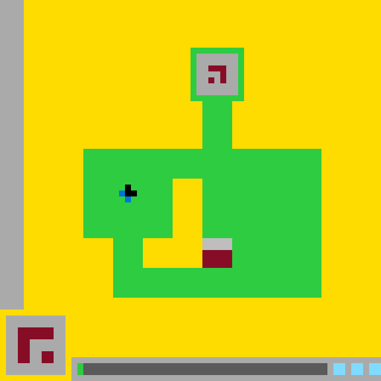

# ARC3 State `aa5950876442c616`

- **Game:** `ls20`
- **Level:** `?`
- **State:** `NOT_FINISHED`
- **Incoming action:** `ACTION1`

## Navigation

- [Level root](../../../../README.md)
- [Parent state](../../../README.md)

## Image



## Files

- [state.json](state.json)
- [objects.pl](objects.pl)

## `objects.pl`

```prolog
bounding_box_format(x_y_width_height).
coordinate_system(origin_top_left, x_right, y_down, pixels).
turtle_dsl_instruction(set_cell, arity(2), filled_rectangle_pixels).

color(yellow, '#ffdc00').
color(green, '#2ecc40').
color(gray, '#aaaaaa').
color(dark_gray, '#666666').
color(maroon, '#870c25').
color(black, '#000000').
color(blue, '#0074d9').
color(cyan, '#7fdbff').

object(canvas, scene).
bbox(canvas, 0, 0, 640, 640).
geometry(canvas, rectangle).
contains(canvas, background).
contains(canvas, left_gray_strip).
contains(canvas, main_structure).
contains(canvas, lower_left_panel).
contains(canvas, bottom_toolbar).

object(background, drawable_region).
bbox(background, 0, 0, 640, 640).
color_of(background, yellow).
geometry(background, rectangle).
layer(background, 0).
turtle_program(background, [
    penup,
    set_pos(0,0),
    setcolor(yellow),
    pendown,
    set_cell(640,640),
    penup
]).

object(left_gray_strip, drawable_region).
bbox(left_gray_strip, 0, 0, 40, 520).
color_of(left_gray_strip, gray).
geometry(left_gray_strip, rectangle).
layer(left_gray_strip, 1).
adjacent(left_gray_strip, background).
turtle_program(left_gray_strip, [
    penup,
    set_pos(0,0),
    setcolor(gray),
    pendown,
    set_cell(40,520),
    penup
]).

object(main_structure, drawable_region).
bbox(main_structure, 140, 80, 400, 420).
color_of(main_structure, green).
geometry(main_structure, orthogonal_connected_region).
layer(main_structure, 2).
component_rect(main_structure, 320,80,90,10).
component_rect(main_structure, 320,90,10,70).
component_rect(main_structure, 400,90,10,70).
component_rect(main_structure, 320,160,90,10).
component_rect(main_structure, 340,170,50,80).
component_rect(main_structure, 140,250,400,50).
component_rect(main_structure, 140,300,150,100).
component_rect(main_structure, 340,300,200,100).
component_rect(main_structure, 190,400,50,50).
component_rect(main_structure, 390,400,150,50).
component_rect(main_structure, 190,450,350,50).
connected(main_structure).
contains(main_structure, top_panel).
contains(main_structure, player_marker).
contains(main_structure, goal_marker).
contains(main_structure, inner_cavity).
turtle_program(main_structure, [
    penup,set_pos(320,80),setcolor(green),pendown,set_cell(90,10),
    penup,set_pos(320,90),pendown,set_cell(10,70),
    penup,set_pos(400,90),pendown,set_cell(10,70),
    penup,set_pos(320,160),pendown,set_cell(90,10),
    penup,set_pos(340,170),pendown,set_cell(50,80),
    penup,set_pos(140,250),pendown,set_cell(400,50),
    penup,set_pos(140,300),pendown,set_cell(150,100),
    penup,set_pos(340,300),pendown,set_cell(200,100),
    penup,set_pos(190,400),pendown,set_cell(50,50),
    penup,set_pos(390,400),pendown,set_cell(150,50),
    penup,set_pos(190,450),pendown,set_cell(350,50),
    penup
]).

object(top_panel, drawable_region).
bbox(top_panel, 330, 90, 70, 70).
color_of(top_panel, gray).
geometry(top_panel, rectangle).
layer(top_panel, 3).
surrounded_by(top_panel, main_structure).
contains(top_panel, top_glyph).
adjacent(top_panel, main_structure).
turtle_program(top_panel, [
    penup,
    set_pos(330,90),
    setcolor(gray),
    pendown,
    set_cell(70,70),
    penup
]).

object(top_glyph, drawable_region).
bbox(top_glyph, 350, 110, 30, 30).
color_of(top_glyph, maroon).
geometry(top_glyph, disconnected_orthogonal_glyph).
layer(top_glyph, 4).
component_rect(top_glyph, 350,110,30,10).
component_rect(top_glyph, 370,120,10,20).
component_rect(top_glyph, 350,130,10,10).
contained_by(top_glyph, top_panel).
component_count(top_glyph, 2).
turtle_program(top_glyph, [
    penup,set_pos(350,110),setcolor(maroon),pendown,set_cell(30,10),
    penup,set_pos(370,120),pendown,set_cell(10,20),
    penup,set_pos(350,130),pendown,set_cell(10,10),
    penup
]).

object(player_marker, composite_drawable).
bbox(player_marker, 200, 310, 30, 30).
geometry(player_marker, four_cell_marker).
layer(player_marker, 4).
contained_by(player_marker, main_structure).
contains(player_marker, player_black_part).
contains(player_marker, player_blue_part).
turtle_program(player_marker, [
    penup,set_pos(210,310),setcolor(black),pendown,set_cell(10,10),
    penup,set_pos(210,320),pendown,set_cell(20,10),
    penup,set_pos(200,320),setcolor(blue),pendown,set_cell(10,10),
    penup,set_pos(210,330),pendown,set_cell(10,10),
    penup
]).

object(player_black_part, drawable_region).
bbox(player_black_part, 210, 310, 20, 20).
color_of(player_black_part, black).
geometry(player_black_part, l_tetromino_fragment).
component_rect(player_black_part, 210,310,10,10).
component_rect(player_black_part, 210,320,20,10).
contained_by(player_black_part, player_marker).
adjacent(player_black_part, player_blue_part).
turtle_program(player_black_part, [
    penup,set_pos(210,310),setcolor(black),pendown,set_cell(10,10),
    penup,set_pos(210,320),pendown,set_cell(20,10),
    penup
]).

object(player_blue_part, drawable_region).
bbox(player_blue_part, 200, 320, 20, 20).
color_of(player_blue_part, blue).
geometry(player_blue_part, diagonal_two_cell_region).
component_rect(player_blue_part, 200,320,10,10).
component_rect(player_blue_part, 210,330,10,10).
contained_by(player_blue_part, player_marker).
adjacent(player_blue_part, player_black_part).
turtle_program(player_blue_part, [
    penup,set_pos(200,320),setcolor(blue),pendown,set_cell(10,10),
    penup,set_pos(210,330),pendown,set_cell(10,10),
    penup
]).

object(inner_cavity, drawable_region).
bbox(inner_cavity, 240, 300, 100, 150).
color_of(inner_cavity, yellow).
geometry(inner_cavity, orthogonal_l_shaped_cavity).
layer(inner_cavity, 3).
component_rect(inner_cavity, 290,300,50,100).
component_rect(inner_cavity, 240,400,100,50).
contained_by(inner_cavity, main_structure).
adjacent(inner_cavity, main_structure).
adjacent(inner_cavity, goal_marker).
turtle_program(inner_cavity, [
    penup,set_pos(290,300),setcolor(yellow),pendown,set_cell(50,100),
    penup,set_pos(240,400),pendown,set_cell(100,50),
    penup
]).

object(goal_marker, composite_drawable).
bbox(goal_marker, 340, 400, 50, 50).
geometry(goal_marker, vertically_split_rectangle).
layer(goal_marker, 4).
contained_by(goal_marker, main_structure).
contains(goal_marker, goal_gray_part).
contains(goal_marker, goal_maroon_part).
adjacent(goal_marker, inner_cavity).
adjacent(goal_marker, main_structure).
turtle_program(goal_marker, [
    penup,set_pos(340,400),setcolor(gray),pendown,set_cell(50,20),
    penup,set_pos(340,420),setcolor(maroon),pendown,set_cell(50,30),
    penup
]).

object(goal_gray_part, drawable_region).
bbox(goal_gray_part, 340, 400, 50, 20).
color_of(goal_gray_part, gray).
geometry(goal_gray_part, rectangle).
contained_by(goal_gray_part, goal_marker).
adjacent(goal_gray_part, goal_maroon_part).
turtle_program(goal_gray_part, [
    penup,set_pos(340,400),setcolor(gray),pendown,set_cell(50,20),penup
]).

object(goal_maroon_part, drawable_region).
bbox(goal_maroon_part, 340, 420, 50, 30).
color_of(goal_maroon_part, maroon).
geometry(goal_maroon_part, rectangle).
contained_by(goal_maroon_part, goal_marker).
adjacent(goal_maroon_part, goal_gray_part).
turtle_program(goal_maroon_part, [
    penup,set_pos(340,420),setcolor(maroon),pendown,set_cell(50,30),penup
]).

object(lower_left_panel, drawable_region).
bbox(lower_left_panel, 10, 530, 100, 100).
color_of(lower_left_panel, gray).
geometry(lower_left_panel, rectangle).
layer(lower_left_panel, 2).
contains(lower_left_panel, lower_left_glyph).
turtle_program(lower_left_panel, [
    penup,set_pos(10,530),setcolor(gray),pendown,set_cell(100,100),penup
]).

object(lower_left_glyph, drawable_region).
bbox(lower_left_glyph, 30, 550, 60, 60).
color_of(lower_left_glyph, maroon).
geometry(lower_left_glyph, disconnected_orthogonal_glyph).
layer(lower_left_glyph, 3).
component_rect(lower_left_glyph, 30,550,60,20).
component_rect(lower_left_glyph, 30,570,20,40).
component_rect(lower_left_glyph, 70,590,20,20).
component_count(lower_left_glyph, 2).
contained_by(lower_left_glyph, lower_left_panel).
turtle_program(lower_left_glyph, [
    penup,set_pos(30,550),setcolor(maroon),pendown,set_cell(60,20),
    penup,set_pos(30,570),pendown,set_cell(20,40),
    penup,set_pos(70,590),pendown,set_cell(20,20),
    penup
]).

object(bottom_toolbar, drawable_region).
bbox(bottom_toolbar, 120, 600, 520, 40).
color_of(bottom_toolbar, gray).
geometry(bottom_toolbar, rectangle).
layer(bottom_toolbar, 2).
contains(bottom_toolbar, toolbar_green_indicator).
contains(bottom_toolbar, toolbar_dark_track).
contains(bottom_toolbar, toolbar_cyan_1).
contains(bottom_toolbar, toolbar_cyan_2).
contains(bottom_toolbar, toolbar_cyan_3).
adjacent(bottom_toolbar, lower_left_panel).
turtle_program(bottom_toolbar, [
    penup,set_pos(120,600),setcolor(gray),pendown,set_cell(520,40),penup
]).

object(toolbar_green_indicator, drawable_region).
bbox(toolbar_green_indicator, 130, 610, 10, 20).
color_of(toolbar_green_indicator, green).
geometry(toolbar_green_indicator, rectangle).
layer(toolbar_green_indicator, 3).
contained_by(toolbar_green_indicator, bottom_toolbar).
adjacent(toolbar_green_indicator, toolbar_dark_track).
turtle_program(toolbar_green_indicator, [
    penup,set_pos(130,610),setcolor(green),pendown,set_cell(10,20),penup
]).

object(toolbar_dark_track, drawable_region).
bbox(toolbar_dark_track, 140, 610, 410, 20).
color_of(toolbar_dark_track, dark_gray).
geometry(toolbar_dark_track, rectangle).
layer(toolbar_dark_track, 3).
contained_by(toolbar_dark_track, bottom_toolbar).
adjacent(toolbar_dark_track, toolbar_green_indicator).
turtle_program(toolbar_dark_track, [
    penup,set_pos(140,610),setcolor(dark_gray),pendown,set_cell(410,20),penup
]).

object(toolbar_cyan_1, drawable_region).
bbox(toolbar_cyan_1, 560, 610, 20, 20).
color_of(toolbar_cyan_1, cyan).
geometry(toolbar_cyan_1, square).
layer(toolbar_cyan_1, 3).
contained_by(toolbar_cyan_1, bottom_toolbar).
turtle_program(toolbar_cyan_1, [
    penup,set_pos(560,610),setcolor(cyan),pendown,set_cell(20,20),penup
]).

object(toolbar_cyan_2, drawable_region).
bbox(toolbar_cyan_2, 590, 610, 20, 20).
color_of(toolbar_cyan_2, cyan).
geometry(toolbar_cyan_2, square).
layer(toolbar_cyan_2, 3).
contained_by(toolbar_cyan_2, bottom_toolbar).
turtle_program(toolbar_cyan_2, [
    penup,set_pos(590,610),setcolor(cyan),pendown,set_cell(20,20),penup
]).

object(toolbar_cyan_3, drawable_region).
bbox(toolbar_cyan_3, 620, 610, 20, 20).
color_of(toolbar_cyan_3, cyan).
geometry(toolbar_cyan_3, square).
layer(toolbar_cyan_3, 3).
contained_by(toolbar_cyan_3, bottom_toolbar).
turtle_program(toolbar_cyan_3, [
    penup,set_pos(620,610),setcolor(cyan),pendown,set_cell(20,20),penup
]).
```

## Actions

- [`ACTION2` → `d80b4064d523fef3`](actions/ACTION2/image_d80b4064d523fef3/README.md)
