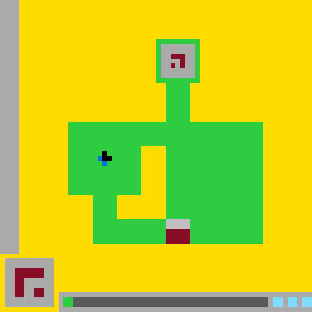

# ARC3 State `d80b4064d523fef3`

- **Game:** `ls20`
- **Level:** `?`
- **State:** `NOT_FINISHED`
- **Incoming action:** `ACTION2`

## Navigation

- [Level root](../../../../../../../README.md)
- [Parent state](../../../README.md)

## Image



## Files

- [state.json](state.json)
- [differences.pl](differences.pl)
- [objects.pl](objects.pl)

## `objects.pl`

```prolog
canvas(arc3_state, 640, 640).
coordinate_system(origin_top_left, x_right, y_down).
turtle_unit(pixel).
bbox_format(inclusive).

color(yellow, rgb(255,220,0), '#ffdc00').
color(green, rgb(46,204,64), '#2ecc40').
color(gray, rgb(170,170,170), '#aaaaaa').
color(dark_gray, rgb(102,102,102), '#666666').
color(burgundy, rgb(128,0,32), '#800020').
color(blue, rgb(0,116,217), '#0074d9').
color(light_blue, rgb(127,219,255), '#7fdbff').
color(black, rgb(0,0,0), '#000000').

visible_object(background).
visible_object(left_sidebar).
visible_object(main_green_structure).
visible_object(portal_panel).
visible_object(portal_glyph).
visible_object(player).
visible_object(player_black_part).
visible_object(player_blue_part).
visible_object(goal).
visible_object(goal_gray_part).
visible_object(goal_burgundy_part).
visible_object(lower_left_panel).
visible_object(lower_left_glyph).
visible_object(status_tray).
visible_object(status_green_segment).
visible_object(status_dark_segment).
visible_object(status_blue_segment_1).
visible_object(status_blue_segment_2).
visible_object(status_blue_segment_3).

object_type(background, background).
object_type(left_sidebar, sidebar).
object_type(main_green_structure, connected_region).
object_type(portal_panel, inset_panel).
object_type(portal_glyph, glyph).
object_type(player, composite_sprite).
object_type(player_black_part, sprite_component).
object_type(player_blue_part, sprite_component).
object_type(goal, composite_marker).
object_type(goal_gray_part, marker_component).
object_type(goal_burgundy_part, marker_component).
object_type(lower_left_panel, ui_panel).
object_type(lower_left_glyph, glyph).
object_type(status_tray, ui_tray).
object_type(status_green_segment, status_segment).
object_type(status_dark_segment, status_segment).
object_type(status_blue_segment_1, status_segment).
object_type(status_blue_segment_2, status_segment).
object_type(status_blue_segment_3, status_segment).

bbox(background, 0, 0, 639, 639).
bbox(left_sidebar, 0, 0, 39, 519).
bbox(main_green_structure, 140, 80, 539, 499).
bbox(portal_panel, 330, 90, 399, 159).
bbox(portal_glyph, 350, 110, 379, 139).
bbox(player, 200, 310, 229, 339).
bbox(player_black_part, 210, 310, 229, 329).
bbox(player_blue_part, 200, 320, 219, 339).
bbox(goal, 340, 450, 389, 499).
bbox(goal_gray_part, 340, 450, 389, 469).
bbox(goal_burgundy_part, 340, 470, 389, 499).
bbox(lower_left_panel, 10, 530, 109, 629).
bbox(lower_left_glyph, 30, 550, 89, 609).
bbox(status_tray, 120, 600, 639, 639).
bbox(status_green_segment, 130, 610, 149, 629).
bbox(status_dark_segment, 150, 610, 549, 629).
bbox(status_blue_segment_1, 560, 610, 579, 629).
bbox(status_blue_segment_2, 590, 610, 609, 629).
bbox(status_blue_segment_3, 620, 610, 639, 629).

object_color(background, yellow).
object_color(left_sidebar, gray).
object_color(main_green_structure, green).
object_color(portal_panel, gray).
object_color(portal_glyph, burgundy).
object_color(player_black_part, black).
object_color(player_blue_part, blue).
object_color(goal_gray_part, gray).
object_color(goal_burgundy_part, burgundy).
object_color(lower_left_panel, gray).
object_color(lower_left_glyph, burgundy).
object_color(status_tray, gray).
object_color(status_green_segment, green).
object_color(status_dark_segment, dark_gray).
object_color(status_blue_segment_1, light_blue).
object_color(status_blue_segment_2, light_blue).
object_color(status_blue_segment_3, light_blue).

geometry(background, rectangle(0,0,640,640)).
geometry(left_sidebar, rectangle(0,0,40,520)).
geometry(main_green_structure,
    union([
        rectangle(320,80,90,90),
        rectangle(340,160,50,90),
        rectangle(140,250,150,150),
        rectangle(340,250,200,250),
        rectangle(190,400,50,100),
        rectangle(240,450,100,50)
    ])).
geometry(portal_panel, rectangle(330,90,70,70)).
geometry(portal_glyph,
    union([
        rectangle(350,110,30,10),
        rectangle(370,120,10,20),
        rectangle(350,130,10,10)
    ])).
geometry(player,
    union([
        rectangle(210,310,10,20),
        rectangle(220,320,10,10),
        rectangle(200,320,10,10),
        rectangle(210,330,10,10)
    ])).
geometry(player_black_part,
    union([
        rectangle(210,310,10,20),
        rectangle(220,320,10,10)
    ])).
geometry(player_blue_part,
    union([
        rectangle(200,320,10,10),
        rectangle(210,330,10,10)
    ])).
geometry(goal, rectangle(340,450,50,50)).
geometry(goal_gray_part, rectangle(340,450,50,20)).
geometry(goal_burgundy_part, rectangle(340,470,50,30)).
geometry(lower_left_panel, rectangle(10,530,100,100)).
geometry(lower_left_glyph,
    union([
        rectangle(30,550,60,20),
        rectangle(30,570,20,40),
        rectangle(70,590,20,20)
    ])).
geometry(status_tray, rectangle(120,600,520,40)).
geometry(status_green_segment, rectangle(130,610,20,20)).
geometry(status_dark_segment, rectangle(150,610,400,20)).
geometry(status_blue_segment_1, rectangle(560,610,20,20)).
geometry(status_blue_segment_2, rectangle(590,610,20,20)).
geometry(status_blue_segment_3, rectangle(620,610,20,20)).

component(player, player_black_part).
component(player, player_blue_part).
component(goal, goal_gray_part).
component(goal, goal_burgundy_part).
component(status_tray, status_green_segment).
component(status_tray, status_dark_segment).
component(status_tray, status_blue_segment_1).
component(status_tray, status_blue_segment_2).
component(status_tray, status_blue_segment_3).

contains(main_green_structure, portal_panel).
contains(portal_panel, portal_glyph).
contains(main_green_structure, player).
contains(main_green_structure, goal).
contains(player, player_black_part).
contains(player, player_blue_part).
contains(goal, goal_gray_part).
contains(goal, goal_burgundy_part).
contains(lower_left_panel, lower_left_glyph).
contains(status_tray, status_green_segment).
contains(status_tray, status_dark_segment).
contains(status_tray, status_blue_segment_1).
contains(status_tray, status_blue_segment_2).
contains(status_tray, status_blue_segment_3).

connected(main_green_structure).
connected(portal_glyph).
connected(player_black_part).
disconnected(player_blue_part, 2).
connected(goal).
connected(lower_left_glyph).
connected(status_dark_segment).

adjacent(left_sidebar, background, edge).
adjacent(portal_panel, main_green_structure, edge_all_sides).
adjacent(portal_glyph, portal_panel, interior).
adjacent(player_black_part, player_blue_part, edge_and_corner).
adjacent(goal_gray_part, goal_burgundy_part, edge).
adjacent(goal, main_green_structure, left_right_edges).
adjacent(lower_left_panel, background, all_outer_edges).
adjacent(lower_left_glyph, lower_left_panel, interior).
adjacent(status_green_segment, status_dark_segment, edge).
adjacent(status_dark_segment, status_tray, edge).
adjacent(status_blue_segment_1, status_tray, edge).
adjacent(status_blue_segment_2, status_tray, edge).
adjacent(status_blue_segment_3, status_tray, edge).
adjacent(status_tray, background, top_and_left_edges).

aligned_to_grid(main_green_structure, 10).
aligned_to_grid(portal_panel, 10).
aligned_to_grid(portal_glyph, 10).
aligned_to_grid(player, 10).
aligned_to_grid(goal, 10).
aligned_to_grid(lower_left_panel, 10).
aligned_to_grid(lower_left_glyph, 10).
aligned_to_grid(status_tray, 10).

z_order(background, 0).
z_order(left_sidebar, 1).
z_order(main_green_structure, 2).
z_order(portal_panel, 3).
z_order(portal_glyph, 4).
z_order(player_black_part, 5).
z_order(player_blue_part, 5).
z_order(goal_gray_part, 6).
z_order(goal_burgundy_part, 6).
z_order(lower_left_panel, 7).
z_order(lower_left_glyph, 8).
z_order(status_tray, 7).
z_order(status_green_segment, 8).
z_order(status_dark_segment, 8).
z_order(status_blue_segment_1, 8).
z_order(status_blue_segment_2, 8).
z_order(status_blue_segment_3, 8).

turtle_program(background,
    [penup,set_pos(0,0),setcolor(yellow),fill_rect(640,640)]).

turtle_program(left_sidebar,
    [penup,set_pos(0,0),setcolor(gray),fill_rect(40,520)]).

turtle_program(main_green_structure,
    [penup,setcolor(green),
     set_pos(320,80),fill_rect(90,90),
     set_pos(340,160),fill_rect(50,90),
     set_pos(140,250),fill_rect(150,150),
     set_pos(340,250),fill_rect(200,250),
     set_pos(190,400),fill_rect(50,100),
     set_pos(240,450),fill_rect(100,50)]).

turtle_program(portal_panel,
    [penup,set_pos(330,90),setcolor(gray),fill_rect(70,70)]).

turtle_program(portal_glyph,
    [penup,setcolor(burgundy),
     set_pos(350,110),fill_rect(30,10),
     set_pos(370,120),fill_rect(10,20),
     set_pos(350,130),fill_rect(10,10)]).

turtle_program(player_black_part,
    [penup,setcolor(black),
     set_pos(210,310),fill_rect(10,20),
     set_pos(220,320),fill_rect(10,10)]).

turtle_program(player_blue_part,
    [penup,setcolor(blue),
     set_pos(200,320),fill_rect(10,10),
     set_pos(210,330),fill_rect(10,10)]).

turtle_program(goal_gray_part,
    [penup,set_pos(340,450),setcolor(gray),fill_rect(50,20)]).

turtle_program(goal_burgundy_part,
    [penup,set_pos(340,470),setcolor(burgundy),fill_rect(50,30)]).

turtle_program(lower_left_panel,
    [penup,set_pos(10,530),setcolor(gray),fill_rect(100,100)]).

turtle_program(lower_left_glyph,
    [penup,setcolor(burgundy),
     set_pos(30,550),fill_rect(60,20),
     set_pos(30,570),fill_rect(20,40),
     set_pos(70,590),fill_rect(20,20)]).

turtle_program(status_tray,
    [penup,set_pos(120,600),setcolor(gray),fill_rect(520,40)]).

turtle_program(status_green_segment,
    [penup,set_pos(130,610),setcolor(green),fill_rect(20,20)]).

turtle_program(status_dark_segment,
    [penup,set_pos(150,610),setcolor(dark_gray),fill_rect(400,20)]).

turtle_program(status_blue_segment_1,
    [penup,set_pos(560,610),setcolor(light_blue),fill_rect(20,20)]).

turtle_program(status_blue_segment_2,
    [penup,set_pos(590,610),setcolor(light_blue),fill_rect(20,20)]).

turtle_program(status_blue_segment_3,
    [penup,set_pos(620,610),setcolor(light_blue),fill_rect(20,20)]).
```

## `differences.pl`

```prolog
observation(object_correspondence(canvas, canvas)).
observation(object_correspondence(background, background)).
observation(object_correspondence(left_gray_strip, left_sidebar)).
observation(object_correspondence(main_structure, main_green_structure)).
observation(object_correspondence(top_panel, portal_panel)).
observation(object_correspondence(top_glyph, portal_glyph)).
observation(object_correspondence(player_marker, player)).
observation(object_correspondence(player_black_part, player_black_part)).
observation(object_correspondence(player_blue_part, player_blue_part)).
observation(object_correspondence(goal_marker, goal)).
observation(object_correspondence(goal_gray_part, goal_gray_part)).
observation(object_correspondence(goal_maroon_part, goal_burgundy_part)).
observation(object_correspondence(lower_left_panel, lower_left_panel)).
observation(object_correspondence(lower_left_glyph, lower_left_glyph)).
observation(object_correspondence(bottom_toolbar, status_tray)).
observation(object_correspondence(toolbar_green_indicator, status_green_segment)).
observation(object_correspondence(toolbar_dark_track, status_dark_segment)).
observation(object_correspondence(toolbar_cyan_1, status_blue_segment_1)).
observation(object_correspondence(toolbar_cyan_2, status_blue_segment_2)).
observation(object_correspondence(toolbar_cyan_3, status_blue_segment_3)).

observation(renamed_object(left_gray_strip, left_sidebar)).
observation(renamed_object(main_structure, main_green_structure)).
observation(renamed_object(top_panel, portal_panel)).
observation(renamed_object(top_glyph, portal_glyph)).
observation(renamed_object(player_marker, player)).
observation(renamed_object(goal_marker, goal)).
observation(renamed_object(goal_maroon_part, goal_burgundy_part)).
observation(renamed_object(bottom_toolbar, status_tray)).
observation(renamed_object(toolbar_green_indicator, status_green_segment)).
observation(renamed_object(toolbar_dark_track, status_dark_segment)).
observation(renamed_object(toolbar_cyan_1, status_blue_segment_1)).
observation(renamed_object(toolbar_cyan_2, status_blue_segment_2)).
observation(renamed_object(toolbar_cyan_3, status_blue_segment_3)).

observation(removed_object(inner_cavity)).
observation(no_added_objects).

observation(moved_object(goal_marker, goal,
                         bbox(340,400,50,50),
                         bbox(340,450,50,50))).
observation(moved_object(goal_gray_part, goal_gray_part,
                         bbox(340,400,50,20),
                         bbox(340,450,50,20))).
observation(moved_object(goal_maroon_part, goal_burgundy_part,
                         bbox(340,420,50,30),
                         bbox(340,470,50,30))).

observation(displacement(goal, 0, 50)).
observation(displacement(goal_gray_part, 0, 50)).
observation(displacement(goal_burgundy_part, 0, 50)).

observation(recolored_object(portal_glyph, maroon, burgundy)).
observation(recolored_object(goal_burgundy_part, maroon, burgundy)).
observation(recolored_object(lower_left_glyph, maroon, burgundy)).

observation(color_value_change(maroon,
                               rgb(135,12,37),
                               rgb(128,0,32))).
observation(color_value_change(maroon, '#870c25', '#800020')).
observation(color_alias(cyan, light_blue, '#7fdbff')).

observation(resized_object(status_green_segment,
                           size(10,20),
                           size(20,20))).
observation(resized_object(status_dark_segment,
                           size(410,20),
                           size(400,20))).

observation(bbox_change(toolbar_green_indicator, status_green_segment,
                        bbox(130,610,10,20),
                        bbox(130,610,20,20))).
observation(bbox_change(toolbar_dark_track, status_dark_segment,
                        bbox(140,610,410,20),
                        bbox(150,610,400,20))).

observation(changed_object(goal_marker, goal,
                           [moved(delta(0,50))])).
observation(changed_object(goal_gray_part, goal_gray_part,
                           [moved(delta(0,50))])).
observation(changed_object(goal_maroon_part, goal_burgundy_part,
                           [moved(delta(0,50)),
                            recolored(maroon,burgundy)])).
observation(changed_object(top_glyph, portal_glyph,
                           [recolored(maroon,burgundy),
                            connectivity_descriptor(disconnected,connected)])).
observation(changed_object(lower_left_glyph, lower_left_glyph,
                           [recolored(maroon,burgundy),
                            connectivity_descriptor(disconnected,connected)])).
observation(changed_object(toolbar_green_indicator, status_green_segment,
                           [resized(size(10,20),size(20,20)),
                            right_edge_shifted(10)])).
observation(changed_object(toolbar_dark_track, status_dark_segment,
                           [left_edge_shifted(10),
                            resized(size(410,20),size(400,20))])).
observation(changed_object(main_structure, main_green_structure,
                           [geometry_decomposition_changed,
                            underlay_model_changed])).
observation(changed_object(inner_cavity, none,
                           [explicit_object_removed,
                            cavity_remains_visually_implicit])).

observation(unchanged_object(canvas, canvas)).
observation(unchanged_object(background, background)).
observation(unchanged_object(left_gray_strip, left_sidebar)).
observation(unchanged_object(top_panel, portal_panel)).
observation(unchanged_object(player_marker, player)).
observation(unchanged_object(player_black_part, player_black_part)).
observation(unchanged_object(player_blue_part, player_blue_part)).
observation(unchanged_object(lower_left_panel, lower_left_panel)).
observation(unchanged_object(bottom_toolbar, status_tray)).
observation(unchanged_object(toolbar_cyan_1, status_blue_segment_1)).
observation(unchanged_object(toolbar_cyan_2, status_blue_segment_2)).
observation(unchanged_object(toolbar_cyan_3, status_blue_segment_3)).

observation(unchanged_geometry(top_glyph, portal_glyph)).
observation(unchanged_geometry(player_marker, player)).
observation(unchanged_geometry(player_black_part, player_black_part)).
observation(unchanged_geometry(player_blue_part, player_blue_part)).
observation(unchanged_geometry(lower_left_glyph, lower_left_glyph)).
observation(unchanged_geometry(bottom_toolbar, status_tray)).
observation(unchanged_geometry(toolbar_cyan_1, status_blue_segment_1)).
observation(unchanged_geometry(toolbar_cyan_2, status_blue_segment_2)).
observation(unchanged_geometry(toolbar_cyan_3, status_blue_segment_3)).

observation(region_exposed_by_motion(goal,
                                     rectangle(340,400,50,50),
                                     green)).
observation(region_covered_by_motion(goal,
                                     rectangle(340,450,50,50),
                                     [gray,burgundy])).

observation(action_effect(observed_transition,
                          move(goal,delta(0,50)))).
observation(action_effect(observed_transition,
                          expose(rectangle(340,400,50,50),green))).
observation(action_effect(observed_transition,
                          cover(rectangle(340,450,50,50),
                                vertically_split(gray,burgundy)))).
observation(action_effect(observed_transition,
                          expand(status_green_segment,right,10))).
observation(action_effect(observed_transition,
                          contract(status_dark_segment,left,10))).

observation(representation_change(bbox_format,
                                  x_y_width_height,
                                  inclusive_corners)).
observation(representation_change(turtle_fill_instruction,
                                  set_cell,
                                  fill_rect)).
observation(representation_change(layer_predicate,
                                  layer,
                                  z_order)).
observation(representation_change(color_name, cyan, light_blue)).
observation(representation_change(color_name, maroon, burgundy)).

observation(descriptor_conflict(portal_glyph,
                                current_connected_claim,
                                geometry_has_two_components)).
observation(descriptor_conflict(lower_left_glyph,
                                current_connected_claim,
                                geometry_has_two_components)).

hypothesis(action_effect(previous_action,
                         advance_goal_down_one_goal_height)).
hypothesis(action_effect(previous_action,
                         increment_status_progress_by_one_ten_pixel_unit)).
hypothesis(coupled_change(goal_motion,
                          status_progress_increment)).
hypothesis(representation_only_change(main_structure,
                                      geometry_decomposition_changed)).
hypothesis(representation_only_removal(inner_cavity)).
hypothesis(extraction_error(portal_glyph, connected)).
hypothesis(extraction_error(lower_left_glyph, connected)).
hypothesis(color_change_may_include_palette_normalization(
               maroon, burgundy)).

object_correspondence(Previous, Current) :-
    observation(object_correspondence(Previous, Current)).

renamed_object(Previous, Current) :-
    observation(renamed_object(Previous, Current)).

added_object(Object) :-
    observation(added_object(Object)).

removed_object(Object) :-
    observation(removed_object(Object)).

changed_object(Previous, Current, Changes) :-
    observation(changed_object(Previous, Current, Changes)).

moved_object(Previous, Current, From, To) :-
    observation(moved_object(Previous, Current, From, To)).

recolored_object(Object, PreviousColor, CurrentColor) :-
    observation(recolored_object(Object, PreviousColor, CurrentColor)).

resized_object(Object, PreviousSize, CurrentSize) :-
    observation(resized_object(Object, PreviousSize, CurrentSize)).

unchanged_object(Previous, Current) :-
    observation(unchanged_object(Previous, Current)).

unchanged_geometry(Previous, Current) :-
    observation(unchanged_geometry(Previous, Current)).

action_effect(Action, Effect) :-
    observation(action_effect(Action, Effect)).
action_effect(Action, Effect) :-
    hypothesis(action_effect(Action, Effect)).

observed_action_effect(Action, Effect) :-
    observation(action_effect(Action, Effect)).

hypothesized_action_effect(Action, Effect) :-
    hypothesis(action_effect(Action, Effect)).

difference_status(Term, observed) :-
    observation(Term).
difference_status(Term, hypothesized) :-
    hypothesis(Term).

pure_translation(Previous, Current, DX, DY) :-
    moved_object(Previous, Current,
                 bbox(X1,Y1,W,H),
                 bbox(X2,Y2,W,H)),
    DX is X2-X1,
    DY is Y2-Y1.

substantive_change(Previous, Current) :-
    changed_object(Previous, Current, _).

representation_only_change(Previous, Current) :-
    hypothesis(representation_only_change(
        Previous, geometry_decomposition_changed)),
    object_correspondence(Previous, Current).
```

## Actions

*No child actions recorded yet.*
