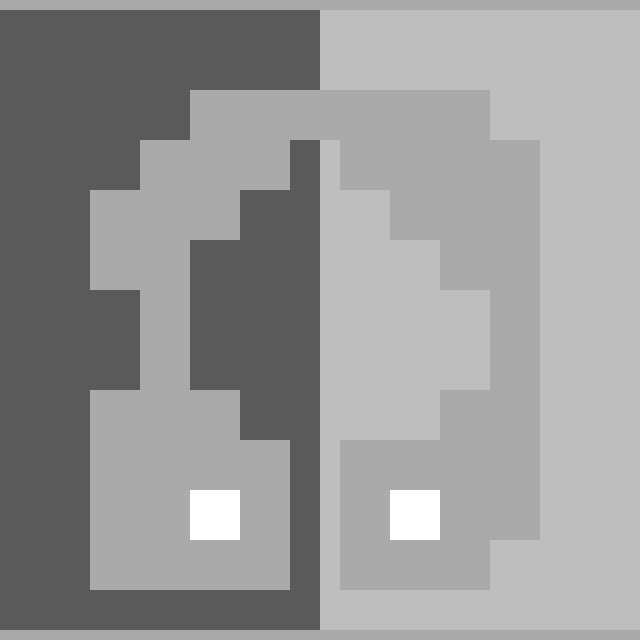

# `m0r0` level `1` — Initial state

## Navigation

**Level start**

### Actions

[`UP`](UP/README.md)

---

- **Full game ID:** `m0r0-492f87ba`
- **State:** `NOT_FINISHED`
- **Image hash:** `1f775d08af1f6d0f`
- **Incoming action:** `initial`

## Image



## Files

- [image.png](image.png)
- [state.json](state.json)
- [object_registry.pl](object_registry.pl) — shared level registry (0 canonical identities)

## Embedded files

<details>
<summary><code>state.json</code></summary>

````json
{
  "state": "NOT_FINISHED",
  "observation": {
    "game_id": "m0r0-492f87ba",
    "state": "NOT_FINISHED",
    "levels_completed": 0,
    "win_levels": 6,
    "action_input": {
      "id": "RESET",
      "data": {},
      "reasoning": null
    },
    "guid": "cafae77f-7f1f-4525-8f8b-83851d852ca1",
    "full_reset": true,
    "available_actions": [
      1,
      2,
      3,
      4,
      5,
      6
    ]
  },
  "step_count": 0,
  "game_id": "m0r0-492f87ba",
  "game_directory": "m0r0",
  "level": "1",
  "image_hash": "1f775d08af1f6d0f",
  "incoming_action": null,
  "action_directory": null,
  "action_data": {},
  "parent_node": null,
  "action_path": []
}
````

[Open `state.json`](state.json)

</details>
